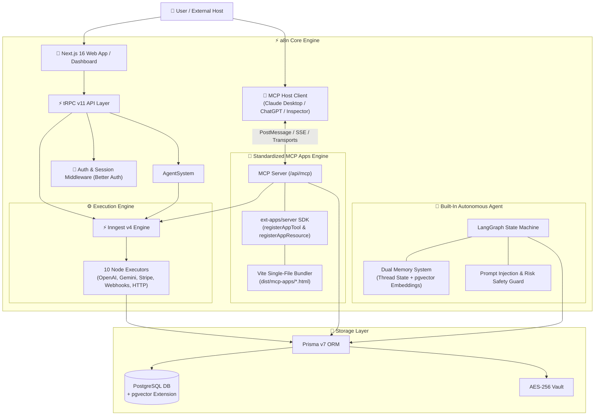
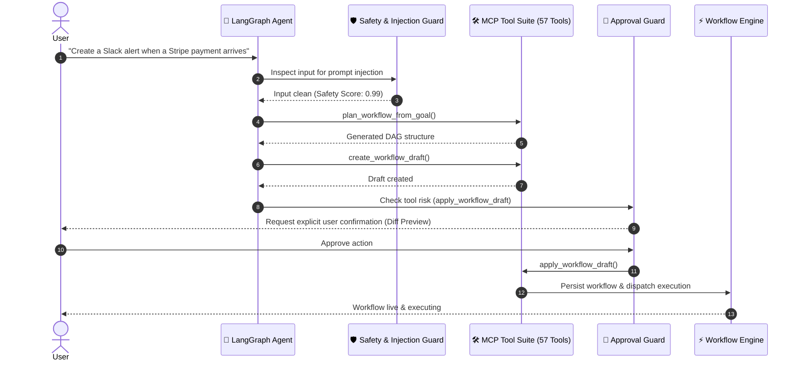
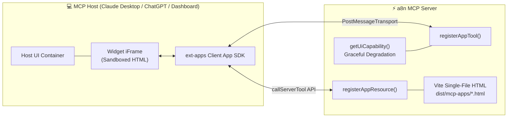

<div align="center">

# ⚡ a8n

### AI-Native Workflow Automation & MCP Apps Platform

Build, connect, and execute intelligent automation workflows via visual DAG editor, autonomous AI agents, and standardized MCP App UIs.

[](https://a8n.aditya-deokar.me/)

[](https://nextjs.org/)
[](https://react.dev/)
[](https://www.typescriptlang.org/)
[](https://js.langchain.com/)
[](https://www.npmjs.com/package/@modelcontextprotocol/ext-apps)
[](https://www.inngest.com/)
[](https://www.prisma.io/)
[](https://trpc.io/)
[](https://www.better-auth.com/)
[](https://reactflow.dev/)
[](https://tailwindcss.com/)
[](LICENSE)

</div>

---

## 📖 What is a8n?

**a8n** is an AI-native workflow automation platform that empowers users to design, execute, and manage complex automation pipelines through:
1. **Visual Drag-and-Drop Editor**: Build Directed Acyclic Graphs (DAGs) using React Flow.
2. **Autonomous AI Agent**: Built-in LangGraph agent that turns natural language intent into verified workflow drafts, debugs execution failures, and manages credentials safely.
3. **Standardized MCP Apps (`@modelcontextprotocol/ext-apps`)**: Turn Model Context Protocol (MCP) tool outputs into rich, interactive micro-frontends embedded directly inside ChatGPT, Claude Desktop, the a8n dashboard, or any MCP Apps host client.

---

## 🏗️ Architecture Overview



---

## ✨ Key Features

| Domain | Feature | Description |
|---|---|---|
| 🎨 **Visual Workflow Editor** | **Drag-and-Drop DAG Editor** | React Flow (XYFlow v12) editor with snap-to-grid, minimap, edge routing, and node config panels. |
| 🔀 **Node Architecture** | **10 Built-In Node Types** | Triggers (Manual, Google Forms, Stripe) + Executors (HTTP, OpenAI, Anthropic, Gemini, Discord, Slack). |
| ⚡ **Durable Execution** | **Inngest v4 Engine** | Event-driven workflow execution with retries, step-function isolation, and failure recovery. |
| 🧠 **Autonomous Agent** | **LangGraph Orchestration** | Natural language workflow generator, self-healing debugger, and credential assistant with dual memory. |
| 🔌 **MCP Apps** | **ext-apps SDK Integration** | Interactive micro-frontends embedded in chat hosts using `@modelcontextprotocol/ext-apps`. |
| 🛡️ **Multi-Layer Safety** | **Prompt Injection Guard** | Built-in semantic classifier, input sanitizer, secret redaction, and risk-aware approval policies. |
| 🔐 **Security & Vault** | **AES-256 Encryption** | Encrypted credential vault, OAuth consent hardening, and HMAC-signed API keys. |
| 💳 **Billing Stack** | **Polar.sh Subscriptions** | Free and Pro tiers with automated checkout, portal management, and usage limits. |

---

## 🧠 Feature Deep-Dive: Built-In Autonomous Agent

The **a8n Agent** is a state-graph assistant powered by **LangGraph** that collaborates with users in real-time.



### Agent Capabilities
- **Natural Language Draft Generation**: Creates validated workflow graphs from high-level user goals.
- **Execution Diagnosis & Auto-Repair**: Analyzes execution timelines and error stack traces to suggest and apply node configuration fixes.
- **Dual Memory**:
  - *Short-Term*: Thread state history.
  - *Long-Term*: User preferences and recurring workflow patterns stored using `pgvector` embeddings.
- **Human-in-the-Loop Approval**: Destructive actions (`delete_workflow`, `apply_workflow_draft`, `revoke_api_key`) require cryptographically verified confirmation hashes.

---

## 🔌 Feature Deep-Dive: Standardized MCP Apps (`@modelcontextprotocol/ext-apps`)

a8n implements the official **`@modelcontextprotocol/ext-apps` SDK** to deliver rich, interactive UIs directly inside any MCP-compliant client.



### 1. Ext-Apps Standardized Integration
- **`registerAppTool()`**: Normalizes UI metadata (`_meta.ui.resourceUri`).
- **`registerAppResource()`**: Registers widget UIs with `RESOURCE_MIME_TYPE` (`text/html;profile=mcp-app`).
- **`App` & `PostMessageTransport` Bridge**: Handles full lifecycle (`ontoolinput`, `ontoolinputpartial`, `ontoolresult`, `onhostcontextchanged`, `onteardown`).
- **Capability-Based Degradation**: Uses `getUiCapability()` via `hasUiCapability()` helper to automatically serve text fallbacks to text-only MCP clients (e.g., Cursor, Claude Code CLI).
- **Vite Single-File Bundles**: Self-contained HTML/CSS/JS bundles created by `scripts/build-mcp-apps-ui.ts` for instant zero-dependency iframe rendering.

### 2. Interactive Widget Suite

| Widget Resource | URI | Interactive Capabilities |
|---|---|---|
| **Workflow Draft Preview** | `ui://a8n/workflow-draft-preview.html` | Real-time streaming input previews (`ontoolinputpartial`), step visualization, validation badge status. |
| **Workflow Setup Checklist** | `ui://a8n/workflow-setup-checklist.html` | Interactive credential testing and webhook verification buttons invoking `app.callServerTool()`. |
| **Execution Timeline** | `ui://a8n/execution-timeline.html` | Step execution duration metrics, timeline logs, interactive `diagnose_execution` action. |
| **Workflow Approval** | `ui://a8n/workflow-approval.html` | Visual graph diff metrics (added/changed/removed nodes & edges), confirmation hash, interactive `apply_workflow_draft`. |

---

## 🛠️ Tech Stack & Key Libraries

| Category | Technology / Library | Version | Purpose |
|---|---|---|---|
| **Core Framework** | `next` (App Router) | `16.2.6` | Full-stack React framework with RSC, Turbopack, and API routes |
| **Frontend Core** | `react` / `react-dom` | `19.2.4` | UI rendering with Server Components |
| **Language & Engine** | `typescript` / Node.js | `6.0.2` / `^24` | Strict type-safety across client, server, and scripts |
| **API Layer** | `@trpc/server`, `@trpc/client`, `@trpc/tanstack-react-query` | `11.16.0` | End-to-end type-safe RPC procedures |
| **Database & ORM** | `prisma`, `@prisma/client`, `@neondatabase/serverless` | `7.7.0` / `1.0.2` | Type-safe ORM with Neon serverless driver & `pgvector` extension |
| **AI Agent Engine** | `@langchain/langgraph`, `@langchain/core` | `1.4.8` / `1.2.3` | State-graph autonomous AI agent orchestration & planning |
| **AI Memory & Vector** | `@langchain/langgraph-checkpoint-postgres`, `@langchain/openai` | `1.0.4` / `1.5.5` | PostgreSQL state checkpointing & pgvector embedding memory |
| **Multi-Provider AI SDK** | `ai` (Vercel AI SDK), `@ai-sdk/openai`, `@ai-sdk/anthropic`, `@ai-sdk/google` | `6.0.153` / `3.0.x` | Unified model interfaces for OpenAI, Anthropic & Gemini |
| **MCP Apps & Ext-Apps** | `@modelcontextprotocol/ext-apps`, `@modelcontextprotocol/sdk` | `1.7.5` / `1.29.0` | Standardized MCP Apps tools (`registerAppTool`), resources (`registerAppResource`), and PostMessage bridge |
| **Workflow Engine** | `inngest`, `@inngest/realtime` | `4.2.0` / `0.4.7` | Durable event-driven workflow execution & live channel updates |
| **Auth & Billing** | `better-auth`, `@polar-sh/better-auth`, `@polar-sh/sdk` | `1.6.11` / `1.8.3` / `0.47.0` | OAuth authentication & Polar subscription billing |
| **Credential Security** | `cryptr` | `6.4.0` | AES-256 encrypted credential vault |
| **Visual DAG Editor** | `@xyflow/react` (React Flow) | `12.10.2` | Interactive DAG canvas with custom nodes & handles |
| **UI & Animations** | `tailwindcss`, `radix-ui`, `framer-motion`, `lucide-react` | `4.0` / `1.6.7` / `12.38` / `1.7` | Styling, accessible component primitives & micro-interactions |
| **State Management** | `@tanstack/react-query`, `jotai`, `nuqs` | `5.96.2` / `2.19.1` / `2.8.9` | Server cache, client atom state, and URL search param state |
| **Widget Bundler** | `vite`, `vite-plugin-singlefile` | `8.2.0` / `2.3.3` | Programmatic single-file HTML bundle builder for MCP widgets |
| **Testing & Quality** | `vitest`, `@playwright/test`, `eslint`, `gitleaks` | `4.0.0` / `1.51.1` / `9.39` / `8.24` | Unit, contract, MCP integration, E2E testing & security scanning |

---

## 📁 Project Structure

```
a8n/
├── .agents/                       # Agent customization skills & rules (add-app-to-server, convert-web-app)
├── .github/
│   └── workflows/                 # GitHub Actions CI/CD workflows (mcp-quality, internal-api, security, backend-e2e)
├── dist/
│   └── mcp-apps/                  # Vite-compiled single-file widget HTML bundles (*.html)
├── docs/                          # Comprehensive architecture documentation & specifications
│   ├── README.md                  # Documentation hub & index
│   ├── ARCHITECTURE.md            # Platform system architecture & request lifecycle
│   ├── TECH_STACK.md              # Technology choices, trade-offs & version specs
│   ├── WORKFLOW_ENGINE.md         # Inngest durable DAG execution engine specifications
│   ├── AUTHENTICATION.md          # Better Auth, OAuth account linking & security scope matrix
│   ├── DATABASE.md                # Schema reference, ERD, and migration guide
│   ├── API_REFERENCE.md           # tRPC procedures & output schema contracts
│   ├── mcp/                       # MCP server & protocol architecture
│   │   └── mcp-apps/              # Standardized ext-apps integration plan & phase docs
│   └── adr/                       # Architectural Decision Records
├── prisma/
│   ├── migrations/                # 15 PostgreSQL database migrations (including pgvector)
│   └── schema.prisma              # Database schema (Models, Enums, Vectors, Audits)
├── scripts/
│   ├── build-mcp-apps-ui.ts       # Programmatic Vite build script for single-file HTML widgets
│   ├── capture-widget-screenshots.ts # Playwright widget screenshot generator script
│   ├── mcp-contract-check.ts      # Automated MCP tool, resource & profile contract validator
│   ├── security-release-check.ts  # Release readiness gate & secret scanner
│   └── env-check.ts               # Environment variables validator
├── src/
│   ├── agent/                     # Autonomous AI Agent Engine
│   │   ├── __tests__/             # Agent security & prompt injection test suites
│   │   ├── eval/                  # Golden tasks & evaluation reporting
│   │   ├── graph/                 # LangGraph state machine, nodes, and planning graph
│   │   ├── memory/                # Thread history & pgvector long-term embedding memory
│   │   └── safety/                # Prompt injection protection & approval guard service
│   ├── app/                       # Next.js 16 App Router Pages & API Routes
│   │   ├── (auth)/                # Auth pages (login, signup)
│   │   ├── (dashboard)/           # Dashboard pages (workflows, credentials, executions, agent, MCP)
│   │   └── api/                   # API routes (/api/mcp endpoint, auth, inngest, webhooks)
│   ├── components/                # React components, shadcn/ui & React Flow custom nodes
│   ├── config/                    # Node registries, environment profiles, and app constants
│   ├── features/                  # Domain modules (workflows, credentials, executions, agent, mcp, triggers)
│   ├── inngest/                   # Inngest durable workflow execution functions & events
│   ├── lib/                       # Utilities (encryption vault, db client, logger, auth)
│   ├── mcp/                       # Model Context Protocol (MCP) Server Implementation
│   │   ├── apps/                  # Ext-Apps Widget Integration
│   │   │   ├── render-tools.ts    # registerAppTool() render tool definitions
│   │   │   ├── widget-resources.ts # registerAppResource() HTML bundle provider
│   │   │   └── ui/                # Widget source entrypoints (Vite single-file bundles)
│   │   │       ├── execution-timeline/
│   │   │       ├── shared/        # Shared bridge (App + PostMessageTransport) & styles
│   │   │       ├── workflow-approval/
│   │   │       ├── workflow-draft-preview/
│   │   │       └── workflow-setup-checklist/
│   │   ├── auth/                  # Bearer token, API key & OAuth token authentication
│   │   ├── contracts/             # Manifest contracts for tools, resources & prompts
│   │   ├── safety/                # App tool policies, risk levels & prompt injection protection
│   │   ├── shared/                # Capability guard (getUiCapability / hasUiCapability)
│   │   └── tools/                 # 57 MCP Tool implementations across 8 domains
│   └── trpc/                      # tRPC v11 API initialization, callers, and router procedures
├── tests/                         # Test Suites
│   ├── api/                       # API unit & contract test suites
│   ├── e2e/                       # Playwright E2E tests for web app & MCP widgets
│   └── mcp/                       # MCP server & ext-apps integration tests
├── .gitleaks.toml                 # Gitleaks security scan configuration
├── docker-compose.yml             # Local docker environment (PostgreSQL 16 with pgvector)
├── package.json                   # Dependencies, scripts, and pnpm overrides
└── vitest.config.mjs              # Vitest runner configuration for MCP & unit tests
```

---

## 🚀 Quick Start

### Prerequisites
- Node.js `^24`
- pnpm `^10`
- Docker (for local PostgreSQL with `pgvector`)

```bash
# 1. Clone the repository
git clone https://github.com/aditya-deokar/a8n.git
cd a8n

# 2. Install dependencies
pnpm install

# 3. Set up environment variables
cp .env.example .env

# 4. Start local PostgreSQL (pgvector enabled)
docker compose up -d db-local

# 5. Apply database migrations
pnpm exec prisma migrate deploy
pnpm prisma generate

# 6. Build MCP App UI widgets
pnpm build:mcp-apps-ui

# 7. Start the development server
pnpm dev
```

Open [http://localhost:3000](http://localhost:3000) to access the application dashboard.

---

## 🧪 Verification & Testing

```bash
# Run TypeScript type check
pnpm typecheck

# Run ESLint check
pnpm lint

# Build MCP App UI widget HTML bundles
pnpm build:mcp-apps-ui

# Run MCP server & ext-apps test suite
pnpm test:mcp

# Run API unit & contract test suite
pnpm test:api:unit

# Run MCP contract & safety checks
pnpm mcp:contract:check
pnpm security:release:check
```

---

## 📚 Documentation Index

For detailed guides, refer to the [`docs/`](./docs/README.md) directory:

- 📐 **[ARCHITECTURE.md](./docs/ARCHITECTURE.md)** — System design, request lifecycle, design principles
- 🔌 **[MCP Server Specification](./docs/mcp/README.md)** — MCP protocol, tools, safety, and ext-apps integration
- 🧠 **[Agent, Client & MCP App Architecture](./docs/mcp-client-agent/README.md)** — End-to-end flow diagrams for Agent, Client Hosts, and MCP App UIs
- 🤖 **[Autonomous Agent Architecture](./docs/mcp-client-agent/agent-architecture.md)** — LangGraph state machine graph, dual memory (`pgvector`), and risk safety system
- 📋 **[Ext-Apps Integration Plan](./docs/mcp/mcp-apps/13-ext-apps-integration-plan.md)** — 9-phase migration to `@modelcontextprotocol/ext-apps`
- 💾 **[DATABASE.md](./docs/DATABASE.md)** — Schema reference, ERD, and migration guide
- 🔌 **[API_REFERENCE.md](./docs/API_REFERENCE.md)** — tRPC routers, procedures, and schemas
- 🔐 **[AUTHENTICATION.md](./docs/AUTHENTICATION.md)** — Auth system, OAuth linking, and security scope matrix
- ⚡ **[WORKFLOW_ENGINE.md](./docs/WORKFLOW_ENGINE.md)** — Inngest durable execution, DAG processing, and node executors

---

## 📄 License

This project is licensed under the MIT License. Developed as part of an academic final-year project.

<div align="center">
  <sub>Built with ❤️ using Next.js, React Flow, Inngest, LangGraph, tRPC, and `@modelcontextprotocol/ext-apps`</sub>
</div>
