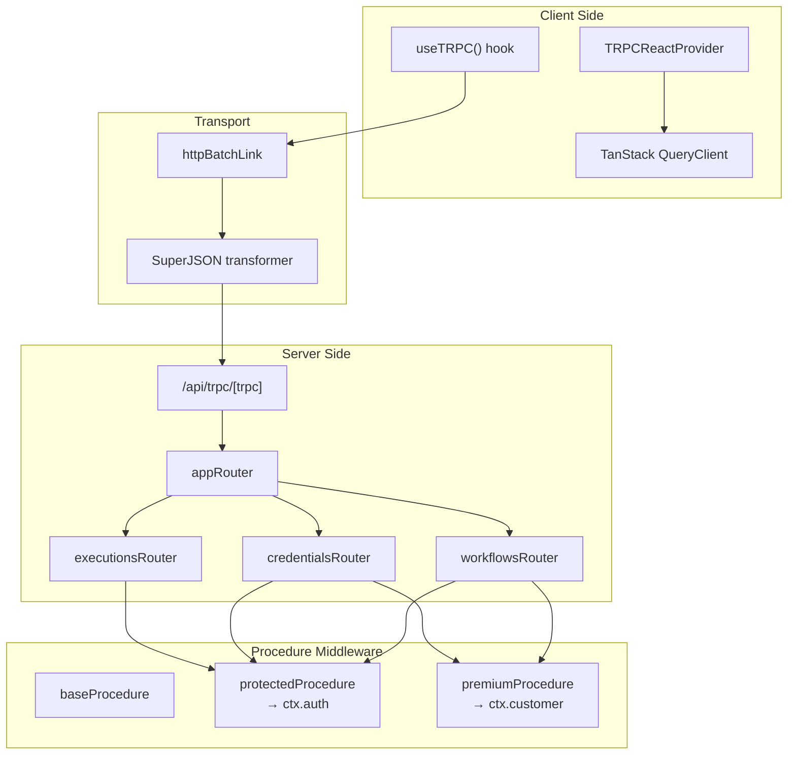

# 🔌 API Reference

> **Last Updated:** April 2026  
> **Framework:** tRPC v11.16.0  
> **Transport:** HTTP batch link with SuperJSON transformer  
> **Endpoint:** `/api/trpc/[trpc]`

---

## Table of Contents

- [Architecture Overview](#architecture-overview)
- [Procedure Types](#procedure-types)
- [Router: workflows](#router-workflows)
- [Router: credentials](#router-credentials)
- [Router: executions](#router-executions)
- [Client Setup](#client-setup)
- [Server-Side Usage](#server-side-usage)
- [Error Handling](#error-handling)

---

## Architecture Overview



### Router Composition

```typescript
// src/trpc/routers/_app.ts
export const appRouter = createTRPCRouter({
  workflows: workflowsRouter,    // 7 procedures
  credentials: credentialsRouter, // 6 procedures
  executions: executionsRouter,   // 2 procedures
});

export type AppRouter = typeof appRouter;
```

---

## Procedure Types

The tRPC layer defines three authorization tiers via middleware:

### `baseProcedure`

No authentication required. Currently unused — all endpoints require at least a session.

```typescript
export const baseProcedure = t.procedure;
```

### `protectedProcedure`

Requires a valid Better Auth session. Injects the session into context.

```typescript
export const protectedProcedure = baseProcedure.use(async ({ ctx, next }) => {
  const session = await auth.api.getSession({
    headers: await headers(),
  });

  if (!session) {
    throw new TRPCError({ code: "UNAUTHORIZED", message: "Unauthorized" });
  }

  return next({ ctx: { ...ctx, auth: session } });
});
```

**Context injected:** `ctx.auth` — `{ user: { id, name, email, ... }, session: { ... } }`

### `premiumProcedure`

Extends `protectedProcedure`. Requires an active Polar.sh subscription.

```typescript
export const premiumProcedure = protectedProcedure.use(async ({ ctx, next }) => {
  const customer = await polarClient.customers.getStateExternal({
    externalId: ctx.auth.user.id,
  });

  if (!customer.activeSubscriptions || customer.activeSubscriptions.length === 0) {
    throw new TRPCError({ code: "FORBIDDEN", message: "Active subscription required" });
  }

  return next({ ctx: { ...ctx, customer } });
});
```

**Context injected:** `ctx.customer` — Polar customer state with subscription details

---

## Router: `workflows`

**Source:** `src/features/workflows/server/routers.ts`  
**Procedures:** 7

### `workflows.create`

Creates a new workflow with a random slug name and an initial placeholder node.

| Property | Value |
|---|---|
| **Type** | `mutation` |
| **Auth** | `premiumProcedure` (Pro subscription required) |
| **Input** | None |
| **Returns** | `Workflow` object |

**Behavior:**
- Generates random name via `generateSlug(3)` (e.g., "happy-blue-dolphin")
- Creates an `INITIAL` type node at position `{ x: 0, y: 0 }`
- Scoped to `ctx.auth.user.id`

---

### `workflows.remove`

Deletes a workflow and all associated nodes, connections, and executions (cascade).

| Property | Value |
|---|---|
| **Type** | `mutation` |
| **Auth** | `protectedProcedure` |
| **Input** | `{ id: string }` |
| **Returns** | Deleted `Workflow` object |

**Validation:** User can only delete their own workflows (`userId` filter).

---

### `workflows.update`

Replaces the entire DAG (nodes + edges) for a workflow using a database transaction.

| Property | Value |
|---|---|
| **Type** | `mutation` |
| **Auth** | `protectedProcedure` |
| **Input** | See schema below |
| **Returns** | `Workflow` object |

**Input Schema:**
```typescript
z.object({
  id: z.string(),
  nodes: z.array(z.object({
    id: z.string(),
    type: z.string().nullish(),
    position: z.object({ x: z.number(), y: z.number() }),
    data: z.record(z.string(), z.any()).optional(),
  })),
  edges: z.array(z.object({
    source: z.string(),
    target: z.string(),
    sourceHandle: z.string().nullish(),
    targetHandle: z.string().nullish(),
  })),
})
```

**Transaction Steps:**
1. Delete all existing nodes (cascades to connections)
2. Create new nodes
3. Create new connections
4. Update workflow timestamp

---

### `workflows.updateName`

Renames a workflow.

| Property | Value |
|---|---|
| **Type** | `mutation` |
| **Auth** | `protectedProcedure` |
| **Input** | `{ id: string, name: string }` — name must be non-empty |
| **Returns** | Updated `Workflow` object |

---

### `workflows.getOne`

Fetches a single workflow with its nodes and connections transformed into React Flow format.

| Property | Value |
|---|---|
| **Type** | `query` |
| **Auth** | `protectedProcedure` |
| **Input** | `{ id: string }` |
| **Returns** | `{ id, name, nodes: Node[], edges: Edge[] }` |

**Response Transformation:**
```typescript
// Prisma Node → React Flow Node
{ id, type: node.type, position: node.position, data: node.data }

// Prisma Connection → React Flow Edge
{ id, source: fromNodeId, target: toNodeId, sourceHandle: fromOutput, targetHandle: toInput }
```

---

### `workflows.getMany`

Lists workflows with search and pagination.

| Property | Value |
|---|---|
| **Type** | `query` |
| **Auth** | `protectedProcedure` |
| **Input** | `{ page?: number, pageSize?: number, search?: string }` |
| **Returns** | Paginated response (see below) |

**Input Defaults:**
| Param | Default | Range |
|---|---|---|
| `page` | `1` | — |
| `pageSize` | `5` | `1..100` |
| `search` | `""` | Case-insensitive name search |

**Response Shape:**
```typescript
{
  items: Workflow[],
  page: number,
  pageSize: number,
  totalCount: number,
  totalPages: number,
  hasNextPage: boolean,
  hasPreviousPage: boolean,
}
```

---

### `workflows.execute`

Triggers workflow execution via Inngest.

| Property | Value |
|---|---|
| **Type** | `mutation` |
| **Auth** | `protectedProcedure` |
| **Input** | `{ id: string }` |
| **Returns** | `Workflow` object |

**Behavior:**
1. Validates workflow exists and belongs to user
2. Calls `sendWorkflowExecution({ workflowId })` to dispatch Inngest event
3. Returns the workflow object (execution happens asynchronously)

---

## Router: `credentials`

**Source:** `src/features/credentials/server/routers.ts`  
**Procedures:** 6

### `credentials.create`

Creates a new encrypted credential.

| Property | Value |
|---|---|
| **Type** | `mutation` |
| **Auth** | `premiumProcedure` (Pro subscription required) |
| **Input** | `{ name: string, type: CredentialType, value: string }` |
| **Returns** | `Credential` object (with encrypted value) |

**Input Validation:**
- `name` — non-empty string
- `type` — must be one of `CredentialType` enum: `OPENAI`, `ANTHROPIC`, `GEMINI`
- `value` — non-empty string (the raw API key)

**Security:** The `value` is encrypted via `encrypt(value)` (AES-256) before storage. The raw key is never persisted.

---

### `credentials.remove`

Deletes a credential.

| Property | Value |
|---|---|
| **Type** | `mutation` |
| **Auth** | `protectedProcedure` |
| **Input** | `{ id: string }` |
| **Returns** | Deleted `Credential` object |

---

### `credentials.update`

Updates a credential (re-encrypts the value).

| Property | Value |
|---|---|
| **Type** | `mutation` |
| **Auth** | `protectedProcedure` |
| **Input** | `{ id: string, name: string, type: CredentialType, value: string }` |
| **Returns** | Updated `Credential` object |

**Security:** Value is re-encrypted on update via `encrypt(value)`.

---

### `credentials.getOne`

Fetches a single credential by ID.

| Property | Value |
|---|---|
| **Type** | `query` |
| **Auth** | `protectedProcedure` |
| **Input** | `{ id: string }` |
| **Returns** | `Credential` object |

> **Note:** The returned `value` is still encrypted. Decryption only happens in executor functions at runtime.

---

### `credentials.getMany`

Lists credentials with search and pagination.

| Property | Value |
|---|---|
| **Type** | `query` |
| **Auth** | `protectedProcedure` |
| **Input** | `{ page?: number, pageSize?: number, search?: string }` |
| **Returns** | Paginated response (same shape as `workflows.getMany`) |

---

### `credentials.getByType`

Fetches all credentials of a specific type (used in node configuration dropdowns).

| Property | Value |
|---|---|
| **Type** | `query` |
| **Auth** | `protectedProcedure` |
| **Input** | `{ type: CredentialType }` |
| **Returns** | `Credential[]` — ordered by `updatedAt` descending |

---

## Router: `executions`

**Source:** `src/features/executions/server/routers.ts`  
**Procedures:** 2

### `executions.getOne`

Fetches a single execution with its workflow name.

| Property | Value |
|---|---|
| **Type** | `query` |
| **Auth** | `protectedProcedure` |
| **Input** | `{ id: string }` |
| **Returns** | `Execution` with `workflow: { id, name }` |

**Data Isolation:** Filters by `workflow.userId` to ensure users only see their own executions.

---

### `executions.getMany`

Lists executions with pagination.

| Property | Value |
|---|---|
| **Type** | `query` |
| **Auth** | `protectedProcedure` |
| **Input** | `{ page?: number, pageSize?: number }` |
| **Returns** | Paginated response with included `workflow: { id, name }` |

**Ordering:** Sorted by `startedAt` descending (most recent first).

---

## Client Setup

### Provider Configuration

```typescript
// src/trpc/client.tsx
export const { TRPCProvider, useTRPC } = createTRPCContext<AppRouter>();

export function TRPCReactProvider({ children }) {
  const queryClient = getQueryClient();
  const [trpcClient] = useState(() =>
    createTRPCClient<AppRouter>({
      links: [
        httpBatchLink({
          transformer: superjson,
          url: getUrl(), // "/api/trpc" or auto-detected Vercel URL
        }),
      ],
    }),
  );
  
  return (
    <QueryClientProvider client={queryClient}>
      <TRPCProvider trpcClient={trpcClient} queryClient={queryClient}>
        {children}
      </TRPCProvider>
    </QueryClientProvider>
  );
}
```

### Query Client Configuration

```typescript
// src/trpc/query-client.ts
export function makeQueryClient() {
  return new QueryClient({
    defaultOptions: {
      queries: { staleTime: 30 * 1000 },              // 30s stale time
      dehydrate: { serializeData: superjson.serialize },
      hydrate: { deserializeData: superjson.deserialize },
    },
  });
}
```

### Client Usage (React Hooks)

```typescript
// Query
const trpc = useTRPC();
const { data } = useSuspenseQuery(trpc.workflows.getMany.queryOptions({ page: 1 }));

// Mutation
const mutation = useMutation(trpc.workflows.create.mutationOptions({
  onSuccess: (data) => toast.success(`Created: ${data.name}`),
}));
mutation.mutate();
```

### Custom Data Hooks

The codebase wraps tRPC calls in custom hooks for reusability:

```typescript
// src/features/workflows/hooks/use-workflows.ts
export const useSuspenseWorkflows = () => {
  const trpc = useTRPC();
  const [params] = useWorkflowsParams();
  return useSuspenseQuery(trpc.workflows.getMany.queryOptions(params));
};

export const useCreateWorkflow = () => {
  const queryClient = useQueryClient();
  const trpc = useTRPC();
  return useMutation(trpc.workflows.create.mutationOptions({
    onSuccess: (data) => {
      toast.success(`Workflow "${data.name}" created`);
      queryClient.invalidateQueries(trpc.workflows.getMany.queryOptions({}));
    },
  }));
};
```

---

## Server-Side Usage

### SSR Prefetching

Server Components pre-fetch data so pages load instantly:

```typescript
// src/trpc/server.tsx
export const trpc = createTRPCOptionsProxy({
  ctx: createTRPCContext,
  router: appRouter,
  queryClient: getQueryClient,
});

export const caller = appRouter.createCaller(createTRPCContext);

export function prefetch<T extends ReturnType<TRPCQueryOptions<any>>>(queryOptions: T) {
  const queryClient = getQueryClient();
  void queryClient.prefetchQuery(queryOptions);
}

export function HydrateClient({ children }) {
  const queryClient = getQueryClient();
  return <HydrationBoundary state={dehydrate(queryClient)}>{children}</HydrationBoundary>;
}
```

### Prefetching Pattern

```typescript
// Server Component (page.tsx)
import { prefetch, HydrateClient, trpc } from "@/trpc/server";

export default async function WorkflowsPage() {
  prefetch(trpc.workflows.getMany.queryOptions({ page: 1 }));
  
  return (
    <HydrateClient>
      <WorkflowsList />  {/* Client component uses useSuspenseQuery */}
    </HydrateClient>
  );
}
```

### Direct Server Caller

For cases where you need to call tRPC directly (not through React):

```typescript
const workflows = await caller.workflows.getMany({ page: 1 });
```

---

## Error Handling

### tRPC Error Codes

| Code | HTTP Status | Used When |
|---|---|---|
| `UNAUTHORIZED` | 401 | No valid session (`protectedProcedure`) |
| `FORBIDDEN` | 403 | No active subscription (`premiumProcedure`) |
| `NOT_FOUND` | 404 | `findUniqueOrThrow` fails (Prisma) |
| `BAD_REQUEST` | 400 | Zod validation fails (auto) |
| `INTERNAL_SERVER_ERROR` | 500 | Unhandled server errors |

### Client-Side Error Handling

```typescript
const mutation = useMutation(trpc.workflows.create.mutationOptions({
  onError: (error) => {
    if (error.data?.code === "FORBIDDEN") {
      // Show upgrade modal
    } else {
      toast.error(error.message);
    }
  },
}));
```

---

## Quick Reference

### All Procedures

| Router | Procedure | Type | Auth | Input |
|---|---|---|---|---|
| `workflows` | `create` | mutation | premium | — |
| `workflows` | `remove` | mutation | protected | `{ id }` |
| `workflows` | `update` | mutation | protected | `{ id, nodes[], edges[] }` |
| `workflows` | `updateName` | mutation | protected | `{ id, name }` |
| `workflows` | `getOne` | query | protected | `{ id }` |
| `workflows` | `getMany` | query | protected | `{ page?, pageSize?, search? }` |
| `workflows` | `execute` | mutation | protected | `{ id }` |
| `credentials` | `create` | mutation | premium | `{ name, type, value }` |
| `credentials` | `remove` | mutation | protected | `{ id }` |
| `credentials` | `update` | mutation | protected | `{ id, name, type, value }` |
| `credentials` | `getOne` | query | protected | `{ id }` |
| `credentials` | `getMany` | query | protected | `{ page?, pageSize?, search? }` |
| `credentials` | `getByType` | query | protected | `{ type }` |
| `executions` | `getOne` | query | protected | `{ id }` |
| `executions` | `getMany` | query | protected | `{ page?, pageSize? }` |

---

## Related Documentation

- [ARCHITECTURE.md](./ARCHITECTURE.md) — API layer in the system architecture
- [DATABASE.md](./DATABASE.md) — Underlying data models
- [AUTHENTICATION.md](./AUTHENTICATION.md) — Session and authorization details
- [STATE_AND_DATA_FLOW.md](./STATE_AND_DATA_FLOW.md) — Client-side data fetching patterns
