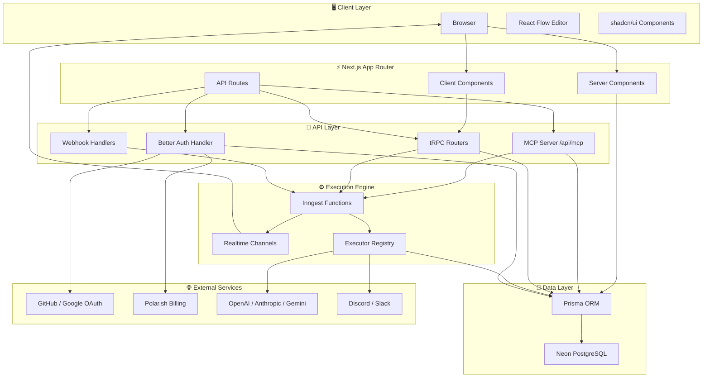
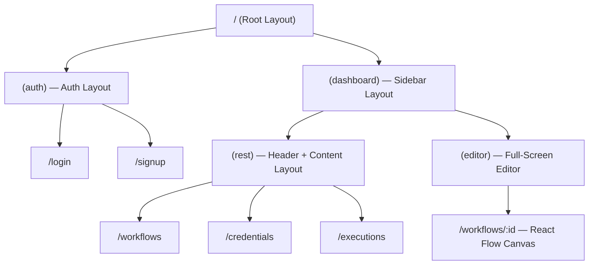
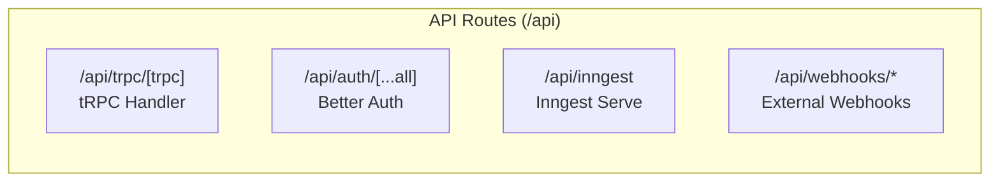
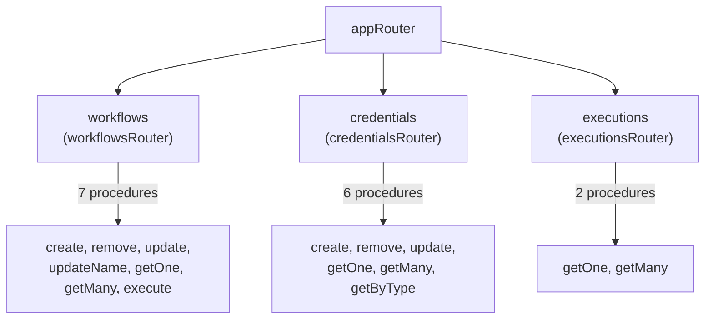
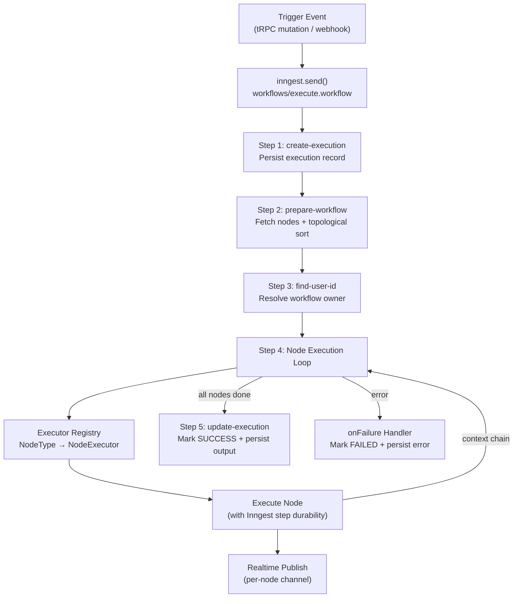
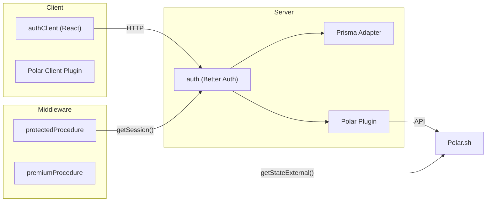
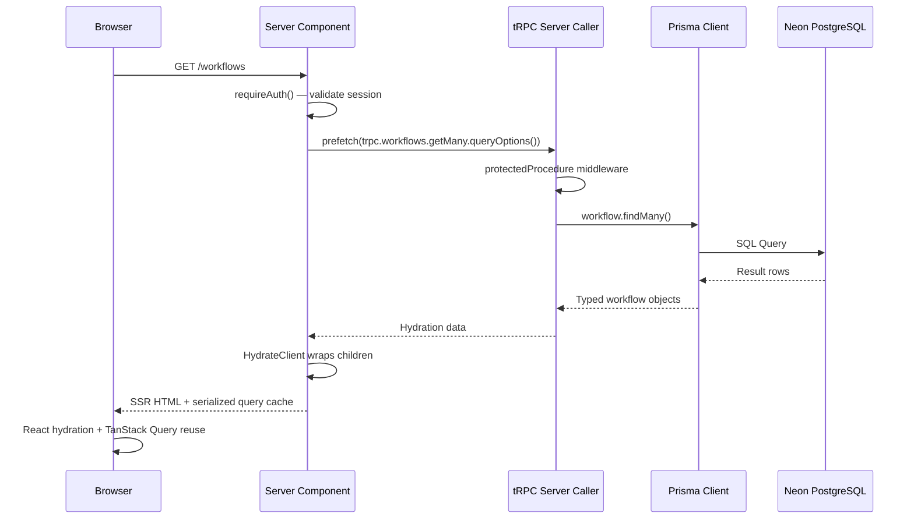
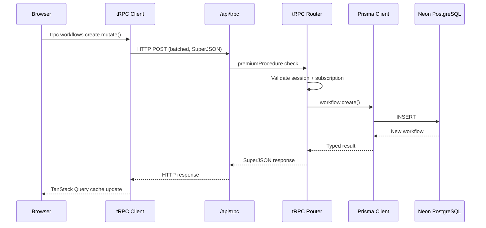
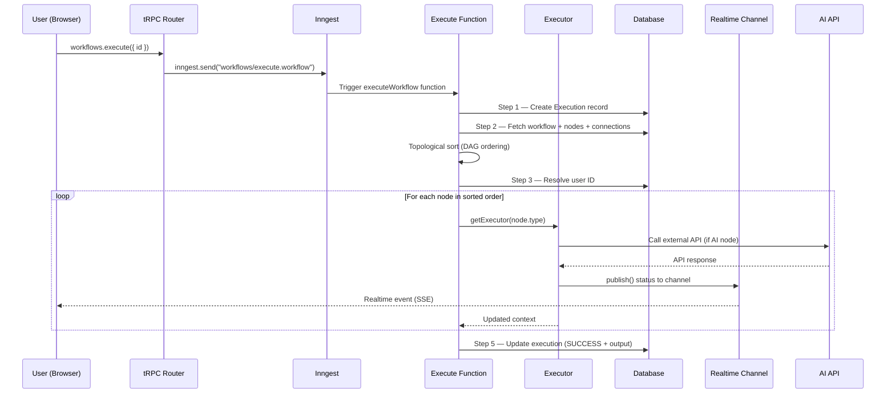

# 🏗️ Architecture

> **Last Updated:** April 2026  
> **Status:** Living document — updated as the architecture evolves

---

## Table of Contents

- [Architecture Overview](#architecture-overview)
- [System Components](#system-components)
- [Layer Diagram](#layer-diagram)
- [Request Lifecycle](#request-lifecycle)
- [Workflow Execution Lifecycle](#workflow-execution-lifecycle)
- [Data Flow](#data-flow)
- [Security Architecture](#security-architecture)
- [Design Principles](#design-principles)

---

## Architecture Overview

a8n is a **full-stack monolithic application** built on Next.js 16 (App Router). It follows a layered architecture with clear separation between the presentation layer, API layer, execution engine, and data layer.



---

## System Components

### 1. Web Application Layer (Next.js App Router)

The frontend is a Next.js 16 application using the **App Router** with React Server Components (RSC) for data fetching and Client Components for interactivity.

**Route Group Architecture:**



| Route Group | Purpose | Layout Components |
|---|---|---|
| `(auth)` | Login and signup pages | `AuthLayout` — centered card |
| `(dashboard)/(rest)` | CRUD listing pages | `SidebarProvider` + `AppSidebar` + `AppHeader` |
| `(dashboard)/(editor)` | Visual workflow editor | `SidebarProvider` + `AppSidebar` + full-screen canvas |

**Root Layout Provider Stack:**
```
<html>
  <body>
    <TRPCReactProvider>       ← tRPC client + TanStack Query
      <NuqsAdapter>           ← URL search params state
        <JotaiProvider>        ← Atomic client state
          {children}
          <Toaster />          ← Toast notifications (Sonner)
        </JotaiProvider>
      </NuqsAdapter>
    </TRPCReactProvider>
  </body>
</html>
```

### 2. API Layer

The API layer consists of three distinct systems, each serving a different purpose:



| Route | Handler | Purpose |
|---|---|---|
| `/api/trpc/[trpc]` | `fetchRequestHandler` | tRPC procedure calls (queries + mutations) |
| `/api/auth/[...all]` | `toNextJsHandler(auth)` | Better Auth — login, signup, session, OAuth callbacks |
| `/api/inngest` | `serve({ client, functions })` | Inngest function registration and invocation endpoint |
| `/api/webhooks/stripe` | Custom `POST` handler | Stripe webhook events → workflow execution |
| `/api/webhooks/google-form` | Custom `POST` handler | Google Forms submissions → workflow execution |

**tRPC Router Composition:**



**Procedure Authorization Tiers:**

```
baseProcedure          → No auth required (unused currently)
    │
    ▼
protectedProcedure     → Session required (Better Auth)
    │                     Injects: ctx.auth (session + user)
    ▼
premiumProcedure       → Active Polar subscription required
                          Injects: ctx.customer (Polar state)
```

### 3. Workflow Execution Engine (Inngest)

The execution engine is the heart of a8n. It uses **Inngest** for durable, event-driven workflow execution with automatic retries and realtime status streaming.

→ See [WORKFLOW_ENGINE.md](./WORKFLOW_ENGINE.md) for the complete deep-dive.

**Engine Architecture:**



**Key Design Decisions:**
- **Durability**: Each step is individually retryable — if step 3 fails, steps 1-2 don't re-execute
- **Topological Sort**: Nodes execute in dependency order (upstream → downstream)
- **Context Chain**: Each node's output becomes the next node's input context
- **Realtime**: 9 dedicated channels publish node-level execution progress to the browser

### 4. Data Layer

The data layer uses **Prisma v7** with the **Neon serverless adapter** for HTTP-based PostgreSQL connections.

**Connection Architecture:**

```
Application Code
    │
    ▼
Prisma Client (singleton)
    │
    ▼
PrismaNeon Adapter
    │ (HTTP-based, no persistent TCP connection)
    ▼
Neon PostgreSQL (Serverless)
    │ (connection pooling, auto-scaling)
    ▼
PostgreSQL Database
```

**Singleton Pattern (Hot Reload Safe):**
```typescript
const globalForPrisma = global as unknown as { prisma: PrismaClient };
const prisma = globalForPrisma.prisma || new PrismaClient({ adapter });
if (process.env.NODE_ENV !== "production") {
  globalForPrisma.prisma = prisma;
}
```

This prevents creating multiple Prisma Client instances during Next.js hot module replacement in development.

→ See [DATABASE.md](./DATABASE.md) for complete schema documentation and ERD.

### 5. Authentication Layer

**Better Auth** provides a unified authentication system with a server/client architecture:



→ See [AUTHENTICATION.md](./AUTHENTICATION.md) for the complete auth documentation.

### 6. Billing Layer

Subscription billing is deeply integrated through the **Polar.sh Better Auth plugin**:

- **Automatic Customer Sync**: Users are created as Polar customers on signup (`createCustomerOnSignUp: true`)
- **Checkout Flow**: `authClient.checkout({ slug: "pro" })` → Polar hosted checkout → redirect to success URL
- **Portal Access**: `authClient.customer.portal()` → Polar billing portal for subscription management
- **Premium Gating**: `premiumProcedure` checks `polarClient.customers.getStateExternal()` for active subscriptions

---

## Request Lifecycle

### Standard Page Load (Server-Side Rendering)



### Client-Side tRPC Mutation



---

## Workflow Execution Lifecycle

The complete lifecycle from user click to execution completion:



---

## MCP Server (AI Client API)

a8n exposes a **Model Context Protocol** server at `/api/mcp` for AI-powered clients (Cursor, Claude Desktop, MCP Inspector). It provides 22 tools, 4 resources, and 3 prompts for workflow automation.

| Property | Value |
|---|---|
| Transport | Streamable HTTP (stateless) |
| Auth | Bearer token (scoped API keys or session) |
| Module | `src/mcp/` |
| Route | `src/app/api/mcp/route.ts` |

The MCP layer runs parallel to tRPC — tools call Prisma and Inngest directly rather than through tRPC routers. See [mcp/README.md](./mcp/README.md) for full documentation.

---

## Security Architecture

### Defense Layers

```
┌─────────────────────────────────────────────────────────┐
│  Layer 1: Authentication (Better Auth)                  │
│  ├── Session token validation                           │
│  ├── OAuth flow (PKCE for GitHub/Google)                │
│  └── CSRF protection (built-in)                         │
├─────────────────────────────────────────────────────────┤
│  Layer 2: Authorization (tRPC Middleware)                │
│  ├── protectedProcedure — session required              │
│  └── premiumProcedure — active subscription required    │
├─────────────────────────────────────────────────────────┤
│  Layer 3: Data Isolation (Row-Level Filtering)          │
│  ├── All queries include: userId: ctx.auth.user.id      │
│  └── Users can only access their own resources          │
├─────────────────────────────────────────────────────────┤
│  Layer 4: Credential Encryption (AES-256)               │
│  ├── API keys encrypted at rest via Cryptr              │
│  └── Decrypted only at execution time                   │
├─────────────────────────────────────────────────────────┤
│  Layer 5: Input Validation (Zod)                        │
│  ├── tRPC input schemas validated on every request       │
│  └── Prisma enums enforce valid node/credential types   │
└─────────────────────────────────────────────────────────┘
```

### Key Security Patterns

| Pattern | Implementation |
|---|---|
| **Session Management** | Better Auth sessions stored in DB with token, IP, user agent |
| **Data Isolation** | Every Prisma query filtered by `userId` — no cross-tenant access |
| **Credential Security** | API keys encrypted with AES-256 (Cryptr) before DB storage |
| **Input Validation** | Zod schemas on every tRPC procedure input |
| **Webhook Verification** | Webhook endpoints validate `workflowId` parameter presence |
| **Auth Guard** | `requireAuth()` utility redirects unauthenticated users server-side |

---

## Design Principles

### 1. Feature-Based Modular Architecture

Code is organized by **business domain**, not technical layer. Each feature module is self-contained with its own components, hooks, server logic, and types.

```
features/workflows/
├── components/     # UI
├── hooks/          # Data hooks
├── server/         # tRPC router + prefetch
├── params.ts       # URL state
└── types.ts        # TypeScript types
```

> **Rationale**: When a developer needs to modify "workflows", they find everything in one directory — not scattered across `components/`, `services/`, `models/`, etc.

### 2. Server/Client Component Boundary

The architecture strictly separates server and client concerns:

- **Server Components**: Data fetching, access control, SEO, layout
- **Client Components**: Interactivity, real-time updates, forms, editor canvas

The `"use client"` directive is applied at the leaf level — components are server-rendered by default and only opt into client mode when interactivity is required.

### 3. End-to-End Type Safety

Types flow from the database schema through the API to the UI without manual type definitions:

```
Prisma Schema → Generated Types → tRPC Router → tRPC Client → React Component
     ↑                                                              ↓
     └── Single source of truth                 AutoComplete + type errors
```

### 4. Event-Driven Execution

Workflow execution is **asynchronous and event-driven**, not synchronous request-response:

```
Request: "Execute this workflow" → Response: "OK, queued" (fast)
Background: Inngest processes steps with durability, retries, and realtime updates
```

> **Rationale**: Workflows can take seconds to minutes (AI API calls, HTTP requests). Synchronous execution would block the user and risk timeouts.

### 5. Progressive Enhancement

The application uses Next.js App Router patterns for optimal user experience:

- **Server-side prefetching** → instant page loads (no loading spinners on navigation)
- **Suspense boundaries** → streaming SSR for slow data
- **URL state (nuqs)** → shareable, bookmarkable page state
- **Optimistic updates** → responsive UI during mutations

---

## Related Documentation

- [TECH_STACK.md](./TECH_STACK.md) — Detailed technology choices and rationale
- [DATABASE.md](./DATABASE.md) — Schema reference and entity relationships
- [WORKFLOW_ENGINE.md](./WORKFLOW_ENGINE.md) — Execution engine deep-dive
- [API_REFERENCE.md](./API_REFERENCE.md) — tRPC procedures and schemas
- [AUTHENTICATION.md](./AUTHENTICATION.md) — Auth system and authorization
- [FRONTEND_ARCHITECTURE.md](./FRONTEND_ARCHITECTURE.md) — Component patterns
- [STATE_AND_DATA_FLOW.md](./STATE_AND_DATA_FLOW.md) — State management
