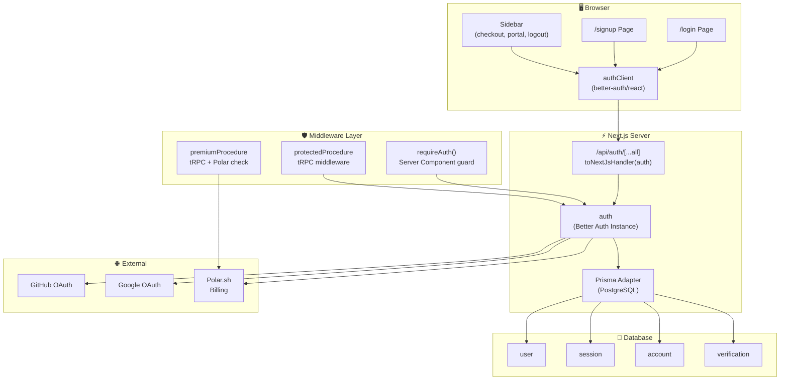
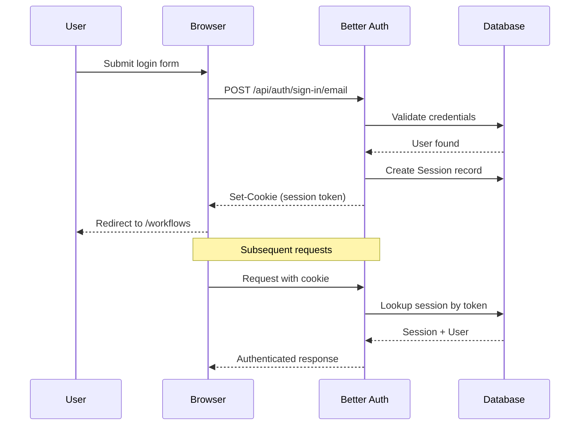
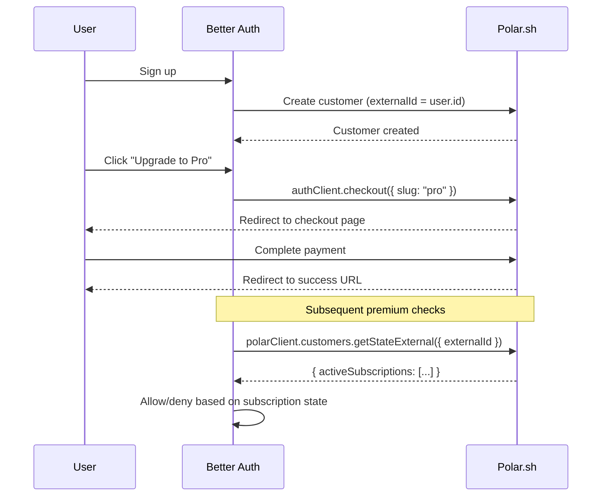
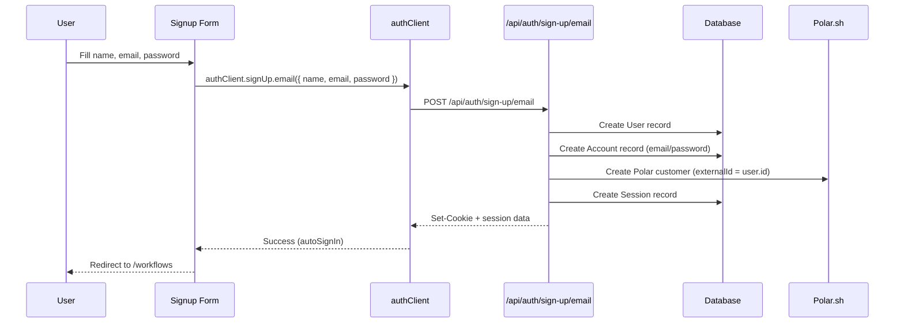
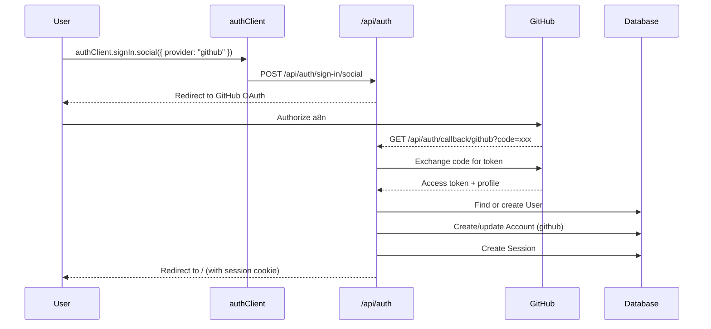

# 🔑 Authentication & Authorization

> **Last Updated:** April 2026  
> **Auth Library:** Better Auth v1.6.0  
> **OAuth Providers:** GitHub, Google  
> **Billing Integration:** Polar.sh (via Better Auth plugin)

---

## Table of Contents

- [Architecture Overview](#architecture-overview)
- [Server Configuration](#server-configuration)
- [Client Configuration](#client-configuration)
- [Auth Utilities](#auth-utilities)
- [Route Protection Strategy](#route-protection-strategy)
- [Session Management](#session-management)
- [API Routes](#api-routes)
- [Billing Integration](#billing-integration)
- [Authorization Matrix](#authorization-matrix)
- [Auth Flow Diagrams](#auth-flow-diagrams)

---

## Architecture Overview



---

## Server Configuration

The auth server is configured in `src/lib/auth.ts`:

```typescript
import { checkout, polar, portal } from "@polar-sh/better-auth";
import { betterAuth } from "better-auth";
import { prismaAdapter } from "better-auth/adapters/prisma";
import prisma from "@/lib/db";
import { polarClient } from "./polar";

export const auth = betterAuth({
  database: prismaAdapter(prisma, {
    provider: "postgresql",
  }),
  
  emailAndPassword: {
    enabled: true,
    autoSignIn: true,    // Auto-login after registration
  },
  
  socialProviders: {
    github: {
      clientId: process.env.GITHUB_CLIENT_ID as string,
      clientSecret: process.env.GITHUB_CLIENT_SECRET as string,
    },
    google: {
      clientId: process.env.GOOGLE_CLIENT_ID as string,
      clientSecret: process.env.GOOGLE_CLIENT_SECRET as string,
    },
  },
  
  plugins: [
    polar({
      client: polarClient,
      createCustomerOnSignUp: true,    // Sync user → Polar customer
      use: [
        checkout({
          products: [{
            productId: "58285280-605b-468f-b711-5b5c9ff936bd",
            slug: "pro",
          }],
          successUrl: process.env.POLAR_SUCCESS_URL,
          authenticatedUsersOnly: true,
        }),
        portal(),    // Billing portal access
      ],
    })
  ]
});
```

### Configuration Breakdown

| Feature | Setting | Behavior |
|---|---|---|
| **Database** | `prismaAdapter(prisma, { provider: "postgresql" })` | Stores auth data in Neon PostgreSQL via Prisma |
| **Email/Password** | `enabled: true, autoSignIn: true` | Users can register with email; auto-logged in on signup |
| **GitHub OAuth** | `clientId` + `clientSecret` from env | "Login with GitHub" button |
| **Google OAuth** | `clientId` + `clientSecret` from env | "Login with Google" button |
| **Polar Plugin** | `createCustomerOnSignUp: true` | Creates Polar billing customer on every new registration |
| **Checkout** | `slug: "pro"`, `authenticatedUsersOnly: true` | Only logged-in users can purchase Pro plan |
| **Portal** | `portal()` | Users can manage subscriptions via `authClient.customer.portal()` |

---

## Client Configuration

The auth client is configured in `src/lib/auth-client.ts`:

```typescript
import { polarClient } from "@polar-sh/better-auth";
import { createAuthClient } from "better-auth/react";

export const authClient = createAuthClient({
  plugins: [polarClient()],
});
```

### Client API

| Method | Purpose | Example |
|---|---|---|
| `authClient.signUp.email()` | Register with email/password | `authClient.signUp.email({ name, email, password })` |
| `authClient.signIn.email()` | Login with email/password | `authClient.signIn.email({ email, password })` |
| `authClient.signIn.social()` | OAuth login | `authClient.signIn.social({ provider: "github" })` |
| `authClient.signOut()` | Logout and clear session | `authClient.signOut({ fetchOptions: { onSuccess: () => router.push("/login") } })` |
| `authClient.useSession()` | React hook for session state | `const { data: session, isPending } = authClient.useSession()` |
| `authClient.checkout()` | Initiate Polar checkout | `authClient.checkout({ slug: "pro" })` |
| `authClient.customer.portal()` | Open billing portal | Direct navigation to Polar portal |

---

## Auth Utilities

Server-side utility functions in `src/lib/auth-utils.ts`:

### `requireAuth()`

Validates the current session in Server Components. Redirects to `/login` if unauthenticated.

```typescript
export const requireAuth = async () => {
  const session = await auth.api.getSession({
    headers: await headers(),
  });

  if (!session) {
    redirect("/login");
  }

  return session;
};
```

**Usage (in Server Components / pages):**
```typescript
export default async function DashboardPage() {
  const session = await requireAuth();
  // session.user.id, session.user.name, etc.
}
```

### `requireUnauth()`

Inverse of `requireAuth`. Redirects authenticated users away from auth pages.

```typescript
export const requireUnauth = async () => {
  const session = await auth.api.getSession({
    headers: await headers(),
  });

  if (session) {
    redirect("/");
  }
};
```

**Usage (in login/signup pages):**
```typescript
export default async function LoginPage() {
  await requireUnauth(); // Redirects away if already logged in
  return <LoginForm />;
}
```

---

## Route Protection Strategy

a8n uses **three layers** of route protection:

### Layer 1: Server Component Guards

For pages — redirect unauthenticated users before any rendering occurs.

```typescript
// In page server component or layout
const session = await requireAuth();
```

### Layer 2: tRPC Middleware

For API calls — reject unauthenticated requests with proper HTTP status codes.

```typescript
// protectedProcedure
const session = await auth.api.getSession({ headers: await headers() });
if (!session) throw new TRPCError({ code: "UNAUTHORIZED" });
return next({ ctx: { ...ctx, auth: session } });
```

### Layer 3: Subscription Gating

For premium features — verify active Polar subscription.

```typescript
// premiumProcedure (extends protectedProcedure)
const customer = await polarClient.customers.getStateExternal({
  externalId: ctx.auth.user.id,
});
if (!customer.activeSubscriptions?.length) {
  throw new TRPCError({ code: "FORBIDDEN", message: "Active subscription required" });
}
```

### Protection by Route

| Route | Protection | Method |
|---|---|---|
| `/login` | `requireUnauth()` — redirect if authenticated | Server Component |
| `/signup` | `requireUnauth()` — redirect if authenticated | Server Component |
| `/workflows` | `requireAuth()` — redirect if unauthenticated | Server Component |
| `/credentials` | `requireAuth()` — redirect if unauthenticated | Server Component |
| `/executions` | `requireAuth()` — redirect if unauthenticated | Server Component |
| `/workflows/:id` (editor) | `requireAuth()` — redirect if unauthenticated | Server Component |
| `workflows.getMany` | `protectedProcedure` | tRPC Middleware |
| `workflows.create` | `premiumProcedure` | tRPC Middleware |
| `credentials.create` | `premiumProcedure` | tRPC Middleware |

---

## Session Management

### Session Storage

Sessions are stored in the `session` database table:

| Field | Purpose |
|---|---|
| `token` | Unique session identifier (sent as cookie) |
| `expiresAt` | Session expiration time |
| `ipAddress` | Client IP at login time (audit trail) |
| `userAgent` | Browser at login time (audit trail) |
| `userId` | FK → user who owns this session |

### Session Resolution

On each request, Better Auth resolves the session from the request headers:

```typescript
const session = await auth.api.getSession({
  headers: await headers(), // Next.js request headers
});
// Returns: { user: { id, name, email, ... }, session: { token, expiresAt, ... } }
// Or null if not authenticated
```

### Session Lifecycle



---

## API Routes

### Auth Handler

```typescript
// src/app/api/auth/[...all]/route.ts
import { auth } from "@/lib/auth";
import { toNextJsHandler } from "better-auth/next-js";

export const { POST, GET } = toNextJsHandler(auth);
```

This catch-all route handles all Better Auth endpoints:

| Endpoint | Method | Purpose |
|---|---|---|
| `/api/auth/sign-up/email` | POST | Email/password registration |
| `/api/auth/sign-in/email` | POST | Email/password login |
| `/api/auth/sign-in/social` | POST | Initiate OAuth flow |
| `/api/auth/callback/:provider` | GET | OAuth callback handler |
| `/api/auth/sign-out` | POST | Logout and clear session |
| `/api/auth/session` | GET | Get current session |
| `/api/auth/checkout` | POST | Initiate Polar checkout |
| `/api/auth/customer/portal` | POST | Open Polar billing portal |

---

## Billing Integration

### Polar.sh Client

```typescript
// src/lib/polar.ts
import { Polar } from "@polar-sh/sdk";

export const polarClient = new Polar({
  accessToken: process.env.POLAR_ACCESS_TOKEN,
  server: "sandbox"  // Use "production" for live billing
});
```

### Customer Lifecycle



### Sidebar Billing UI

The sidebar (`src/components/app-sidebar.tsx`) includes billing actions:

```typescript
// Show upgrade button only for free users
{!hasActiveSubscription && !isLoading && (
  <SidebarMenuButton onClick={() => authClient.checkout({ slug: "pro" })}>
    <StarIcon /> Upgrade to Pro
  </SidebarMenuButton>
)}

// Always show billing portal
<SidebarMenuButton onClick={() => authClient.customer.portal()}>
  <CreditCardIcon /> Billing Portal
</SidebarMenuButton>

// Logout
<SidebarMenuButton onClick={() => authClient.signOut(/* ... */)}>
  <LogOutIcon /> Sign out
</SidebarMenuButton>
```

---

## Authorization Matrix

### Resource-Level Permissions

| Resource Action | Unauthenticated | Free (Authenticated) | Pro (Subscribed) |
|---|---|---|---|
| View login/signup pages | ✅ | ❌ (redirected away) | ❌ (redirected away) |
| View workflows list | ❌ → `/login` | ✅ (own only) | ✅ (own only) |
| Create workflow | ❌ | ❌ (`FORBIDDEN`) | ✅ |
| Edit workflow (nodes/edges) | ❌ | ✅ (own only) | ✅ (own only) |
| Delete workflow | ❌ | ✅ (own only) | ✅ (own only) |
| Rename workflow | ❌ | ✅ (own only) | ✅ (own only) |
| Execute workflow | ❌ | ✅ (own only) | ✅ (own only) |
| View executions | ❌ | ✅ (own only) | ✅ (own only) |
| Create credential | ❌ | ❌ (`FORBIDDEN`) | ✅ |
| Edit/delete credential | ❌ | ✅ (own only) | ✅ (own only) |
| View credentials | ❌ | ✅ (own only) | ✅ (own only) |
| Checkout (upgrade) | ❌ | ✅ | ✅ (manage existing) |
| Billing portal | ❌ | ✅ | ✅ |

### Data Isolation

All data access is filtered by `userId`:

```
WHERE userId = ctx.auth.user.id          -- Direct resources
WHERE workflow.userId = ctx.auth.user.id -- Nested resources (executions)
WHERE { id: credentialId, userId }       -- Credential access in executors
```

There is **no admin role** or cross-tenant access. Every user sees only their own data.

---

## Auth Flow Diagrams

### Email/Password Registration



### GitHub OAuth Login



---

## Environment Variables

| Variable | Required | Description |
|---|---|---|
| `BETTER_AUTH_SECRET` | ✅ | Session encryption key (32+ characters) |
| `BETTER_AUTH_URL` | ✅ | Base URL of the app (`http://localhost:3000`) |
| `GITHUB_CLIENT_ID` | Optional | GitHub OAuth App Client ID |
| `GITHUB_CLIENT_SECRET` | Optional | GitHub OAuth App Client Secret |
| `GOOGLE_CLIENT_ID` | Optional | Google OAuth Client ID |
| `GOOGLE_CLIENT_SECRET` | Optional | Google OAuth Client Secret |
| `POLAR_ACCESS_TOKEN` | ✅ | Polar.sh API access token |
| `POLAR_SUCCESS_URL` | ✅ | Post-checkout redirect URL |

→ See [CONFIGURATION.md](./CONFIGURATION.md) for complete environment setup.

---

## Related Documentation

- [ARCHITECTURE.md](./ARCHITECTURE.md) — Auth layer in the system architecture
- [DATABASE.md](./DATABASE.md) — User, Session, Account, Verification models
- [API_REFERENCE.md](./API_REFERENCE.md) — Procedure authorization levels
- [GETTING_STARTED.md](./GETTING_STARTED.md) — OAuth app setup instructions
