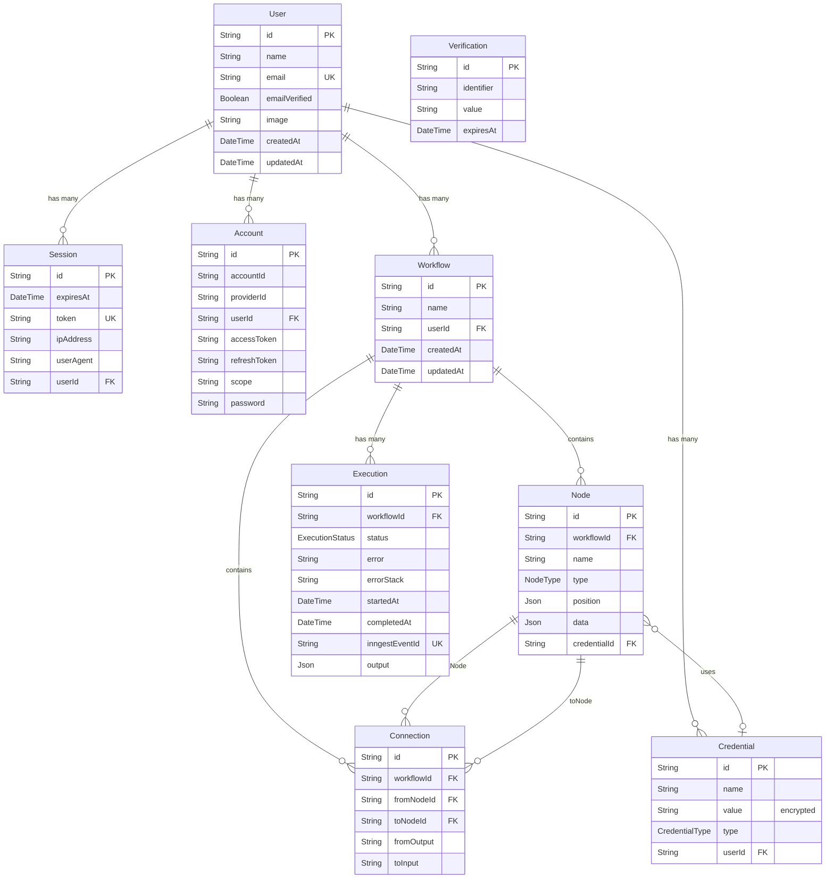

# 💾 Database Schema & Data Layer

> **Last Updated:** April 2026  
> **ORM:** Prisma v7.7.0  
> **Database:** Neon PostgreSQL (Serverless)  
> **Adapter:** `@prisma/adapter-neon` (HTTP-based connections)

---

## Table of Contents

- [Entity-Relationship Diagram](#entity-relationship-diagram)
- [Model Reference](#model-reference)
- [Enums](#enums)
- [Prisma Configuration](#prisma-configuration)
- [Data Access Patterns](#data-access-patterns)
- [Migration Workflow](#migration-workflow)

---

## Entity-Relationship Diagram



---

## Model Reference

### User

The core identity model. Every resource in the system is owned by a user.

| Field | Type | Constraints | Description |
|---|---|---|---|
| `id` | `String` | `@id` | Primary key (set by Better Auth) |
| `name` | `String` | required | Display name |
| `email` | `String` | `@@unique` | Login email — unique constraint |
| `emailVerified` | `Boolean` | `@default(false)` | Whether email has been verified |
| `image` | `String?` | optional | Profile avatar URL |
| `createdAt` | `DateTime` | `@default(now())` | Account creation timestamp |
| `updatedAt` | `DateTime` | `@updatedAt` | Last modification timestamp |

**Relations:**
- `sessions` → `Session[]` — Active login sessions
- `accounts` → `Account[]` — OAuth provider accounts
- `workflows` → `Workflow[]` — User's workflows
- `credentials` → `Credential[]` — Encrypted API credentials

**Table mapping:** `@@map("user")`

---

### Session

Tracks active authentication sessions. Managed by Better Auth.

| Field | Type | Constraints | Description |
|---|---|---|---|
| `id` | `String` | `@id` | Primary key |
| `expiresAt` | `DateTime` | required | Session expiration time |
| `token` | `String` | `@@unique` | Session token for cookie validation |
| `ipAddress` | `String?` | optional | Client IP address at login |
| `userAgent` | `String?` | optional | Browser user agent at login |
| `userId` | `String` | FK → User | Owner of this session |

**Cascade:** Deleting a User deletes all their sessions.

**Table mapping:** `@@map("session")`

---

### Account

OAuth provider accounts linked to a user. Created when a user signs in via GitHub or Google.

| Field | Type | Constraints | Description |
|---|---|---|---|
| `id` | `String` | `@id` | Primary key |
| `accountId` | `String` | required | Provider-specific account ID |
| `providerId` | `String` | required | Provider name (`github`, `google`) |
| `userId` | `String` | FK → User | Linked user |
| `accessToken` | `String?` | optional | OAuth access token |
| `refreshToken` | `String?` | optional | OAuth refresh token |
| `idToken` | `String?` | optional | OIDC ID token |
| `accessTokenExpiresAt` | `DateTime?` | optional | Access token expiration |
| `refreshTokenExpiresAt` | `DateTime?` | optional | Refresh token expiration |
| `scope` | `String?` | optional | OAuth scopes granted |
| `password` | `String?` | optional | Hashed password (for email/password auth) |

**Cascade:** Deleting a User deletes all their accounts.

**Table mapping:** `@@map("account")`

---

### Verification

Email verification tokens. Used during signup and email change flows.

| Field | Type | Constraints | Description |
|---|---|---|---|
| `id` | `String` | `@id` | Primary key |
| `identifier` | `String` | required | Email or identifier to verify |
| `value` | `String` | required | Verification token value |
| `expiresAt` | `DateTime` | required | Token expiration time |

**Table mapping:** `@@map("verification")`

---

### Credential

Encrypted API key storage. Users store their AI provider keys securely, and these are decrypted only at workflow execution time.

| Field | Type | Constraints | Description |
|---|---|---|---|
| `id` | `String` | `@id @default(cuid())` | Auto-generated CUID |
| `name` | `String` | required | User-friendly credential name |
| `value` | `String` | required | **AES-256 encrypted** API key value |
| `type` | `CredentialType` | enum | Provider type (OPENAI, ANTHROPIC, GEMINI) |
| `userId` | `String` | FK → User | Owner |
| `credentialId` | — | — | Referenced by Node |

**Security:**
- Values are **encrypted at rest** using Cryptr (AES-256-GCM)
- Encryption happens in the tRPC router on `create` and `update` via `encrypt(value)`
- Decryption happens in executor functions at runtime via `decrypt(credential.value)`
- The raw API key is **never stored in plaintext**

**Cascade:** Deleting a User deletes all their credentials.

---

### Workflow

The primary domain entity. A workflow is a DAG (directed acyclic graph) composed of nodes connected by edges.

| Field | Type | Constraints | Description |
|---|---|---|---|
| `id` | `String` | `@id @default(cuid())` | Auto-generated CUID |
| `name` | `String` | required | Auto-generated slug or user-defined name |
| `userId` | `String` | FK → User | Owner |
| `createdAt` | `DateTime` | `@default(now())` | Creation timestamp |
| `updatedAt` | `DateTime` | `@updatedAt` | Last modification |

**Relations:**
- `nodes` → `Node[]` — All nodes in this workflow
- `connections` → `Connection[]` — Edges between nodes
- `executions` → `Execution[]` — Execution history

**Name Generation:** New workflows get random slug names via `random-word-slugs`:
```typescript
name: generateSlug(3) // e.g., "happy-blue-dolphin"
```

**Cascade:** Deleting a User deletes all their workflows (and transitively all nodes, connections, executions).

---

### Node

A single step in a workflow graph. Nodes have a type (trigger or executor), a position on the canvas, and type-specific configuration data.

| Field | Type | Constraints | Description |
|---|---|---|---|
| `id` | `String` | `@id @default(cuid())` | Auto-generated CUID |
| `workflowId` | `String` | FK → Workflow | Parent workflow |
| `name` | `String` | required | Node display name (usually matches type) |
| `type` | `NodeType` | enum | Node type (see Enums section) |
| `position` | `Json` | required | `{ x: number, y: number }` canvas coordinates |
| `data` | `Json` | `@default("{}")` | Type-specific configuration |
| `credentialId` | `String?` | FK → Credential | Optional linked credential |

**The `data` field** stores node-specific configuration as JSON. Structure varies by type:

| Node Type | `data` Structure |
|---|---|
| `MANUAL_TRIGGER` | `{}` (no config) |
| `HTTP_REQUEST` | `{ variableName, endpoint, method, body }` |
| `OPENAI` | `{ variableName, credentialId, systemPrompt, userPrompt }` |
| `ANTHROPIC` | `{ variableName, credentialId, systemPrompt, userPrompt }` |
| `GEMINI` | `{ variableName, credentialId, systemPrompt, userPrompt }` |
| `DISCORD` | `{ variableName, webhookUrl, message }` |
| `SLACK` | `{ variableName, webhookUrl, message }` |
| `GOOGLE_FORM_TRIGGER` | `{}` (data comes from webhook) |
| `STRIPE_TRIGGER` | `{}` (data comes from webhook) |

**Cascade:** Deleting a Workflow deletes all its nodes.

---

### Connection

A directed edge between two nodes. Represents data flow from one node's output to another node's input in the DAG.

| Field | Type | Constraints | Description |
|---|---|---|---|
| `id` | `String` | `@id @default(cuid())` | Auto-generated CUID |
| `workflowId` | `String` | FK → Workflow | Parent workflow |
| `fromNodeId` | `String` | FK → Node (FromNode) | Source node |
| `toNodeId` | `String` | FK → Node (ToNode) | Target node |
| `fromOutput` | `String` | `@default("main")` | Source handle name |
| `toInput` | `String` | `@default("main")` | Target handle name |

**Unique Constraint:** `@@unique([fromNodeId, toNodeId, fromOutput, toInput])` — prevents duplicate connections.

**React Flow Mapping:**
```typescript
// Connection → React Flow Edge
{
  id: connection.id,
  source: connection.fromNodeId,
  target: connection.toNodeId,
  sourceHandle: connection.fromOutput,
  targetHandle: connection.toInput,
}
```

**Cascade:** Deleting a Node or Workflow deletes all associated connections.

---

### Execution

A single workflow run. Tracks status, timing, and output. Correlated with Inngest via `inngestEventId`.

| Field | Type | Constraints | Description |
|---|---|---|---|
| `id` | `String` | `@id @default(cuid())` | Auto-generated CUID |
| `workflowId` | `String` | FK → Workflow | Executed workflow |
| `status` | `ExecutionStatus` | `@default(RUNNING)` | Current status |
| `error` | `String?` | `@db.Text` | Error message (if failed) |
| `errorStack` | `String?` | `@db.Text` | Error stack trace (if failed) |
| `startedAt` | `DateTime` | `@default(now())` | Execution start time |
| `completedAt` | `DateTime?` | optional | Execution end time (null while running) |
| `inngestEventId` | `String` | `@unique` | Inngest event correlation ID |
| `output` | `Json?` | optional | Final execution output (context chain result) |

**Status Lifecycle:**
```
RUNNING → SUCCESS  (completedAt set, output populated)
RUNNING → FAILED   (error + errorStack populated via onFailure handler)
```

**Cascade:** Deleting a Workflow deletes all its executions.

---

## Enums

### NodeType

Defines all available workflow node types. Each type corresponds to an executor function and a React Flow component.

```prisma
enum NodeType {
  INITIAL              // Placeholder node (created with new workflows)
  MANUAL_TRIGGER       // Trigger: manual execution button
  HTTP_REQUEST         // Executor: HTTP API calls
  GOOGLE_FORM_TRIGGER  // Trigger: Google Forms webhook
  STRIPE_TRIGGER       // Trigger: Stripe webhook events
  ANTHROPIC            // Executor: Claude AI model
  GEMINI               // Executor: Google Gemini model
  OPENAI               // Executor: GPT model
  DISCORD              // Executor: Discord webhook message
  SLACK                // Executor: Slack webhook message
}
```

**Categories:**

| Category | Types | Behavior |
|---|---|---|
| **Triggers** | `MANUAL_TRIGGER`, `GOOGLE_FORM_TRIGGER`, `STRIPE_TRIGGER` | Start a workflow; inject initial data into context |
| **AI Executors** | `OPENAI`, `ANTHROPIC`, `GEMINI` | Call AI APIs using encrypted credentials |
| **Integration Executors** | `HTTP_REQUEST`, `DISCORD`, `SLACK` | Call external services |
| **System** | `INITIAL` | Placeholder; replaced when user selects a trigger |

---

### CredentialType

Available credential providers for API key storage.

```prisma
enum CredentialType {
  OPENAI     // OpenAI API key
  ANTHROPIC  // Anthropic API key
  GEMINI     // Google AI (Gemini) API key
}
```

---

### ExecutionStatus

Workflow execution lifecycle states.

```prisma
enum ExecutionStatus {
  RUNNING  // Execution in progress
  SUCCESS  // All nodes completed successfully
  FAILED   // An error occurred during execution
}
```

---

## Prisma Configuration

### Schema Location

```
prisma/schema.prisma      → Schema definition
prisma.config.ts           → Prisma CLI configuration
src/generated/prisma/      → Generated client output (git-ignored)
```

### Prisma Config (`prisma.config.ts`)

```typescript
import 'dotenv/config'
import { defineConfig, env } from 'prisma/config'

export default defineConfig({
  schema: 'prisma/schema.prisma',
  datasource: {
    url: env('DATABASE_URL'),  // Loads from .env via dotenv
  },
})
```

### Database Client Singleton (`src/lib/db.ts`)

```typescript
import { PrismaNeon } from "@prisma/adapter-neon";
import { PrismaClient } from "@/generated/prisma";

const globalForPrisma = global as unknown as { prisma: PrismaClient };

const connectionString = `${process.env.DATABASE_URL}`;
const adapter = new PrismaNeon({ connectionString });

const prisma = globalForPrisma.prisma || new PrismaClient({ adapter });

if (process.env.NODE_ENV !== "production") {
  globalForPrisma.prisma = prisma;  // Prevent duplicate clients during dev hot-reload
}

export default prisma;
```

**Why this pattern?**  
Next.js hot module replacement creates new module instances on each file change. Without the global singleton, each HMR cycle would create a new Prisma Client and eventually exhaust the database connection pool.

### Neon Adapter

The `PrismaNeon` adapter enables **HTTP-based database connections** instead of persistent TCP connections. This is critical for serverless environments (Vercel) where:
- Functions are ephemeral — no persistent connections
- Connection pooling is handled by Neon's proxy
- Cold starts are fast (no TCP handshake)

---

## Data Access Patterns

### Row-Level Isolation

Every query includes a `userId` filter to ensure data isolation:

```typescript
// ✅ All queries filter by authenticated user
prisma.workflow.findMany({
  where: { userId: ctx.auth.user.id },
});

// ✅ Nested relations also filter by user
prisma.execution.findMany({
  where: { workflow: { userId: ctx.auth.user.id } },
});
```

### Paginated Queries

All list endpoints follow the same pagination pattern:

```typescript
const [items, totalCount] = await Promise.all([
  prisma.workflow.findMany({
    skip: (page - 1) * pageSize,
    take: pageSize,
    where: { userId: ctx.auth.user.id },
    orderBy: { updatedAt: "desc" },
  }),
  prisma.workflow.count({
    where: { userId: ctx.auth.user.id },
  }),
]);

return {
  items, page, pageSize,
  totalCount,
  totalPages: Math.ceil(totalCount / pageSize),
  hasNextPage: page < totalPages,
  hasPreviousPage: page > 1,
};
```

### Transactional DAG Updates

Workflow node/edge updates use Prisma transactions for atomicity:

```typescript
await prisma.$transaction(async (tx) => {
  // 1. Delete all existing nodes (cascades to connections)
  await tx.node.deleteMany({ where: { workflowId: id } });
  
  // 2. Create new nodes
  await tx.node.createMany({ data: nodes });
  
  // 3. Create new connections
  await tx.connection.createMany({ data: edges });
  
  // 4. Update workflow timestamp
  await tx.workflow.update({ where: { id }, data: { updatedAt: new Date() } });
});
```

This ensures the graph is always in a consistent state — you never see partial node/edge states.

### Credential Encryption Flow

```
Create/Update:                    Execution:
User Input → encrypt() → DB      DB → decrypt() → AI SDK → API Call
             (Cryptr AES-256)              (Cryptr AES-256)
```

---

## Migration Workflow

### Development

```bash
# Quick schema sync (no migration history) — prototyping
pnpm prisma db push

# Create a tracked migration — collaborative development
pnpm prisma migrate dev --name describe_your_change

# Regenerate client after schema changes
pnpm prisma generate

# Open database browser
pnpm prisma studio
```

### Production

```bash
# Apply pending migrations
pnpm prisma migrate deploy

# Never use db push in production!
```

### Common Operations

```bash
# Reset database (⚠️ destructive — drops all data)
pnpm prisma migrate reset

# View migration status
pnpm prisma migrate status

# Generate SQL without applying
pnpm prisma migrate diff --from-schema-datasource prisma/schema.prisma --to-schema-datamodel prisma/schema.prisma --script
```

---

## Related Documentation

- [ARCHITECTURE.md](./ARCHITECTURE.md) — How the data layer fits into the system
- [API_REFERENCE.md](./API_REFERENCE.md) — tRPC procedures that query this schema
- [WORKFLOW_ENGINE.md](./WORKFLOW_ENGINE.md) — How nodes and connections are executed
- [AUTHENTICATION.md](./AUTHENTICATION.md) — Auth models (User, Session, Account, Verification)
- [CONFIGURATION.md](./CONFIGURATION.md) — `DATABASE_URL` and Prisma config details
