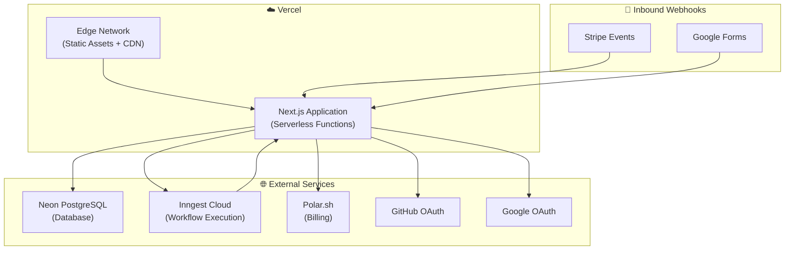

# 🚀 Deployment Guide

> **Last Updated:** April 2026  
> **Target Platform:** Vercel (recommended) / Any Node.js 18+ host  
> **Database:** Neon PostgreSQL (serverless)

---

## Table of Contents

- [Deployment Architecture](#deployment-architecture)
- [Vercel Deployment](#vercel-deployment)
- [Environment Variables (Production)](#environment-variables-production)
- [Database Migration](#database-migration)
- [Inngest Configuration](#inngest-configuration)
- [Pre-Deployment Checklist](#pre-deployment-checklist)
- [Post-Deployment Verification](#post-deployment-verification)
- [Production Monitoring](#production-monitoring)

---

## Deployment Architecture



---

## Vercel Deployment

### Step 1: Connect Repository

1. Go to [vercel.com/new](https://vercel.com/new)
2. Import your GitHub/GitLab repository
3. Vercel auto-detects Next.js — no build configuration needed

### Step 2: Configure Build Settings

| Setting | Value |
|---|---|
| **Framework Preset** | Next.js (auto-detected) |
| **Build Command** | `pnpm build` (default) |
| **Output Directory** | `.next` (default) |
| **Install Command** | `pnpm install` |
| **Node.js Version** | 18.x or later |

### Step 3: Set Environment Variables

Add all required production environment variables in **Vercel → Project → Settings → Environment Variables**.

> ⚠️ **Critical:** Use production values, not development ones. See the [Environment Variables section](#environment-variables-production) below.

### Step 4: Deploy

```bash
# Automatic: Push to main branch triggers deployment
git push origin main

# Manual: Deploy from CLI
npx vercel --prod
```

### Alternative: Self-Hosting

For non-Vercel deployments (Docker, AWS, etc.):

```bash
# Build the production bundle
pnpm build

# Start the production server
pnpm start
# or
node .next/standalone/server.js  # If using standalone output
```

**Requirements:**
- Node.js 18+
- All environment variables set
- Database accessible from the server
- Inngest Cloud or self-hosted Inngest server

---

## Environment Variables (Production)

### What Changes from Development

| Variable | Development | Production |
|---|---|---|
| `DATABASE_URL` | Local/dev database | Production Neon project |
| `BETTER_AUTH_URL` | `http://localhost:3000` | `https://your-domain.com` |
| `NEXT_PUBLIC_APP_URL` | `http://localhost:3000` | `https://your-domain.com` |
| `POLAR_SUCCESS_URL` | `http://localhost:3000/success?...` | `https://your-domain.com/success?...` |
| `NODE_ENV` | `development` | `production` (auto-set by Vercel) |

### Production Environment Variables

```env
# ===== DATABASE =====
DATABASE_URL="postgresql://<prod-user>:<prod-pass>@<prod-host>/neondb?sslmode=require"

# ===== AUTHENTICATION =====
BETTER_AUTH_SECRET="<production-secret-32-chars>"
BETTER_AUTH_URL="https://your-domain.com"

# ===== OAUTH =====
GITHUB_CLIENT_ID=<production-github-client-id>
GITHUB_CLIENT_SECRET=<production-github-secret>
GOOGLE_CLIENT_ID=<production-google-client-id>
GOOGLE_CLIENT_SECRET=<production-google-secret>

# ===== ENCRYPTION =====
ENCRYPTION_KEY="<production-encryption-key-32-chars>"

# ===== BILLING =====
POLAR_ACCESS_TOKEN=<production-polar-token>
POLAR_SUCCESS_URL=https://your-domain.com/success?checkout_id={CHECKOUT_ID}

# ===== PUBLIC =====
NEXT_PUBLIC_APP_URL=https://your-domain.com
```

### Production OAuth Callback URLs

Update OAuth callback URLs in provider dashboards:

| Provider | Callback URL |
|---|---|
| **GitHub** | `https://your-domain.com/api/auth/callback/github` |
| **Google** | `https://your-domain.com/api/auth/callback/google` |

### Production Polar Configuration

In `src/lib/polar.ts`, switch from sandbox to production:

```typescript
export const polarClient = new Polar({
  accessToken: process.env.POLAR_ACCESS_TOKEN,
  server: "production",  // Change from "sandbox"
});
```

---

## Database Migration

### Before First Deployment

Run migrations against the production database:

```bash
# Set production DATABASE_URL
export DATABASE_URL="postgresql://..."

# Apply migrations
pnpm prisma migrate deploy

# Or if not using migrations
pnpm prisma db push
```

### On Schema Changes

```bash
# 1. Create migration locally
pnpm prisma migrate dev --name describe_change

# 2. Push to repository
git add prisma/migrations/
git commit -m "Add migration: describe_change"

# 3. Apply in production
# Option A: Run in CI/CD pipeline
pnpm prisma migrate deploy

# Option B: Run manually against production DB
DATABASE_URL="<prod-url>" pnpm prisma migrate deploy
```

### Prisma Generate in CI

The Prisma client must be generated during the build. This happens automatically via the `postinstall` script or can be done explicitly:

```bash
pnpm prisma generate
```

Ensure the `prisma` package is listed in `pnpm.onlyBuiltDependencies` in `package.json` so post-install scripts run.

---

## Inngest Configuration

### Development → Production

| Setting | Development | Production |
|---|---|---|
| **Server** | Local dev server (`pnpm inngest:dev`) | Inngest Cloud |
| **Retries** | 0 | 3 |
| **Dashboard** | `http://localhost:8288` | [app.inngest.com](https://app.inngest.com) |

### Setting Up Inngest Cloud

1. Create an account at [inngest.com](https://www.inngest.com/)
2. Create a new application
3. Copy the Inngest signing key and event key
4. Add to Vercel environment variables:
   - `INNGEST_SIGNING_KEY`
   - `INNGEST_EVENT_KEY`
5. Inngest auto-discovers functions via the `/api/inngest` route

### Vercel Integration

Inngest has a native [Vercel integration](https://www.inngest.com/docs/deploy/vercel) that:
- Automatically syncs functions on each deployment
- Configures signing keys
- Connects to the production dashboard

---

## Pre-Deployment Checklist

### Code Quality

- [ ] **Build succeeds** — `pnpm build` completes without errors
- [ ] **TypeScript passes** — No type errors in strict mode
- [ ] **ESLint passes** — `pnpm lint` has no errors
- [ ] **No console.log** — Remove debug logging

### Environment

- [ ] **Production `.env`** — All required variables set with production values
- [ ] **OAuth callbacks** — Updated to production domain
- [ ] **Polar mode** — Switched from `"sandbox"` to `"production"`
- [ ] **ENCRYPTION_KEY** — Generated and stored securely
- [ ] **BETTER_AUTH_SECRET** — Generated and stored securely

### Database

- [ ] **Migrations applied** — `pnpm prisma migrate deploy` on production DB
- [ ] **Prisma client generated** — Build includes generated client
- [ ] **Connection string** — Uses production Neon connection pooler URL
- [ ] **SSL enabled** — Connection string includes `?sslmode=require`

### Services

- [ ] **Inngest Cloud** — Account created, Vercel integration installed
- [ ] **Polar.sh** — Production access token, product configured
- [ ] **Neon** — Production project, connection pooling enabled
- [ ] **OAuth apps** — Configured for production domain

### Security

- [ ] **Secrets rotated** — No development secrets in production
- [ ] **`.env` not committed** — Verified in `.gitignore`
- [ ] **HTTPS only** — Production domain uses HTTPS
- [ ] **Sensitive headers** — No API keys leaked in client bundles

---

## Post-Deployment Verification

After deploying, verify each system works:

### 1. Application Health

```bash
# Check the app loads
curl -I https://your-domain.com

# Should return 307 redirect to /workflows (unauthenticated)
```

### 2. Authentication

- [ ] Email/password registration works
- [ ] Email/password login works
- [ ] GitHub OAuth flow completes
- [ ] Google OAuth flow completes
- [ ] Logout works and clears session

### 3. Core Features

- [ ] Workflow list loads (after login)
- [ ] Create workflow (requires Pro subscription)
- [ ] Open workflow editor
- [ ] Add and connect nodes
- [ ] Save workflow
- [ ] Execute workflow (verify in Inngest dashboard)

### 4. Billing

- [ ] Upgrade checkout flow completes
- [ ] Billing portal opens
- [ ] Premium features gated correctly (FORBIDDEN for free users)

### 5. Webhooks (if applicable)

- [ ] Stripe webhook endpoint responds
- [ ] Google Forms webhook endpoint responds
- [ ] Webhook-triggered executions appear in Inngest dashboard

---

## Production Monitoring

### Vercel

| Feature | Purpose |
|---|---|
| **Deployment logs** | Build output and errors |
| **Function logs** | API route and Server Component logs |
| **Analytics** | Web Vitals (LCP, FID, CLS) |
| **Speed Insights** | Real user performance data |

### Inngest

| Feature | Purpose |
|---|---|
| **Function dashboard** | View all registered functions |
| **Event log** | Track every event sent |
| **Run history** | Step-by-step execution trace |
| **Error alerts** | Notifications on function failures |

### Neon

| Feature | Purpose |
|---|---|
| **Query insights** | Slow query identification |
| **Connection monitoring** | Active connections and pooling stats |
| **Storage usage** | Database size tracking |
| **Branch management** | Preview deployment databases |

### Polar

| Feature | Purpose |
|---|---|
| **Customer dashboard** | Subscriber management |
| **Revenue metrics** | MRR, churn, growth |
| **Webhook logs** | Subscription event history |

---

## Scaling Considerations

| Component | Current | Scaling Path |
|---|---|---|
| **Compute** | Vercel Serverless | Scale automatically (per-invocation) |
| **Database** | Neon Free/Pro | Neon autoscaling (compute units) |
| **Execution Engine** | Inngest Free | Inngest Pro (higher concurrency limits) |
| **Billing** | Polar.sh | Scales with customer count |
| **Static Assets** | Vercel CDN | Global edge network (automatic) |

---

## Related Documentation

- [GETTING_STARTED.md](./GETTING_STARTED.md) — Development environment setup
- [CONFIGURATION.md](./CONFIGURATION.md) — All environment variables
- [AUTHENTICATION.md](./AUTHENTICATION.md) — OAuth provider configuration
- [WORKFLOW_ENGINE.md](./WORKFLOW_ENGINE.md) — Inngest function setup
