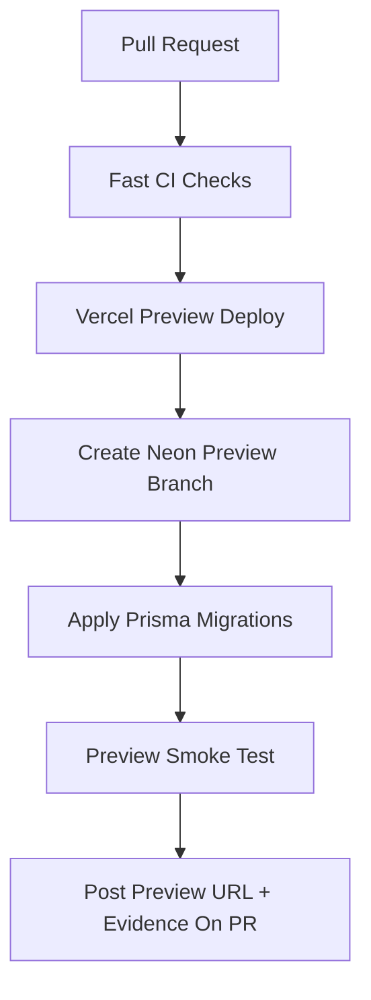
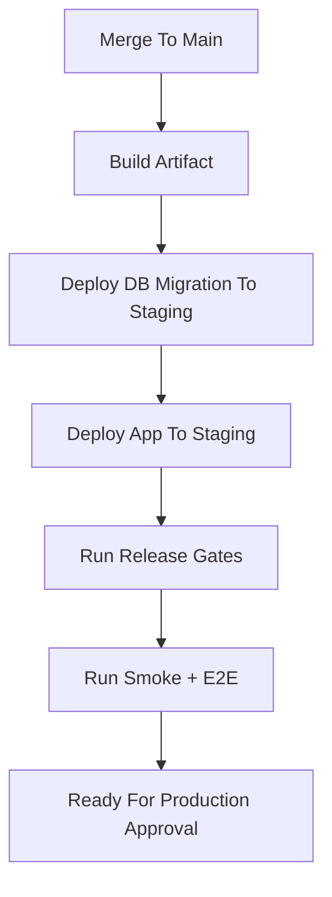
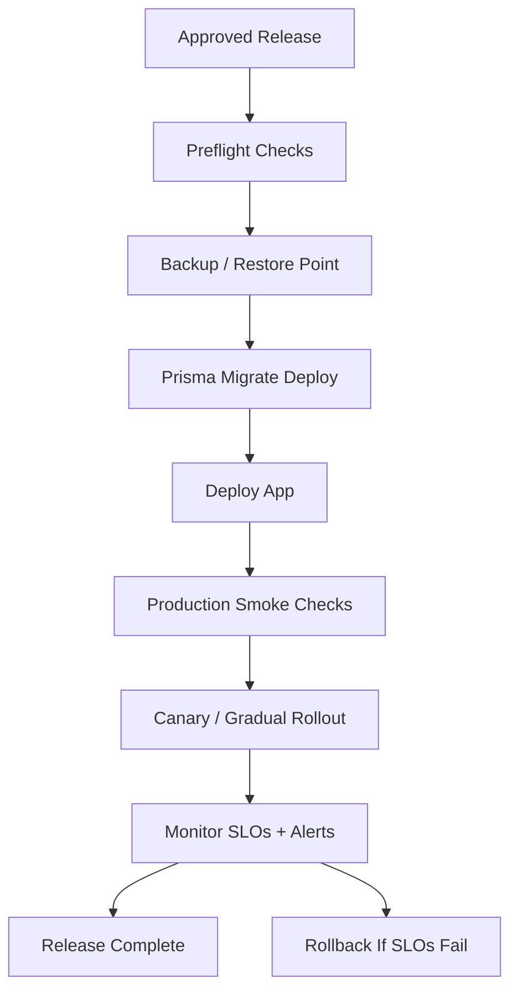

# Industry Grade DevOps Implementation Plan

> Project: a8n  
> Scope: Next.js app, tRPC/internal API, MCP server, Prisma/PostgreSQL, Inngest workflows, Better Auth, Polar billing, webhooks, CI/CD, release operations  
> Purpose: Explain what real industry DevOps contains, why each part exists, what problem it solves, and how this project should implement it over time.

---

## 1. What DevOps Means In This Project

DevOps is not only deployment. It is the complete engineering system that helps a team move code from idea to production safely, repeatedly, and with evidence.

For this project, DevOps covers:

- Local developer workflow.
- Branching, code review, versioning, and release management.
- CI pipelines for lint, typecheck, tests, build, security, and release gates.
- CD pipelines for preview, staging, production, rollback, and hotfixes.
- Environment management for development, test, staging, and production.
- Database migration safety.
- Secrets and configuration management.
- Feature flags, gradual rollout, A/B testing, and kill switches.
- Observability: logs, metrics, traces, dashboards, alerts, and SLOs.
- Incident response, postmortems, backup, restore, and disaster recovery.
- Security and supply-chain controls.
- Cost, performance, compliance, and operational governance.

The goal is simple: every important production change should be tested, reviewed, deployable, observable, reversible, and explainable.

---

## 2. Current Project Baseline

This repo already has a good foundation:

| Area | Current Status |
|---|---|
| Framework | Next.js app with API routes, server code, and UI |
| Backend API | tRPC/internal API and MCP routes |
| Database | Prisma with PostgreSQL/Neon-style connection |
| Workflow engine | Inngest |
| Auth | Better Auth |
| Billing | Polar |
| Unit/contract tests | Vitest API and MCP tests |
| Backend E2E tests | Playwright API E2E suite |
| Release gates | Internal API release gate and API E2E release gate |
| CI | GitHub Actions workflows for API, MCP, backend E2E, and release gate |
| Evidence | API and E2E release evidence stored under `docs/api/evidence` |

Important files already present:

| File | Purpose |
|---|---|
| `package.json` | Scripts for dev, build, lint, typecheck, API tests, MCP tests, E2E tests, release gates |
| `.github/workflows/internal-api-quality.yml` | Internal API quality checks |
| `.github/workflows/backend-e2e.yml` | Backend E2E smoke/full pipeline |
| `.github/workflows/backend-release-gate.yml` | Combined backend release gate |
| `.github/workflows/mcp-quality.yml` | MCP quality checks |
| `scripts/api-release-gate.ts` | API release gate runner |
| `scripts/api-e2e-release-gate.ts` | API E2E release gate runner |
| `docs/TRPC_INTERNAL_API_TESTING_PLAN.md` | Internal API testing plan |
| `docs/BACKEND_E2E_TESTING_PLAN.md` | Backend E2E testing plan |
| `docs/DEPLOYMENT.md` | Basic deployment guide |
| `docs/CONFIGURATION.md` | Environment variable reference |

This plan builds on that foundation.

---

## 3. Target DevOps Architecture

The target workflow should look like this:

```mermaid
flowchart LR
    Dev["Developer Machine"] --> Branch["Feature Branch"]
    Branch --> PR["Pull Request"]
    PR --> CI["CI Quality Gates"]
    CI --> Preview["Preview Environment"]
    Preview --> Review["Code + Product Review"]
    Review --> Main["Merge To Main"]
    Main --> Staging["Staging Deploy"]
    Staging --> StageGate["Staging Smoke + E2E + Migration Checks"]
    StageGate --> Canary["Canary / Gradual Rollout"]
    Canary --> Prod["Production"]
    Prod --> Observe["Logs, Metrics, Traces, Alerts"]
    Observe --> Incident["Incident Response / Rollback"]
    Observe --> Improve["Postmortem / Backlog"]
```



Every box exists to reduce a specific risk:

| Step | Problem It Solves |
|---|---|
| Local dev checks | Catches mistakes before they reach CI |
| Pull request review | Prevents unreviewed code from reaching shared branches |
| CI quality gates | Catches type, lint, test, build, and security failures |
| Preview environment | Lets reviewers test real behavior before merge |
| Staging | Tests production-like config before customer traffic |
| Canary rollout | Limits blast radius of risky releases |
| Production smoke checks | Confirms the deployed app actually works |
| Observability | Helps detect and debug production issues quickly |
| Rollback | Restores service when a release is bad |
| Postmortem | Converts incidents into permanent improvements |

---

## 4. Environment Strategy

Industry-grade projects separate environments because each one answers a different question.

| Environment | Purpose | Data | Who Uses It | Deployment Trigger |
|---|---|---|---|---|
| Local | Developer coding and debugging | Local or disposable dev DB | Individual developer | Manual `pnpm dev` |
| Test/CI | Automated verification | Ephemeral test DB | GitHub Actions | PR/push/schedule |
| Preview | Review one PR in a real hosted app | Isolated preview DB or safe shared dev DB | Developer/reviewer | PR opened/updated |
| Development shared | Team integration before staging | Non-production shared DB | Team | Merge to `develop` if used |
| Staging | Production-like rehearsal | Staging DB, staging secrets | Team/QA | Merge to `main` or release branch |
| Production | Real users and real data | Production DB and production secrets | Customers | Approved release |

### Required Environment Rules

- Production secrets must never be used in local, CI, preview, or staging.
- Test data must never write to production.
- CI should use disposable databases whenever possible.
- Preview environments should be automatically destroyed when a PR closes.
- Staging should be as close to production as possible, but with non-production accounts and tokens.
- Production deploys should require release gates, approval, and rollback instructions.

### Recommended Project Mapping

| Environment | Suggested Platform Setup |
|---|---|
| Local | `pnpm dev`, local `.env`, local/Neon dev database |
| CI | GitHub Actions + Postgres service container |
| Preview | Vercel preview deployments + Neon branch per PR |
| Staging | Vercel staging project + Neon staging database + Inngest staging app |
| Production | Vercel production project + Neon production database + Inngest production app |

---

## 5. Branching Strategy

Recommended strategy for this project:

| Branch Type | Example | Purpose |
|---|---|---|
| Main branch | `main` | Always releasable |
| Feature branch | `feature/api-rate-limit` | Normal product work |
| Fix branch | `fix/webhook-signature-validation` | Bug fix |
| Codex branch | `codex/backend-e2e-phase-10` | AI-assisted work branch |
| Release branch | `release/1.4.0` | Stabilization for a release |
| Hotfix branch | `hotfix/1.4.1-webhook-outage` | Urgent production fix |

### Rules

- No direct push to `main`.
- Every production change goes through a PR.
- PRs must pass required CI checks.
- At least one review required for production-sensitive code.
- CODEOWNERS should require reviews for security, auth, billing, database, and deployment files.
- Large risky changes should use feature flags.

### Files To Add Later

| File | Purpose |
|---|---|
| `.github/CODEOWNERS` | Require review from owners for critical areas |
| `.github/pull_request_template.md` | Standard PR checklist |
| `.github/ISSUE_TEMPLATE/bug_report.md` | Reproducible bug reports |
| `.github/ISSUE_TEMPLATE/incident.md` | Incident tracking |

---

## 6. Versioning And Release Management

Versioning answers: what changed, when was it released, and how do we roll back?

Recommended approach:

- Use Semantic Versioning: `MAJOR.MINOR.PATCH`.
- Use tags for production releases: `v1.5.0`.
- Generate release notes from merged PRs or conventional commits.
- Keep a changelog for user-visible and operational changes.
- Attach release evidence: CI run, migration status, E2E report, security scan, and deployment URL.

### Version Rules

| Change Type | Version Bump | Example |
|---|---|---|
| Breaking API/schema behavior | Major | `1.0.0` to `2.0.0` |
| New backward-compatible feature | Minor | `1.0.0` to `1.1.0` |
| Bug fix | Patch | `1.1.0` to `1.1.1` |
| Internal-only test/docs change | No production version or patch if released | Docs/test-only |

### Release Manifest

Every release should produce a machine-readable release manifest:

```json
{
  "version": "1.5.0",
  "commit": "abc123",
  "environment": "production",
  "releasedAt": "2026-07-03T12:00:00.000Z",
  "databaseMigration": "passed",
  "apiReleaseGate": "passed",
  "apiE2eReleaseGate": "passed",
  "mcpReleaseGate": "passed",
  "buildArtifact": "vercel-deployment-id",
  "rollbackTarget": "v1.4.3"
}
```

Future file to add:

- `scripts/release-manifest.ts`
- `docs/releases/README.md`
- `docs/releases/YYYY-MM-DD-vX.Y.Z.md`

---

## 7. CI Pipeline Design

CI means Continuous Integration. It verifies every proposed change before it is merged or released.

### Recommended CI Layers

| Layer | Command / Tool | Problem Solved |
|---|---|---|
| Install lockfile check | `pnpm install --frozen-lockfile` | Prevents dependency drift |
| Prisma validation | `pnpm exec prisma validate` | Catches invalid schema |
| Typecheck | `pnpm typecheck` | Catches TypeScript contract errors |
| Lint | `pnpm lint` | Catches code quality and Next.js mistakes |
| Unit tests | `pnpm test` | Catches pure logic bugs quickly |
| API unit/contract | `pnpm test:api:unit` | Protects tRPC surface and validations |
| API integration/security | `pnpm test:api:integration` | Protects DB/auth/security behavior |
| API E2E smoke | `pnpm api:e2e:release:gate -- --smoke --json` | Verifies core backend flows over real HTTP |
| MCP quality | `pnpm test:mcp` and MCP checks | Protects MCP server behavior |
| Build | `pnpm build` | Catches production build failures |
| Security scan | CodeQL, dependency audit, secret scan | Catches vulnerable or leaked code |
| Artifact upload | GitHub artifacts | Keeps evidence for review/debugging |

### CI Split By Speed

Fast PR checks should run on every PR:

- Install.
- Prisma validate.
- Typecheck.
- Lint.
- Unit tests.
- API contract tests.
- Backend E2E smoke.
- Build for app-affecting changes.

Slower checks should run on main, nightly, or before release:

- Full backend E2E.
- Full MCP evals.
- Coverage.
- Database integrity tests.
- Dependency vulnerability scans.
- DAST scans.
- Load tests.
- Restore drills.

### Current CI To Keep

The existing workflows are useful and should stay:

- `internal-api-quality.yml`
- `backend-e2e.yml`
- `backend-release-gate.yml`
- `mcp-quality.yml`
- `internal-api-nightly.yml`

### CI Improvements To Add Later

| Improvement | Why It Matters |
|---|---|
| Separate frontend quality workflow | Keeps UI checks independent from backend checks |
| Build cache | Speeds up CI |
| Concurrency cancellation | Cancels old PR runs when new commits arrive |
| Required status checks | Prevents merging broken code |
| CodeQL | Finds security issues in source code |
| Secret scanning | Prevents token leaks |
| Dependency review | Blocks vulnerable new packages |
| SBOM generation | Tracks third-party software in releases |
| Release evidence bundle | Makes every release auditable |

---

## 8. Complete CD Pipeline Design

CD means Continuous Delivery or Continuous Deployment.

For this project, use Continuous Delivery for production: deploy automatically to preview/staging, but require approval for production.

### Preview Deployment Flow



What it solves:

- Reviewers can test real behavior.
- Database changes are tested before merge.
- UI/backend integration issues are visible early.
- Broken PRs are caught before they pollute staging.

### Staging Deployment Flow



What it solves:

- Validates production-like environment variables.
- Tests migration order.
- Tests external service integration with staging accounts.
- Gives the team a final rehearsal before production.

### Production Deployment Flow



What it solves:

- Prevents unknown migration state.
- Confirms the live deployment works.
- Limits impact of bad changes.
- Gives a clear rollback path.

---

## 9. Deployment Strategies

Different release types need different strategies.

| Strategy | Use When | Benefit | Risk |
|---|---|---|---|
| All-at-once | Small internal changes | Simple | Full blast radius |
| Rolling deploy | Stateless app servers | No full downtime | Mixed versions during rollout |
| Blue-green | High-risk releases | Fast rollback | Higher infra cost |
| Canary | Risky product/backend changes | Small blast radius | Needs metrics and routing |
| Feature flag rollout | User-facing behavior changes | Decouples deploy from release | Needs flag governance |
| Dark launch | Backend path not visible to users | Tests infra load safely | Hidden code can rot |
| Shadow traffic | New backend compared with old | Validates behavior on real traffic | Needs strong privacy controls |

Recommended default:

- Preview for every PR.
- Staging for every merge to main.
- Production by approved release gate.
- Feature flags for user-facing or risky backend changes.
- Canary rollout for high-risk production changes.

---

## 10. Feature Flags And A/B Testing

Feature flags and A/B testing are separate concepts, but they often use the same system.

### Feature Flags

A feature flag controls whether a feature is on or off.

Problems solved:

- Ship code without exposing it immediately.
- Turn off bad features without redeploying.
- Release to admins/internal users first.
- Roll out gradually by percentage.
- Separate deployment from product launch.

Recommended flag types:

| Flag Type | Example | Purpose |
|---|---|---|
| Release flag | `newWorkflowEditor` | Gradual rollout |
| Ops flag | `disableWorkflowExecution` | Emergency kill switch |
| Permission flag | `mcpServerEnabled` | Gate access by plan/user |
| Experiment flag | `pricingPageVariant` | A/B testing |
| Migration flag | `useNewCredentialEncryption` | Safe migration rollout |

### A/B Testing

A/B testing compares variants to learn which one performs better.

Problems solved:

- Avoids guessing product decisions.
- Measures effect on signup, activation, retention, revenue, or performance.
- Lets you make data-backed decisions.

Required A/B testing rules:

- Assign each user deterministically to a variant.
- Keep the same user in the same variant.
- Define the success metric before launch.
- Define guardrail metrics before launch.
- Have a kill switch.
- Do not run experiments on security-critical behavior.
- Do not expose private data to analytics.
- End the experiment and remove dead variants.

Example experiment:

| Field | Example |
|---|---|
| Experiment | `workflow_onboarding_v2` |
| Variants | `control`, `guided_setup` |
| Primary metric | Workflow created within 24 hours |
| Guardrails | Error rate, page load time, support complaints |
| Exposure | 10 percent, then 50 percent, then 100 percent |
| Rollback | Set flag to `control` |

### Future Implementation Options

Simple first version:

- Store flags in database.
- Add server-side helper `isFeatureEnabled(userId, flagKey)`.
- Add admin-only management route.
- Add audit log for flag changes.

Production mature version:

- Use LaunchDarkly, Statsig, GrowthBook, or OpenFeature-compatible service.
- Export experiment events to analytics.
- Use dashboards for metrics and confidence.

Future files:

- `src/lib/feature-flags.ts`
- `src/features/admin/feature-flags`
- `prisma` models for `FeatureFlag`, `FeatureFlagRule`, `ExperimentExposure`
- `docs/DevOps/feature-flag-runbook.md`

---

## 11. Database DevOps

Database changes are usually the riskiest part of production deployment because rollback is harder than code rollback.

### Required Database Practices

| Practice | Problem Solved |
|---|---|
| Migration files committed to repo | Makes schema changes reviewable |
| `prisma validate` in CI | Catches invalid schema early |
| Migration preflight in CI | Blocks destructive SQL patterns before release |
| `prisma migrate deploy` in CI/staging/prod | Applies schema consistently |
| Migration status check | Detects drift |
| Backups before risky migrations | Enables recovery |
| Restore drills | Proves backups are usable |
| Expand-contract pattern | Avoids breaking old app versions |
| Seed scripts for test/staging | Makes environments reproducible |
| Preview DB branches | Tests migrations before merge |

### Expand-Contract Migration Pattern

Use this for risky schema changes.

1. Expand: add new nullable column/table/index without removing old behavior.
2. Deploy app version that writes both old and new fields.
3. Backfill existing data.
4. Deploy app version that reads the new field.
5. Contract: remove old column/code after verification.

This solves:

- Zero-downtime schema changes.
- Safer rollback.
- Compatibility between old and new app versions.

### Migration Release Checklist

- [ ] Migration reviewed.
- [ ] Migration tested on CI database.
- [ ] Migration tested on preview/staging.
- [ ] Backfill estimated and tested.
- [ ] Locking/performance risk considered.
- [ ] Backup/restore point available.
- [ ] Rollback plan documented.
- [ ] App code compatible before and after migration.

### Future Commands

```powershell
pnpm exec prisma validate
pnpm db:migration:preflight
pnpm db:migration:preflight -- --db
pnpm exec prisma migrate status
pnpm exec prisma migrate deploy
pnpm test:api:db
pnpm api:release:gate -- --strict --db --json
```

---

## 12. Secrets And Configuration Management

Secrets are production assets. Treat them like code with stronger access controls.

### Problems Solved

- Prevents accidental credential leaks.
- Makes environments reproducible.
- Supports secret rotation.
- Keeps production access limited.
- Avoids production bugs caused by missing config.

### Required Practices

| Practice | Implementation |
|---|---|
| `.env` is never committed | Already covered by gitignore |
| `.env.example` exists | Add and keep updated |
| Central env validation | Add `src/env.ts` using Zod |
| Separate env per environment | Vercel/GitHub environment secrets |
| Secret rotation schedule | Document quarterly or after incident |
| Minimum access | Only production deploy job can read production secrets |
| Redaction | Release gate logs must redact secrets |

### Environment Variable Groups

| Group | Examples |
|---|---|
| Database | `DATABASE_URL` |
| App URLs | `NEXT_PUBLIC_APP_URL`, `APP_URL`, `BETTER_AUTH_URL` |
| Auth | `BETTER_AUTH_SECRET`, OAuth client secrets |
| Encryption | `ENCRYPTION_KEY` |
| Billing | `POLAR_ACCESS_TOKEN` |
| Inngest | event keys, signing keys |
| MCP | API key HMAC secrets, OAuth token HMAC secrets |
| Webhooks | Stripe and app webhook secrets |
| E2E only | `E2E_TESTS`, `E2E_EXTERNAL_SERVICES` |

### Future Files

- `.env.example`
- `src/env.ts`
- `scripts/env-check.ts`
- `docs/DevOps/secrets-rotation-runbook.md`

---

## 13. Testing Strategy In DevOps

Testing is not one thing. Each test layer catches a different class of defect.

| Test Type | Runs Where | Problem Solved |
|---|---|---|
| Unit tests | PR CI | Logic defects |
| Contract tests | PR CI | API shape changes |
| Integration tests | PR/main CI | DB/auth/service integration bugs |
| Transport tests | PR/main CI | HTTP/tRPC protocol issues |
| Security negative tests | PR/main CI | Auth bypass and unsafe access |
| Backend E2E smoke | PR CI | Core production paths broken |
| Full backend E2E | Main/nightly/release | End-to-end backend confidence |
| MCP evals | PR/main/nightly | MCP behavior and safety regressions |
| Frontend E2E | PR/main | User journey regressions |
| Load tests | Staging/release | Capacity and performance failures |
| DAST scans | Staging/nightly | Runtime security issues |
| Chaos/fault tests | Staging/nightly | Resilience to service failure |

### Current Project Commands

```powershell
pnpm typecheck
pnpm lint
pnpm test
pnpm test:api
pnpm test:api:e2e
pnpm test:mcp
pnpm test:mcp:offline
pnpm api:release:gate -- --strict --db --json
pnpm api:e2e:release:gate -- --json
pnpm build
```

### Future Testing Additions

- Frontend E2E for critical user journeys.
- Production smoke tests against deployed staging/production URLs.
- Load test scripts for workflow execution and webhook traffic.
- DAST scan against staging.
- Contract compatibility tests for webhook payloads and MCP clients.
- Performance budget tests for page load and API latency.

---

## 14. Observability

Observability answers: is production healthy, what changed, what broke, and why?

### Three Pillars

| Pillar | Examples | Problem Solved |
|---|---|---|
| Logs | Request logs, auth logs, workflow logs | Understand events |
| Metrics | Error rate, latency, queue depth | Detect health changes |
| Traces | Request path across services | Debug distributed failures |

### What To Measure

| Area | Metrics |
|---|---|
| App/API | Request count, p95 latency, p99 latency, 4xx/5xx rate |
| tRPC | Procedure latency, error codes, auth failures |
| Workflows | Execution count, success rate, failure rate, retry count |
| Inngest | Queue delay, function duration, retry exhaustion |
| Database | Connection count, slow queries, migration status |
| MCP | Tool calls, auth failures, rate limits, audit errors |
| Webhooks | Signature failures, processing errors, replay attempts |
| Billing | Checkout failures, webhook failures, subscription sync errors |
| Frontend | Web vitals, JS errors, hydration errors |

### SLOs And SLIs

SLO means Service Level Objective. SLI means Service Level Indicator.

Example targets:

| Service | SLI | SLO |
|---|---|---|
| API availability | Successful requests / total requests | 99.5 percent monthly |
| API latency | p95 duration | Under 500 ms for core reads |
| Workflow execution | Successful executions | 99 percent excluding user config errors |
| Webhooks | Valid webhook processed | 99.9 percent within 60 seconds |
| Login | Successful auth requests | 99.5 percent |

### Alert Rules

Good alerts are actionable. Avoid noisy alerts.

| Alert | Severity |
|---|---|
| Production app down | P0 |
| Auth login failing broadly | P0/P1 |
| Database unavailable | P0 |
| Workflow executions failing globally | P1 |
| Webhook signature failure spike | P1/P2 |
| API 5xx rate above threshold | P1 |
| p95 API latency above threshold | P2 |
| Error budget burn high | P1/P2 |

### Future Tools

Any of these are acceptable:

- Sentry for errors and performance traces.
- Vercel Observability for app/platform metrics.
- Inngest dashboard for workflow execution.
- Neon monitoring for database.
- Better Stack, Datadog, Grafana Cloud, or OpenTelemetry for broader observability.

Future files:

- `docs/DevOps/observability-runbook.md`
- `docs/DevOps/alert-rules.md`
- `src/lib/observability.ts`
- `src/instrumentation.ts`

---

## 15. Incident Response

Incident response is the system for handling production failures without panic.

### Incident Severity

| Severity | Meaning | Example |
|---|---|---|
| P0 | Critical outage or data loss | App unavailable, database corrupted |
| P1 | Major feature broken | Login down, workflow execution down |
| P2 | Degraded production behavior | Slow API, one integration failing |
| P3 | Minor issue | Non-critical UI bug |

### Incident Lifecycle

1. Detect: alert, user report, dashboard, or CI/CD failure.
2. Triage: confirm scope and severity.
3. Mitigate: rollback, disable flag, scale service, pause jobs.
4. Communicate: status update to users/team.
5. Resolve: fix root cause.
6. Verify: smoke checks and monitoring.
7. Postmortem: document timeline, impact, cause, action items.

### Required Runbooks

| Runbook | Purpose |
|---|---|
| Production rollback | Restore previous app version |
| Bad database migration | Recover or roll forward safely |
| Auth outage | Diagnose Better Auth/OAuth/session failures |
| Inngest failure | Restore workflow execution |
| Webhook failure | Handle replay/signature/processing failures |
| Billing failure | Handle Polar/Stripe sync failures |
| Secret leak | Rotate secrets and audit access |
| Database restore | Restore from backup/PITR |

Future files:

- `docs/DevOps/incidents/incident-template.md`
- `docs/DevOps/incidents/postmortem-template.md`
- `docs/DevOps/runbooks/rollback.md`
- `docs/DevOps/runbooks/database-restore.md`
- `docs/DevOps/runbooks/secret-rotation.md`

---

## 16. Rollback Strategy

Rollback must be planned before release.

### App Rollback

For Vercel:

- Keep previous successful production deployment.
- Promote previous deployment if new release fails.
- Run production smoke checks after rollback.

### Feature Rollback

Preferred for product changes:

- Turn off feature flag.
- Keep code deployed.
- Avoid redeploy if possible.

### Database Rollback

Database rollback is more complex:

- Prefer roll-forward fixes.
- Avoid destructive migrations.
- Use expand-contract migration pattern.
- Keep backups/restore points.
- Test restore procedure.

### Rollback Decision Table

| Failure Type | Best Response |
|---|---|
| UI bug only | Feature flag off or app rollback |
| API errors after deploy | App rollback |
| Bad feature behavior | Feature flag off |
| Migration failed before deploy | Stop release and fix migration |
| Migration applied but app broken | Roll forward app or rollback app if compatible |
| Data corruption | Stop writes, restore or repair from backup |

---

## 17. Security And DevSecOps

DevSecOps means security is part of the pipeline, not an afterthought.

### Security Controls

| Control | Problem Solved |
|---|---|
| Secret scanning | Prevents leaked credentials |
| Dependency scanning | Finds vulnerable packages |
| CodeQL/SAST | Finds insecure code patterns |
| DAST | Finds runtime web vulnerabilities |
| SBOM | Tracks third-party components |
| Least privilege secrets | Limits blast radius |
| Branch protection | Prevents unsafe merges |
| Required reviews | Catches risky changes |
| Audit logs | Supports investigation |
| Threat modeling | Finds design-level risks |
| Rate limiting | Reduces abuse |
| Security headers | Hardens browser/runtime behavior |

### Security Checks To Add

| Check | Trigger |
|---|---|
| GitHub secret scanning | Always on |
| Dependency Review Action | PR |
| CodeQL | PR/main |
| npm/pnpm audit or OSV scanner | PR/nightly |
| Semgrep optional | PR/main |
| ZAP baseline scan | Staging/nightly |
| SBOM generation | Release |
| License policy check | PR/release |

### Security Review Areas In This Project

- `src/lib/auth.ts`
- `src/trpc/init.ts`
- `src/lib/db.ts`
- `src/lib/encryption.ts`
- `src/mcp/**`
- `src/app/api/webhooks/**`
- `src/app/api/mcp/**`
- `src/app/api/oauth/**`
- `prisma/schema.prisma`
- `.github/workflows/**`

---

## 18. Supply Chain Security

Supply chain security protects against compromised dependencies, build scripts, and artifacts.

Required practices:

- Use `pnpm-lock.yaml`.
- Install with `pnpm install --frozen-lockfile` in CI.
- Review dependency changes in PRs.
- Enable Dependabot or Renovate.
- Block known critical vulnerabilities.
- Generate SBOM for releases.
- Pin GitHub Actions to major versions now, exact SHAs later for higher security.
- Avoid running untrusted install scripts unless required.
- Record build provenance for production releases.

Future files:

- `.github/dependabot.yml`
- `.github/workflows/security.yml`
- `docs/DevOps/supply-chain-policy.md`

---

## 19. Infrastructure As Code

Infrastructure as Code means environments are created from versioned code instead of manual dashboard clicks.

Problems solved:

- Reproducible environments.
- Reviewable infrastructure changes.
- Faster disaster recovery.
- Less configuration drift.

### What Should Be Managed

| Resource | Suggested Approach |
|---|---|
| Vercel projects | Terraform or documented setup first |
| Vercel env vars | Vercel dashboard initially, IaC later |
| Neon databases/branches | Neon API/Terraform if available |
| GitHub environments | GitHub UI or Terraform |
| GitHub branch protection | Terraform/GitHub settings |
| Inngest apps | Dashboard initially, documented runbook |
| DNS | Cloudflare/Vercel DNS as code later |
| Monitoring alerts | Provider config as code |

### Future Folder

```text
infra/
  README.md
  terraform/
    environments/
      staging/
      production/
```

For this project, start with documented manual setup. Move to Terraform after the environment model is stable.

---

## 20. Containers And Runtime Packaging

Because this project targets Vercel, containers are optional. Still, many industry systems use Docker for reproducible local dev, CI, and self-hosting.

### When Docker Helps

- Local Postgres setup.
- CI services.
- Self-hosted deployment.
- Reproducible dev environment.
- Load testing environment.

### Future Docker Setup

| File | Purpose |
|---|---|
| `Dockerfile` | Build production Next.js app |
| `docker-compose.yml` | Local app + Postgres + optional services |
| `.dockerignore` | Reduce image size |
| `docs/DevOps/docker-runbook.md` | How to run/debug containers |

Since Vercel already handles deployment packaging, Docker should not block the next DevOps phases.

---

## 21. Performance And Load Testing

Performance testing prevents surprises when traffic grows.

### What To Test

| Target | Scenario |
|---|---|
| tRPC API | High read/write request volume |
| Workflow execution | Many workflow triggers |
| Webhooks | Burst of Stripe/Google webhook events |
| MCP server | Tool calls, auth failures, rate limits |
| Database | Query latency under realistic data volume |
| Frontend | Core Web Vitals |

### Suggested Tools

- k6 for API/load tests.
- Playwright for browser/user journey performance smoke.
- Inngest dashboard for workflow runtime.
- Neon query insights for database bottlenecks.

### Performance Budgets

Example starting targets:

| Metric | Target |
|---|---|
| API p95 latency | Under 500 ms for simple reads |
| API p99 latency | Under 1500 ms for normal operations |
| Webhook processing acknowledgement | Under 2 seconds |
| Workflow dispatch | Under 5 seconds to accepted event |
| Dashboard page LCP | Under 2.5 seconds |
| Error rate | Under 1 percent for valid traffic |

Future files:

- `tests/load/api.k6.js`
- `tests/load/webhooks.k6.js`
- `.github/workflows/performance-nightly.yml`

---

## 22. Backup, Restore, And Disaster Recovery

Backups only matter if restore has been tested.

### Key Terms

| Term | Meaning |
|---|---|
| RPO | How much data loss is acceptable |
| RTO | How long recovery may take |
| PITR | Point-in-time recovery |

### Suggested Initial Targets

| System | RPO | RTO |
|---|---|---|
| Production database | 15 minutes or better | 1 hour |
| App deployment | No data loss | 15 minutes |
| Secrets | No data loss | 1 hour |
| Inngest workflows | Depends on provider retention | 1-2 hours |

### Required Practices

- Enable database backups/PITR.
- Document restore steps.
- Run restore drill quarterly.
- Verify restored database integrity.
- Keep production credentials recoverable by owner/admin only.
- Document DNS and Vercel recovery path.

Future files:

- `docs/DevOps/disaster-recovery.md`
- `docs/DevOps/runbooks/database-restore.md`
- `.github/workflows/restore-drill.yml`

---

## 23. Compliance, Privacy, And Data Governance

Even small production apps need basic data governance.

### Required Concepts

| Area | What To Define |
|---|---|
| Data classification | Public, internal, confidential, secret |
| PII handling | What user data is stored and why |
| Retention | How long logs, audit records, workflow data stay |
| Deletion | How to delete user data |
| Access control | Who can access production data |
| Auditability | What actions are logged |
| Privacy | Avoid sending secrets/PII to analytics |

### Project-Specific Sensitive Data

- User accounts and sessions.
- OAuth tokens.
- Encrypted workflow credentials.
- MCP API keys and token hashes.
- Webhook payloads.
- Workflow execution input/output.
- Billing/customer metadata.

Future docs:

- `docs/DevOps/data-retention-policy.md`
- `docs/DevOps/production-access-policy.md`
- `docs/DevOps/privacy-and-logging-policy.md`

---

## 24. Developer Experience

Good DevOps also makes developers faster.

### Goals

- New developer can run the app quickly.
- Commands are documented and reliable.
- Local failures look like CI failures.
- Common tasks have scripts.
- Environment setup is clear.

### Recommended Additions

| Addition | Purpose |
|---|---|
| `.env.example` | Shows required config |
| `pnpm verify` | Runs common local quality checks |
| `pnpm verify:backend` | Runs backend-focused checks |
| Pre-commit hooks optional | Catch simple mistakes early |
| Dev container optional | Reproducible dev setup |
| Troubleshooting docs | Faster onboarding |

Suggested script shape:

```json
{
  "scripts": {
    "verify": "pnpm typecheck && pnpm lint && pnpm test",
    "verify:backend": "pnpm api:release:gate -- --strict --json && pnpm api:e2e:release:gate -- --smoke --json"
  }
}
```

---

## 25. Documentation System

Industry-grade DevOps depends on accurate docs.

### Required Docs

| Doc | Purpose |
|---|---|
| Architecture | How the system works |
| Deployment | How to deploy |
| Configuration | What env vars exist |
| Runbooks | How to operate during incidents |
| Release process | How to ship safely |
| Testing strategy | What each test protects |
| Security model | Threats and controls |
| Data policy | How data is handled |
| Onboarding | How to start development |

### Documentation Rule

If a process is required for production, it should be documented and preferably automated.

---

## 26. Complete Phase-Wise Implementation Roadmap

This roadmap is the recommended future implementation order.

### Phase 0: DevOps Audit And Standards

Goal: define the baseline and rules.

Implement:

- Inventory current CI workflows, scripts, environments, secrets, and deployment process.
- Create DevOps ownership map.
- Define branch protection requirements.
- Define required status checks.
- Add PR template.
- Add CODEOWNERS.
- Define release checklist.

Problems solved:

- No confusion about how code moves to production.
- Critical files receive review.
- PRs follow the same quality standard.

Acceptance criteria:

- PR template exists.
- CODEOWNERS exists.
- Required CI checks are documented.
- Release checklist exists.

Suggested files:

- `.github/CODEOWNERS`
- `.github/pull_request_template.md`
- `docs/DevOps/release-checklist.md`

---

### Phase 1: Environment And Secrets Foundation

Goal: make dev, test, staging, and prod configuration safe and explicit.

Implement:

- Create `.env.example`.
- Add centralized env validation with Zod.
- Document each environment.
- Create GitHub Environments: `preview`, `staging`, `production`.
- Move secrets to GitHub/Vercel environment secrets.
- Add secret rotation runbook.
- Ensure production secrets are unavailable to PR workflows.

Problems solved:

- Missing env vars fail early.
- Production secrets do not leak into CI.
- Developers know which variables belong where.

Acceptance criteria:

- App fails fast when required env is missing.
- CI has test-only secrets.
- Production deploy job uses protected environment secrets.

Suggested files:

- `.env.example`
- `src/env.ts`
- `scripts/env-check.ts`
- `docs/DevOps/environment-strategy.md`
- `docs/DevOps/secrets-rotation-runbook.md`

---

### Phase 2: CI Quality Gates

Goal: make every PR prove basic correctness.

Implement:

- Add/verify CI jobs for install, Prisma validate, typecheck, lint, unit tests, API contract tests.
- Add backend E2E smoke checks for backend-affecting PRs.
- Add build check for app-affecting PRs.
- Add path filters to avoid wasting CI.
- Add concurrency cancellation.
- Upload coverage and test artifacts.

Problems solved:

- Broken code cannot merge easily.
- Reviewers see automated evidence.
- CI stays fast enough for daily work.

Acceptance criteria:

- Required PR checks pass before merge.
- API/backend PRs run API quality and E2E smoke.
- Artifacts are uploaded on failure.

Current baseline:

- This project already has internal API, MCP, backend E2E, and release gate workflows.

Future improvements:

- Add frontend E2E workflow.
- Add general `verify` workflow.
- Add concurrency groups to all workflows.

---

### Phase 3: Database Migration Safety

Goal: make schema changes production-safe.

Implement:

- Ensure migrations are committed and reviewed.
- Run `prisma migrate status` in release gates.
- Add migration checklist.
- Add preview/staging migration tests.
- Add rollback/roll-forward rules.
- Add backup requirement before production migration.
- Add expand-contract guidance.

Problems solved:

- Prevents schema drift.
- Reduces migration downtime risk.
- Makes rollback decisions clearer.

Acceptance criteria:

- Every DB PR includes migration notes.
- Staging migration must pass before production.
- Release checklist includes migration and backup status.

Suggested files:

- `docs/DevOps/database-migration-runbook.md`
- `scripts/migration-preflight.ts`

Current implementation:

- `scripts/migration-preflight.ts` scans Prisma migration SQL for destructive and review-required patterns.
- `pnpm db:migration:preflight` runs the static migration gate.
- `pnpm db:migration:preflight -- --db` adds `prisma migrate status` against the configured database.
- CI workflows run migration preflight before DB-backed API, MCP, E2E, nightly, and release gates.
- Migration evidence is written under `docs/api/evidence/migrations`.

---

### Phase 4: Preview Environments

Goal: let every PR be tested in a real environment.

Implement:

- Vercel preview deployments for PRs.
- Neon database branch per PR or safe shared preview database.
- Apply migrations to preview DB.
- Run preview smoke checks.
- Post preview URL and evidence to PR.
- Destroy preview DB when PR closes.

Problems solved:

- Product behavior can be reviewed before merge.
- DB migration issues appear before staging.
- QA/review does not depend on local setup.

Acceptance criteria:

- PR gets preview URL.
- Preview deployment uses non-production secrets.
- Preview smoke check result is visible.

Suggested files:

- `.github/workflows/preview.yml`
- `scripts/environment-smoke.ts`
- `docs/DevOps/preview-environment-runbook.md`

Current implementation:

- `.github/workflows/preview.yml` runs preview readiness checks on PRs.
- The same workflow runs hosted preview smoke when GitHub receives a successful Preview deployment status.
- `scripts/environment-smoke.ts` provides the shared smoke runner.
- `pnpm smoke:preview` smokes a preview URL and writes JSON evidence.
- Preview evidence is stored under `docs/api/evidence/smoke/preview`.
- `docs/DevOps/preview-environment-runbook.md` defines preview DB, secret, smoke, and teardown rules.

---

### Phase 5: Staging Environment

Goal: create a production-like rehearsal environment.

Implement:

- Dedicated staging Vercel project.
- Dedicated staging database.
- Staging Inngest app.
- Staging OAuth apps.
- Staging Polar/sandbox configuration.
- Deploy main branch to staging.
- Run full release gates against staging.
- Run smoke and E2E checks after deploy.

Problems solved:

- Catches environment-specific issues before production.
- Tests external service wiring.
- Gives team a stable QA environment.

Acceptance criteria:

- Staging URL exists.
- Staging deploy is automatic from main or release branch.
- Staging release gates block production promotion.

Suggested files:

- `.github/workflows/staging-deploy.yml`
- `scripts/environment-smoke.ts`
- `docs/DevOps/staging-runbook.md`

Current implementation:

- `.github/workflows/staging-deploy.yml` deploys `main` and `release/**` to the protected `staging` environment.
- The workflow runs production-profile env validation with staging-only secrets.
- Staging migrations run through preflight, `prisma migrate deploy`, and DB status checks.
- Internal API, API E2E smoke, MCP release gate, build, Vercel staging deploy, and staging smoke are wired.
- `pnpm smoke:staging` smokes a staging URL and writes JSON evidence.
- Staging evidence is stored under `docs/api/evidence/smoke/staging`.
- `docs/DevOps/staging-runbook.md` defines staging secrets, platform requirements, promotion rules, and rollback handling.

---

### Phase 6: Production Delivery Pipeline

Goal: make production deploys controlled, repeatable, and reversible.

Implement:

- Production deploy workflow with manual approval.
- Preflight checks.
- Production migration deploy.
- Production app deploy.
- Production smoke checks.
- Release manifest.
- Rollback instructions linked from workflow summary.
- Artifact upload for evidence.

Problems solved:

- Prevents accidental production deploys.
- Makes releases auditable.
- Reduces time to recover from bad deploys.

Acceptance criteria:

- Production deploy cannot run without passing gates.
- Deployment creates release manifest.
- Smoke check runs after deploy.
- Rollback target is recorded.

Suggested files:

- `.github/workflows/production-deploy.yml`
- `scripts/environment-smoke.ts`
- `scripts/release-manifest.ts`
- `docs/DevOps/production-release-runbook.md`

Current implementation:

- `.github/workflows/production-deploy.yml` provides manual production deploy through the protected `production` environment.
- Production deploy requires backup confirmation and a rollback target before it continues.
- The workflow runs production env validation, observability readiness, migration preflight/status, build, Vercel production deploy, production smoke, and release manifest generation.
- `pnpm smoke:prod` runs production smoke checks and writes JSON evidence.
- `pnpm release:manifest` writes release manifests under `docs/releases`.
- `docs/DevOps/production-release-runbook.md` defines production secrets, inputs, gates, smoke, evidence, and rollback order.

---

### Phase 7: Observability And Alerting

Goal: detect and debug production issues quickly.

Implement:

- Error tracking.
- Structured logs.
- API metrics.
- Workflow metrics.
- Webhook metrics.
- MCP metrics.
- Dashboards.
- Alert rules.
- SLO definitions.

Problems solved:

- Production issues become visible.
- Debugging is faster.
- Alerts focus on user impact.

Acceptance criteria:

- Error dashboard exists.
- API 5xx and latency alerts exist.
- Workflow failure alert exists.
- Webhook failure alert exists.
- Runbooks are linked from alerts.

Suggested files:

- `src/lib/observability.ts`
- `src/instrumentation.ts`
- `docs/DevOps/observability-runbook.md`
- `docs/DevOps/alert-rules.md`

Current implementation:

- `src/lib/observability.ts` provides structured redacted server logs, metric events, duration tracking, and exception capture.
- `src/instrumentation.ts` emits a server boot event through the observability layer.
- `scripts/observability-check.ts` validates observability readiness and writes JSON evidence.
- `.github/workflows/observability.yml` runs observability readiness on PR/main/nightly/manual triggers.
- `pnpm observability:check` and `pnpm observability:check:strict` are available for local and production readiness checks.
- `docs/DevOps/observability-runbook.md` defines logs, metrics, traces, dashboards, SLOs, and provider setup.
- `docs/DevOps/alert-rules.md` defines initial API, database, workflow, webhook, MCP, billing, and release alerts.

---

### Phase 8: Security And Supply Chain

Goal: make security checks part of every change.

Implement:

- Secret scanning.
- Dependency review.
- CodeQL.
- Vulnerability scan.
- SBOM generation.
- License policy.
- Security headers review.
- Threat model updates for major features.

Problems solved:

- Prevents leaked secrets.
- Catches vulnerable packages.
- Makes releases auditable.
- Reduces security review blind spots.

Acceptance criteria:

- Security workflow runs on PR/main.
- Critical dependency vulnerabilities block release.
- SBOM is generated for production releases.
- Threat model exists for auth, MCP, webhooks, credentials, billing.

Suggested files:

- `.github/workflows/security.yml`
- `.github/dependabot.yml`
- `docs/DevOps/supply-chain-policy.md`
- `docs/DevOps/security-release-checklist.md`

Current implementation:

- `.github/workflows/security.yml` runs CodeQL, dependency review, Gitleaks secret scanning, `pnpm security:release:check`, `pnpm audit --audit-level high`, and SBOM generation.
- `.github/dependabot.yml` keeps npm and GitHub Actions dependencies current with grouped update PRs.
- `scripts/security-release-check.ts` validates security workflow coverage, supply-chain docs, package manager build-script controls, threat model presence, and obvious secret leaks.
- `pnpm security:release:check` writes JSON evidence under `docs/api/evidence/security`.
- Staging, production, and backend release gate workflows include the security release check and upload security evidence.
- `docs/DevOps/supply-chain-policy.md`, `docs/DevOps/security-release-checklist.md`, and `docs/DevOps/threat-model.md` define the operational policy.

---

### Phase 9: Feature Flags, Canary, And A/B Testing

Goal: reduce risk and support data-driven product decisions.

Implement:

- Feature flag abstraction.
- Kill switches for workflow execution, MCP, and risky integrations.
- Admin-only flag management.
- Audit logs for flag changes.
- Percentage rollout support.
- Deterministic experiment assignment.
- Experiment event tracking.
- A/B testing runbook.

Problems solved:

- Bad features can be disabled instantly.
- Risky releases can roll out gradually.
- Product decisions can use measured data.

Acceptance criteria:

- Server-side feature flag helper exists.
- At least one kill switch is implemented.
- Flag changes are audited.
- A/B tests have metric and guardrail templates.

Suggested files:

- `src/lib/feature-flags.ts`
- `docs/DevOps/feature-flag-runbook.md`
- `docs/DevOps/ab-testing-runbook.md`

Current implementation:

- `src/config/feature-flags.ts` defines release flags, canary flags, kill switches, and the initial `workflowOnboardingV2` experiment.
- `src/lib/feature-flags.ts` provides server-side flag evaluation, deterministic percentage rollout, kill switch checks, experiment assignment, exposure logging, and diagnostics.
- Workflow execution dispatch is protected by `KILL_SWITCH_DISABLE_WORKFLOW_EXECUTION`.
- Google Form and Stripe webhook routes are protected by `KILL_SWITCH_DISABLE_WEBHOOK_PROCESSING`.
- MCP write, admin, and external side-effect tools are blocked by `KILL_SWITCH_DISABLE_MCP_MUTATIONS` while read-only MCP tools remain available.
- `scripts/feature-flag-check.ts` validates registry shape, kill switch wiring, experiment weights, runbooks, and audit log presence.
- `.github/workflows/feature-flags.yml` runs feature flag readiness and uploads evidence.
- Staging and production workflows expose rollout, experiment, canary, and kill switch variables through protected environment variables.
- `docs/DevOps/feature-flag-runbook.md`, `docs/DevOps/ab-testing-runbook.md`, and `docs/DevOps/feature-flag-audit-log.md` define rollout and experiment operations.

---

### Phase 10: Incident Response, Backup, And DR

Goal: prepare for production failure before it happens.

Implement:

- Incident severity matrix.
- Incident template.
- Postmortem template.
- Rollback runbook.
- Database restore runbook.
- Secret leak runbook.
- Backup verification.
- Restore drill workflow.

Problems solved:

- Incidents are handled calmly and consistently.
- Restore process is proven.
- Recurring incidents produce permanent fixes.

Acceptance criteria:

- Incident runbooks exist.
- Restore drill has been tested.
- Rollback process has been tested.
- Postmortem action items are tracked.

Suggested files:

- `docs/DevOps/incidents/incident-template.md`
- `docs/DevOps/incidents/postmortem-template.md`
- `docs/DevOps/disaster-recovery.md`
- `.github/workflows/restore-drill.yml`

Current implementation:

- `docs/DevOps/incident-response-runbook.md` defines severity, roles, communication, mitigation, validation, and postmortem rules.
- `docs/DevOps/incidents/incident-template.md` and `docs/DevOps/incidents/postmortem-template.md` provide reusable incident and postmortem templates.
- `docs/DevOps/rollback-runbook.md` defines rollback order across feature flags, kill switches, app rollback, database roll-forward, and restore.
- `docs/DevOps/secret-leak-runbook.md` defines revoke, rotate, audit, and notification steps for leaked secrets.
- `docs/DevOps/database-restore-runbook.md` defines PITR/snapshot restore steps, staging rehearsal, integrity checks, and approval requirements.
- `docs/DevOps/disaster-recovery.md` defines RPO/RTO targets, backup verification, restore drill cadence, and DR evidence.
- `scripts/incident-readiness-check.ts` and `scripts/restore-drill-check.ts` generate incident and disaster recovery evidence.
- `.github/workflows/restore-drill.yml` runs non-destructive incident and restore drill readiness checks on a quarterly schedule or manual dispatch.
- Release workflows include incident and restore readiness evidence.

---

### Phase 11: Performance, Load, And Cost Controls

Goal: make the system scalable and cost-aware.

Implement:

- API load tests.
- Webhook burst tests.
- Workflow execution load tests.
- Performance budgets.
- Cost dashboard.
- Slow query review.
- Dependency bundle analysis.

Problems solved:

- Prevents production slowdown.
- Reveals bottlenecks before users do.
- Keeps cloud cost under control.

Acceptance criteria:

- Load tests run on schedule or before major release.
- Performance budgets are documented.
- Slow query review is part of release readiness.

Suggested files:

- `tests/load/api.k6.js`
- `tests/load/webhooks.k6.js`
- `.github/workflows/performance-nightly.yml`
- `docs/DevOps/performance-runbook.md`

Current implementation:

- `docs/DevOps/performance-budgets.json` defines API, webhook, workflow execution, frontend, and cost budgets.
- `docs/DevOps/performance-runbook.md` defines load-test rules, p95 guardrails, release-blocking conditions, and evidence paths.
- `docs/DevOps/cost-control-runbook.md` defines cloud, database, AI/provider, workflow, and observability cost controls.
- `docs/DevOps/slow-query-review-template.md` provides a slow query investigation template.
- `tests/load/api.k6.js`, `tests/load/webhooks.k6.js`, and `tests/load/workflow-execution.k6.js` provide staged k6 load-test scaffolding.
- `scripts/performance-readiness-check.ts` validates budgets, load-test scripts, performance workflow, cost controls, and slow-query review docs.
- `.github/workflows/performance-nightly.yml` runs performance readiness and can run staged k6 load tests against a configured staging URL.
- Release workflows include performance readiness evidence.

---

### Phase 12: Platform Maturity And Governance

Goal: make DevOps sustainable as the project grows.

Implement:

- Infrastructure as Code.
- Environment drift detection.
- Release calendar.
- Operational review meeting.
- Error budget review.
- Quarterly access review.
- Quarterly secret rotation.
- Quarterly restore drill.
- Quarterly threat model refresh.

Problems solved:

- Reduces manual setup.
- Keeps production healthy over time.
- Makes ownership and risk visible.

Acceptance criteria:

- Infra changes are reviewed like code.
- Environment drift is detectable.
- Operational reviews produce tracked action items.

Suggested files:

- `infra/README.md`
- `docs/DevOps/operational-review-template.md`
- `docs/DevOps/access-review-template.md`

Current implementation:

- `infra/README.md` defines Infrastructure as Code ownership, review rules, and future provider layout.
- `infra/environment-baseline.json` records local, test, preview, staging, and production environment expectations.
- `docs/DevOps/governance-runbook.md` defines operational review, access review, secret rotation, restore drill, threat model refresh, release calendar, and evidence cadence.
- `docs/DevOps/operational-review-template.md` records SLOs, error budget status, incidents, performance, cost, and action items.
- `docs/DevOps/access-review-template.md` supports quarterly least-privilege review for GitHub, Vercel, database, and providers.
- `docs/DevOps/error-budget-policy.md` defines SLO baseline, release freeze behavior, and rollback policy.
- `docs/DevOps/release-calendar.md` defines release windows, freeze windows, hotfix rules, and release ownership.
- `docs/DevOps/environment-drift-runbook.md` defines baseline ownership and staging/production drift response.
- `docs/DevOps/quarterly-governance-checklist.md` ties access review, secret rotation, restore drill, and threat model refresh into one quarterly checklist.
- `scripts/governance-readiness-check.ts` and `scripts/environment-drift-check.ts` generate governance and drift evidence.
- `.github/workflows/governance.yml` runs governance and environment drift checks on PR, schedule, and manual dispatch.
- Staging, production, backend release gates, release manifests, CODEOWNERS, PR template, and release checklist include governance and environment drift controls.

---

## 27. Recommended Workflow Files To Eventually Have

| Workflow | Trigger | Purpose |
|---|---|---|
| `internal-api-quality.yml` | PR/main | tRPC/internal API quality |
| `backend-e2e.yml` | PR/main/nightly | Backend E2E smoke/full |
| `mcp-quality.yml` | PR/main | MCP quality |
| `backend-release-gate.yml` | main/release/manual | Combined backend gate |
| `frontend-quality.yml` | PR/main | UI tests/build checks |
| `security.yml` | PR/main/nightly | CodeQL, dependencies, secrets |
| `feature-flags.yml` | PR/main/manual | Feature flag, canary, kill switch, and experiment readiness |
| `preview.yml` | PR | Preview deployment and smoke |
| `staging-deploy.yml` | main/release | Staging deploy and gates |
| `production-deploy.yml` | release/manual | Production deploy with approval |
| `performance-nightly.yml` | schedule/manual | Load/performance tests |
| `restore-drill.yml` | schedule/manual | Backup restore verification |
| `governance.yml` | PR/quarterly/manual | Platform governance and environment drift checks |

---

## 28. Recommended Package Scripts To Eventually Have

| Script | Purpose |
|---|---|
| `pnpm verify` | Local full quality check |
| `pnpm verify:backend` | Backend release quality check |
| `pnpm verify:frontend` | Frontend quality check |
| `pnpm smoke:preview` | Preview smoke tests |
| `pnpm smoke:staging` | Staging smoke tests |
| `pnpm smoke:prod` | Production smoke tests |
| `pnpm release:manifest` | Generate release manifest |
| `pnpm observability:check` | Observability readiness and evidence |
| `pnpm env:check` | Validate environment variables |
| `pnpm security:release:check` | Security and supply-chain release readiness |
| `pnpm feature-flags:check` | Feature flag, kill switch, and experiment readiness |
| `pnpm incident:check` | Incident response and rollback readiness |
| `pnpm restore:drill:check` | Disaster recovery and restore drill readiness |
| `pnpm performance:check` | Performance budget, load-test, cost, and slow-query readiness |
| `pnpm governance:check` | Platform governance, access review, release calendar, and error budget readiness |
| `pnpm environment:drift:check` | Environment baseline and drift detection readiness |
| `pnpm load:api` | API load test |
| `pnpm load:webhooks` | Webhook burst load test |
| `pnpm load:workflow` | Workflow execution load test |
| `pnpm db:migration:preflight` | Migration preflight checks |

---

## 29. Production Release Checklist

Use this before any production release.

### Code And CI

- [ ] PR reviewed and approved.
- [ ] Required CI checks passed.
- [ ] Typecheck passed.
- [ ] Lint passed.
- [ ] Unit tests passed.
- [ ] API release gate passed.
- [ ] Backend E2E release gate passed.
- [ ] MCP release gate passed if MCP changed.
- [ ] Security release check passed.
- [ ] Feature flag readiness check passed.
- [ ] Incident readiness check passed.
- [ ] Restore drill readiness check passed.
- [ ] Performance readiness check passed.
- [ ] Governance readiness check passed.
- [ ] Environment drift check passed.
- [ ] Build passed.

### Security

- [ ] No secrets committed.
- [ ] Dependency scan reviewed.
- [ ] SBOM generated for production release.
- [ ] Auth/security-sensitive changes reviewed.
- [ ] Webhook changes tested.
- [ ] Credential/encryption changes reviewed.

### Database

- [ ] Migration reviewed.
- [ ] Migration tested on staging.
- [ ] Backup/restore point available.
- [ ] Rollback or roll-forward plan documented.

### Release

- [ ] Version/tag decided.
- [ ] Release notes ready.
- [ ] Feature flags configured.
- [ ] Kill switches configured and rollback order is clear.
- [ ] Rollback target known.
- [ ] Production smoke test command ready.

### After Deploy

- [ ] Production smoke passed.
- [ ] Error rate normal.
- [ ] Latency normal.
- [ ] Workflow execution normal.
- [ ] Webhook processing normal.
- [ ] Release evidence saved.

---

## 30. Immediate Next Best Steps For This Project

The project has now implemented this initial sequence. For a new project, start here:

1. Add `.env.example` and `src/env.ts` validation.
2. Add `.github/CODEOWNERS` and PR template.
3. Add CI concurrency and required branch protection.
4. Add security workflow with CodeQL and dependency review.
5. Add staging environment and staging smoke script.
6. Add production release workflow with approval and release manifest.
7. Add Sentry or equivalent error monitoring.
8. Add feature flag helper and one emergency kill switch.
9. Add incident, rollback, and database restore runbooks.
10. Add performance budgets, load tests, and cost controls.
11. Add governance, access review, release calendar, error budget, and drift detection.

This order gives the highest production safety return without overbuilding too early.

---

## 31. DevOps Maturity Scorecard

Use this table to track progress.

| Area | Level 0 | Level 1 | Level 2 | Level 3 |
|---|---|---|---|---|
| CI | Manual checks | Basic PR checks | Release gates | Optimized, cached, evidence-rich |
| CD | Manual deploy | Preview deploy | Staging + prod approval | Canary/rollback automated |
| Tests | Few tests | Unit/API tests | E2E/release gates | Load/security/chaos tests |
| Environments | Local/prod only | CI test env | Preview/staging/prod | Fully isolated ephemeral envs |
| Secrets | Manual `.env` | GitHub/Vercel secrets | Validated and rotated | Audited least-privilege |
| DB | Manual changes | Prisma migrations | Staging migration gates | Expand-contract + restore drills |
| Observability | Logs only | Error tracking | Metrics/alerts/SLOs | Error budgets and tracing |
| Security | Manual review | Dependency scans | SAST/DAST/SBOM | Threat model and governance |
| Releases | Ad hoc | Tags/changelog | Release manifest | Automated promotion/rollback |
| Incidents | Reactive | Templates | Runbooks | Drills and postmortem program |

Target for this project:

- Short term: Level 1-2.
- Medium term: Level 2.
- Production maturity: Level 3 for release, security, observability, database, and incidents.

---

## 32. Final Principle

Industry-grade DevOps is not about adding every tool. It is about reducing production risk in the right order.

For this project, the best sequence is:

1. Make configuration safe.
2. Make CI strict.
3. Make releases repeatable.
4. Make production observable.
5. Make rollback fast.
6. Make security continuous.
7. Make experiments controlled.
8. Make operations measurable.

That is the DevOps foundation that turns a project from "it works on my machine" into "we can ship, observe, recover, and improve with confidence."
