# Production Logging Implementation Plan

> Project: a8n  
> Scope: Next.js 16 App Router, tRPC, Better Auth, Prisma/PostgreSQL, Inngest workflow execution, webhooks, MCP server, OAuth routes, billing checks, external provider calls, client error reporting, CI readiness, and production rollout.  
> Goal: introduce a production-grade logging system across the complete codebase without leaking secrets or turning logs into an unbounded data store.

---

## 1. Executive Summary

The project already has a useful observability foundation:

- `src/lib/observability.ts` emits structured JSON events with basic redaction.
- `src/instrumentation.ts` emits an app boot event.
- MCP has structured audit logging in `src/mcp/middleware/audit-logger.ts`.
- MCP runtime guardrails emit in-process observability events.
- DevOps docs and CI checks already include observability readiness.

However, logging is not yet an industry-grade system because runtime logging is split across helper functions, direct `console.*` calls, MCP-only audit code, and uncorrelated request flows. There is no shared logger API, no request-scoped context, no consistent log schema, no systematic tRPC/webhook/workflow coverage, no provider-ready field mapping, and no CI rule preventing future runtime `console.*` drift.

The recommended implementation is:

1. Add a central structured logger package and app-specific wrapper.
2. Use request-scoped context with `AsyncLocalStorage` for request IDs, user IDs, trace IDs, workflow IDs, and route metadata.
3. Refactor the existing observability helper to use the logger instead of replacing all callers at once.
4. Wrap API routes, tRPC procedures, MCP requests, OAuth routes, webhooks, and Inngest workflow execution with consistent logging.
5. Keep security audit logs separate from operational logs, but share redaction and correlation IDs.
6. Send JSON logs to stdout in production and let the hosting or observability provider collect them.
7. Add tests and CI guardrails so secrets are redacted and runtime code does not reintroduce direct `console.*`.

Recommended primary logger: `pino`.

Why:

- Fast JSON logging with low runtime overhead.
- Works well in serverless stdout pipelines.
- Mature redaction support.
- Compatible with Datadog, Grafana Loki, CloudWatch, Better Stack, and OpenTelemetry collectors.
- `pino-pretty` can be used only in local development.

---

## 2. Project Audit

### 2.1 Runtime Architecture

| Area | Current implementation | Logging impact |
|---|---|---|
| Framework | Next.js 16 App Router | Route handlers and server code need request logs and error logs. |
| API | tRPC v11 through `/api/trpc/[trpc]` | Procedure-level logs should include path, type, status, duration, user ID, and correlation ID. |
| Auth | Better Auth at `/api/auth/[...all]` | Auth route should log high-level request outcomes, not raw credentials or session tokens. |
| Database | Prisma v7 with PostgreSQL adapter | Need slow query and DB error logs with redacted params. |
| Workflow engine | Inngest v4 | Need dispatch, execution, node, retry, failure, and provider call logs. |
| Webhooks | Google Form and Stripe handlers | Need signature verification outcome, workflow ID, dispatch status, duration, source metadata, and error logs. |
| MCP | `/api/mcp`, tool registry, audit logger, guardrails | Existing audit logs should be integrated with shared logging and redaction. |
| OAuth MCP | `/api/oauth/*` routes | Needs token/auth error logging with no code/token leakage. |
| Billing | Polar checks in tRPC middleware and MCP subscription guard | Need provider latency/error logs without customer secrets. |
| Frontend | React client and `global-error.tsx` | Needs client error capture endpoint or provider integration. |
| Scripts | `scripts/*.ts` use `console.log` for CLI output | CLI output can remain console-oriented; runtime app code should not. |

### 2.2 Existing Observability Files

| File | Current role | Keep or change |
|---|---|---|
| `src/lib/observability.ts` | Structured event, metric, duration, exception helpers | Keep public API, refactor internals to shared logger. |
| `src/instrumentation.ts` | Emits `app_boot` event | Keep, add logger initialization and OTel trace context support. |
| `src/mcp/middleware/audit-logger.ts` | MCP audit log with redaction and optional DB persistence | Keep audit persistence, replace console output with shared logger. |
| `src/mcp/observability/runtime-guardrails.ts` | MCP in-memory metrics and guardrail events | Keep metrics, emit through shared logger. |
| `scripts/observability-check.ts` | Readiness evidence | Extend to check logger files and no runtime console usage. |
| `docs/DevOps/observability-runbook.md` | Observability policy | Update after implementation with concrete logger usage rules. |

### 2.3 Runtime Console Inventory

These runtime paths currently use direct `console.*` and should be migrated to the shared logger:

| File | Current usage | Migration |
|---|---|---|
| `src/app/api/trpc/[trpc]/route.ts` | tRPC `onError` logs raw error | Use request logger and procedure metadata. |
| `src/app/api/webhooks/stripe/route.ts` | Stripe webhook catch block | Use webhook logger with redacted event metadata. |
| `src/app/api/webhooks/google-form/route.ts` | Google Form catch block | Use webhook logger with workflow ID and verification mode. |
| `src/app/api/demo/enrichment/route.ts` | Demo route catch block | Use API route wrapper logger. |
| `src/app/api/mcp/route.ts` | MCP request catch block | Use MCP request logger and audit correlation ID. |
| `src/mcp/middleware/error-boundary.ts` | Unknown MCP tool errors | Use component logger with tool name. |
| `src/mcp/middleware/audit-logger.ts` | Audit console output and persistence failures | Use shared logger for audit and persistence failure events. |
| `src/mcp/observability/runtime-guardrails.ts` | MCP observability console output | Use shared logger with MCP event schema. |
| `src/mcp/tools/_registry.ts` | Tool registration startup logs | Use debug/info logger. |
| `src/mcp/resources/_registry.ts` | Resource registration startup logs | Use debug/info logger. |
| `src/mcp/prompts/_registry.ts` | Prompt registration startup logs | Use debug/info logger. |
| `src/mcp/tools/chatgpt-profile.ts` | Guardrail message | Use logger with profile context. |
| `src/mcp/security/security-summary.ts` | Warning log | Use logger with security component. |
| `src/components/landing/hero.tsx` | Client-side script load error | Send to client logger endpoint or keep as development-only debug. |
| `src/features/*/actions.ts` | Client fetch token errors | Send to client logger endpoint or UI error boundary. |
| `src/features/triggers/components/google-form-trigger/utils.ts` | Generated Google Apps Script console | Leave as generated script behavior; not app runtime logging. |

Scripts under `scripts/` should not be blindly migrated. They are CLI tools where `console.log` is expected user output. If needed later, create a separate `scripts/lib/cli-output.ts`.

---

## 3. Target Logging Requirements

### 3.1 Non-Negotiable Production Rules

- Logs must be structured JSON in production.
- Every request log must include a stable `requestId` or `correlationId`.
- Every request log should include `traceId` and `spanId` when OpenTelemetry context exists.
- Logs must never include raw passwords, API keys, OAuth codes, access tokens, refresh tokens, webhook secrets, cookies, authorization headers, encrypted credential values, database URLs, private keys, or provider secrets.
- Application logs and audit logs must be related by correlation ID but remain conceptually separate.
- User IDs may be logged only as IDs already used internally; emails and names should be avoided unless explicitly needed and redacted in error paths.
- Request and response bodies are disabled by default. Only small allowlisted metadata can be logged.
- Production errors should include error class, stable error code, safe message, component, operation, and correlation ID.
- Stack traces should be sent only to trusted error tracking or included in logs behind an explicit production setting.
- Logging must not block request completion.
- Logging must not write general operational logs to PostgreSQL. Use stdout plus provider ingestion. Only security/audit records should persist in DB where required.

### 3.2 Log Levels

| Level | Use |
|---|---|
| `debug` | Local/staging diagnostic details, disabled in production by default. |
| `info` | Successful lifecycle events, request completion, workflow start/end, normal operational events. |
| `warn` | Recoverable errors, controlled denials, retries, rate limits, suspicious but non-critical conditions. |
| `error` | Failed requests, failed workflow executions, provider failures, database errors. |
| `fatal` | Boot failure or unrecoverable process-level failures. |

### 3.3 Canonical Event Names

Use stable snake_case event names. Examples:

- `app_boot`
- `http_request_completed`
- `http_request_failed`
- `trpc_procedure_completed`
- `trpc_procedure_failed`
- `webhook_received`
- `webhook_verification_failed`
- `webhook_dispatch_completed`
- `workflow_dispatch_requested`
- `workflow_execution_started`
- `workflow_node_started`
- `workflow_node_completed`
- `workflow_node_failed`
- `workflow_execution_completed`
- `workflow_execution_failed`
- `mcp_request_completed`
- `mcp_tool_completed`
- `mcp_tool_failed`
- `mcp_audit_persist_failed`
- `db_slow_query`
- `external_provider_request_failed`
- `client_error_reported`

---

## 4. Target Log Schema

### 4.1 Base Fields

Every log should follow this shape:

```json
{
  "timestamp": "2026-07-05T00:00:00.000Z",
  "level": "info",
  "service": "a8n",
  "environment": "production",
  "release": "git-sha-or-version",
  "component": "workflow",
  "event": "workflow_execution_completed",
  "message": "Workflow execution completed.",
  "requestId": "req_...",
  "correlationId": "req_...",
  "traceId": "otel-trace-id",
  "spanId": "otel-span-id",
  "userId": "user_123",
  "route": "/api/trpc",
  "method": "POST",
  "statusCode": 200,
  "durationMs": 42,
  "attributes": {}
}
```

### 4.2 Component-Specific Fields

| Component | Required extra fields |
|---|---|
| `api` | `route`, `method`, `statusCode`, `durationMs` |
| `trpc` | `procedurePath`, `procedureType`, `durationMs`, `userId` |
| `auth` | `route`, `method`, `statusCode`, `authEvent`, `durationMs` |
| `billing` | `provider`, `operation`, `durationMs`, `status` |
| `database` | `operation`, `model`, `durationMs`, `slowQuery`, no raw query params by default |
| `webhook` | `provider`, `workflowId`, `verificationMode`, `verified`, `durationMs` |
| `workflow` | `workflowId`, `executionId`, `inngestEventId`, `nodeId`, `nodeType`, `status` |
| `mcp` | `tool`, `risk`, `profile`, `authMethod`, `oauthClientId`, `durationMs`, `status` |
| `client` | `url`, `userAgent`, `errorName`, `safeMessage`, `digest` |

### 4.3 Error Shape

```json
{
  "event": "trpc_procedure_failed",
  "level": "error",
  "component": "trpc",
  "error": {
    "name": "TRPCError",
    "code": "INTERNAL_SERVER_ERROR",
    "message": "Safe message",
    "stack": "included only when allowed"
  }
}
```

---

## 5. Target Architecture

```mermaid
flowchart TD
    Request["Incoming HTTP Request"] --> Context["Logging Context AsyncLocalStorage"]
    Context --> RouteLogger["Route Handler Logger"]
    Context --> TRPCLogger["tRPC Middleware Logger"]
    Context --> MCPLogger["MCP Logger + Audit Context"]
    Context --> WebhookLogger["Webhook Logger"]
    Context --> WorkflowLogger["Inngest Workflow Logger"]

    RouteLogger --> AppLogger["src/lib/logging/logger.ts"]
    TRPCLogger --> AppLogger
    MCPLogger --> AppLogger
    WebhookLogger --> AppLogger
    WorkflowLogger --> AppLogger

    AppLogger --> Redaction["Shared Redaction Layer"]
    Redaction --> Stdout["JSON stdout"]
    Stdout --> Provider["Vercel / Datadog / Loki / CloudWatch / Better Stack / OTEL Collector"]

    MCPLogger --> AuditDb["McpAuditLog DB persistence"]
```



### 5.1 New Logging Module Layout

Add:

```text
src/lib/logging/
  context.ts
  errors.ts
  fields.ts
  http.ts
  logger.ts
  redaction.ts
  serializers.ts
  types.ts
  index.ts
```

Purpose:

| File | Responsibility |
|---|---|
| `types.ts` | Shared log level, component, context, and event type definitions. |
| `redaction.ts` | Deep redaction for keys, values, URLs, headers, and error messages. |
| `serializers.ts` | Pino serializers for `Error`, `Request`, `Response`, and safe headers. |
| `context.ts` | `AsyncLocalStorage` context helpers: request ID, user ID, workflow ID, trace IDs. |
| `fields.ts` | Standard service/env/release/component field builders. |
| `logger.ts` | Root pino instance and child logger factory. |
| `http.ts` | `withRequestLogging` wrapper for Next.js route handlers. |
| `errors.ts` | Error normalization and safe error shape. |
| `index.ts` | Public exports. |

### 5.2 Existing Files To Refactor

| File | Change |
|---|---|
| `src/lib/observability.ts` | Internally call `logger` and shared redaction. Keep existing exports. |
| `src/instrumentation.ts` | Initialize logging metadata and emit boot log through logger. |
| `src/env.ts` | Add logging config validation. |
| `.env.example` | Add logging config defaults. |
| `src/proxy.ts` | Add or forward `x-request-id` where safe. Keep it lightweight for edge compatibility. |
| `src/app/api/trpc/[trpc]/route.ts` | Use request wrapper and structured tRPC error logging. |
| `src/trpc/init.ts` | Add context metadata and logging middleware. |
| `src/app/api/webhooks/*/route.ts` | Use `withRequestLogging` and component-specific webhook logs. |
| `src/app/api/demo/enrichment/route.ts` | Use route wrapper and safe error logging. |
| `src/app/api/mcp/route.ts` | Use shared logger for request failures and route-level events. |
| `src/mcp/middleware/audit-logger.ts` | Use shared redaction and logger while preserving DB audit persistence. |
| `src/mcp/middleware/error-boundary.ts` | Replace direct console with component logger. |
| `src/mcp/observability/runtime-guardrails.ts` | Emit through shared logger. |
| `src/inngest/utils.ts` | Log workflow dispatch request/success/failure. |
| `src/inngest/functions.ts` | Log workflow execution lifecycle and node lifecycle. |
| `src/features/executions/components/*/executor.ts` | Add provider/node-safe logs through a common wrapper. |
| `src/lib/db.ts` | Add optional Prisma slow-query/error logging. |
| `src/app/global-error.tsx` | Send safe client error report if client logging endpoint is implemented. |

---

## 6. Dependencies

### 6.1 Production Dependencies

Add:

```powershell
pnpm add pino
```

Optional but recommended as direct dependencies if OpenTelemetry fields are used explicitly:

```powershell
pnpm add @opentelemetry/api
```

`@opentelemetry/api` is already present transitively through Next/Inngest, but direct usage should be declared explicitly.

### 6.2 Development Dependencies

Add:

```powershell
pnpm add -D pino-pretty
```

Use `pino-pretty` only in local development. Production should emit plain JSON to stdout.

---

## 7. Environment Configuration

### 7.1 Reuse Existing Variables

The project already has:

```env
OBSERVABILITY_LOG_ENABLED=true
OBSERVABILITY_LOG_LEVEL=info
OBSERVABILITY_PROVIDER=console
OBSERVABILITY_METRICS_ENDPOINT=
ERROR_TRACKING_DSN=
OTEL_EXPORTER_OTLP_ENDPOINT=
OTEL_SERVICE_NAME=a8n
OTEL_HEADERS=
RELEASE_VERSION=
```

Keep these as the primary observability controls.

### 7.2 Add Logging-Specific Variables

Add to `src/env.ts`, `.env.example`, and infrastructure baseline:

```env
OBSERVABILITY_LOG_FORMAT=json
OBSERVABILITY_REDACTION_STRICT=true
OBSERVABILITY_INCLUDE_ERROR_STACK=false
OBSERVABILITY_CLIENT_LOG_ENABLED=true
OBSERVABILITY_REQUEST_BODY_LOG_ENABLED=false
OBSERVABILITY_SLOW_QUERY_MS=500
OBSERVABILITY_SAMPLE_DEBUG_RATE=0
```

Meaning:

| Variable | Default | Purpose |
|---|---|---|
| `OBSERVABILITY_LOG_FORMAT` | `json` | `json` in production, `pretty` allowed locally. |
| `OBSERVABILITY_REDACTION_STRICT` | `true` | Enables strict recursive redaction. |
| `OBSERVABILITY_INCLUDE_ERROR_STACK` | `false` | Controls stack traces in log output. |
| `OBSERVABILITY_CLIENT_LOG_ENABLED` | `true` | Enables client error report endpoint. |
| `OBSERVABILITY_REQUEST_BODY_LOG_ENABLED` | `false` | Keeps body logging disabled unless explicitly needed. |
| `OBSERVABILITY_SLOW_QUERY_MS` | `500` | Threshold for slow query events. |
| `OBSERVABILITY_SAMPLE_DEBUG_RATE` | `0` | Sampling rate for debug logs in production. |

---

## 8. Implementation Phases

## Phase 1: Logging Foundation

Goal: create the shared logger and redaction layer without changing behavior.

Tasks:

- Add `pino` and `pino-pretty`.
- Add logging environment validation in `src/env.ts`.
- Add defaults to `.env.example`.
- Add `src/lib/logging/types.ts`.
- Add `src/lib/logging/redaction.ts`.
- Add `src/lib/logging/errors.ts`.
- Add `src/lib/logging/context.ts`.
- Add `src/lib/logging/serializers.ts`.
- Add `src/lib/logging/fields.ts`.
- Add `src/lib/logging/logger.ts`.
- Add `src/lib/logging/index.ts`.
- Add unit tests for redaction and error serialization.

Acceptance criteria:

- `logger.info({ event: "test" }, "message")` emits valid JSON in production mode.
- Redaction removes secrets from nested objects, arrays, URLs, headers, and strings.
- `DATABASE_URL`, `Authorization`, `Cookie`, `apiKey`, `secret`, `token`, `password`, private keys, `whsec_*`, `sk-*`, and `a8n_mcp_*` are redacted.
- Local development can use pretty output without changing production behavior.

Suggested tests:

```text
tests/api/unit/logging-redaction.test.mjs
tests/api/unit/logging-errors.test.mjs
tests/api/unit/logging-context.test.mjs
```

## Phase 2: Preserve And Upgrade Existing Observability API

Goal: keep current callers working while upgrading output quality.

Tasks:

- Refactor `src/lib/observability.ts` to call the new logger.
- Reuse shared `redactLogValue` from `src/lib/logging/redaction.ts`.
- Keep existing exports:
  - `emitObservabilityEvent`
  - `recordMetric`
  - `captureException`
  - `observeDuration`
  - `redactObservabilityValue`
- Update `src/instrumentation.ts` to emit through the new logger.
- Keep event names and fields compatible with existing docs.

Acceptance criteria:

- Feature flag exposure logs still work.
- Kill switch blocked-operation logs still work.
- App boot event still emits.
- Existing tests continue to pass.

## Phase 3: Request Context And API Route Logging

Goal: make every important HTTP path traceable by request ID and duration.

Tasks:

- Add request ID extraction:
  - Prefer `x-request-id`.
  - Else use `x-vercel-id` if available.
  - Else generate `crypto.randomUUID()`.
- Add trace extraction:
  - Parse W3C `traceparent`.
  - Pull active OpenTelemetry span context when available.
- Add `withRequestLogging(request, handler, options)` in `src/lib/logging/http.ts`.
- Include safe request fields:
  - method
  - route
  - pathname
  - status code
  - duration
  - user agent
  - source IP from trusted proxy headers
  - request ID
- Do not log request body by default.
- Add or forward `x-request-id` response header.

Apply to:

- `src/app/api/trpc/[trpc]/route.ts`
- `src/app/api/webhooks/google-form/route.ts`
- `src/app/api/webhooks/stripe/route.ts`
- `src/app/api/demo/enrichment/route.ts`
- `src/app/api/mcp/route.ts`
- `src/app/api/oauth/authorize/route.ts`
- `src/app/api/oauth/token/route.ts`
- `src/app/api/oauth/register/route.ts`
- `src/app/api/oauth/revoke/route.ts`
- `src/app/api/cron/mcp-maintenance/route.ts`
- `src/app/api/e2e/*` only in test mode or debug mode

Acceptance criteria:

- Successful route calls emit `http_request_completed`.
- Failed route calls emit `http_request_failed`.
- Logs include `requestId`, `route`, `method`, `statusCode`, and `durationMs`.
- Response contains `x-request-id`.
- No secret headers are logged.

## Phase 4: tRPC Procedure Logging

Goal: capture internal API behavior at procedure level.

Tasks:

- Update `createTRPCContext` to include:
  - request ID
  - request logger
  - request metadata
  - authenticated user ID when available
- Add a tRPC logging middleware in `src/trpc/init.ts`.
- Log procedure start at debug level only.
- Log procedure completion at info level.
- Log procedure failures at warn/error based on error code.
- Include:
  - `procedurePath`
  - `procedureType`
  - `durationMs`
  - `userId`
  - `trpcErrorCode`
- Replace direct `console.error` in `src/app/api/trpc/[trpc]/route.ts`.
- Avoid logging procedure input by default.
- Add an allowlist for safe metadata when useful:
  - workflow ID
  - execution ID
  - page/page size
  - credential type, never credential value

Acceptance criteria:

- Every tRPC procedure produces a completion or failure log.
- Unauthorized requests log a safe auth failure without cookies or tokens.
- Credential create/update never logs credential values.
- Tests cover one successful query, one unauthorized request, and one failed mutation.

## Phase 5: Webhook Logging

Goal: make external event ingestion debuggable and safe.

Tasks:

- Add `src/lib/logging/webhooks.ts` helper or use child logger with `component: "webhook"`.
- For Google Form webhook:
  - log `webhook_received`
  - log verification result
  - log dispatch success with `workflowId` and `inngestEventId`
  - log malformed payload as `warn`, not `error`
- For Stripe webhook:
  - log signature verification mode
  - log Stripe event ID and event type only
  - never log raw body, signature, customer email, or payment metadata by default
- Replace direct catch-block `console.error` calls.

Acceptance criteria:

- Signature failures are visible as `webhook_verification_failed`.
- Dispatch success is visible as `webhook_dispatch_completed`.
- 4xx malformed payloads are warnings.
- 5xx processing failures are errors.

## Phase 6: Inngest And Workflow Execution Logging

Goal: make workflow execution traceable from user action or webhook through every node.

Tasks:

- Add dispatch logs in `src/inngest/utils.ts`:
  - `workflow_dispatch_requested`
  - `workflow_dispatch_completed`
  - `workflow_dispatch_failed`
- Include:
  - `workflowId`
  - generated `eventId`
  - caller correlation ID if available
  - kill switch outcome
  - mocked E2E mode flag
- Add execution logs in `src/inngest/functions.ts`:
  - `workflow_execution_started`
  - `workflow_execution_prepared`
  - `workflow_execution_completed`
  - `workflow_execution_failed`
- Wrap each node execution:
  - `workflow_node_started`
  - `workflow_node_completed`
  - `workflow_node_failed`
- Include:
  - `workflowId`
  - `executionId`
  - `inngestEventId`
  - `nodeId`
  - `nodeType`
  - `durationMs`
- Add a small helper:

```text
src/inngest/logging.ts
```

Potential helper responsibilities:

- create workflow logger
- run node with timing
- normalize Inngest failure events
- attach workflow IDs to log context

Acceptance criteria:

- One workflow execution can be followed by `workflowId` and `inngestEventId`.
- Node failures show node ID/type and safe error shape.
- Provider prompts, model responses, email bodies, webhook URLs, and credentials are not logged.

## Phase 7: External Provider And Node Executor Logging

Goal: capture third-party failure signals without logging sensitive payloads.

Tasks:

- Add provider logging helper:

```text
src/lib/logging/external.ts
```

- Standard provider fields:
  - `provider`
  - `operation`
  - `durationMs`
  - `statusCode`
  - `retryable`
  - `nodeId`
  - `nodeType`
- Apply to:
  - OpenAI executor
  - Anthropic executor
  - Gemini executor
  - HTTP request executor
  - Slack executor
  - Discord executor
  - Email executor
  - Google Sheets executor
  - Polar subscription checks
- For AI SDK calls:
  - Review `experimental_telemetry.recordInputs` and `recordOutputs`.
  - Disable raw input/output telemetry in production unless explicitly approved.
  - Log model/provider names and token/error metadata only when available and safe.
- For email:
  - Do not log body, SMTP password, recipient list, or message content.
  - Log message ID only after send succeeds.
- For webhooks:
  - Do not log webhook URL.
  - Log host only if redacted and useful.

Acceptance criteria:

- Provider failures have enough context to debug which provider/node failed.
- Provider secrets and user payloads do not appear in logs.
- Tests verify sensitive executor inputs are redacted.

## Phase 8: MCP Logging And Audit Integration

Goal: unify MCP logging with the app logger while preserving security audit behavior.

Tasks:

- Keep `McpAuditLog` DB persistence for security/audit.
- Use shared redaction in `audit-logger.ts`.
- Replace audit console output with:
  - `logger.info` for success
  - `logger.error` for failure
- Include audit correlation ID in operational logs.
- Replace console calls in:
  - `src/app/api/mcp/route.ts`
  - `src/mcp/middleware/error-boundary.ts`
  - `src/mcp/middleware/audit-logger.ts`
  - `src/mcp/observability/runtime-guardrails.ts`
  - `src/mcp/tools/_registry.ts`
  - `src/mcp/resources/_registry.ts`
  - `src/mcp/prompts/_registry.ts`
  - `src/mcp/tools/chatgpt-profile.ts`
  - `src/mcp/security/security-summary.ts`
- Keep MCP in-memory metrics for dashboard summaries.
- Ensure persisted audit input remains sanitized.

Acceptance criteria:

- MCP request, tool, guardrail, auth failure, rate limit, and audit persistence failure logs use the shared schema.
- Persisted audit records remain queryable through `list_mcp_audit_events`.
- MCP audit logs and operational logs can be joined by `correlationId`.
- Existing MCP observability tests still pass or are updated with equivalent assertions.

## Phase 9: Database Logging

Goal: detect database failures and slow operations without logging SQL secrets or high-cardinality noise.

Tasks:

- Add optional Prisma query event logging in `src/lib/db.ts`.
- Default to only:
  - DB errors
  - slow queries over `OBSERVABILITY_SLOW_QUERY_MS`
- Do not log raw query params by default.
- Include:
  - `component: "database"`
  - `event: "db_slow_query"` or `db_query_failed`
  - `durationMs`
  - `target` or model when available
  - sanitized query preview only if enabled locally
- Add high-level database operation logs through tRPC/workflow wrappers instead of logging every Prisma query.

Acceptance criteria:

- Slow query log works in development/staging.
- Production default does not emit every query.
- Database URL and query parameters are redacted.

## Phase 10: Client Error Logging

Goal: capture useful browser errors without creating a privacy problem.

Tasks:

- Add route:

```text
src/app/api/logs/client/route.ts
```

- Accept only:
  - error name
  - safe message
  - digest
  - path
  - browser metadata
  - request ID if present
- Reject or truncate large payloads.
- Rate limit or sample client log endpoint.
- Update `src/app/global-error.tsx` to send safe error reports.
- Consider adding a client error boundary for dashboard/editor flows.
- Do not log form values, workflow node data, credentials, prompts, provider responses, or emails.

Acceptance criteria:

- Client error route logs `client_error_reported`.
- Payload size limit is enforced.
- Route can be disabled with `OBSERVABILITY_CLIENT_LOG_ENABLED=false`.

Status: implemented. The client endpoint, browser reporter, global error hook, payload limit, disable flag, rate limit, redaction, and unit coverage are in place.

## Phase 11: CI Guardrails And Readiness Checks

Goal: prevent regression once logging is introduced.

Tasks:

- Extend `scripts/observability-check.ts` to verify:
  - `src/lib/logging/logger.ts` exists
  - `src/lib/logging/redaction.ts` exists
  - `src/lib/observability.ts` uses shared logger
  - `.env.example` includes logging variables
  - runtime source has no direct `console.*` outside allowlisted files
- Add ESLint `no-console` override for runtime app code.
- Allow console in:
  - scripts
  - tests
  - generated code
  - explicit CLI files
  - generated Google Apps Script string if unavoidable
- Add tests for:
  - redaction
  - logger context
  - tRPC failure log
  - webhook failure log
  - MCP audit log redaction
  - workflow node failure log
- Add a secret-leak assertion test that logs sample secrets and checks output redaction.

Acceptance criteria:

- `pnpm observability:check` fails if runtime `console.error` is reintroduced.
- `pnpm test:api:unit` covers logging utilities.
- MCP tests cover audit logging compatibility.
- Release gates still pass.

Status: implemented. The readiness check validates the logging foundation, shared observability logger, client endpoint, runtime console allowlist, ESLint console guard, dashboard specs, runbook evidence, and alert coverage.

## Phase 12: Provider Integration And Dashboards

Goal: make production logs usable by operators.

Tasks:

- Choose production log ingestion target:
  - Vercel log drains
  - Datadog
  - Grafana Loki
  - CloudWatch
  - Better Stack
  - OTEL collector
- Map fields to provider conventions:
  - Datadog: `dd.trace_id`, `dd.span_id`, `service`, `env`, `version`
  - OpenTelemetry: `trace_id`, `span_id`, `service.name`, `deployment.environment`
  - Loki: labels should be low cardinality only
- Add dashboards:
  - API errors and latency by route
  - tRPC errors and latency by procedure
  - webhook accepted/rejected/failed
  - workflow dispatch/execution/node failures
  - external provider failures
  - MCP auth/tool/audit failures
  - database slow queries
  - client errors by route
- Add alerts based on existing `docs/DevOps/alert-rules.md`.

Acceptance criteria:

- Production logs are queryable by `requestId`, `workflowId`, `executionId`, and `correlationId`.
- At least one dashboard exists for API/workflow/MCP health.
- Alerts link to relevant runbooks.

Status: provider-ready implementation completed. Logs include provider-neutral and Datadog/OpenTelemetry-compatible field aliases, dashboard specs are documented, and alerts are mapped to the runbooks. The live hosted provider target still needs to be configured during production deployment.

---

## 9. Suggested Code Patterns

### 9.1 Logger Usage

```ts
import { logger } from "@/lib/logging";

logger.info(
  {
    component: "workflow",
    event: "workflow_dispatch_completed",
    workflowId,
    inngestEventId: event.eventId,
    durationMs,
  },
  "Workflow dispatch completed.",
);
```

### 9.2 Child Logger

```ts
const workflowLogger = logger.child({
  component: "workflow",
  workflowId,
  inngestEventId,
});
```

### 9.3 Safe Error Logging

```ts
logger.error(
  {
    component: "webhook",
    event: "webhook_dispatch_failed",
    error: normalizeError(error),
    workflowId,
  },
  "Webhook dispatch failed.",
);
```

### 9.4 Request Wrapper

```ts
export const POST = withRequestLogging(
  async (request) => {
    // route logic
  },
  {
    component: "webhook",
    route: "/api/webhooks/stripe",
  },
);
```

---

## 10. Rollout Plan

### Step 1: Foundation Only

- Add logger module and tests.
- Do not change runtime call sites yet.
- Run typecheck, lint, and tests.

### Step 2: Observability Compatibility

- Refactor `src/lib/observability.ts`.
- Validate feature flag logs and app boot logs.

### Step 3: Low-Risk Runtime Migration

- Replace simple direct console logs in MCP registries and route catch blocks.
- Migrate webhook catch blocks.
- Migrate demo route.

### Step 4: Request And tRPC Logging

- Add request wrapper and tRPC middleware.
- Monitor log volume locally and in staging.

### Step 5: Workflow Logging

- Add dispatch/execution/node lifecycle logs.
- Validate one manual workflow and one webhook-triggered workflow.

### Step 6: MCP Audit Integration

- Replace MCP audit console output with shared logger.
- Verify persisted audit records are unchanged.

### Step 7: Provider And Database Logging

- Add slow query logging.
- Add provider failure logs.
- Keep body/prompt/output logging disabled.

### Step 8: Client Error Logging

- [x] Add client logging endpoint and global error reporting.
- [x] Add rate limiting/sampling.

### Step 9: CI Guardrails

- [x] Add no-runtime-console check.
- [x] Extend observability readiness evidence.

### Step 10: Production Enablement

- [ ] Configure hosted provider ingestion for the chosen production platform.
- [x] Build provider-neutral dashboard specs.
- [x] Enable alert definitions in the runbook set.
- [x] Add release notes and runbook updates.

---

## 11. Testing Matrix

| Test type | Coverage |
|---|---|
| Unit | Redaction, error serialization, context propagation, logger field generation. |
| API unit | tRPC middleware logs success/failure without inputs. |
| API integration | Webhook route logs verification failure and dispatch success. |
| MCP unit | Audit logger sanitizes inputs and emits through shared logger. |
| Workflow unit/integration | Workflow execution logs start/end/failure and node context. |
| Security | Sample secrets never appear in emitted log output. |
| E2E smoke | Request ID exists in API responses and route logs. |
| CI readiness | Runtime `console.*` allowlist enforced. |

Recommended commands:

```powershell
pnpm env:check
pnpm typecheck
pnpm lint
pnpm test:api:unit
pnpm test:mcp
pnpm test:api:integration
pnpm observability:check
pnpm verify
```

---

## 12. Security And Privacy Checklist

- [x] No credential values in logs.
- [x] No encrypted credential values in logs.
- [x] No OAuth authorization codes, access tokens, or refresh tokens in logs.
- [x] No API keys or key hashes in logs.
- [x] No webhook signatures or webhook shared secrets in logs.
- [x] No cookies or authorization headers in logs.
- [x] No full webhook payloads in production logs.
- [x] No AI prompts or model outputs in production logs by default.
- [x] No email body or recipient list in production logs.
- [x] No raw database URL, query params, or connection strings in logs.
- [x] Client log endpoint truncates payloads and rejects oversized reports.
- [x] Audit logs remain sanitized before DB persistence.

---

## 13. Operational Guidelines

### 13.1 What To Log

- Request completion and failures.
- Auth denials and provider errors.
- Webhook verification and dispatch outcomes.
- Workflow dispatch, execution, node lifecycle, and failures.
- MCP request/tool/audit/guardrail outcomes.
- Slow database operations and database failures.
- External provider failures and latency.
- Feature flag exposure and kill switch events.
- Client runtime errors with safe metadata.

### 13.2 What Not To Log

- Secrets, tokens, cookies, private keys, provider credentials.
- Full request bodies.
- Full webhook payloads.
- AI prompts and outputs.
- Email bodies and recipient lists.
- Raw credential values.
- High-cardinality labels as provider log labels.
- Debug noise in production.

### 13.3 Retention

- Operational logs: retain in the logging provider according to cost and compliance needs, initially 14 to 30 days.
- Security audit logs: keep `McpAuditLog` retention aligned with MCP operations policy.
- Error tracking: keep grouped issues longer than raw logs.
- Never use app logs as the source of truth for billing, audit, or workflow state.

---

## 14. Acceptance Criteria For Complete Implementation

The logging rollout is complete when:

- A central logger exists under `src/lib/logging`.
- `src/lib/observability.ts` uses the central logger.
- Runtime direct `console.*` calls are removed or explicitly allowlisted.
- tRPC procedures log success/failure with duration and request ID.
- Webhooks log verification and dispatch outcomes.
- Inngest workflow execution logs dispatch, execution, node success/failure, and final result.
- MCP audit logging uses shared redaction and shared logger while preserving DB persistence.
- Database slow query/error logging is available and safe.
- External provider failures are logged with safe metadata.
- Client error logging exists or an equivalent provider integration is configured.
- `pnpm observability:check` validates the logging implementation.
- Tests prove redaction for representative secrets.
- Production log ingestion and at least one dashboard are configured.

---

## 15. Recommended First Pull Request Breakdown

To reduce risk, implement in small PRs:

| PR | Scope |
|---|---|
| PR 1 | Add dependencies, logger module, redaction, tests, env variables. |
| PR 2 | Refactor `src/lib/observability.ts` and `src/instrumentation.ts`. |
| PR 3 | Add request wrapper and migrate tRPC/webhook/demo routes. |
| PR 4 | Add tRPC middleware and context logging. |
| PR 5 | Add Inngest workflow and node lifecycle logging. |
| PR 6 | Migrate MCP audit/observability/error-boundary console output. |
| PR 7 | Add provider, database, and client error logging. |
| PR 8 | Add CI guardrails, docs updates, dashboards, and rollout evidence. |

---

## 16. File-Level Implementation Checklist

### Add

- [x] `src/lib/logging/types.ts`
- [x] `src/lib/logging/redaction.ts`
- [x] `src/lib/logging/errors.ts`
- [x] `src/lib/logging/context.ts`
- [x] `src/lib/logging/serializers.ts`
- [x] `src/lib/logging/fields.ts`
- [x] `src/lib/logging/logger.ts`
- [x] `src/lib/logging/http.ts`
- [x] `src/lib/logging/external.ts`
- [x] `src/lib/logging/index.ts`
- [x] `src/inngest/logging.ts`
- [x] `src/app/api/logs/client/route.ts`
- [x] `tests/api/unit/logging-redaction.test.mjs`
- [x] `tests/api/unit/logging-context.test.mjs`
- [x] `tests/api/unit/logging-errors.test.mjs`
- [x] `tests/api/unit/client-log-route.test.mjs`

### Modify

- [x] `package.json`
- [x] `pnpm-lock.yaml`
- [x] `.env.example`
- [x] `src/env.ts`
- [x] `src/lib/observability.ts`
- [x] `src/instrumentation.ts`
- [x] `src/proxy.ts`
- [x] `src/app/api/trpc/[trpc]/route.ts`
- [x] `src/trpc/init.ts`
- [x] `src/app/api/webhooks/google-form/route.ts`
- [x] `src/app/api/webhooks/stripe/route.ts`
- [x] `src/app/api/demo/enrichment/route.ts`
- [x] `src/app/api/mcp/route.ts`
- [x] `src/app/api/oauth/*/route.ts`
- [x] `src/inngest/utils.ts`
- [x] `src/inngest/functions.ts`
- [x] `src/features/executions/components/*/executor.ts`
- [x] `src/features/triggers/components/manual-trigger/actions.ts`
- [x] `src/lib/db.ts`
- [x] `src/mcp/middleware/audit-logger.ts`
- [x] `src/mcp/middleware/error-boundary.ts`
- [x] `src/mcp/observability/runtime-guardrails.ts`
- [x] `src/mcp/tools/_registry.ts`
- [x] `src/mcp/resources/_registry.ts`
- [x] `src/mcp/prompts/_registry.ts`
- [x] `scripts/observability-check.ts`
- [x] `eslint.config.mjs`
- [x] `docs/DevOps/observability-runbook.md`
- [x] `docs/DevOps/alert-rules.md`
- [x] `docs/DevOps/logging-dashboard-specs.md`
- [x] `infra/environment-baseline.json`

---

## 17. Risks And Mitigations

| Risk | Mitigation |
|---|---|
| Secret leakage | Strict redaction, tests with representative secrets, no body logging by default. |
| Log volume/cost spike | Info-level only in production, debug sampling, no per-query logs by default. |
| Serverless overhead | Use pino sync stdout JSON, avoid network transports in request path. |
| Duplicate logs | Add wrapper once per route and avoid logging the same error at every layer unless context changes. |
| High-cardinality labels | Keep IDs in log fields, not provider labels, unless provider supports high-cardinality fields safely. |
| Audit and operational logs confused | Keep `McpAuditLog` as security audit; use operational logs for debugging and metrics. |
| Edge runtime incompatibility | Keep proxy logging minimal; use Node-only logger in server route handlers and background jobs. |
| PII overcollection | Log IDs and safe metadata, not names, emails, prompts, payloads, or message content. |

---

## 18. Final Target State

After this plan is implemented, a production incident can be investigated like this:

1. Start from an alert or user report.
2. Search logs by `requestId`, `correlationId`, `workflowId`, `executionId`, or `userId`.
3. Follow the path across tRPC/webhook, Inngest dispatch, workflow execution, node execution, provider call, MCP audit, and database events.
4. Confirm whether the issue is app code, provider failure, user input, auth, rate limit, database, or deployment related.
5. Use dashboards and runbooks to decide rollback, kill switch, retry, provider mitigation, or code fix.

That is the practical goal of industry-grade logging: fast, safe, correlated answers without exposing sensitive data.
