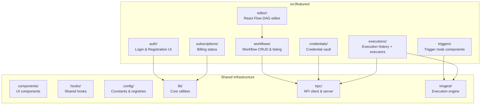
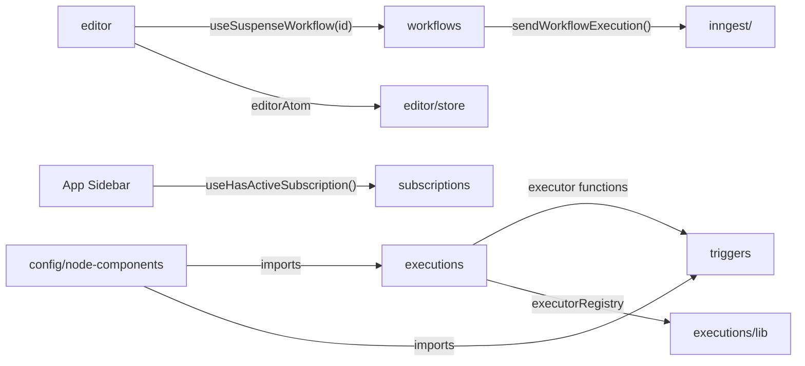

# 🧩 Feature Modules

> **Last Updated:** April 2026  
> **Pattern:** Feature-based modular architecture  
> **Location:** `src/features/`

---

## Table of Contents

- [Architecture Overview](#architecture-overview)
- [Module Structure Convention](#module-structure-convention)
- [Module Index](#module-index)
- [Module Deep-Dives](#module-deep-dives)
- [Cross-Module Communication](#cross-module-communication)
- [Shared Infrastructure](#shared-infrastructure)
- [Creating a New Feature Module](#creating-a-new-feature-module)

---

## Architecture Overview

Nodebase uses a **feature-based modular architecture** where code is organized by business domain, not technical layer. Each feature module is a self-contained vertical slice of the application.



### Why Feature-Based?

| Approach | Problem |
|---|---|
| **Layer-based** (`components/`, `services/`, `hooks/`, `models/`) | To modify "workflows" you touch files across 4+ directories |
| **Feature-based** (`features/workflows/`) | Everything for "workflows" lives in one directory — components, hooks, server logic, types |

> **Rule of Thumb:** When a developer picks up a task like "add search to workflows page", they should only need to look inside `features/workflows/` (plus shared infrastructure).

---

## Module Structure Convention

Every feature module follows a consistent internal structure:

```
features/<module>/
├── components/       # React components specific to this feature
│   ├── <component>.tsx
│   └── <sub-feature>/
│       ├── node.tsx      # React Flow node component
│       ├── dialog.tsx    # Configuration dialog
│       ├── executor.ts   # Inngest executor function
│       └── actions.ts    # Server actions (realtime tokens)
├── hooks/            # Custom hooks for this feature
│   ├── use-<entity>.ts           # Data fetching hooks
│   └── use-<entity>-params.ts    # URL params hooks
├── server/           # Server-side logic
│   ├── routers.ts    # tRPC router definition
│   └── prefetch.ts   # SSR prefetch helpers
├── store/            # Client state (Jotai atoms)
│   └── atoms.ts
├── params.ts         # URL search params schema (nuqs)
└── types.ts          # TypeScript type definitions
```

### What Goes Where

| Directory | Contains | Rendering |
|---|---|---|
| `components/` | React components, dialogs, forms | Client Components (`"use client"`) |
| `hooks/` | Custom React hooks | Client-only |
| `server/` | tRPC routers, prefetch helpers | Server-only |
| `store/` | Jotai atoms | Client-only |
| `params.ts` | nuqs search param definitions | Shared (server + client) |
| `types.ts` | TypeScript interfaces | Shared |

---

## Module Index

| Module | Purpose | Structure |
|---|---|---|
| **auth** | Login and registration UI | `components/` only |
| **workflows** | Workflow CRUD, listing, management | Full: `components/`, `hooks/`, `server/`, `params.ts` |
| **editor** | React Flow visual editor | `components/`, `store/` |
| **credentials** | Credential vault management | Full: `components/`, `hooks/`, `server/`, `params.ts` |
| **executions** | Execution history + node executors | Full: `components/`, `hooks/`, `server/`, `params.ts`, `types.ts` |
| **triggers** | Trigger node components + executors | `components/` only (sub-folders per trigger) |
| **subscriptions** | Billing status hooks | `hooks/` only |

---

## Module Deep-Dives

### `features/auth/`

The simplest module — contains only login and signup form components.

```
auth/
└── components/
    ├── login-form.tsx    # Email/password + social login
    └── signup-form.tsx   # Registration form
```

**Key Details:**
- Both forms use `authClient` from `lib/auth-client.ts`
- Social providers: `authClient.signIn.social({ provider: "github" | "google" })`
- No server logic — Better Auth handles everything via `/api/auth/[...all]`

---

### `features/workflows/`

The core domain module. Manages workflow listing, CRUD operations, and the data layer for the editor.

```
workflows/
├── components/
│   └── workflows.tsx           # Workflow list page with search + pagination
├── hooks/
│   ├── use-workflows.ts        # 6 data hooks (CRUD + execute)
│   └── use-workflows-params.ts # URL params hook wrapper
├── server/
│   ├── routers.ts              # tRPC workflowsRouter (7 procedures)
│   └── prefetch.ts             # SSR prefetch: prefetchWorkflows(), prefetchWorkflow()
└── params.ts                   # URL search params: page, pageSize, search
```

**Data Hooks Provided:**

| Hook | Purpose | tRPC Procedure |
|---|---|---|
| `useSuspenseWorkflows()` | List workflows (with Suspense) | `workflows.getMany` |
| `useSuspenseWorkflow(id)` | Single workflow | `workflows.getOne` |
| `useCreateWorkflow()` | Create mutation | `workflows.create` |
| `useRemoveWorkflow()` | Delete mutation | `workflows.remove` |
| `useUpdateWorkflow()` | Save nodes/edges | `workflows.update` |
| `useUpdateWorkflowName()` | Rename mutation | `workflows.updateName` |
| `useExecuteWorkflow()` | Trigger execution | `workflows.execute` |

**Cache Invalidation Pattern:** Every mutation invalidates related queries after success:
```typescript
onSuccess: (data) => {
  queryClient.invalidateQueries(trpc.workflows.getMany.queryOptions({}));
  queryClient.invalidateQueries(trpc.workflows.getOne.queryOptions({ id: data.id }));
}
```

---

### `features/editor/`

The React Flow visual workflow editor. Manages canvas state and node interactions.

```
editor/
├── components/
│   ├── editor.tsx                # Main ReactFlow canvas component
│   ├── add-node-button.tsx       # Add node dropdown (10 types)
│   ├── execute-workflow-button.tsx # Manual execution trigger
│   ├── save-workflow-button.tsx  # Persist nodes/edges to DB
│   └── workflow-name.tsx         # Editable workflow name
└── store/
    └── atoms.ts                  # editorAtom (Jotai)
```

**Editor State Management:**
- **Local state**: `useState<Node[]>` and `useState<Edge[]>` — React Flow canvas state
- **Global state**: `editorAtom` (Jotai) — React Flow instance reference for toolbar actions
- **Server state**: `useSuspenseWorkflow(id)` — initial data loaded via tRPC

**React Flow Configuration:**
```typescript
<ReactFlow
  nodes={nodes}
  edges={edges}
  nodeTypes={nodeComponents}      // 10 registered node types
  onInit={setEditor}              // Store instance in Jotai atom
  fitView                         // Auto-fit on load
  snapGrid={[10, 10]}             // 10px snap grid
  snapToGrid
  panOnScroll                     // Scroll to pan
  panOnDrag={false}               // Disable drag-to-pan (use selection)
  selectionOnDrag                 // Drag creates selection box
>
  <Background />
  <Controls />
  <MiniMap />
  <Panel position="top-right"><AddNodeButton /></Panel>
  {hasManualTrigger && (
    <Panel position="bottom-center"><ExecuteWorkflowButton /></Panel>
  )}
</ReactFlow>
```

---

### `features/credentials/`

Encrypted API key management. Mirrors the workflows module structure.

```
credentials/
├── components/
│   ├── columns.tsx               # Table column definitions
│   ├── credentials.tsx           # Credential list page
│   └── <credential-type>/       # Type-specific forms (future)
├── hooks/
│   ├── use-credentials.ts        # Data hooks (CRUD)
│   └── use-credentials-params.ts # URL params hook
├── server/
│   ├── routers.ts               # tRPC credentialsRouter (6 procedures)
│   └── prefetch.ts              # SSR prefetch helper
└── params.ts                    # URL search params: page, pageSize, search
```

---

### `features/executions/`

The most complex module. Contains **execution history UI** and **all node executor implementations**.

```
executions/
├── components/
│   ├── columns.tsx               # Execution table columns
│   ├── executions.tsx            # Execution list page
│   ├── http-request/             # HTTP Request executor
│   │   ├── node.tsx              # React Flow node component
│   │   ├── dialog.tsx            # Configuration dialog
│   │   ├── executor.ts           # Inngest executor function
│   │   └── actions.ts            # Server action (realtime token)
│   ├── openai/                   # Same 4-file pattern
│   ├── anthropic/                # Same 4-file pattern
│   ├── gemini/                   # Same 4-file pattern
│   ├── discord/                  # Same 4-file pattern
│   └── slack/                    # Same 4-file pattern
├── hooks/
│   ├── use-executions.ts         # Data hooks (read-only)
│   ├── use-executions-params.ts  # URL params hook
│   └── use-node-status.ts        # Inngest realtime subscription
├── lib/
│   └── executor-registry.ts     # NodeType → NodeExecutor map
├── server/
│   ├── routers.ts               # tRPC executionsRouter (2 procedures)
│   └── prefetch.ts              # SSR prefetch helper
├── params.ts                    # URL search params: page, pageSize
└── types.ts                     # NodeExecutor, WorkflowContext types
```

**Node Executor Sub-Module Pattern (4 files):**

| File | Purpose | Environment |
|---|---|---|
| `node.tsx` | React Flow visual component | Client (browser) |
| `dialog.tsx` | Configuration dialog with forms | Client (browser) |
| `executor.ts` | Inngest execution logic | Server (Inngest) |
| `actions.ts` | Server Action for realtime token | Server (Next.js) |

---

### `features/triggers/`

Trigger-type node components and executors. Follows the same 4-file sub-module pattern.

```
triggers/
└── components/
    ├── manual-trigger/
    │   ├── node.tsx
    │   ├── dialog.tsx
    │   ├── executor.ts
    │   └── actions.ts
    ├── google-form-trigger/
    │   ├── node.tsx
    │   ├── dialog.tsx
    │   ├── executor.ts
    │   └── actions.ts
    └── stripe-trigger/
        ├── node.tsx
        ├── dialog.tsx
        ├── executor.ts
        └── actions.ts
```

---

### `features/subscriptions/`

The smallest module — only contains hooks for checking subscription status.

```
subscriptions/
└── hooks/
    └── use-subscription.ts   # useSubscription(), useHasActiveSubscription()
```

**Hooks Provided:**

| Hook | Returns |
|---|---|
| `useSubscription()` | Full Polar customer state (TanStack Query) |
| `useHasActiveSubscription()` | `{ hasActiveSubscription: boolean, subscription, isLoading }` |

---

## Cross-Module Communication

Modules communicate through well-defined boundaries:



### Rules

1. **Modules NEVER import directly from another module's internal files**
2. **Hooks are the public API** — other modules use hooks, not internal functions
3. **Server logic stays inside `server/`** — never imported from client code
4. **Shared logic goes to `lib/`, `config/`, or `hooks/`** — not duplicated across modules

---

## Shared Infrastructure

Code that serves multiple features lives outside `features/`:

| Directory | Purpose | Examples |
|---|---|---|
| `components/ui/` | 53 shadcn/ui primitive components | Button, Dialog, Table, Sidebar |
| `components/` | Shared app components | AppSidebar, AppHeader, InitialNode |
| `components/react-flow/` | Base React Flow components | BaseHandle, NodeStatusIndicator |
| `hooks/` | Cross-cutting hooks | `useEntitySearch`, `useUpgradeModal`, `useIsMobile` |
| `config/` | Constants and registries | `PAGINATION`, `nodeComponents` |
| `lib/` | Core utilities | `auth`, `db`, `encryption`, `polar`, `utils` |
| `trpc/` | tRPC client/server setup | `client.tsx`, `server.tsx`, `init.ts` |
| `inngest/` | Execution engine | `client.ts`, `functions.ts`, `channels/`, `utils.ts` |

---

## Creating a New Feature Module

### Step-by-Step Guide

```bash
# 1. Create the module directory
mkdir -p src/features/notifications/{components,hooks,server}

# 2. Create the tRPC router
touch src/features/notifications/server/routers.ts

# 3. Register the router in the app router
# Edit src/trpc/routers/_app.ts:
#   import { notificationsRouter } from "@/features/notifications/server/routers";
#   export const appRouter = createTRPCRouter({
#     ...existing,
#     notifications: notificationsRouter,
#   });

# 4. Create URL params (if paginated)
touch src/features/notifications/params.ts

# 5. Create data hooks
touch src/features/notifications/hooks/use-notifications.ts

# 6. Create prefetch helper
touch src/features/notifications/server/prefetch.ts

# 7. Create components
touch src/features/notifications/components/notifications.tsx
```

### Checklist

- [ ] Module directory under `src/features/`
- [ ] tRPC router in `server/routers.ts`
- [ ] Router registered in `src/trpc/routers/_app.ts`
- [ ] Data hooks in `hooks/`
- [ ] URL params in `params.ts` (if listing page)
- [ ] Prefetch helper in `server/prefetch.ts`
- [ ] Page component in `src/app/` using the module
- [ ] Server Component calls `prefetch()` + wraps with `<HydrateClient>`
- [ ] Client Component uses `useSuspenseQuery()` with Suspense boundary

---

## Related Documentation

- [ARCHITECTURE.md](./ARCHITECTURE.md) — Design principles behind feature-based architecture
- [FRONTEND_ARCHITECTURE.md](./FRONTEND_ARCHITECTURE.md) — Component hierarchy and rendering
- [API_REFERENCE.md](./API_REFERENCE.md) — tRPC routers defined in each module
- [WORKFLOW_ENGINE.md](./WORKFLOW_ENGINE.md) — Executor modules in executions/triggers
- [STATE_AND_DATA_FLOW.md](./STATE_AND_DATA_FLOW.md) — How hooks and params connect
