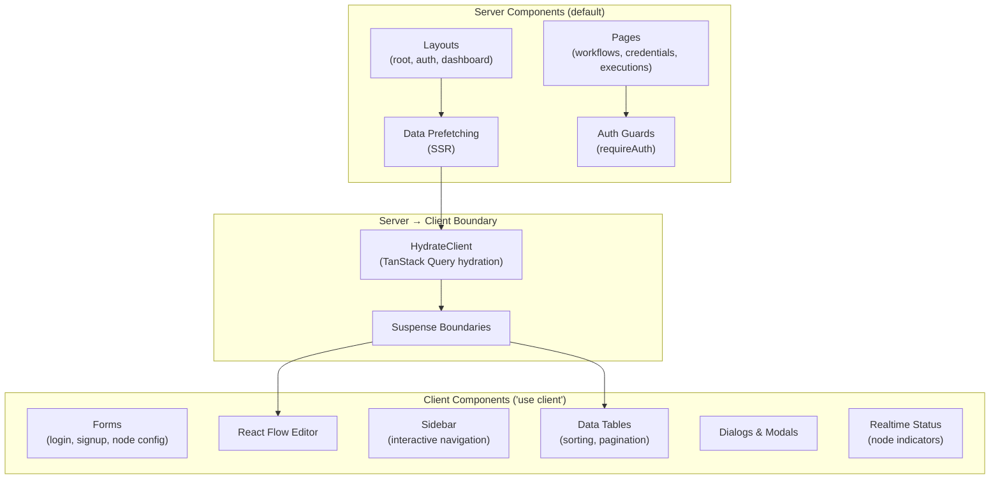
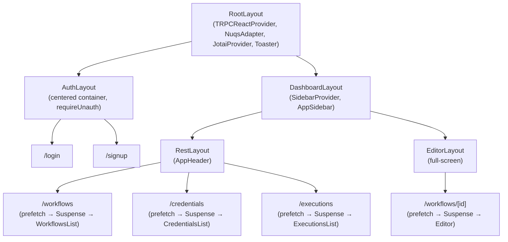
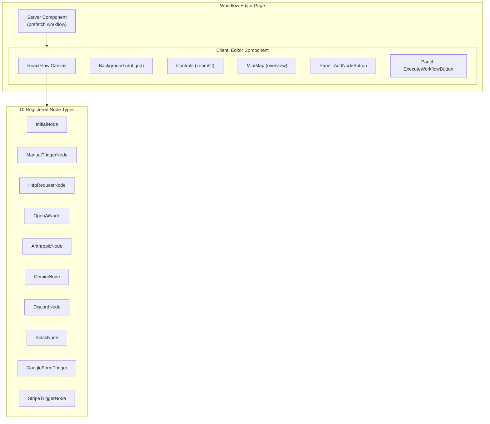

# 🎨 Frontend Architecture

> **Last Updated:** April 2026  
> **Framework:** Next.js 16 (App Router) + React 19  
> **Rendering:** Server Components (default) + Client Components (interactive)  
> **Styling:** Tailwind CSS v4 + shadcn/ui (53 components)

---

## Table of Contents

- [Rendering Strategy](#rendering-strategy)
- [Route Architecture](#route-architecture)
- [Layout Hierarchy](#layout-hierarchy)
- [Component Classification](#component-classification)
- [React Flow Integration](#react-flow-integration)
- [Styling System](#styling-system)
- [Component Patterns](#component-patterns)
- [Error and Loading States](#error-and-loading-states)

---

## Rendering Strategy

a8n uses **React Server Components (RSC) by default** and opts into Client Components only where interactivity is required.



### When to Use Each

| Server Component | Client Component |
|---|---|
| Data fetching (Prisma/tRPC) | Event handlers (onClick, onChange) |
| Auth guards (requireAuth) | Form state (react-hook-form) |
| SEO metadata | Real-time updates (Inngest subscriptions) |
| Static content rendering | Drag-and-drop (React Flow) |
| Layout structure | Animations and transitions |
| Prefetching query data | Interactive UI (dialogs, dropdowns, tabs) |

---

## Route Architecture

### File-System Routing

```
src/app/
├── layout.tsx                    # Root Layout (providers, fonts, theme)
├── (auth)/                       # Auth Route Group
│   ├── layout.tsx                # Centered card layout
│   ├── login/page.tsx            # Login page
│   └── signup/page.tsx           # Signup page
├── (dashboard)/                  # Dashboard Route Group
│   ├── layout.tsx                # Sidebar + provider layout
│   ├── (rest)/                   # CRUD Listing Route Group
│   │   ├── layout.tsx            # Header layout
│   │   ├── workflows/page.tsx    # Workflow list
│   │   ├── credentials/page.tsx  # Credential list
│   │   └── executions/page.tsx   # Execution list
│   └── (editor)/                 # Editor Route Group  
│       └── workflows/
│           └── [workflowId]/
│               └── page.tsx      # Full-screen editor
└── api/                          # API Routes
    ├── auth/[...all]/            # Better Auth
    ├── inngest/                  # Inngest functions
    ├── trpc/[trpc]/              # tRPC handler
    └── webhooks/                 # External webhooks
```

### Route Groups

Route groups (folders with parentheses) share layouts without affecting the URL:

| Route Group | URL Path | Layout | Purpose |
|---|---|---|---|
| `(auth)` | `/login`, `/signup` | Centered card | Authentication pages |
| `(dashboard)` | All dashboard pages | Sidebar | Shared navigation |
| `(rest)` | `/workflows`, `/credentials`, `/executions` | Sidebar + Header | CRUD listing pages |
| `(editor)` | `/workflows/[id]` | Sidebar + Full-screen | Workflow editor |

### Dynamic Segments

| Segment | Route | Parameter |
|---|---|---|
| `[workflowId]` | `/workflows/:workflowId` | Workflow editor ID |
| `[trpc]` | `/api/trpc/:path` | tRPC procedure path |
| `[...all]` | `/api/auth/*` | Better Auth catch-all |

---

## Layout Hierarchy



### Root Layout

The root layout wraps the entire app with providers:

```tsx
// src/app/layout.tsx
export default function RootLayout({ children }) {
  return (
    <html lang="en" suppressHydrationWarning>
      <body className={fonts}>
        <TRPCReactProvider>       {/* tRPC client + TanStack Query */}
          <NuqsAdapter>           {/* URL search params */}
            <JotaiProvider>       {/* Atomic client state */}
              {children}
              <Toaster />         {/* Toast notifications (Sonner) */}
            </JotaiProvider>
          </NuqsAdapter>
        </TRPCReactProvider>
      </body>
    </html>
  );
}
```

### Page Pattern (Server → Client Boundary)

Every listing page follows the same pattern:

```tsx
// Server Component (page.tsx)
export default async function WorkflowsPage() {
  await requireAuth();                                        // Auth guard
  prefetch(trpc.workflows.getMany.queryOptions({ page: 1 })); // SSR prefetch
  
  return (
    <HydrateClient>                    {/* Hydrates TanStack Query cache */}
      <Suspense fallback={<Loading />}>
        <Workflows />                   {/* Client component */}
      </Suspense>
    </HydrateClient>
  );
}

// Client Component (features/workflows/components/workflows.tsx)
"use client";
export const Workflows = () => {
  const { data } = useSuspenseWorkflows(); // Reads from hydrated cache
  return <DataTable data={data.items} columns={columns} />;
};
```

**Why This Pattern?**
1. **Server Component** handles auth + prefetch (no loading spinner on navigation)
2. **HydrateClient** transfers prefetched data to the client cache
3. **Suspense boundary** shows fallback only if data isn't ready
4. **Client Component** reads from cache (instant) and handles interactivity

---

## Component Classification

### Component Types

```
src/components/
├── ui/                 # shadcn/ui primitives (53 components)
│   ├── button.tsx      # Generic, reusable UI primitive
│   ├── dialog.tsx
│   ├── table.tsx
│   ├── sidebar.tsx
│   └── ...
├── react-flow/         # React Flow base components
│   ├── base-handle.tsx          # Styled connection handles
│   └── node-status-indicator.tsx # Loading/success/error indicator
├── app-sidebar.tsx     # Application sidebar navigation
├── app-header.tsx      # Dashboard page header
├── entity-components.tsx # Shared Loading/Error views
├── initial-node.tsx    # Placeholder node for new workflows
└── upgrade-modal.tsx   # Pro upgrade prompt dialog
```

### Component Hierarchy

| Level | Type | Examples | Reused? |
|---|---|---|---|
| **Primitives** | `components/ui/*` | Button, Dialog, Input, Table | Everywhere |
| **Base Components** | `components/*` | AppSidebar, AppHeader, BaseHandle | Across features |
| **Feature Components** | `features/*/components/*` | Workflows, Editor, NodeDialogs | Within feature |
| **Page Components** | `app/*/page.tsx` | Server Components (auth + prefetch) | Route-specific |

### shadcn/ui Component Categories (53 total)

| Category | Components |
|---|---|
| **Data Display** | Table, Card, Badge, Avatar, Carousel, Chart |
| **Input** | Input, Textarea, Select, Checkbox, Switch, Slider, RadioGroup, Calendar |
| **Navigation** | Sidebar, NavigationMenu, Breadcrumb, Tabs, Menubar, Pagination |
| **Overlay** | Dialog, Sheet, Drawer, Popover, HoverCard, Tooltip, DropdownMenu, ContextMenu |
| **Feedback** | Alert, AlertDialog, Sonner (toast), Progress, Skeleton, Spinner |
| **Layout** | Separator, Accordion, Collapsible, ResizablePanel, ScrollArea, AspectRatio |
| **Forms** | Form, Field, Label, InputOTP, InputGroup, ButtonGroup, Command |

---

## React Flow Integration

The visual editor is powered by React Flow (XYFlow v12):

### Architecture



### Node Component Pattern

Each node type follows a consistent visual pattern:

```tsx
// Simplified node component structure
export const HttpRequestNode = ({ id, data, selected }: NodeProps) => {
  const status = useNodeStatus({
    nodeId: id,
    channel: HTTP_REQUEST_CHANNEL_NAME,
    topic: "status",
    refreshToken: fetchHttpRequestRealtimeToken,
  });

  return (
    <div className={cn("node-card", selected && "ring-2 ring-primary")}>
      <BaseHandle type="target" position={Position.Left} />
      <div className="node-content">
        <Icon />
        <span>HTTP Request</span>
        <NodeStatusIndicator status={status} />
      </div>
      <BaseHandle type="source" position={Position.Right} />
      <NodeConfigDialog data={data} nodeId={id} />
    </div>
  );
};
```

**Each node has:**
- Input handle (left) — connection from upstream node
- Output handle (right) — connection to downstream node
- Status indicator — realtime loading/success/error via Inngest
- Configuration dialog — opens on click to set node parameters

### Registries

Two registries connect node types to their implementations:

```typescript
// UI Registry (config/node-components.ts)
nodeComponents: NodeType → React Component     // Visual appearance

// Executor Registry (executions/lib/executor-registry.ts)  
executorRegistry: NodeType → NodeExecutor       // Execution logic
```

---

## Styling System

### Tailwind CSS v4 + CSS Variables

The design system is based on Tailwind CSS with CSS custom properties for theming:

```css
/* src/app/globals.css — Design tokens */
:root {
  --background: oklch(1 0 0);
  --foreground: oklch(0.145 0 0);
  --card: oklch(1 0 0);
  --primary: oklch(0.205 0 0);
  --secondary: oklch(0.97 0 0);
  --muted: oklch(0.97 0 0);
  --accent: oklch(0.97 0 0);
  --destructive: oklch(0.577 0.245 27.325);
  --border: oklch(0.922 0 0);
  --ring: oklch(0.708 0 0);
  --radius: 0.625rem;
  /* ... more tokens */
}

.dark {
  --background: oklch(0.145 0 0);
  --foreground: oklch(0.985 0 0);
  /* ... dark mode overrides */
}
```

### Utility Functions

```typescript
// src/lib/utils.ts — CSS class merging
import { clsx, type ClassValue } from "clsx";
import { twMerge } from "tailwind-merge";

export function cn(...inputs: ClassValue[]) {
  return twMerge(clsx(inputs));
}
```

**`cn()` is used everywhere to:**
- Merge Tailwind classes without conflicts
- Conditionally apply classes: `cn("base-class", isActive && "active-class")`
- Compose variant classes from CVA

### Class Variance Authority (CVA)

shadcn/ui components use CVA for variant-based styling:

```typescript
// Example: Button component
const buttonVariants = cva(
  "inline-flex items-center justify-center rounded-md text-sm font-medium",
  {
    variants: {
      variant: {
        default: "bg-primary text-primary-foreground hover:bg-primary/90",
        destructive: "bg-destructive text-white hover:bg-destructive/90",
        outline: "border border-input bg-background hover:bg-accent",
        secondary: "bg-secondary text-secondary-foreground hover:bg-secondary/80",
        ghost: "hover:bg-accent hover:text-accent-foreground",
        link: "text-primary underline-offset-4 hover:underline",
      },
      size: {
        default: "h-9 px-4 py-2",
        sm: "h-8 rounded-md px-3 text-xs",
        lg: "h-10 rounded-md px-8",
        icon: "h-9 w-9",
      },
    },
    defaultVariants: { variant: "default", size: "default" },
  }
);
```

---

## Component Patterns

### 1. Suspense Loading Pattern

All data-dependent client components use Suspense:

```tsx
// Page (Server Component)
<Suspense fallback={<WorkflowsSkeleton />}>
  <Workflows />
</Suspense>

// Component (Client) uses useSuspenseQuery
const { data } = useSuspenseQuery(trpc.workflows.getMany.queryOptions(params));
```

### 2. Entity Search Pattern (Debounced URL Params)

Shared search hook with URL-synced pagination:

```tsx
const [params, setParams] = useWorkflowsParams();  // nuqs URL state
const { searchValue, onSearchChange } = useEntitySearch({
  params, setParams, debounceMs: 500,
});

return <Input value={searchValue} onChange={(e) => onSearchChange(e.target.value)} />;
```

This pattern:
- Debounces search input (500ms) to avoid excessive API calls
- Resets to page 1 on search change
- Syncs search term with URL (`?search=query`)
- Clears URL param when value equals default (via `clearOnDefault`)

### 3. Upgrade Modal Pattern

Premium features show an upgrade modal instead of failing silently:

```tsx
const { handleError, modal } = useUpgradeModal();

const createMutation = useCreateWorkflow();
const handleCreate = () => {
  createMutation.mutate(undefined, {
    onError: (error) => {
      if (!handleError(error)) {
        toast.error(error.message);  // Non-subscription errors
      }
    },
  });
};

return (
  <>
    <Button onClick={handleCreate}>Create Workflow</Button>
    {modal}  {/* Renders UpgradeModal when FORBIDDEN error occurs */}
  </>
);
```

### 4. Data Table Pattern

Listing pages use a consistent table pattern:

```
┌──────────────────────────────────────────────┐
│  Header (title + search + create button)     │
├──────────────────────────────────────────────┤
│  Table (sortable columns, row actions)       │
│  ├── Row 1: [Name, Status, Date, Actions]    │
│  ├── Row 2: ...                              │
│  └── Row N: ...                              │
├──────────────────────────────────────────────┤
│  Pagination (page X of Y, prev/next)         │
└──────────────────────────────────────────────┘
```

---

## Error and Loading States

### Loading States

| Component | Loading Pattern |
|---|---|
| **Page-level** | `<Suspense fallback={<LoadingView />}>` with Skeleton UI |
| **Editor** | `<EditorLoading />` — centered spinner with message |
| **Mutation buttons** | `isLoading` state on Button with Spinner icon |
| **Node status** | `NodeStatusIndicator` — initial/loading/success/error states |

### Error States

| Level | Error Handling |
|---|---|
| **Page-level** | `error.tsx` boundary (Next.js convention) |
| **Component-level** | `<ErrorView message="..." />` component |
| **Mutation errors** | Toast notification via Sonner |
| **Premium errors** | `useUpgradeModal()` intercepts `FORBIDDEN` |
| **Editor errors** | `<EditorError />` fallback component |

### Error Boundaries

```tsx
// React Error Boundary for runtime errors
import { ErrorBoundary } from "react-error-boundary";

<ErrorBoundary fallback={<ErrorView message="Something went wrong" />}>
  <FeatureComponent />
</ErrorBoundary>
```

---

## Related Documentation

- [ARCHITECTURE.md](./ARCHITECTURE.md) — System-level frontend architecture
- [FEATURE_MODULES.md](./FEATURE_MODULES.md) — Feature module structure
- [STATE_AND_DATA_FLOW.md](./STATE_AND_DATA_FLOW.md) — State management details
- [TECH_STACK.md](./TECH_STACK.md) — Frontend library rationale
