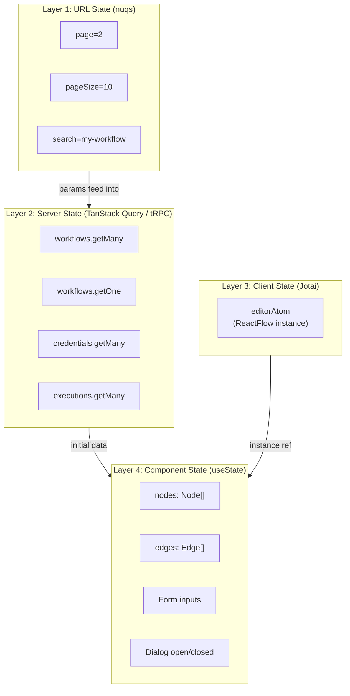
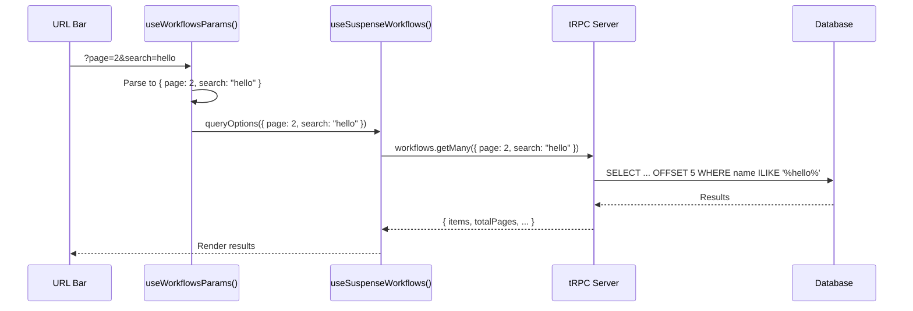
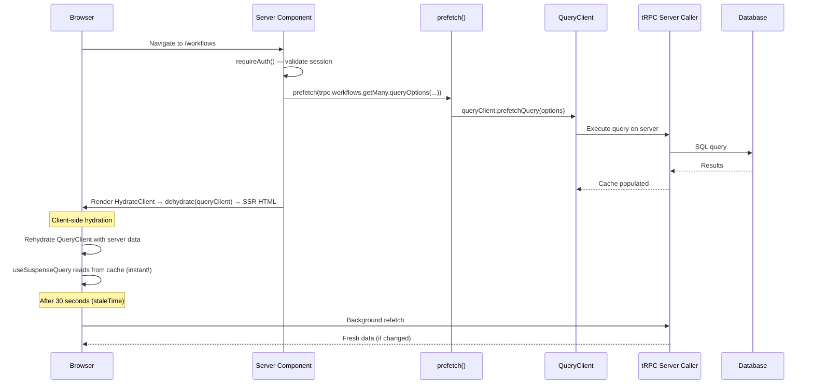
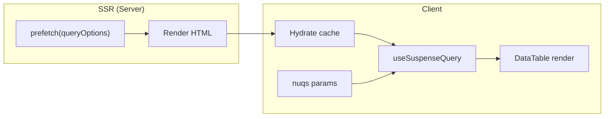
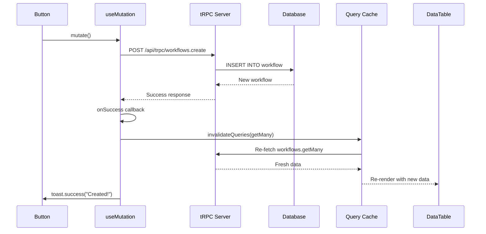
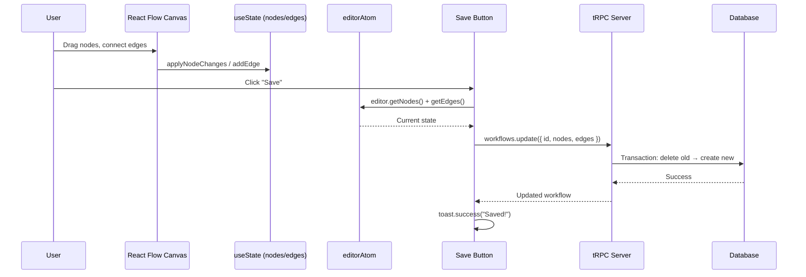
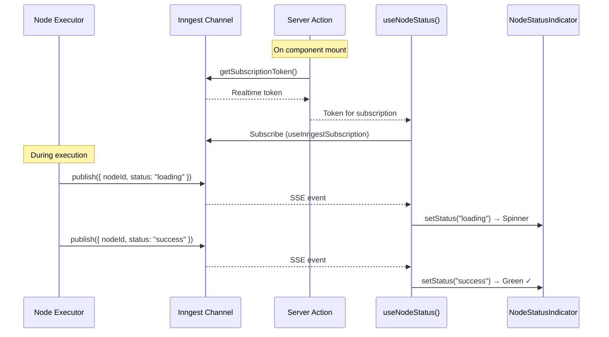

# 🔄 State & Data Flow

> **Last Updated:** April 2026  
> **State Layers:** URL State (nuqs) + Server State (TanStack Query/tRPC) + Client State (Jotai)  
> **Data Flow:** SSR Prefetch → Hydration → Client Cache → Realtime Updates

---

## Table of Contents

- [State Management Overview](#state-management-overview)
- [Layer 1: URL State (nuqs)](#layer-1-url-state-nuqs)
- [Layer 2: Server State (TanStack Query)](#layer-2-server-state-tanstack-query)
- [Layer 3: Client State (Jotai)](#layer-3-client-state-jotai)
- [Layer 4: Local Component State](#layer-4-local-component-state)
- [Data Flow Patterns](#data-flow-patterns)
- [Realtime Data Flow](#realtime-data-flow)
- [Cache Management](#cache-management)

---

## State Management Overview

Nodebase uses a **layered state management** approach where each type of state is managed by the most appropriate tool:



### State Decision Matrix

| State Type | Tool | When to Use | Persistence |
|---|---|---|---|
| **URL parameters** | nuqs | Pagination, search, filters | URL (shareable, bookmarkable) |
| **Remote data** | TanStack Query (via tRPC) | Database records, API responses | Cache (30s stale time) |
| **Global UI state** | Jotai | Cross-component references (editor instance) | Memory (session-lived) |
| **Local UI state** | `useState` | Form inputs, modal state, canvas changes | Memory (component-lived) |
| **Persisted data** | Prisma (database) | Workflows, nodes, credentials | PostgreSQL |

---

## Layer 1: URL State (nuqs)

**nuqs** manages URL search parameters as type-safe state. This makes pagination, search, and filters **shareable, bookmarkable, and back-button compatible**.

### Parameter Definitions

Each feature module defines its URL parameters:

```typescript
// features/workflows/params.ts
import { parseAsInteger, parseAsString } from "nuqs/server";
import { PAGINATION } from "@/config/constants";

export const workflowsParams = {
  page: parseAsInteger
    .withDefault(PAGINATION.DEFAULT_PAGE)        // Default: 1
    .withOptions({ clearOnDefault: true }),       // Remove from URL when default
  pageSize: parseAsInteger
    .withDefault(PAGINATION.DEFAULT_PAGE_SIZE)    // Default: 5
    .withOptions({ clearOnDefault: true }),
  search: parseAsString
    .withDefault("")
    .withOptions({ clearOnDefault: true }),
};
```

### Hook Pattern

```typescript
// features/workflows/hooks/use-workflows-params.ts
import { useQueryStates } from "nuqs";
import { workflowsParams } from "../params";

export const useWorkflowsParams = () => {
  return useQueryStates(workflowsParams);
};
```

### How URL State Drives Data Fetching



### URL State by Feature

| Feature | Parameters | Example URL |
|---|---|---|
| Workflows | `page`, `pageSize`, `search` | `/workflows?page=2&search=api` |
| Credentials | `page`, `pageSize`, `search` | `/credentials?search=openai` |
| Executions | `page`, `pageSize` | `/executions?page=3` |

### `clearOnDefault` Behavior

When a parameter equals its default value, nuqs removes it from the URL:

```
User on page 1 with no search: /workflows          ← clean URL
User navigates to page 2:      /workflows?page=2   ← only non-default shown
User searches:                  /workflows?page=1&search=api → /workflows?search=api
```

---

## Layer 2: Server State (TanStack Query)

All remote data is managed through **TanStack Query v5** via the tRPC integration. The system provides SSR prefetching, automatic caching, and background refetching.

### Query Client Configuration

```typescript
// src/trpc/query-client.ts
export function makeQueryClient() {
  return new QueryClient({
    defaultOptions: {
      queries: {
        staleTime: 30 * 1000,  // Data considered fresh for 30 seconds
      },
      dehydrate: {
        serializeData: superjson.serialize,  // Serialize Dates, BigInts
        shouldDehydrateQuery: (query) =>
          defaultShouldDehydrateQuery(query) ||
          query.state.status === 'pending',  // Dehydrate pending queries too
      },
      hydrate: {
        deserializeData: superjson.deserialize,
      },
    },
  });
}
```

### SSR Data Flow

The SSR data flow is the core pattern that enables instant page loads:



### Server-Side Prefetch Pattern

```typescript
// Server Component (page.tsx)
import { prefetch, HydrateClient, trpc } from "@/trpc/server";

export default async function WorkflowsPage() {
  await requireAuth();
  prefetch(trpc.workflows.getMany.queryOptions({ page: 1, pageSize: 5 }));
  
  return (
    <HydrateClient>
      <Suspense fallback={<Loading />}>
        <Workflows />   {/* Client component — reads from hydrated cache */}
      </Suspense>
    </HydrateClient>
  );
}
```

### Client-Side Data Hooks

```typescript
// features/workflows/hooks/use-workflows.ts

// Read (Suspense)
export const useSuspenseWorkflows = () => {
  const trpc = useTRPC();
  const [params] = useWorkflowsParams();
  return useSuspenseQuery(trpc.workflows.getMany.queryOptions(params));
};

// Mutate (with cache invalidation)
export const useCreateWorkflow = () => {
  const queryClient = useQueryClient();
  const trpc = useTRPC();
  return useMutation(trpc.workflows.create.mutationOptions({
    onSuccess: (data) => {
      toast.success(`Workflow "${data.name}" created`);
      queryClient.invalidateQueries(trpc.workflows.getMany.queryOptions({}));
    },
  }));
};
```

### Query Key Structure

TanStack Query automatically generates cache keys from tRPC procedure paths and inputs:

```
["workflows", "getMany", { page: 1, pageSize: 5, search: "" }]
["workflows", "getOne", { id: "abc123" }]
["credentials", "getByType", { type: "OPENAI" }]
["executions", "getMany", { page: 1 }]
```

---

## Layer 3: Client State (Jotai)

Jotai manages **minimal global client state** — specifically the React Flow editor instance.

### Atoms

```typescript
// features/editor/store/atoms.ts
import { atom } from 'jotai';
import type { ReactFlowInstance } from '@xyflow/react';

export const editorAtom = atom<ReactFlowInstance | null>(null);
```

### Usage

```typescript
// Setting (Editor component)
import { useSetAtom } from 'jotai';
const setEditor = useSetAtom(editorAtom);

<ReactFlow onInit={setEditor} ... />

// Reading (SaveButton component)
import { useAtomValue } from 'jotai';
const editor = useAtomValue(editorAtom);

const handleSave = () => {
  const nodes = editor?.getNodes();
  const edges = editor?.getEdges();
  updateWorkflow.mutate({ id, nodes, edges });
};
```

**Why Jotai for this?**
- The editor instance needs to be accessible from toolbar buttons (AddNode, Save, Execute) that are **sibling** components of the ReactFlow canvas  
- `useState` can't share state across siblings without prop drilling
- Context would cause unnecessary re-renders
- Jotai provides **fine-grained subscriptions** — only components that read the atom re-render

### Why So Little Global State?

Most state doesn't need to be global:

| State | Where It Lives | Why |
|---|---|---|
| Workflow list | TanStack Query cache | Server state — auto-cached, auto-refetched |
| Current workflow | TanStack Query cache | Same — fetched by ID |
| URL params | nuqs (URL) | Shareable, bookmarkable |
| Node/edge canvas | `useState` in Editor | Only the Editor changes this |
| Form inputs | `useState` in Dialog | Only the Dialog owns this |
| Editor instance ref | Jotai atom | Needs cross-component access |

---

## Layer 4: Local Component State

React's `useState` handles state that's scoped to a single component:

### Editor Canvas State

```typescript
// features/editor/components/editor.tsx
const [nodes, setNodes] = useState<Node[]>(workflow.nodes);  // Initial from tRPC
const [edges, setEdges] = useState<Edge[]>(workflow.edges);  // Initial from tRPC

// React Flow change handlers
const onNodesChange = useCallback(
  (changes: NodeChange[]) => setNodes((nds) => applyNodeChanges(changes, nds)), []
);
const onEdgesChange = useCallback(
  (changes: EdgeChange[]) => setEdges((eds) => applyEdgeChanges(changes, eds)), []
);
const onConnect = useCallback(
  (params: Connection) => setEdges((eds) => addEdge(params, eds)), []
);
```

**Lifecycle:**
```
Server fetch → useSuspenseWorkflow(id) → { nodes, edges }
    ↓
useState initialization → [nodes, setNodes], [edges, setEdges]
    ↓
User drags/connects → React Flow applies changes locally
    ↓
User clicks "Save" → reads editorAtom → sends to tRPC mutation → DB
```

### Debounced Search State

```typescript
// hooks/use-entity-search.tsx
const [localSearch, setLocalSearch] = useState(params.search);

useEffect(() => {
  const timer = setTimeout(() => {
    if (localSearch !== params.search) {
      setParams({ ...params, search: localSearch, page: PAGINATION.DEFAULT_PAGE });
    }
  }, 500);  // 500ms debounce
  return () => clearTimeout(timer);
}, [localSearch]);
```

**Why local + URL state?**
- `localSearch` updates **instantly** on every keystroke (responsive UI)
- `params.search` (URL) updates **after 500ms debounce** (efficient API calls)
- This prevents a network request on every keystroke while keeping the UI responsive

---

## Data Flow Patterns

### Pattern 1: Listing Page Flow



### Pattern 2: Mutation + Cache Invalidation Flow



### Pattern 3: Editor Save Flow



---

## Realtime Data Flow

Inngest Realtime provides live execution status updates from server to browser:



### Token Refresh Pattern

Each node type has a Server Action that fetches a subscription token:

```typescript
// Server Action (runs on server)
"use server";
export async function fetchHttpRequestRealtimeToken() {
  return getSubscriptionToken(inngest, {
    channel: httpRequestChannel(),
    topics: ["status"],
  });
}

// Client Hook (runs in browser)
const status = useNodeStatus({
  nodeId: props.id,
  channel: HTTP_REQUEST_CHANNEL_NAME,
  topic: "status",
  refreshToken: fetchHttpRequestRealtimeToken,  // Server Action reference
});
```

---

## Cache Management

### Stale Time Configuration

```typescript
staleTime: 30 * 1000  // 30 seconds
```

| Scenario | Behavior |
|---|---|
| Navigate to cached page within 30s | Instant render from cache (no spinner) |
| Navigate to cached page after 30s | Show cached data + background refetch |
| Return after cache eviction | Suspense fallback → fresh fetch |

### Cache Invalidation Strategy

Mutations invalidate specific query keys to trigger refetches:

```typescript
// After creating a workflow
queryClient.invalidateQueries(trpc.workflows.getMany.queryOptions({}));

// After updating a specific workflow
queryClient.invalidateQueries(trpc.workflows.getMany.queryOptions({}));
queryClient.invalidateQueries(trpc.workflows.getOne.queryOptions({ id: data.id }));

// After deleting a workflow
queryClient.invalidateQueries(trpc.workflows.getMany.queryOptions({}));
queryClient.invalidateQueries(trpc.workflows.getOne.queryFilter({ id: data.id }));
```

### Hydration

SSR-fetched data is serialized with SuperJSON and dehydrated into the HTML:

```typescript
// Server: Serialize and embed in HTML
<HydrationBoundary state={dehydrate(queryClient)}>
  {children}
</HydrationBoundary>

// Client: Deserialize and inject into cache
// (automatic via HydrationBoundary + hydrate.deserializeData: superjson.deserialize)
```

This means the first render on the client reads from the hydrated cache — **no loading spinner, no refetch, instant UI**.

---

## Complete Data Flow Summary

```
┌─────────────── SERVER SIDE ───────────────┐    ┌─────────── CLIENT SIDE ──────────┐
│                                            │    │                                   │
│  Page Request                              │    │  After Hydration                  │
│  ┌─────────────────────┐                   │    │  ┌──────────────────────┐         │
│  │ requireAuth()       │ → Auth guard      │    │  │ nuqs params          │ → URL   │
│  │ prefetch(queryOpts) │ → Warm cache      │    │  │ (page, search)       │         │
│  │ HydrateClient       │ → Serialize       │    │  └──────────┬───────────┘         │
│  └─────────────────────┘                   │    │             ↓                      │
│                                            │    │  ┌──────────────────────┐         │
│  ───── SSR HTML + Cache Data ─────────────►│───►│  │ useSuspenseQuery     │ → Cache │
│                                            │    │  │ (reads hydrated data)│         │
│                                            │    │  └──────────┬───────────┘         │
│                                            │    │             ↓                      │
│  tRPC Mutation ◄────────────────────────── │◄───│  │ useMutation          │ → Forms │
│  ┌─────────────────────┐                   │    │  │ invalidateQueries    │ → Refetch│
│  │ Prisma → Database   │                   │    │  └──────────────────────┘         │
│  └─────────────────────┘                   │    │                                   │
│                                            │    │  ┌──────────────────────┐         │
│  Inngest publish() ───────────────────────►│───►│  │ useInngestSubscription│→ SSE   │
│  ┌─────────────────────┐                   │    │  │ useNodeStatus        │→ Status │
│  │ Realtime channels   │                   │    │  └──────────────────────┘         │
│  └─────────────────────┘                   │    │                                   │
└────────────────────────────────────────────┘    └───────────────────────────────────┘
```

---

## Related Documentation

- [ARCHITECTURE.md](./ARCHITECTURE.md) — System design principles
- [FRONTEND_ARCHITECTURE.md](./FRONTEND_ARCHITECTURE.md) — Component rendering patterns
- [API_REFERENCE.md](./API_REFERENCE.md) — tRPC procedures and client setup
- [FEATURE_MODULES.md](./FEATURE_MODULES.md) — Module-level data hook organization
- [WORKFLOW_ENGINE.md](./WORKFLOW_ENGINE.md) — Realtime channel specifications
