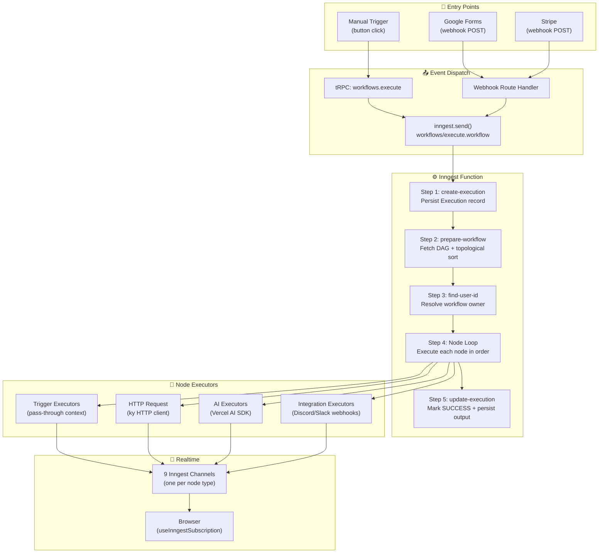

# ⚙️ Workflow Execution Engine

> **Last Updated:** April 2026  
> **Engine:** Inngest v4.2.0 with Realtime Middleware  
> **Pattern:** Event-driven, durable step functions with topological DAG execution

This is the **heart of Nodebase** — the system that transforms a visual DAG of nodes into a reliable, observable execution pipeline.

---

## Table of Contents

- [Engine Overview](#engine-overview)
- [Inngest Integration](#inngest-integration)
- [Execution Pipeline](#execution-pipeline)
- [Topological Sort Algorithm](#topological-sort-algorithm)
- [Node Executor Pattern](#node-executor-pattern)
- [Executor Registry](#executor-registry)
- [Executor Deep-Dives](#executor-deep-dives)
- [Inngest Realtime Channels](#inngest-realtime-channels)
- [Context Propagation](#context-propagation)
- [Error Handling](#error-handling)
- [Adding a New Node Type](#adding-a-new-node-type)

---

## Engine Overview



---

## Inngest Integration

### Client Configuration

```typescript
// src/inngest/client.ts
import { realtimeMiddleware } from "@inngest/realtime/middleware";
import { Inngest } from "inngest";

export const inngest = new Inngest({ 
  id: "nodebase",
  middleware: [realtimeMiddleware() as any],
});
```

| Config | Value | Purpose |
|---|---|---|
| `id` | `"nodebase"` | Application identifier in Inngest dashboard |
| `middleware` | `realtimeMiddleware()` | Enables `publish()` function for streaming status to the browser |

### Function Registration

The Inngest function is registered as a Next.js API route:

```typescript
// src/app/api/inngest/route.ts
import { serve } from "inngest/next";
import { inngest } from "@/inngest/client";
import { executeWorkflow } from "@/inngest/functions";

export const { GET, POST, PUT } = serve({
  client: inngest,
  functions: [executeWorkflow],
});
```

### Event Dispatch

Workflow execution is triggered by sending an Inngest event:

```typescript
// src/inngest/utils.ts
export const sendWorkflowExecution = async (data) => {
  return inngest.send({
    name: "workflows/execute.workflow",
    data,           // { workflowId, initialData? }
    id: createId(), // CUID2 for event deduplication
  });
};
```

**Entry points that call `sendWorkflowExecution()`:**

| Source | Trigger | Initial Data |
|---|---|---|
| `workflows.execute` tRPC mutation | Manual button click | `{ workflowId }` |
| `/api/webhooks/google-form` | Google Forms submission | `{ workflowId, initialData: { googleForm: {...} } }` |
| `/api/webhooks/stripe` | Stripe event | `{ workflowId, initialData: { stripe: {...} } }` |

---

## Execution Pipeline

The `executeWorkflow` function is the main Inngest function. Each step is **individually durable** — if step 3 fails and retries, steps 1-2 do not re-execute.

```typescript
// src/inngest/functions.ts
export const executeWorkflow = inngest.createFunction(
  { 
    id: "execute-workflow",
    retries: process.env.NODE_ENV === "production" ? 3 : 0,
    onFailure: async ({ event, step }) => { /* ... */ },
    triggers: [{ event: "workflows/execute.workflow" }],
    channels: [/* 9 realtime channels */],
  },
  async ({ event, step, publish }) => { /* ... */ },
);
```

### Step 1: Create Execution Record

```typescript
await step.run("create-execution", async () => {
  return prisma.execution.create({
    data: {
      workflowId,
      inngestEventId,  // Correlates DB record with Inngest event
    },
  });
});
```

Creates an `Execution` record with status `RUNNING`. The `inngestEventId` enables the `onFailure` handler to find and update the correct execution.

### Step 2: Prepare Workflow (Topological Sort)

```typescript
const sortedNodes = await step.run("prepare-workflow", async () => {
  const workflow = await prisma.workflow.findUniqueOrThrow({
    where: { id: workflowId },
    include: { nodes: true, connections: true },
  });
  return topologicalSort(workflow.nodes, workflow.connections);
});
```

Fetches the complete DAG (nodes + connections) and computes an execution order via topological sort.

### Step 3: Find User ID

```typescript
const userId = await step.run("find-user-id", async () => {
  const workflow = await prisma.workflow.findUniqueOrThrow({
    where: { id: workflowId },
    select: { userId: true },
  });
  return workflow.userId;
});
```

Resolves the workflow owner — needed for credential access (executors can only decrypt credentials belonging to the workflow owner).

### Step 4: Node Execution Loop

```typescript
let context = event.data.initialData || {};

for (const node of sortedNodes) {
  const executor = getExecutor(node.type as NodeType);
  context = await executor({
    data: node.data as Record<string, unknown>,
    nodeId: node.id,
    userId,
    context,     // Output from previous node
    step,        // Inngest step tools (durability)
    publish,     // Inngest realtime publish
  });
}
```

Nodes execute **sequentially** in topological order. Each node:
1. Receives the **accumulated context** from all upstream nodes
2. Performs its action (API call, AI generation, etc.)
3. Returns an **updated context** (merged with its output)
4. Publishes realtime status updates (loading → success/error)

### Step 5: Update Execution

```typescript
await step.run("update-execution", async () => {
  return prisma.execution.update({
    where: { inngestEventId, workflowId },
    data: {
      status: ExecutionStatus.SUCCESS,
      completedAt: new Date(),
      output: context,  // Final accumulated context
    },
  });
});
```

---

## Topological Sort Algorithm

The topological sort ensures nodes execute in dependency order — a node only runs after all its upstream nodes have completed.

```typescript
// src/inngest/utils.ts
export const topologicalSort = (nodes: Node[], connections: Connection[]): Node[] => {
  if (connections.length === 0) return nodes;

  // Extract edges from connections
  const edges: [string, string][] = connections.map(conn => [
    conn.fromNodeId, conn.toNodeId
  ]);

  // Add disconnected nodes as self-edges
  const connectedNodeIds = new Set<string>();
  for (const conn of connections) {
    connectedNodeIds.add(conn.fromNodeId);
    connectedNodeIds.add(conn.toNodeId);
  }
  for (const node of nodes) {
    if (!connectedNodeIds.has(node.id)) {
      edges.push([node.id, node.id]);
    }
  }

  // Sort and deduplicate
  let sortedNodeIds = [...new Set(toposort(edges))];

  // Map IDs back to node objects
  const nodeMap = new Map(nodes.map(n => [n.id, n]));
  return sortedNodeIds.map(id => nodeMap.get(id)!).filter(Boolean);
};
```

**Key behaviors:**

| Scenario | Handling |
|---|---|
| **No connections** | Returns nodes as-is (all independent) |
| **Disconnected nodes** | Added as self-edges to include them in the sort |
| **Cyclic graph** | Throws `"Workflow contains a cycle"` error |
| **Linear chain** | A → B → C returns `[A, B, C]` |
| **Diamond pattern** | A → B, A → C, B → D, C → D returns `[A, B, C, D]` or `[A, C, B, D]` |

**Library:** Uses the `toposort` npm package for the core algorithm.

---

## Node Executor Pattern

Every node type implements the `NodeExecutor` interface — a function that receives context and returns updated context.

### Type Definitions

```typescript
// src/features/executions/types.ts

export type WorkflowContext = Record<string, unknown>;

export type StepTools = GetStepTools<Inngest.Any>;

export interface NodeExecutorParams<TData = Record<string, unknown>> {
  data: TData;                      // Node-specific config from the `data` JSON field
  nodeId: string;                   // Node ID for step naming and realtime
  userId: string;                   // Workflow owner for credential access
  context: WorkflowContext;         // Accumulated output from upstream nodes
  step: StepTools;                  // Inngest step tools (durability, retries)
  publish: Realtime.PublishFn;      // Inngest realtime publish function
}

export type NodeExecutor<TData = Record<string, unknown>> = (
  params: NodeExecutorParams<TData>,
) => Promise<WorkflowContext>;
```

### Executor Anatomy

Every executor follows the same pattern:

```
1. Publish "loading" status via realtime channel
2. Validate required configuration (throw NonRetriableError if missing)
3. Execute the action inside step.run() (for durability)
4. Publish "success" status
5. Return merged context: { ...context, [variableName]: result }
```

**On error:**
```
catch → Publish "error" status → Re-throw error
```

---

## Executor Registry

The registry maps each `NodeType` enum to its executor function:

```typescript
// src/features/executions/lib/executor-registry.ts

export const executorRegistry: Record<NodeType, NodeExecutor> = {
  [NodeType.INITIAL]: manualTriggerExecutor,
  [NodeType.MANUAL_TRIGGER]: manualTriggerExecutor,
  [NodeType.HTTP_REQUEST]: httpRequestExecutor,
  [NodeType.GOOGLE_FORM_TRIGGER]: googleFormTriggerExecutor,
  [NodeType.STRIPE_TRIGGER]: stripeTriggerExecutor,
  [NodeType.GEMINI]: geminiExecutor,
  [NodeType.ANTHROPIC]: anthropicExecutor,
  [NodeType.OPENAI]: openAiExecutor,
  [NodeType.DISCORD]: discordExecutor,
  [NodeType.SLACK]: slackExecutor,
};

export const getExecutor = (type: NodeType): NodeExecutor => {
  const executor = executorRegistry[type];
  if (!executor) {
    throw new Error(`No executor found for node type: ${type}`);
  }
  return executor;
};
```

> **Note:** `INITIAL` maps to `manualTriggerExecutor` because INITIAL is the placeholder node created when a workflow is first generated — it acts as a pass-through.

---

## Executor Deep-Dives

### Manual Trigger Executor (Simplest)

The simplest executor — passes context through unchanged. Acts as the workflow entry point.

```typescript
export const manualTriggerExecutor: NodeExecutor<ManualTriggerData> = async ({
  nodeId, context, step, publish,
}) => {
  await publish(manualTriggerChannel().status({ nodeId, status: "loading" }));
  const result = await step.run("manual-trigger", async () => context);
  await publish(manualTriggerChannel().status({ nodeId, status: "success" }));
  return result;
};
```

### HTTP Request Executor

Makes HTTP API calls with Handlebars template interpolation:

```typescript
export const httpRequestExecutor: NodeExecutor<HttpRequestData> = async ({
  data, nodeId, context, step, publish,
}) => {
  // 1. Publish loading status
  await publish(httpRequestChannel().status({ nodeId, status: "loading" }));
  
  // 2. Validate: endpoint, variableName, method required
  
  // 3. Execute HTTP request inside step.run for durability
  const result = await step.run("http-request", async () => {
    // Interpolate Handlebars templates with context
    const endpoint = Handlebars.compile(data.endpoint)(context);
    
    const response = await ky(endpoint, { method: data.method, body, headers });
    const responseData = contentType?.includes("json") 
      ? await response.json() 
      : await response.text();
    
    return {
      ...context,
      [data.variableName]: { httpResponse: { status, statusText, data: responseData } },
    };
  });
  
  // 4. Publish success + return
  await publish(httpRequestChannel().status({ nodeId, status: "success" }));
  return result;
};
```

**Key Details:**
- **Template Interpolation**: Endpoint URL and body support `{{variable}}` Handlebars syntax referencing upstream context
- **HTTP Client**: Uses `ky` for requests (lightweight, TypeScript-first)
- **Content Negotiation**: Automatically parses JSON or text responses

### AI Executor (OpenAI Example)

AI executors decrypt credentials and call the Vercel AI SDK:

```typescript
export const openAiExecutor: NodeExecutor<OpenAiData> = async ({
  data, nodeId, userId, context, step, publish,
}) => {
  // 1. Publish loading + validate config
  
  // 2. Interpolate prompts with Handlebars
  const systemPrompt = Handlebars.compile(data.systemPrompt)(context);
  const userPrompt = Handlebars.compile(data.userPrompt)(context);
  
  // 3. Fetch and decrypt credential
  const credential = await step.run("get-credential", () => {
    return prisma.credential.findUnique({
      where: { id: data.credentialId, userId },
    });
  });

  const openai = createOpenAI({ apiKey: decrypt(credential.value) });
  
  // 4. Generate text via Vercel AI SDK
  const { steps } = await step.ai.wrap("openai-generate-text", generateText, {
    model: openai("gpt-4"),
    system: systemPrompt,
    prompt: userPrompt,
    experimental_telemetry: { isEnabled: true, recordInputs: true, recordOutputs: true },
  });
  
  // 5. Extract text and return merged context
  const text = steps[0].content[0].type === "text" ? steps[0].content[0].text : "";
  return { ...context, [data.variableName]: { text } };
};
```

**Key Details:**
- **Credential Security**: API key decrypted at runtime — never stored in Inngest event payload
- **User Scoping**: `where: { id: data.credentialId, userId }` ensures users can only use their own credentials
- **AI SDK Instrumentation**: `step.ai.wrap()` enables Inngest telemetry and step-level durability for AI calls
- **Prompt Templates**: System and user prompts support `{{variable}}` references to upstream context

---

## Inngest Realtime Channels

Each node type has a dedicated realtime channel for streaming execution status to the browser.

### Channel Definition

```typescript
// src/inngest/channels/http-request.ts
import { channel, topic } from "@inngest/realtime";

export const HTTP_REQUEST_CHANNEL_NAME = "http-request-execution";

export const httpRequestChannel = channel(HTTP_REQUEST_CHANNEL_NAME)
  .addTopic(
    topic("status").type<{
      nodeId: string;
      status: "loading" | "success" | "error";
    }>(),
  );
```

### All Channels

| Channel Name | Channel Variable | Node Type |
|---|---|---|
| `http-request-execution` | `httpRequestChannel` | `HTTP_REQUEST` |
| `manual-trigger-execution` | `manualTriggerChannel` | `MANUAL_TRIGGER` |
| `google-form-trigger-execution` | `googleFormTriggerChannel` | `GOOGLE_FORM_TRIGGER` |
| `stripe-trigger-execution` | `stripeTriggerChannel` | `STRIPE_TRIGGER` |
| `gemini-execution` | `geminiChannel` | `GEMINI` |
| `openai-execution` | `openAiChannel` | `OPENAI` |
| `anthropic-execution` | `anthropicChannel` | `ANTHROPIC` |
| `discord-execution` | `discordChannel` | `DISCORD` |
| `slack-execution` | `slackChannel` | `SLACK` |

### Browser-Side Subscription

The browser subscribes to realtime updates using server actions to fetch tokens:

```typescript
// Server Action (actions.ts)
"use server";
export async function fetchHttpRequestRealtimeToken() {
  return getSubscriptionToken(inngest, {
    channel: httpRequestChannel(),
    topics: ["status"],
  });
}

// Client Hook (use-node-status.ts)
export function useNodeStatus({ nodeId, channel, topic, refreshToken }) {
  const [status, setStatus] = useState<NodeStatus>("initial");
  const { data } = useInngestSubscription({ refreshToken, enabled: true });
  
  useEffect(() => {
    const latest = data
      ?.filter(msg => msg.channel === channel && msg.data.nodeId === nodeId)
      .sort((a, b) => new Date(b.createdAt) - new Date(a.createdAt))[0];
    
    if (latest?.kind === "data") setStatus(latest.data.status);
  }, [data, nodeId]);
  
  return status; // "initial" | "loading" | "success" | "error"
}
```

### Status Flow

```
Executor publishes "loading" → Channel → useNodeStatus → NodeStatusIndicator (spinner)
Executor publishes "success" → Channel → useNodeStatus → NodeStatusIndicator (✓ green)
Executor publishes "error"   → Channel → useNodeStatus → NodeStatusIndicator (✗ red)
```

---

## Context Propagation

The **context** is the core data structure that flows through the workflow. Each node reads from it and writes to it.

### How It Works

```
Initial context: event.data.initialData || {}

Node A (Manual Trigger):
  Input:  {}
  Output: {}  (pass-through)

Node B (HTTP Request, variableName: "apiData"):
  Input:  {}
  Output: { apiData: { httpResponse: { status: 200, data: {...} } } }

Node C (OpenAI, variableName: "aiResponse"):
  Input:  { apiData: { httpResponse: {...} } }
  Prompt: "Summarize this: {{apiData.httpResponse.data}}"    ← Handlebars
  Output: { apiData: {...}, aiResponse: { text: "..." } }

Node D (Slack, message: "AI said: {{aiResponse.text}}"):
  Input:  { apiData: {...}, aiResponse: { text: "..." } }
  Output: { apiData: {...}, aiResponse: {...}, slackResult: {...} }
```

### Key Rules

1. **Context is immutable per node** — each node spreads the existing context and adds its own key
2. **Variable names are configurable** — users set `variableName` in the node's data configuration
3. **Template access** — Handlebars `{{variable.path}}` syntax accesses any upstream context value
4. **Final context = execution output** — stored in `Execution.output`

---

## Error Handling

### Non-Retriable Errors

Configuration errors (missing endpoint, missing credentials) throw `NonRetriableError` to prevent wasted retries:

```typescript
if (!data.endpoint) {
  throw new NonRetriableError("HTTP Request node: No endpoint configured");
}
```

### Failure Handler

The function-level `onFailure` callback marks executions as `FAILED`:

```typescript
onFailure: async ({ event, step }) => {
  return prisma.execution.update({
    where: { inngestEventId: event.data.event.id },
    data: {
      status: ExecutionStatus.FAILED,
      error: event.data.error.message,
      errorStack: event.data.error.stack,
    },
  });
}
```

### Retry Policy

| Environment | Retries | Rationale |
|---|---|---|
| Production | 3 | Handles transient failures (network, rate limits) |
| Development | 0 | Fail fast for debugging |

### Error Propagation

```
Node executor throws → Inngest retries (if retriable) → 
  All retries exhausted → onFailure handler → 
  Execution.status = FAILED, error + errorStack saved
```

---

## Adding a New Node Type

Follow these steps to add a new node type (e.g., `WEBHOOK` executor):

### 1. Add Prisma Enum

```prisma
// prisma/schema.prisma
enum NodeType {
  // ... existing types
  WEBHOOK  // Add new type
}
```

```bash
pnpm prisma db push
pnpm prisma generate
```

### 2. Create Inngest Realtime Channel

```typescript
// src/inngest/channels/webhook.ts
import { channel, topic } from "@inngest/realtime";

export const WEBHOOK_CHANNEL_NAME = "webhook-execution";

export const webhookChannel = channel(WEBHOOK_CHANNEL_NAME)
  .addTopic(
    topic("status").type<{
      nodeId: string;
      status: "loading" | "success" | "error";
    }>(),
  );
```

### 3. Create Executor Function

```typescript
// src/features/executions/components/webhook/executor.ts
import type { NodeExecutor } from "@/features/executions/types";
import { webhookChannel } from "@/inngest/channels/webhook";

type WebhookData = { variableName?: string; url?: string };

export const webhookExecutor: NodeExecutor<WebhookData> = async ({
  data, nodeId, context, step, publish,
}) => {
  await publish(webhookChannel().status({ nodeId, status: "loading" }));
  
  try {
    const result = await step.run("webhook", async () => {
      // ... your execution logic
      return { ...context, [data.variableName!]: { /* result */ } };
    });
    
    await publish(webhookChannel().status({ nodeId, status: "success" }));
    return result;
  } catch (error) {
    await publish(webhookChannel().status({ nodeId, status: "error" }));
    throw error;
  }
};
```

### 4. Register in Executor Registry

```typescript
// src/features/executions/lib/executor-registry.ts
import { webhookExecutor } from "../components/webhook/executor";

export const executorRegistry: Record<NodeType, NodeExecutor> = {
  // ... existing entries
  [NodeType.WEBHOOK]: webhookExecutor,
};
```

### 5. Create React Flow Node Component

```typescript
// src/features/executions/components/webhook/node.tsx
import { BaseExecutionNode } from "../base-execution-node";

export const WebhookNode = (props) => (
  <BaseExecutionNode {...props} label="Webhook" icon={WebhookIcon} />
);
```

### 6. Register Node Component

```typescript
// src/config/node-components.ts
import { WebhookNode } from "@/features/executions/components/webhook/node";

export const nodeComponents = {
  // ... existing entries
  [NodeType.WEBHOOK]: WebhookNode,
} as const satisfies NodeTypes;
```

### 7. Add Channel to Inngest Function

```typescript
// src/inngest/functions.ts
import { webhookChannel } from "./channels/webhook";

export const executeWorkflow = inngest.createFunction({
  // ...
  channels: [
    // ... existing channels
    webhookChannel(),
  ],
}, /* ... */);
```

### 8. Create Server Action for Realtime Token

```typescript
// src/features/executions/components/webhook/actions.ts
"use server";
export async function fetchWebhookRealtimeToken() {
  return getSubscriptionToken(inngest, {
    channel: webhookChannel(),
    topics: ["status"],
  });
}
```

---

## Related Documentation

- [ARCHITECTURE.md](./ARCHITECTURE.md) — How the engine fits into the system
- [DATABASE.md](./DATABASE.md) — Node, Connection, and Execution schemas
- [API_REFERENCE.md](./API_REFERENCE.md) — `workflows.execute` mutation
- [FEATURE_MODULES.md](./FEATURE_MODULES.md) — Feature module structure for executors
