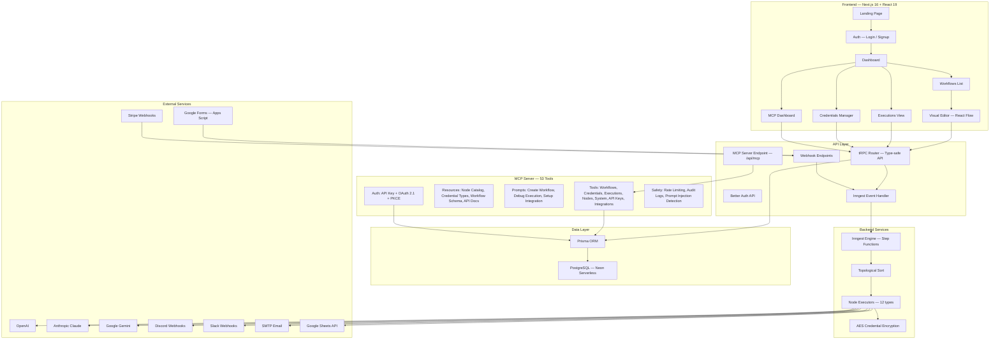
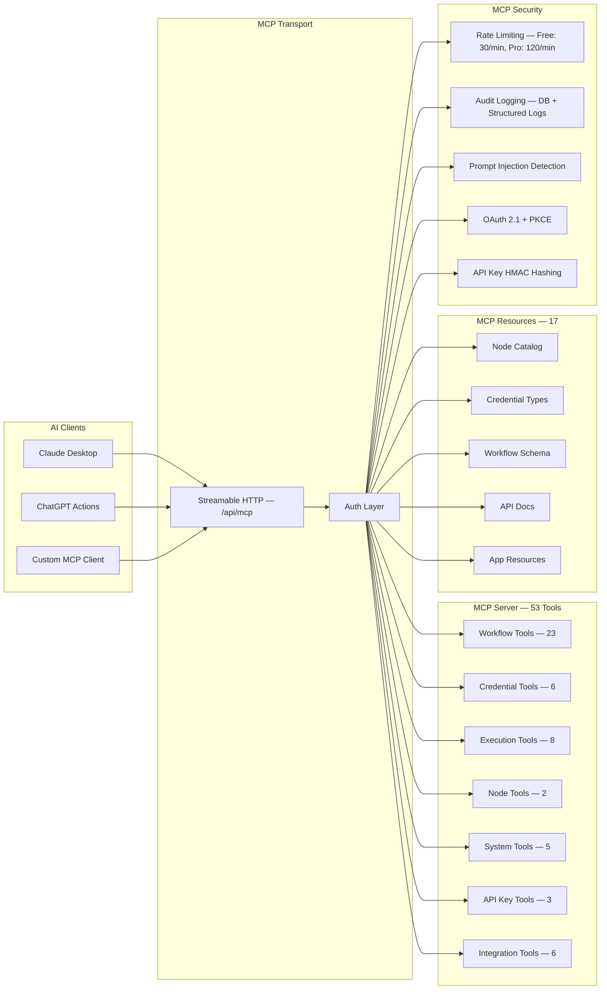
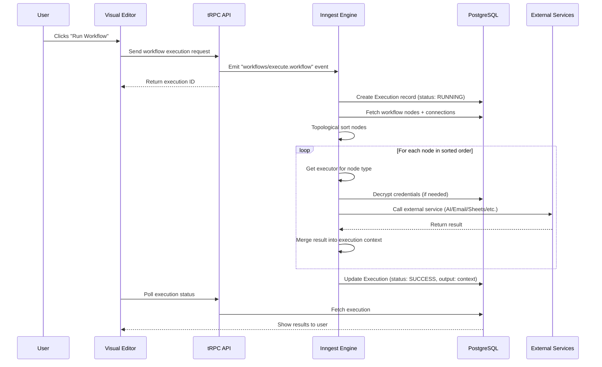
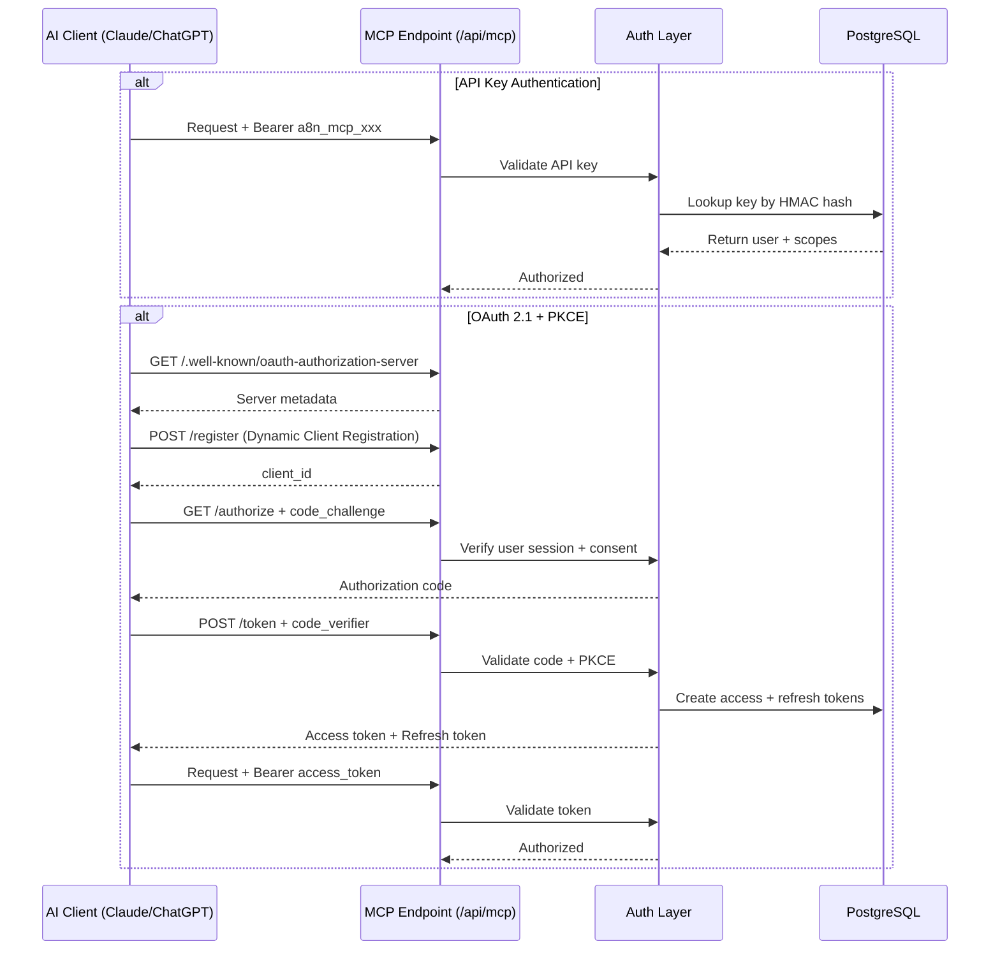
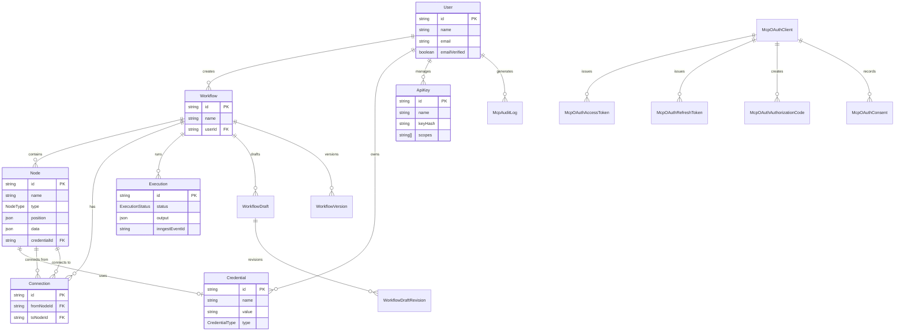

# a8n — YouTube Demo Video Script (~6.5 minutes)

> **PACT Framework**: Problem → Architecture → Live Demo → Technical Decisions → Challenges & Learnings → Future Improvements

---

## 🎬 SLIDE 1 — Title Card
> **On Screen**: a8n logo + "AI-Powered Workflow Automation Platform" + your name + Final Year Project

---

## 0:00–0:30 | Problem (30 seconds)

**[You, talking to camera / voiceover]**

> "Hey everyone! So here's the thing — if you're a small business owner, a freelancer, or even a student running a club, you're probably doing a LOT of repetitive stuff manually. Like, someone fills out a Google Form, and then you have to read it, summarize it, email them back, maybe log it in a spreadsheet... and you do this over and over and over.
>
> Now tools like Zapier and n8n exist, but they're either super expensive or really hard to set up.
>
> So I built **a8n** — a visual workflow automation platform that lets you connect triggers, AI models, and actions together using a simple drag-and-drop editor. And the cool part? It also has a full **MCP Server** so AI assistants like ChatGPT and Claude can build and manage your workflows for you."

### 🎬 SLIDE 2 — The Problem
> **On Screen**: 
> - ❌ Repetitive manual tasks
> - ❌ Existing tools are expensive or complex
> - ✅ a8n: Visual + AI-powered automation
> - ✅ MCP Server: Let AI assistants manage workflows

---

## 0:30–1:15 | Architecture (45 seconds)

**[Show the architecture diagram on screen]**

> "Let me quickly walk you through how the whole system is put together.
>
> The frontend is built with **Next.js 16** and **React 19** — it's a full-stack app. The visual editor uses **React Flow** for that drag-and-drop experience.
>
> For the backend, I'm using **tRPC** for type-safe API calls between the frontend and backend. The database is **PostgreSQL on Neon** — a serverless Postgres — with **Prisma** as the ORM.
>
> Workflow execution happens through **Inngest** — think of it as a job queue. When you hit 'Run' or a webhook fires, Inngest picks up the event, sorts the nodes in the right order, and runs each one step by step.
>
> And then there's the **MCP Server** — this is a Streamable HTTP endpoint that exposes 53 tools, 17 resources, and 3 prompts so any MCP-compatible AI client can manage your workflows.
>
> Authentication uses **Better Auth** with GitHub and Google OAuth. Credentials are encrypted with AES. And the whole thing is deployed on **Vercel**."

### 🎬 SLIDE 3 — Architecture Overview

> **On Screen**: Show the Mermaid diagram below

### 🎬 SLIDE 4 — Tech Stack Summary

> **On Screen**:
> | Layer | Technology |
> |-------|-----------|
> | Frontend | Next.js 16, React 19, React Flow, Tailwind CSS, Framer Motion |
> | State | Jotai + TanStack React Query |
> | API | tRPC (type-safe end-to-end) |
> | Database | PostgreSQL (Neon Serverless) + Prisma ORM |
> | Auth | Better Auth + GitHub/Google OAuth |
> | Execution | Inngest (event-driven step functions) |
> | MCP Server | @modelcontextprotocol/sdk, Streamable HTTP |
> | AI Providers | OpenAI, Anthropic, Gemini (via Vercel AI SDK) |
> | Deployment | Vercel + Docker Compose (local dev) |

---

## 1:15–4:00 | Live Demo (2 min 45 sec)

### 🎬 SLIDE 5 — "Live Demo"
> **On Screen**: "Let's see it in action!" title card

---

### 1:15–1:40 | Landing Page + Auth (25 sec)

**[Screen recording — show the landing page]**

> "Alright, so this is the landing page. You can see use cases, how the visual editor works, pricing — all that.
>
> Let me sign up with GitHub real quick... and boom, I'm inside the dashboard."

---

### 1:40–2:15 | Workflows Dashboard (35 sec)

**[Screen recording — workflows list]**

> "This is the main dashboard — all my workflows live here. I can create new ones, see when they were last updated, and jump into the editor.
>
> Let me create a new workflow — I'll call it 'Form Auto-Reply'."

---

### 2:15–3:00 | Visual Editor (45 sec)

**[Screen recording — workflow editor with React Flow]**

> "This is the heart of a8n — the **visual editor**. It's powered by React Flow.
>
> I'll add a **Google Form Trigger** — this kicks things off when someone submits a form. Then I'll connect a **Gemini node** to summarize the response. And finally, an **Email node** to send that summary back to the person.
>
> You can see each node has its own config panel — like setting the prompt for Gemini, choosing which credential to use, and writing the email template with template variables like `{{aiSummary.text}}`.
>
> There's also a minimap, zoom controls, dark mode support — all the usual stuff."

### 🎬 SLIDE 6 — Supported Node Types

> **On Screen**:
> | Category | Nodes |
> |----------|-------|
> | **Triggers** | Manual, Google Form, Stripe Event |
> | **AI** | OpenAI (GPT), Anthropic (Claude), Google Gemini |
> | **Actions** | HTTP Request, Discord, Slack, Email (SMTP), Google Sheets |
> | **System** | Initial Placeholder |

---

### 3:00–3:20 | Credentials (20 sec)

**[Screen recording — credentials page]**

> "Before running, I need to set up credentials. This page lets me store my API keys and service accounts securely — everything is encrypted with AES before hitting the database. So your OpenAI key, your SMTP password — all encrypted at rest."

---

### 3:20–3:40 | Execution (20 sec)

**[Screen recording — execute + execution detail page]**

> "Now I hit Run... and you can see the execution in the executions page — status, output, errors if any. Each execution is tied to the workflow and tracked with a unique Inngest event ID."

---

### 3:40–4:00 | MCP Dashboard + MCP Server (20 sec)

**[Screen recording — MCP dashboard page]**

> "And here's the MCP section. This is where you generate API keys to connect any MCP-compatible AI client — like Claude Desktop or a custom ChatGPT action.
>
> It shows 53 tools, 17 resources, 3 prompts. There's a security center, active API keys, and even copy-paste configs for Claude Desktop and other clients.
>
> So basically, you can just tell Claude 'create a workflow that takes Stripe payments and posts to Slack', and it'll do it through our MCP server."

### 🎬 SLIDE 7 — MCP Server Breakdown

> **On Screen**: Show the Mermaid diagram below

---

## 4:00–5:30 | Technical Decisions (1 min 30 sec)

### 🎬 SLIDE 8 — Key Technical Decisions

> **On Screen**: Show bullet list (reveal one at a time)

**[You, talking to camera]**

> "Let me talk about some key decisions I made and why.
>
> **Why Next.js?** — I needed server-side rendering for SEO on the landing page, API routes for webhooks and MCP, and React Server Components for performance. Next.js gave me all of that in one framework.
>
> **Why tRPC?** — Full type safety from database to frontend. I define a procedure once, and TypeScript validates everything end to end — no need for REST schemas or manual type definitions.
>
> **Why Inngest instead of a simple queue?** — Workflows can have multiple steps, and some steps call external APIs that can fail. Inngest gives me automatic retries, step-by-step execution, and real-time streaming — all serverless. No need to manage a separate worker process.
>
> **Why topological sort?** — Nodes in a workflow form a DAG — a directed acyclic graph. Topological sort ensures that every node only runs after all its dependencies are done. This is how I guarantee the correct execution order.
>
> **Why MCP instead of a regular REST API?** — MCP is the emerging standard for connecting AI models to external tools. By implementing it, any AI client — Claude, ChatGPT, whatever — can discover and use a8n's capabilities without custom integration code. One protocol, many clients.
>
> **Why encrypt credentials?** — Users store their OpenAI keys, SMTP passwords, and Google service accounts. I use AES encryption so even if the database leaks, the secrets are safe."

### 🎬 SLIDE 9 — Why These Choices?

> **On Screen**:
> | Decision | Reason |
> |----------|--------|
> | Next.js 16 | SSR + API routes + RSC in one framework |
> | tRPC | End-to-end type safety, zero schema drift |
> | Inngest | Serverless step functions with retry + streaming |
> | Topological Sort | Correct execution order for DAG workflows |
> | MCP Protocol | Universal AI client compatibility |
> | Prisma + Neon | Serverless Postgres, auto-scaling, branching |
> | AES Encryption | Protect credentials at rest |
> | Better Auth | OAuth + email login with minimal config |

---

## 5:30–6:30 | Challenges & Learnings (1 minute)

### 🎬 SLIDE 10 — Challenges & Learnings

**[You, talking to camera]**

> "This project was NOT easy — let me share some real challenges.
>
> **Challenge 1: Template variables.** Users write things like `{{aiSummary.text}}` in their email body or prompt. I had to build a Handlebars-based template engine that resolves these variables from the execution context at runtime without breaking if a variable is missing.
>
> **Challenge 2: MCP OAuth 2.1.** Implementing OAuth 2.1 with PKCE for the MCP server was intense — authorization codes, access tokens, refresh tokens, consent management, token rotation — all from scratch, all stored in the database with proper hashing.
>
> **Challenge 3: Webhook security.** Google Forms and Stripe both send webhooks, but I needed signature verification to prevent anyone from faking a webhook. For Stripe, that's their built-in signatures. For Google Forms, I had to create a shared secret system.
>
> **Challenge 4: Node execution order.** When a workflow has branching paths or multiple connections, figuring out the right order to execute nodes is genuinely hard. Topological sort solved it, but handling edge cases like cycles and orphan nodes took time.
>
> **What I learned?** Building a production-grade platform is way harder than building a feature demo. Security, error handling, observability — these things take 3x more effort than the core feature."

---

## 6:30–7:00 | Future Improvements (30 seconds)

### 🎬 SLIDE 11 — Future Improvements

**[You, talking to camera]**

> "If I had more time, here's what I'd add:
>
> - **Conditional branching** — if/else nodes so workflows can make decisions.
> - **Loop nodes** — for processing batches of data.
> - **More integrations** — Notion, Airtable, Telegram, WhatsApp.
> - **Workflow marketplace** — share and import templates from other users.
> - **Real-time execution viewer** — watch nodes light up as they execute in the editor.
> - **Mobile app** — trigger and monitor workflows from your phone.
>
> That's it! If you have questions, drop them in the comments. Thanks for watching!"

### 🎬 SLIDE 12 — Thank You

> **On Screen**:
> - a8n logo
> - "Thank you!"
> - GitHub link
> - Your name + college

---

## 📊 Workflow Execution Flow Diagram

> Use this when explaining how a workflow actually runs (during the Live Demo or Technical Decisions section)

---

## 📊 MCP Authentication Flow Diagram

> Use this when explaining MCP OAuth during Technical Decisions

---

## 📊 Database Schema Diagram

> Use this during Architecture or Technical Decisions

---

## 🕐 Timestamp Summary

| Time | Section | Duration |
|------|---------|----------|
| 0:00–0:30 | Problem | 30 sec |
| 0:30–1:15 | Architecture | 45 sec |
| 1:15–1:40 | Demo: Landing + Auth | 25 sec |
| 1:40–2:15 | Demo: Workflows Dashboard | 35 sec |
| 2:15–3:00 | Demo: Visual Editor | 45 sec |
| 3:00–3:20 | Demo: Credentials | 20 sec |
| 3:20–3:40 | Demo: Execution | 20 sec |
| 3:40–4:00 | Demo: MCP Dashboard | 20 sec |
| 4:00–5:30 | Technical Decisions | 90 sec |
| 5:30–6:30 | Challenges & Learnings | 60 sec |
| 6:30–7:00 | Future Improvements | 30 sec |
| **Total** | | **~6.5 min** |

---

## 📝 Slide List (12 Slides Total)

| # | Slide Title | Content |
|---|------------|---------|
| 1 | Title Card | a8n logo, subtitle, your name, project type |
| 2 | The Problem | Pain points + what a8n solves |
| 3 | Architecture Overview | Full system Mermaid diagram |
| 4 | Tech Stack Summary | Table of all technologies |
| 5 | Live Demo | "Let's see it in action!" title card |
| 6 | Supported Node Types | 12 node types in a table |
| 7 | MCP Server Breakdown | MCP Mermaid diagram |
| 8 | Key Technical Decisions | Bullet list of decisions |
| 9 | Why These Choices? | Decision-reason table |
| 10 | Challenges & Learnings | 4 challenges described |
| 11 | Future Improvements | Bullet list of future features |
| 12 | Thank You | Logo, links, name |
