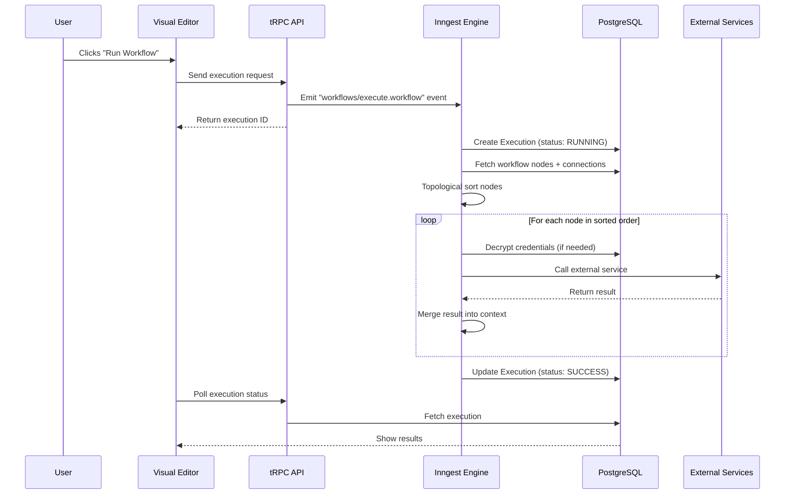
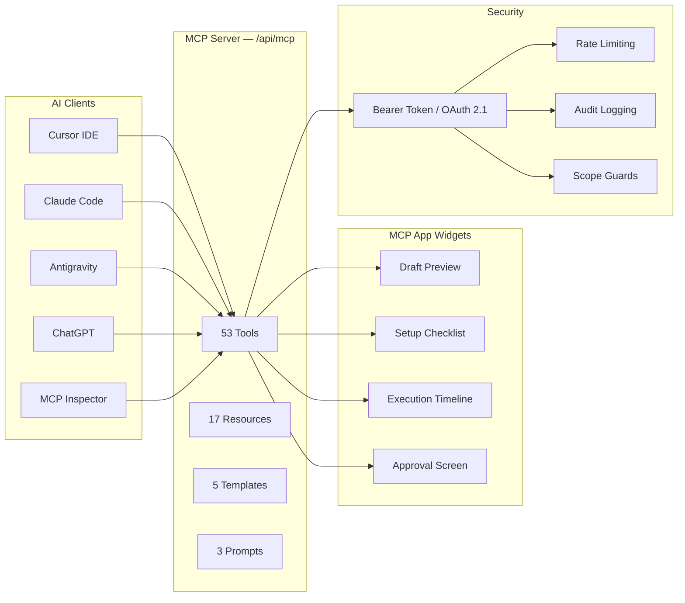

# a8n — Video Walkthrough Script

> A simple, screen-by-screen walkthrough of the platform.
> Tone: natural, conversational — like you're showing a friend what you built.
> Total length: ~7 minutes

---

## Intro (0:00 – 0:20)

> *Camera or voiceover, casual*

"Hey, so this is **a8n** — a visual workflow automation platform I built as my final year project.

The idea is pretty straightforward. You connect a trigger, some AI, and an action — all with drag-and-drop — and the whole thing runs automatically. No code, no complicated setup.

Let me just walk you through the whole app, screen by screen."

---

## Screen 1 — Landing Page (0:20 – 0:50)

> *Open the browser at `/` — show the full landing page*

"This is the landing page. Right at the top you've got the hero section — it says *Automate without limits* — along with two buttons: **Launch App** and **Read Docs**.

Below that, there are a few sections:

- **Use Cases** — real scenarios like form auto-replies, payment alerts, API logging
- **Visual Editor Preview** — a live React Flow demo showing what the editor looks like
- **AI Nodes** — the three AI providers we support: OpenAI, Anthropic, and Gemini

Everything here is built with Next.js, React, and Framer Motion. The animations are smooth, there's a dark mode toggle in the navbar, and the whole page is server-rendered for SEO."

---

## Screen 2 — Sign Up / Login (0:50 – 1:10)

> *Click 'Launch App' → show the auth page*

"When you click Launch App, you land on the login page. We support **GitHub login** and **Google login** — both OAuth. Under the hood, this uses **Better Auth**, which handles the entire session flow.

Let me sign in with GitHub real quick…

And that's it — I'm inside the dashboard."

---

## Screen 3 — Workflows Dashboard (1:10 – 1:50)

> *Show the `/workflows` page — list of workflows*

"This is the workflows page. Every workflow you create shows up here as a card — you can see the name, when it was last updated, and a quick status.

You can create a new workflow from the top-right button. Let me do that — I'll call this one **'Form Auto-Reply'**.

There's also a sidebar on the left with links to:

- **Workflows** — where we are right now
- **Executions** — a log of every time a workflow ran
- **Credentials** — where you store your API keys and secrets
- **MCP** — the Model Context Protocol dashboard

I'll show each of these."

---

## Screen 4 — Visual Editor (1:50 – 3:00)

> *Click into a workflow → show the React Flow editor*
> *Use the real workflow at: `/workflows/cmqlxlpy9000cu4or9gf15wqb`*

"This is the heart of the app — the **visual editor**. It's built with **React Flow**.

Let me open a real workflow I already have: `/workflows/cmqlxlpy9000cu4or9gf15wqb`.

Here's how it's laid out:

- **Top bar** — breadcrumbs with the workflow name (you can click to rename it), a **Save Workflow** button on the right, and a **sidebar toggle** plus an **Add Node** button on each end.
- **Canvas** — this is the main area with a dot grid background. You can drag nodes around, zoom in and out, and there's a **minimap** in the corner to keep track of where you are.

Let me walk through the nodes in this workflow:

1. **Google Form Trigger** — this is the starting point. When someone submits a Google Form, it fires a webhook that kicks off this workflow.
2. **Gemini Node** — this takes the form responses and sends them to Google Gemini with a prompt like *Summarize this form submission*. The result is stored in a variable, say `aiSummary`.
3. **Email Node** — this sends an email back to the person who submitted the form, using template variables like `{{aiSummary.text}}` and `{{googleForm.respondentEmail}}`.

Each node has its own config panel — when you click on a node, a dialog pops up where you can set the prompt, pick a credential, write the email body, etc.

To connect nodes, you just drag from one handle to another. The connections show the data flow — left to right, top to bottom.

At the bottom of the canvas, there's a **Run** button that shows up if the workflow has a Manual Trigger. Hit that, and the workflow executes right away.

Here are all the node types we support:

| Category    | Nodes                                       |
|-------------|---------------------------------------------|
| **Triggers** | Manual, Google Form, Stripe Event           |
| **AI**       | OpenAI (GPT), Anthropic (Claude), Gemini   |
| **Actions**  | HTTP Request, Discord, Slack, Email (SMTP), Google Sheets |

That's 12 node types across 4 categories."

---

## Screen 5 — Node Configuration (3:00 – 3:30)

> *Click on a node → show the config dialog*

"Let me click on the Gemini node to show how configuration works.

A dialog pops up with these fields:

- **Result Name** — like `aiSummary`. Other nodes use this to reference the output.
- **Credential** — a dropdown of your saved Gemini API keys.
- **Prompt** — the actual instruction you're sending to the AI. You can use template variables here, like `{{json googleForm.responses}}`, which injects the raw form data.
- **System Prompt** (optional) — if you want the AI to behave a certain way, like *You are a concise assistant*.

The cool part is template variables. Anywhere in the app — prompts, email bodies, webhook URLs — you can write `{{variableName.field}}` and it gets replaced at runtime with real data from earlier nodes. It's basically Handlebars under the hood."

---

## Screen 6 — Credentials Page (3:30 – 4:00)

> *Navigate to `/credentials` from the sidebar*

"Over on the Credentials page, this is where you store all your API keys and secrets.

Each credential has a name, a type (like OPENAI, GEMINI, SMTP_EMAIL, GOOGLE_SHEETS), and the actual secret value. The important thing here: **everything is encrypted with AES before it's stored in the database**. So even if someone got access to the database directly, the raw keys would be unreadable.

You can create a new credential, edit existing ones, or delete them. The credential types are:

| Type            | What It's For                     |
|-----------------|-----------------------------------|
| OPENAI          | OpenAI API key                    |
| ANTHROPIC       | Anthropic API key                 |
| GEMINI          | Google AI Studio key              |
| SMTP_EMAIL      | Email server credentials (JSON)   |
| GOOGLE_SHEETS   | Google service account key (JSON) |

When you add a node like Gemini to your workflow, it pulls from this list to know which credential to use."

---

## Screen 7 — Executions Page (4:00 – 4:30)

> *Navigate to `/executions` from the sidebar*

"The Executions page shows a log of every time a workflow ran — manually or through a webhook.

Each execution row shows:

- **Workflow name** — which workflow ran
- **Status** — SUCCESS, FAILED, or RUNNING
- **Timestamp** — when it started
- **Duration** — how long it took

You can click into any execution to see the full output — what each node produced, any errors that happened, and the final result.

Under the hood, every execution goes through **Inngest** — it's a serverless step function engine. When you hit Run (or a webhook fires), Inngest picks up the event, sorts all the nodes using **topological sort** (so dependencies run first), and then executes each one step by step. If any step fails, it retries automatically."

---

## Screen 8 — A Real Workflow in Action (4:30 – 5:00)

> *Go back to the workflow editor at `/workflows/cmqlxlpy9000cu4or9gf15wqb`*
> *Hit the Run button and show the execution*

"Let me actually run this workflow so you can see what happens.

I'll hit the Run button at the bottom… and now if I go to the Executions page, you can see a new entry just appeared — status is SUCCESS, took about 2 seconds.

If I click into it, here's the full execution output:

- The **Google Form Trigger** passed along the form data — questions, answers, respondent email.
- The **Gemini node** took that data and returned a summary.
- The **Email node** sent the summary back to the respondent.

That's the full flow: trigger → AI → action. And it all happened automatically.

This is the kind of workflow you'd set up once and forget about. Every time someone submits that Google Form, they get a personalized AI-generated email within seconds."

---

## Screen 9 — MCP Server & Dashboard (5:00 – 5:50)

> *Navigate to `/mcp` from the sidebar*

"Now here's something I'm really proud of — the **MCP Dashboard**.

MCP stands for **Model Context Protocol**. It's an open standard that lets AI assistants — like Claude, ChatGPT, Cursor, Antigravity — connect to external tools and services.

a8n has a full MCP server built in. Here's what's on this page:

**Overview Cards:**

- **78 Active Capabilities** — that's 53 tools, 17 resources, 5 templates, and 3 prompts
- **Protocol Security** — Bearer tokens hashed with SHA-256
- **Transport Layer** — Streamable HTTP with stateless SSE messaging

**Security Center:**

This shows the real-time security posture — whether the MCP schema is valid, if the audit database is enabled, rate limiting status, CORS policy, and egress allowlist. There are green/amber status pills so you can see at a glance if anything needs attention.

It also shows **Connected Apps** — any OAuth clients that have authorized access — with the option to revoke them.

**Active API Keys:**

This is where you generate and manage API keys. Each key has a name, a prefix (so you can identify it), scopes (like `workflows:read`, `executions:write`, or full `*` access), creation date, last used date, and expiration.

You can generate a new key by clicking the button in the top-right. The panel slides open and lets you set a name, choose scopes, and set an expiration. Once generated, it shows you the full key one time — you copy it and never see it again.

**Client Integration Presets:**

At the bottom, there are ready-to-copy configs for connecting to:

| Client          | Config File                     |
|-----------------|----------------------------------|
| Antigravity     | `.gemini/settings.json`         |
| Cursor IDE      | `.cursor/mcp.json`              |
| Claude Code     | `claude_desktop_config.json`    |
| MCP Inspector   | CLI command with endpoint + key |

You just copy the JSON, paste it into your client's config file, replace `<your_api_key>` with the key you generated, and you're connected. That's it."

---

## Screen 10 — MCP App Feature (5:50 – 6:20)

> *Show the MCP tools and explain the ChatGPT widget/app system*

"There's one more thing about MCP that's worth showing — the **MCP App** feature.

Besides the standard tools for creating workflows, managing credentials, and running executions, a8n also registers a set of **render tools** that are designed specifically for AI clients like ChatGPT.

These tools return structured data that AI clients can use to display rich, interactive widgets. Here's what we have:

- **Workflow Draft Preview** — shows a visual preview of a workflow draft, including the nodes, connections, and validation status
- **Workflow Setup Checklist** — generates a step-by-step checklist of everything needed before a workflow can run: credentials, webhook setup, missing fields
- **Execution Timeline** — shows a timeline of an execution with status, duration, and step-by-step results
- **Workflow Approval** — shows a diff of what changed in a draft with a confirmation hash, so the AI can present an approve/reject screen

So for example, you could tell ChatGPT: *'Create a workflow that takes Stripe payments and sends a Slack notification'* — and it would use the MCP tools to draft it, show you a preview widget, run a setup checklist, and then ask for your approval before applying it.

The whole thing is scope-guarded, rate-limited, and audit-logged. Every MCP tool call gets recorded in the database."

---

## Screen 11 — How It All Connects (6:20 – 6:50)

> *Quick recap / talking to camera*

"So let me just recap how everything fits together:

1. **Landing Page** → you learn what a8n does
2. **Sign up with GitHub/Google** → you're in the dashboard
3. **Create a workflow** → drag and drop nodes in the visual editor
4. **Set up credentials** → store your API keys securely
5. **Run the workflow** → manually or through a webhook trigger
6. **Check executions** → see status, output, and errors
7. **Connect AI clients via MCP** → generate an API key, copy the config, and your AI assistant can manage everything for you

The tech stack, quickly:

| Layer       | Technology                                      |
|-------------|-------------------------------------------------|
| Frontend    | Next.js 16, React 19, React Flow, Framer Motion |
| State       | Jotai + TanStack React Query                    |
| API         | tRPC (type-safe end-to-end)                     |
| Database    | PostgreSQL on Neon + Prisma ORM                 |
| Auth        | Better Auth + GitHub/Google OAuth               |
| Execution   | Inngest (event-driven step functions)            |
| MCP Server  | @modelcontextprotocol/sdk, Streamable HTTP       |
| AI          | OpenAI, Anthropic, Gemini (via Vercel AI SDK)    |
| Deployment  | Vercel                                           |

Everything is type-safe from database to frontend. tRPC makes sure there's zero schema drift between the API and the UI."

---

## Closing (6:50 – 7:00)

> *Camera or voiceover*

"That's **a8n**. A visual automation platform with a full MCP server, built from scratch.

Thanks for watching — if you've got questions, drop them in the comments."

---

## Reference — Workflow Execution Flow

> *Use this diagram if you want to explain how execution works visually*

---

## Reference — MCP Server Capabilities

> *Use this to summarize the MCP system*

---

## Reference — Supported Node Types

| Category     | Type                  | What It Does                                          |
|--------------|-----------------------|-------------------------------------------------------|
| System       | Initial               | Placeholder node created with new workflows           |
| Trigger      | Manual Trigger        | Starts workflow when you click Run                    |
| Trigger      | Google Form Trigger   | Starts workflow on Google Form submission             |
| Trigger      | Stripe Event Trigger  | Starts workflow on Stripe webhook event               |
| AI           | OpenAI                | Generates text using GPT models                       |
| AI           | Anthropic             | Generates text using Claude models                    |
| AI           | Gemini                | Generates text using Google Gemini                    |
| Action       | HTTP Request          | Calls any external API                                |
| Action       | Discord               | Sends a message to a Discord channel via webhook      |
| Action       | Slack                 | Sends a message to a Slack channel via webhook        |
| Action       | Email (SMTP)          | Sends an email through SMTP                           |
| Action       | Google Sheets         | Appends a row to a Google Sheet                       |

---

## Reference — Real Workflow Example

**URL:** `/workflows/cmqlxlpy9000cu4or9gf15wqb`

**Flow:** Google Form Trigger → Gemini AI → Email

**What it does:**
1. Someone submits a Google Form
2. Gemini summarizes the form responses
3. An email with the summary is sent back to the respondent

**Template variables used:**
- `{{json googleForm.responses}}` — in the Gemini prompt
- `{{aiSummary.text}}` — in the email body
- `{{googleForm.respondentEmail}}` — in the email "To" field

---

## Timestamp Summary

| Time        | Screen                     | Duration |
|-------------|----------------------------|----------|
| 0:00 – 0:20 | Intro                      | 20 sec   |
| 0:20 – 0:50 | Landing Page               | 30 sec   |
| 0:50 – 1:10 | Sign Up / Login            | 20 sec   |
| 1:10 – 1:50 | Workflows Dashboard        | 40 sec   |
| 1:50 – 3:00 | Visual Editor              | 70 sec   |
| 3:00 – 3:30 | Node Configuration         | 30 sec   |
| 3:30 – 4:00 | Credentials Page           | 30 sec   |
| 4:00 – 4:30 | Executions Page            | 30 sec   |
| 4:30 – 5:00 | Real Workflow in Action    | 30 sec   |
| 5:00 – 5:50 | MCP Server & Dashboard     | 50 sec   |
| 5:50 – 6:20 | MCP App Feature            | 30 sec   |
| 6:20 – 6:50 | How It All Connects        | 30 sec   |
| 6:50 – 7:00 | Closing                    | 10 sec   |
| **Total**   |                            | **~7 min** |
