# The Execution Engine Behind a8n

## Turning a visual workflow into a durable runtime

In my previous post, I wrote that building a workflow tool is harder than drawing nodes on a canvas.

This is the deeper breakdown I promised.

When I started building **a8n**, my final year project, the visible goal was simple: build an n8n-style workflow automation platform where users can drag nodes onto a canvas, connect them, and run automations.

But the real system starts after the user clicks **Run**.

At that point, the product has to answer much harder questions:

- Which node should run first?
- How do we convert a visual graph into a valid execution order?
- How does data move from one node to the next?
- What happens if an API call fails halfway through?
- How do we retry without duplicating already completed work?
- How do we show live execution status on the canvas?
- How do we use user credentials without exposing secrets?

That is where the architecture becomes interesting.

a8n is not just a drag-and-drop UI. It is a workflow runtime built around a DAG execution engine, durable background processing, realtime execution updates, and encrypted credential access.

---

## The Core Mental Model

The canvas is only the authoring surface.

The workflow engine is the system that turns the saved graph into something executable.

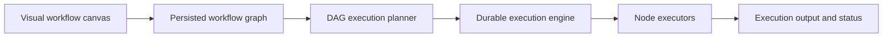

In simple terms:

- The **canvas** lets users describe intent.
- The **database** stores nodes and connections.
- The **execution planner** decides the order.
- The **execution engine** runs the workflow.
- The **executor registry** maps node types to actual behavior.
- The **context object** carries data between nodes.
- The **realtime layer** streams node status back to the UI.

This separation is important because the UI and the runtime have very different jobs.

The UI cares about interaction.

The runtime cares about correctness, durability, ordering, failures, and security.

---

## High-Level Architecture

a8n is built as a full-stack Next.js application with a durable execution engine behind it.

The main layers are:

- **Next.js App Router** for the web application.
- **React Flow** for the visual workflow editor.
- **tRPC** for the first-party product API.
- **Prisma** for the data model.
- **PostgreSQL** for persistence.
- **Inngest** for durable workflow execution.
- **Inngest Realtime** for live node status updates.
- **Executor modules** for HTTP, AI, messaging, email, Google Sheets, and trigger nodes.
- **Encrypted credentials** for API keys and integration secrets.

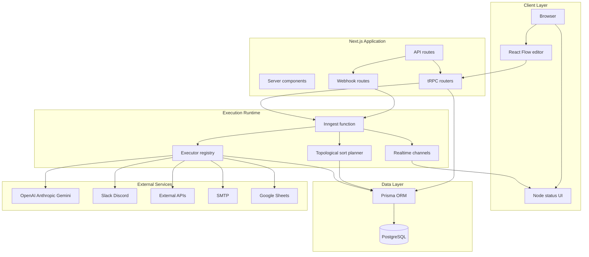

The most important decision here is that workflow execution is **not** handled inside the HTTP request.

When a user clicks **Run**, the app sends an event to Inngest. Inngest then runs the workflow in the background.

That makes execution asynchronous, durable, retryable, and easier to observe.

---

## How a Workflow Is Stored

A workflow in a8n is stored as a graph.

The graph has two main pieces:

- **Nodes**: the things that do work.
- **Connections**: the directed edges between nodes.

At the database level, this looks roughly like this:

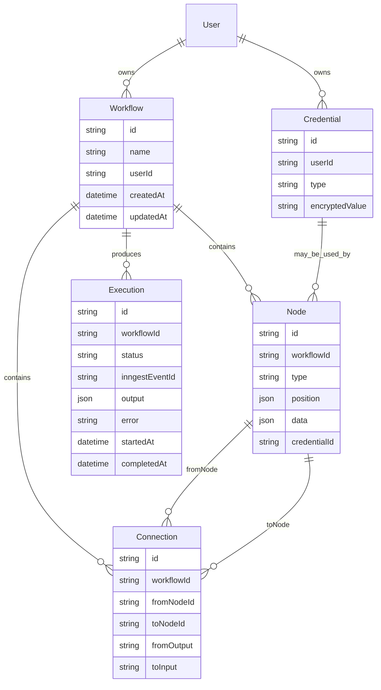

This data model keeps authoring state and runtime state separate.

A **Workflow** is the saved definition.

An **Execution** is a single run of that workflow.

That separation matters because the same workflow can run many times, fail in one run, succeed in another run, and produce different outputs depending on trigger data.

---

## What Happens When the User Clicks Run

The `workflows.execute` mutation does not execute every node directly.

It validates that the workflow belongs to the current user, then sends an Inngest event:

```ts
await sendWorkflowExecution({
  workflowId: input.id,
});
```

The event name is:

```txt
workflows/execute.workflow
```

That event becomes the entry point for the durable execution pipeline.

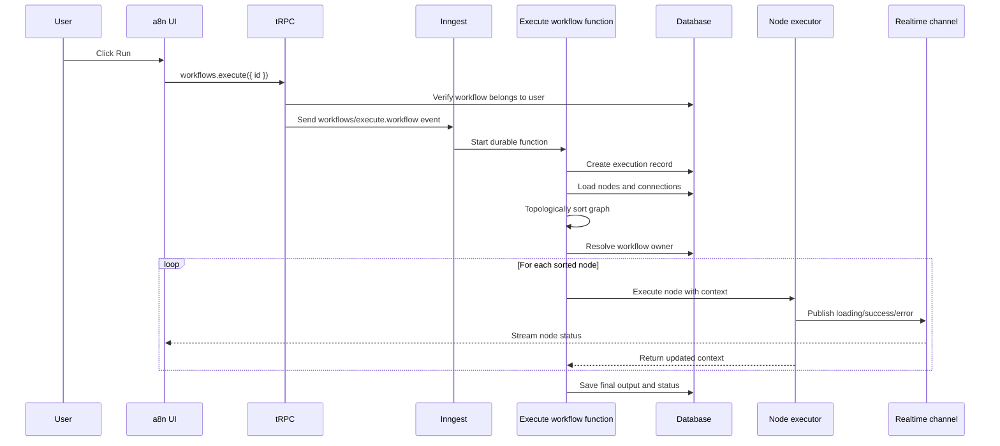

The workflow execution pipeline is:

1. Create an execution record.
2. Load the workflow graph.
3. Topologically sort the graph.
4. Resolve the workflow owner.
5. Execute each node in dependency order.
6. Store the final output.
7. Mark the execution as `SUCCESS` or `FAILED`.

This turns a visual graph into a controlled runtime process.

---

## Why DAG Execution Matters

The user sees a graph.

The engine needs a list.

If the workflow looks like this:

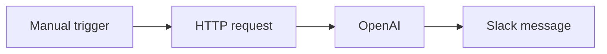

The execution order is straightforward:

```txt
Manual trigger -> HTTP request -> OpenAI -> Slack message
```

But workflows are not always linear.

They can branch:

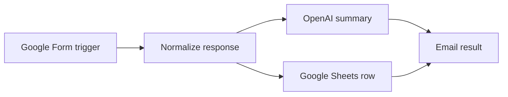

In this case, the engine cannot just execute nodes in the order they were created in the UI.

It needs to respect dependencies:

- `Normalize response` must run after the trigger.
- `OpenAI summary` and `Google Sheets row` depend on normalized data.
- `Email result` should run only after its upstream inputs are available.

This is why the workflow is treated as a **DAG**, a directed acyclic graph.

The engine uses **topological sorting** to convert the graph into a valid execution order.

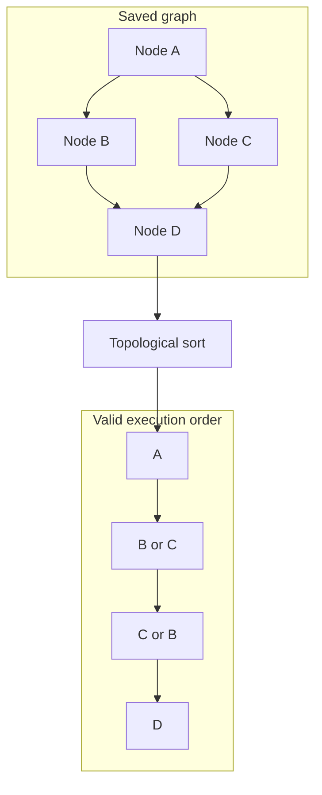

The important property is simple:

> A node only executes after all nodes it depends on have executed.

If the graph contains a cycle, the engine rejects it because cyclic workflows cannot be safely ordered.

For example:

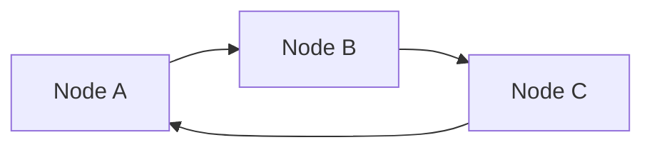

This creates an impossible question:

Which node should run first?

The answer is: none of them can be first without violating a dependency.

That is why cycle detection is part of the execution planning step.

---

## The Execution Engine Pipeline

The main execution function is an Inngest function called `execute-workflow`.

Conceptually, it works like this:

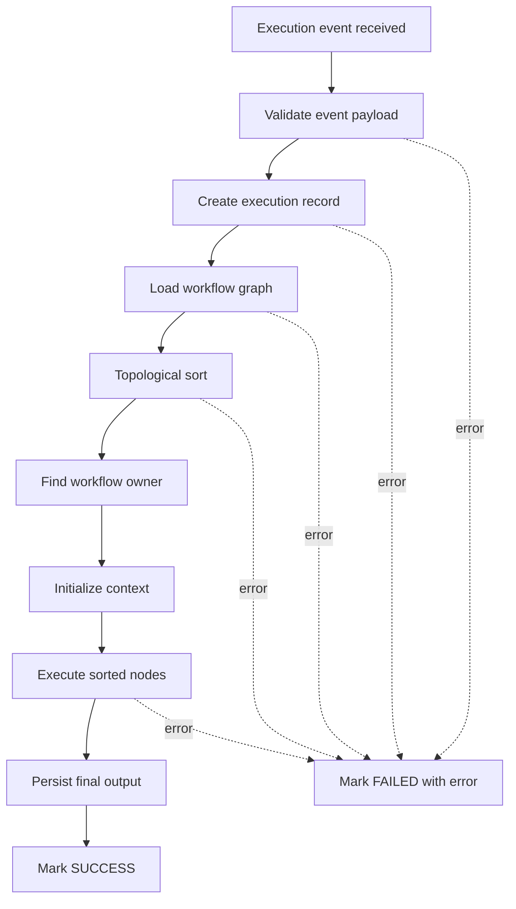

Each important operation is wrapped as a durable Inngest step.

That gives the engine a better failure model than a normal async function.

If a later step fails and retries, earlier completed steps do not need to be repeated.

That is one of the biggest differences between:

```txt
Run all workflow code inside one request handler
```

and:

```txt
Run workflow execution as a durable background process
```

The second approach is much better for workflows because nodes often call external systems, and external systems are unreliable by default.

---

## The Executor Registry

The engine itself does not know how to call OpenAI, send an email, append a Google Sheet row, or post a Slack message.

Instead, it delegates work to node-specific executors.

The mapping is stored in an executor registry:

```ts
NodeType.INITIAL -> manualTriggerExecutor
NodeType.MANUAL_TRIGGER -> manualTriggerExecutor
NodeType.GOOGLE_FORM_TRIGGER -> googleFormTriggerExecutor
NodeType.STRIPE_TRIGGER -> stripeTriggerExecutor
NodeType.HTTP_REQUEST -> httpRequestExecutor
NodeType.OPENAI -> openAiExecutor
NodeType.ANTHROPIC -> anthropicExecutor
NodeType.GEMINI -> geminiExecutor
NodeType.DISCORD -> discordExecutor
NodeType.SLACK -> slackExecutor
NodeType.EMAIL -> emailExecutor
NodeType.GOOGLE_SHEETS -> googleSheetsExecutor
```

Grouped by behavior, the runtime currently supports:

| Category | Node types | Responsibility |
|---|---|---|
| Triggers | Manual, Google Form, Stripe | Start the workflow and seed initial context |
| HTTP and data | HTTP Request, Google Sheets | Call APIs or write structured data |
| AI | OpenAI, Anthropic, Gemini | Generate model output from templated prompts |
| Communication | Slack, Discord, Email | Notify users or teams with templated messages |

This gives the engine a plugin-like shape.

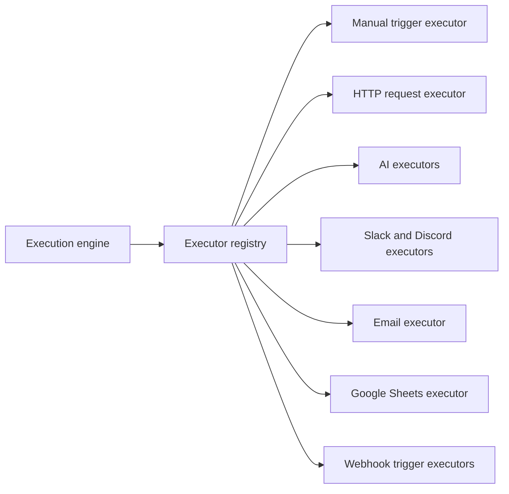

The core engine only needs to know this:

```ts
const executor = getExecutor(node.type);

context = await executor({
  data: node.data,
  nodeId: node.id,
  userId,
  context,
  step,
  publish,
});
```

That makes adding a new node type much easier.

To add a node, I do not need to rewrite the engine. I need to:

1. Add the node type.
2. Build the UI configuration dialog.
3. Create the executor.
4. Add a realtime channel.
5. Register the executor.

That was one of the best architecture decisions in the project because it kept the runtime generic while allowing node behavior to grow independently.

---

## The Node Executor Contract

Every executor follows the same basic contract:

```ts
type WorkflowContext = Record<string, unknown>;

type NodeExecutor = (params: {
  data: Record<string, unknown>;
  nodeId: string;
  userId: string;
  context: WorkflowContext;
  step: StepTools;
  publish: RealtimePublish;
}) => Promise<WorkflowContext>;
```

In plain English:

An executor receives:

- The node configuration.
- The current node ID.
- The workflow owner's user ID.
- The current workflow context.
- Inngest step tools.
- A realtime publish function.

It returns:

- The updated workflow context.

Most executors follow this shape:

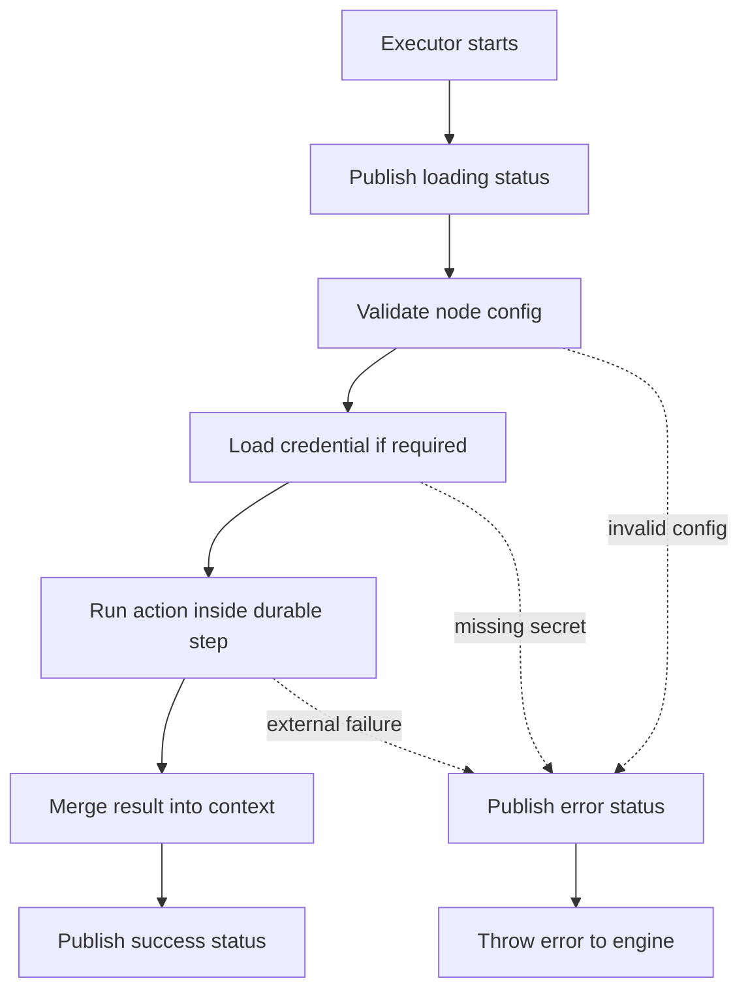

This pattern appears across the system:

- HTTP request nodes validate endpoint, method, and variable name.
- AI nodes validate prompt, credential, and output variable.
- Email nodes validate SMTP credentials and recipient fields.
- Google Sheets nodes validate service account credentials and row JSON.

Configuration errors are treated as non-retriable because retrying will not fix a missing endpoint or missing credential.

Transient external failures, on the other hand, can be retried by the execution engine.

---

## Context Propagation

The most important runtime object in a8n is the **context**.

The context is the accumulated data produced by the workflow so far.

Each node receives it, reads from it, and returns a new version of it.

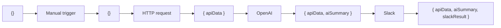

For example, a workflow may do this:

1. Receive a Google Form submission.
2. Store it as `googleForm` in the initial context.
3. Send that data to an OpenAI node.
4. Store the model result as `aiSummary`.
5. Send a Slack message using `aiSummary.text`.
6. Append a row to Google Sheets using both the form data and AI summary.

The context might evolve like this:

```json
{
  "googleForm": {
    "respondentEmail": "student@example.com",
    "responses": {
      "question": "How do I prepare for the exam?"
    }
  }
}
```

After an AI node:

```json
{
  "googleForm": {
    "respondentEmail": "student@example.com",
    "responses": {
      "question": "How do I prepare for the exam?"
    }
  },
  "aiSummary": {
    "text": "Create a revision plan, prioritize weak topics, and solve previous papers."
  }
}
```

This is what makes workflows composable.

Nodes do not need direct knowledge of each other.

They only need to agree on context keys.

---

## Template-Based Data Access

To make context useful inside node configuration, a8n supports Handlebars templates.

That means a downstream node can reference upstream output like this:

```txt
New form response from {{googleForm.respondentEmail}}

AI summary:
{{aiSummary.text}}
```

For HTTP and integration nodes, this is especially useful because URLs, request bodies, prompts, emails, and messages can be dynamically generated from previous node outputs.

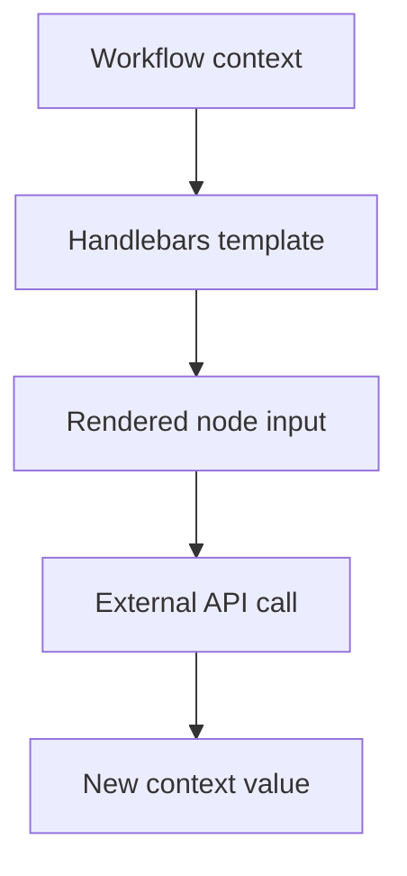

This was a small feature that made the engine feel much more powerful.

Without templating, nodes would be isolated actions.

With templating, nodes can form actual data pipelines.

---

## Durable Execution with Inngest

One of the biggest design choices in a8n was using Inngest for the execution engine instead of running workflows directly in the web server request.

Workflows are naturally unreliable:

- HTTP APIs fail.
- AI providers rate limit.
- Webhooks may send unexpected payloads.
- SMTP servers can reject messages.
- Credentials can be missing or invalid.
- Long-running requests can timeout.

So the workflow engine needs durability.

In a8n, Inngest gives the execution engine:

- Background execution.
- Step-level durability.
- Automatic retries.
- Failure hooks.
- AI call wrapping.
- Realtime status publishing.

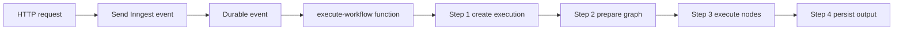

This means the user does not wait for the entire workflow to finish inside the request-response cycle.

The request only starts the workflow.

The runtime owns the execution.

---

## Failure Handling and Retries

Failures are not just logs in a8n.

They are part of the product state.

Each execution has a status:

```txt
RUNNING
SUCCESS
FAILED
```

When a workflow starts, a new execution record is created with `RUNNING`.

When it completes, the engine stores:

- Final status.
- Completion time.
- Final output.

When it fails, the engine stores:

- Failed status.
- Error message.
- Error stack.

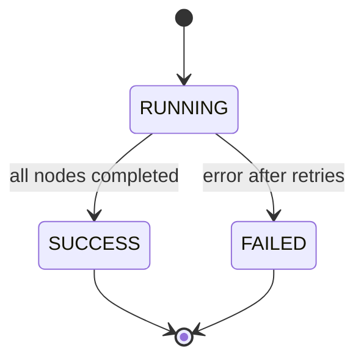

There are two broad failure categories:

| Failure type | Example | Retry? |
|---|---|---|
| Configuration failure | Missing endpoint, missing credential, invalid row JSON | No |
| Transient failure | API timeout, temporary provider issue, network error | Yes |

This distinction matters.

Retrying a missing API key three times is wasted work.

Retrying a temporary network failure is reasonable.

That is why configuration problems throw non-retriable errors, while unexpected external failures are allowed to bubble up into the retry system.

---

## Realtime Execution Tracking

A workflow tool needs feedback.

When the user clicks **Run**, they should not stare at a static canvas wondering what happened.

a8n streams node-level status updates back to the browser.

Each executor publishes status events:

```txt
loading -> success
loading -> error
```

The browser subscribes to typed realtime channels and updates each node indicator.

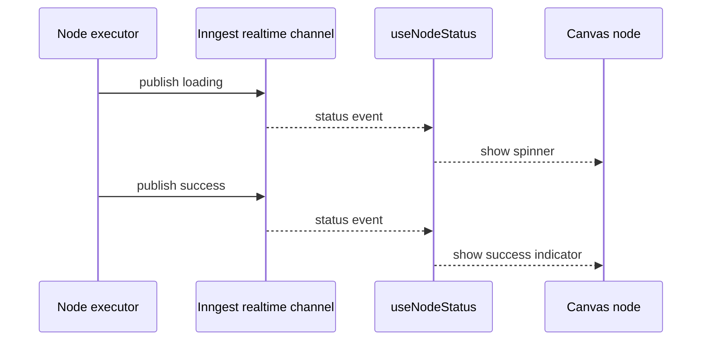

The important design choice is that status updates are keyed by `nodeId`.

That lets the UI update only the node that changed.

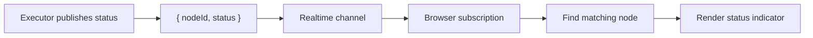

This makes the canvas feel alive during execution.

The user can see which node is running, which node succeeded, and which node failed.

---

## Credential Security

Workflow automation tools often need secrets:

- OpenAI API keys.
- Anthropic keys.
- Gemini keys.
- SMTP credentials.
- Google service account JSON.

Storing and using those credentials safely is part of the execution engine design.

In a8n, credentials are encrypted before being stored in the database.

During execution:

1. The engine resolves the workflow owner.
2. The executor loads only credentials owned by that user.
3. The encrypted credential value is decrypted at runtime.
4. The secret is used for the external API call.
5. The secret is not stored in the execution context.

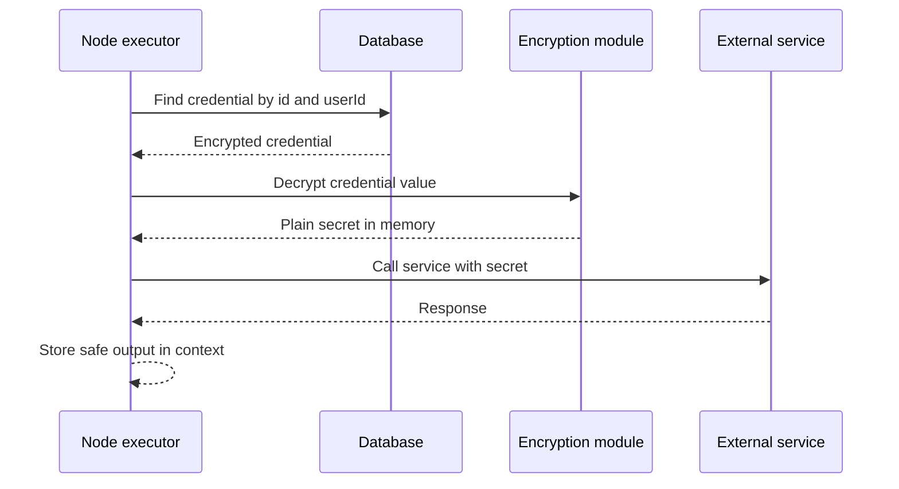

The `userId` check is important.

It prevents one user's workflow from referencing another user's credential.

So credential security is not just encryption. It is also ownership enforcement.

---

## Trigger Sources

Workflows can start from different entry points.

In the current implementation, a workflow can be triggered by:

- A manual run from the UI.
- A Google Form webhook.
- A Stripe webhook.

Each trigger eventually sends the same execution event to Inngest.

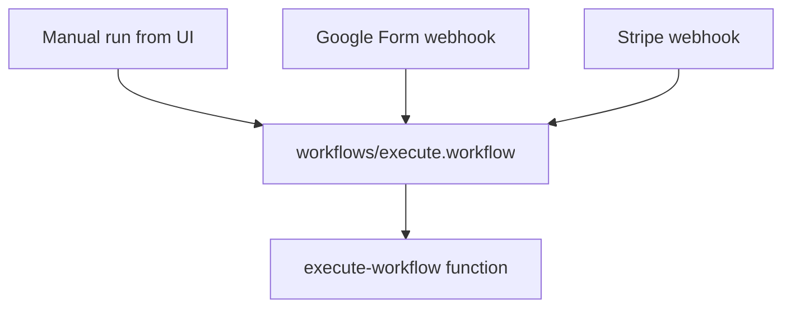

This is a clean boundary.

The engine does not need separate execution logic for every trigger source.

Trigger-specific routes only prepare the initial data.

After that, everything becomes a normal workflow execution.

For example, a Google Form trigger can initialize context like this:

```json
{
  "googleForm": {
    "formId": "...",
    "respondentEmail": "...",
    "responses": {}
  }
}
```

A Stripe trigger can initialize context like this:

```json
{
  "stripe": {
    "eventId": "...",
    "eventType": "checkout.session.completed",
    "livemode": false
  }
}
```

After that, downstream nodes consume the trigger data through the same context system.

---

## Example: A Complete Workflow Run

Imagine this workflow:

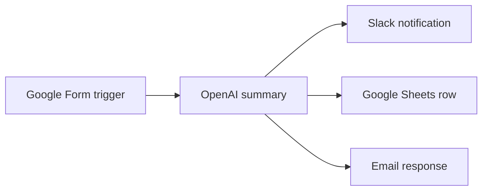

The runtime sees this as:

```txt
1. Receive Google Form payload
2. Initialize context with googleForm data
3. Run OpenAI node using the form response
4. Store generated text as aiSummary
5. Send Slack message using aiSummary.text
6. Append row to Google Sheets
7. Send email response
8. Store final context in Execution.output
```

The final context becomes a trace of what the workflow produced:

```json
{
  "googleForm": {
    "respondentEmail": "student@example.com",
    "responses": {}
  },
  "aiSummary": {
    "text": "Here is a personalized study plan..."
  },
  "slackResult": {
    "ok": true
  },
  "sheetAppend": {
    "updatedRange": "Sheet1!A2:D2"
  },
  "emailResult": {
    "messageId": "..."
  }
}
```

This output is useful for debugging, execution history, and future workflow inspection.

---

## Why This Feels Like a Distributed System

Before building a8n, I thought the hardest part would be the editor.

The editor was challenging, but the execution engine was the real system design problem.

Workflow automation has many distributed-system-style concerns:

- Work happens asynchronously.
- External APIs can fail.
- Execution state must survive beyond a request.
- Retries must not corrupt state.
- User secrets must be scoped and protected.
- The UI needs live updates from background work.
- The runtime must transform a graph into deterministic execution.

That is why a workflow builder is not just a CRUD app with a canvas.

It is closer to a small orchestration platform.

---

## What I Would Improve Next

The current architecture works well for the project, but there are clear next steps that would make it more production-grade:

1. **Parallel execution for independent branches**

   Right now, the engine executes nodes sequentially after topological sorting. A future version could detect independent branches and run them concurrently.

2. **Stronger graph validation before execution**

   The engine should validate required trigger nodes, disconnected paths, invalid handles, and unsupported node configurations before sending the run to Inngest.

3. **Execution timeline UI**

   Instead of only showing current status, the product could show a detailed timeline of node start time, end time, duration, input, output, and error.

4. **Better retry policy per node type**

   Some nodes should retry aggressively. Others should fail fast. A per-node retry strategy would make execution more precise.

5. **Versioned workflow execution**

   An execution should ideally point to the exact workflow version that ran, even if the user edits the workflow later.

6. **More structured observability**

   Logs, traces, correlation IDs, and per-node metrics would make production debugging much easier.

These improvements are less about adding more nodes and more about making the runtime stronger.

---

## Final Takeaway

The biggest lesson from building a8n was this:

> The visible product is the canvas, but the real product is the execution engine.

Dragging nodes is the easy part.

The hard part is turning a visual graph into a reliable runtime:

- Planning execution order.
- Moving data between nodes.
- Handling failures.
- Retrying safely.
- Tracking execution state.
- Streaming realtime progress.
- Protecting credentials.

That is what made a8n such a valuable final year project for me.

It started as a workflow builder.

It became an exercise in orchestration, reliability, and system design.
