# FDE Case Study 1 — AI-Native E-commerce Admin Platform

## From Dashboard Friction to Conversational Business Operations

When I joined the organization, a startup software company that builds custom web applications and e-commerce platforms for clients, nobody was asking for an AI assistant. My job was to help deliver production features.

What happened instead was that I discovered a problem nobody had named yet, validated it through daily observation, and built an AI-native operations layer that changed how entire business teams interacted with their most important internal tool.

This is the technical story of how that system was designed, built, and hardened for production — and what it taught me about building AI products that businesses can actually trust.

---

## The Business

The organization's flagship initiative was a Shopify-like multi-tenant e-commerce platform. The architecture allowed multiple client stores to operate from a shared platform while each business managed its own operations independently.

Two of the primary clients were **Client A**, a sports equipment retailer specializing in specialty goods, and **Client B**, a home appliances business. Both generated the majority of their revenue through online orders.

The admin dashboard was not just internal software. It was the operational backbone of these businesses.

Every day, different employees — administrators, product managers, order managers, inventory managers, and shop managers — spent hours inside this dashboard handling business operations:

- Managing product catalogs across categories.
- Processing orders from the website and external marketplaces.
- Creating shipments and generating shipping labels.
- Updating inventory across multiple warehouses.
- Writing SEO metadata for product pages.
- Managing pricing, discounts, and promotions.
- Handling customer accounts and support.
- Reviewing sales reports and analytics.

Client A alone processed roughly 100 website orders and more than 200 marketplace orders daily. Every click, every delay, and every repetitive task directly affected how efficiently these businesses could operate.

```mermaid
flowchart LR
    subgraph Tenants["Multi-Tenant Platform"]
        T1["Client A\n(Sports Equipment)"]
        T2["Client B\n(Home Appliances)"]
        T3["Future Tenants"]
    end

    subgraph Users["Daily Users"]
        Admin["Administrator"]
        PM["Product Manager"]
        OM["Order Manager"]
        IM["Inventory Manager"]
        SM["Shop Manager"]
    end

    subgraph Operations["Daily Operations"]
        Products["Product Management"]
        Orders["Order Processing"]
        Shipments["Shipment Creation"]
        Inventory["Inventory Updates"]
        SEO["SEO Management"]
        Pricing["Pricing & Discounts"]
        Customers["Customer Management"]
        Reports["Reports & Analytics"]
    end

    Users --> Tenants
    Tenants --> Operations
```

---

## Discovering the Problem

After working on the platform for a while, I became very familiar with how different teams used the admin dashboard. Because I was responsible for building features across multiple modules, I was not limited to one part of the system — I understood the complete operational workflow.

Over time, I started noticing a pattern. Employees were not struggling because the software lacked features. The platform already handled products, orders, shipments, inventory, SEO, pricing, and customers. The real issue was **how** they had to perform those tasks.

Most business operations followed the same sequence every day. Users would open one module, search for data, copy information, move to another screen, fill forms, switch tabs, sometimes open ChatGPT to generate product descriptions or SEO content, copy the response back into the dashboard, and then continue the process.

I observed five recurring patterns:

### Pattern 1 — Repetitive Identical Workflows

The same workflow, every single day. Different orders. Same process. For shipment creation alone, employees repeated nearly identical steps hundreds of times daily.

### Pattern 2 — Constant Context Switching


Employees continuously bounced between the dashboard, ChatGPT, Google, shipping portals, and back again. Each switch cost attention and time.

### Pattern 3 — Business Knowledge vs Software Navigation

People understood the business deeply. They did not always remember where every button was located. The software was becoming a barrier between business knowledge and business action.

### Pattern 4 — Growing UI Complexity

As more features were added, the dashboard became harder to use. Classic SaaS problem — each new feature helped users do more but made the interface harder to navigate.

### Pattern 5 — Deterministic Business Operations

Most operations were deterministic and followed predictable sequences:

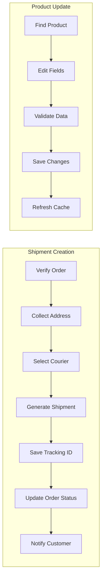

The inputs changed. The business logic did not. That made them perfect candidates for AI automation.

The turning point was realizing that employees were not paid to operate the dashboard. They were paid to run the business. The dashboard was only a tool. If AI could understand business intent and safely execute those repetitive workflows, employees could focus on decisions instead of navigation.

No client asked for this feature. There was no ticket in the backlog. But because I had built much of the platform myself and understood both the backend and frontend architecture, I knew it was technically feasible. More importantly, I believed solving this problem would create much more value than adding another isolated feature.

---

## Validating the Hypothesis

My hypothesis was not that people wanted to use AI. My hypothesis was that if employees could describe their task in natural language instead of navigating multiple screens, they could complete repetitive operations faster while keeping the same business rules and security.

Three signals gave me confidence:

**High Frequency** — Shipment creation, product updates, SEO updates, and price changes happened continuously. They were not weekly tasks.

**Predictable Workflow** — Every task followed nearly the same process. The inputs changed, but the business logic did not. That makes automation practical.

**Existing Backend** — The platform already had backend APIs for these operations. The challenge was not implementing business logic — it was creating a better interface that could orchestrate those existing capabilities.

Before investing engineering time, I needed to verify one more thing: could this be built quickly enough to test the idea? Because the backend APIs already existed and the business workflows were already well-defined, I estimated an MVP could be delivered within a week.

---

## Why MCP

I considered multiple approaches before choosing MCP.

One option was to improve the existing UI — reducing clicks, introducing shortcuts, adding bulk actions. That would improve usability, but users would still need to learn the dashboard, remember where features lived, and navigate across multiple modules.

Another option was to build a traditional chatbot connected to an LLM. However, that would mostly answer questions. It could not safely perform real business operations like updating products, creating shipments, modifying prices, or managing inventory.

The more I analyzed the problem, the more I realized that the backend already had the business capabilities needed. The missing piece was not functionality — it was an intelligent execution layer that could understand user intent and orchestrate existing operations safely.

MCP gave me a structured way to expose the platform's capabilities to an AI system. Instead of asking the model to understand internal APIs or interact with the UI, I could expose business operations as well-defined tools, resources, and prompts. That created a clear contract between the AI and the application.

> **"I was not trying to make the dashboard AI-powered. I was trying to make the business operations AI-native."**

The core idea:

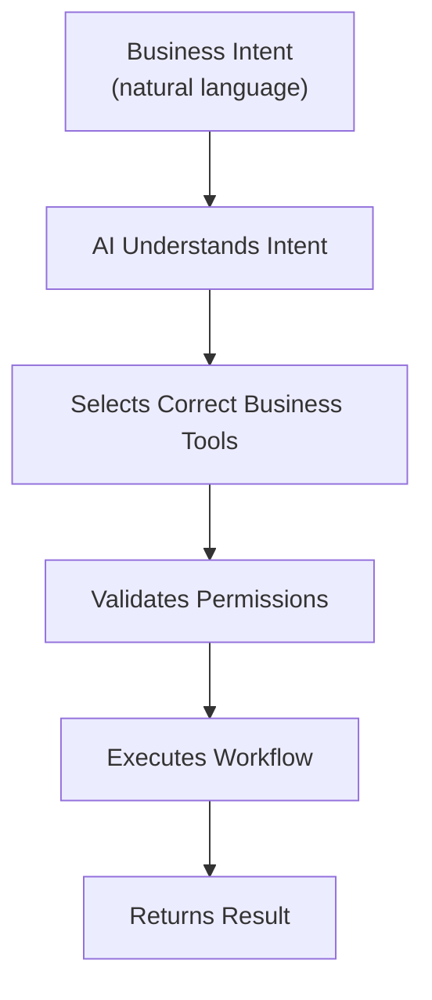

The user thinks about **business**, not **software**.

---

## High-Level System Architecture

The platform was built as a three-tier system with an MCP layer bridging AI clients to the existing business backend.

The main components:

- **Next.js Storefront** for the customer-facing e-commerce experience.
- **React Admin Dashboard** for internal business operations.
- **Express.js Backend** as the central API layer.
- **PostgreSQL** for relational persistence.
- **Redis** for caching, session management, and pub/sub.
- **BullMQ** for durable background job processing.
- **MCP Server** (via `@modelcontextprotocol/sdk`) for AI-native tool execution.
- **Zod** for runtime schema validation across tools and APIs.

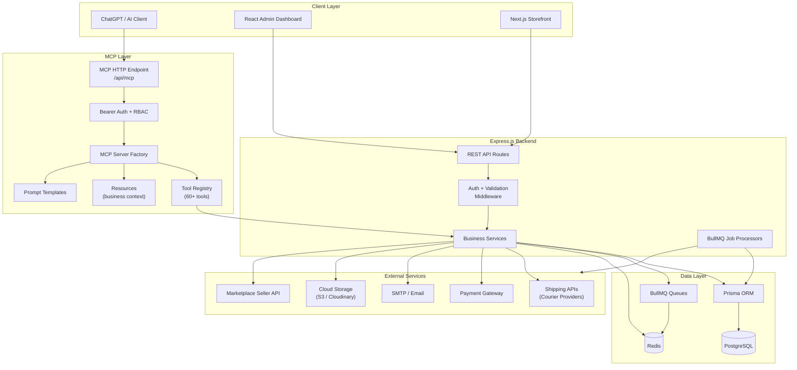

The most important architectural decision was that the MCP layer did not bypass the existing backend. It consumed the same services and enforced the same business rules as the admin dashboard. AI actions went through the identical authorization, validation, and execution paths that human-initiated actions did.

---

## Platform Architecture

The platform served three distinct interfaces from a shared backend:

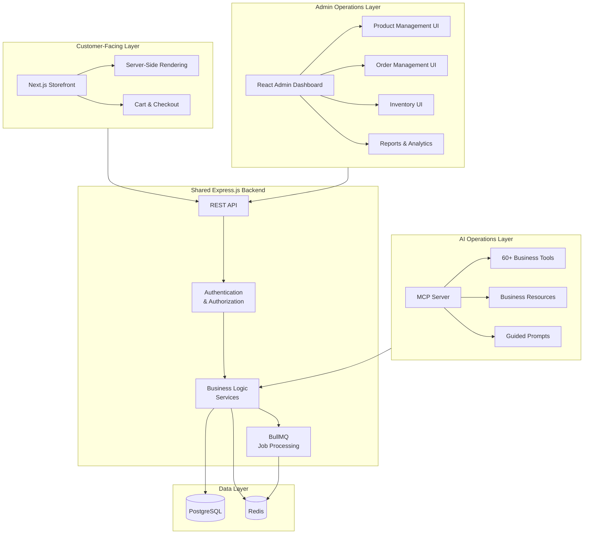

This separation matters because each interface has different concerns:

- The **storefront** cares about performance, SEO, and customer experience.
- The **admin dashboard** cares about complete operational control and visibility.
- The **MCP layer** cares about safe, structured access to business operations for AI clients.

All three consume the same business services. That means a product update made through ChatGPT follows the same validation rules as one made through the admin dashboard.

---

## Data Model

The platform stores multi-tenant e-commerce data in PostgreSQL via Prisma. The core entities and their relationships:

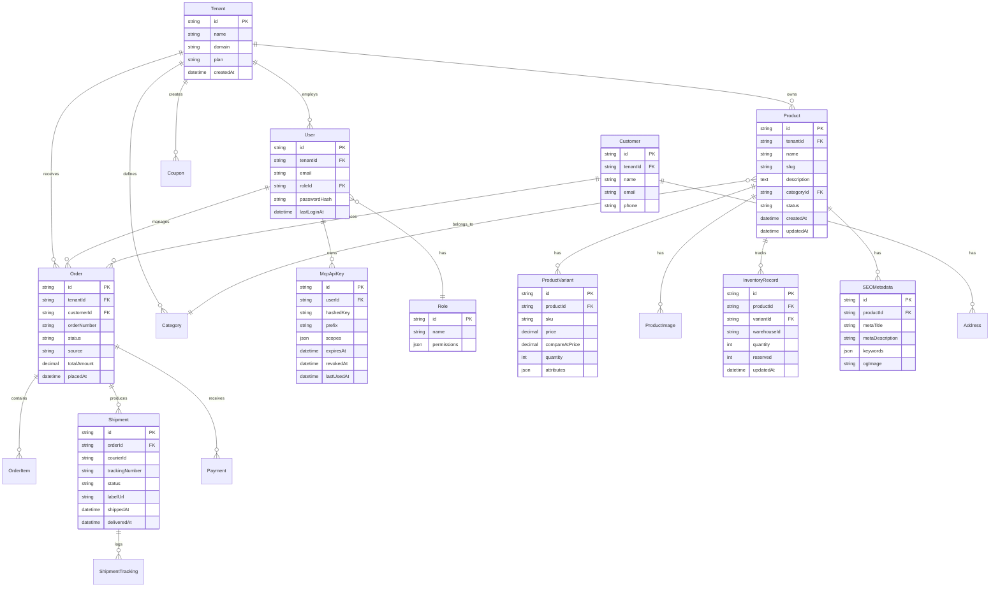

This data model keeps tenant isolation at every level. Every query filters by `tenantId` — the same constraint enforced whether the request originates from the admin dashboard or from an MCP tool invoked through ChatGPT.

---

## MCP Server Architecture

The MCP server was built using `@modelcontextprotocol/sdk` and integrated with the existing Express backend. The server follows a stateless, per-request model — a new server instance is created for each incoming HTTP request.

### Module Structure

```
src/mcp/
├── index.ts                    # createMcpServer() factory
├── config.ts                   # Server name, rate limits, env flags
├── auth/
│   ├── api-key.service.ts      # Generate, hash, validate, revoke keys
│   ├── bearer-auth.middleware.ts
│   ├── scopes.ts               # Permission definitions (reused from Express)
│   └── types.ts                # McpAuthInfo, AuthResult
├── middleware/
│   ├── scope-guard.ts          # requireScope() — same scopes as Express APIs
│   ├── rate-limiter.ts         # Redis-backed sliding window
│   ├── audit-logger.ts         # Structured audit + metrics
│   └── error-boundary.ts       # withErrorBoundary()
├── shared/
│   ├── sanitize.ts             # Output redaction, mcpJsonResponse
│   ├── pagination.ts           # Cursor-based pagination helpers
│   └── validation.ts           # Zod schema helpers
├── tools/
│   ├── _registry.ts            # registerAllTools()
│   ├── products/               # 12 tools
│   ├── orders/                 # 9 tools
│   ├── shipments/              # 7 tools
│   ├── inventory/              # 6 tools
│   ├── seo/                    # 5 tools
│   ├── pricing/                # 5 tools
│   ├── customers/              # 6 tools
│   ├── reports/                # 5 tools
│   ├── categories/             # 4 tools
│   ├── coupons/                # 3 tools
│   └── system/                 # 4 tools
├── resources/
│   ├── _registry.ts            # Business context resources
│   └── *.resource.ts
└── prompts/
    ├── _registry.ts            # Guided workflow prompts
    └── *.prompt.ts
```

### Module Map

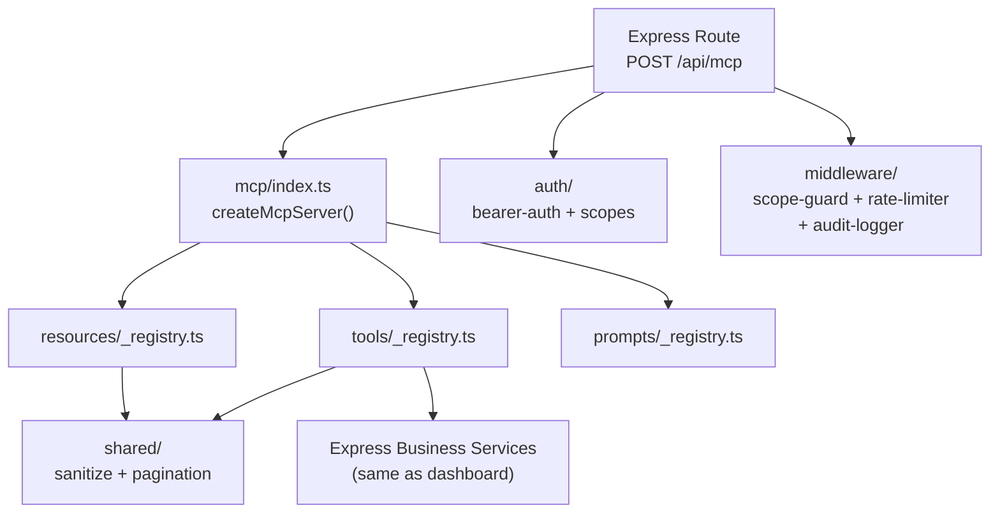

### Server Factory

`createMcpServer()` is the central assembly point:

1. Instantiate `McpServer` with name and version.
2. Call `registerAllTools(server)` — registers all 60+ tools.
3. Call `registerAllResources(server)` — registers business context.
4. Call `registerAllPrompts(server)` — registers guided workflows.
5. Return the configured server (not yet connected to transport).

A **new instance is created per HTTP request** — the server is stateless.

---

## Tool Design — 60+ Business Capability Tools

I designed tools around **business capabilities** rather than backend endpoints.

Instead of thinking:

```text
POST /api/products/:id
```

I thought:

```text
Update Product Details
```

Instead of:

```text
POST /api/shipments/create
```

I thought:

```text
Create Shipment for Order
```

This distinction matters because the AI model operates at the business intent level, not the API endpoint level.

### Tool Registry

```typescript
export function registerAllTools(server: McpServer): void {
  registerProductTools(server);      // 12 tools
  registerOrderTools(server);        // 9 tools
  registerShipmentTools(server);     // 7 tools
  registerInventoryTools(server);    // 6 tools
  registerSEOTools(server);          // 5 tools
  registerPricingTools(server);      // 5 tools
  registerCustomerTools(server);     // 6 tools
  registerReportTools(server);       // 5 tools
  registerCategoryTools(server);     // 4 tools
  registerCouponTools(server);       // 3 tools
  registerSystemTools(server);       // 4 tools
}
```

### Tool Catalog by Business Domain

| Domain | Tools | Example Operations |
|---|---|---|
| **Products** (12) | `list_products`, `get_product`, `create_product`, `update_product`, `delete_product`, `bulk_update_products`, `update_product_images`, `get_product_variants`, `create_variant`, `update_variant`, `delete_variant`, `search_products` | Full product lifecycle management |
| **Orders** (9) | `list_orders`, `get_order`, `update_order_status`, `cancel_order`, `get_order_timeline`, `list_orders_by_status`, `get_order_summary`, `bulk_update_orders`, `search_orders` | Order processing and tracking |
| **Shipments** (7) | `create_shipment`, `get_shipment`, `list_shipments`, `cancel_shipment`, `generate_shipping_label`, `get_tracking_info`, `bulk_create_shipments` | End-to-end shipment management |
| **Inventory** (6) | `get_inventory`, `update_stock`, `bulk_update_inventory`, `get_low_stock_alerts`, `transfer_inventory`, `get_inventory_history` | Stock management across warehouses |
| **SEO** (5) | `get_seo_metadata`, `update_seo_metadata`, `generate_seo_content`, `bulk_update_seo`, `get_seo_suggestions` | AI-powered SEO management |
| **Pricing** (5) | `get_pricing`, `update_pricing`, `bulk_update_prices`, `get_competitor_pricing`, `create_price_rule` | Price management and analysis |
| **Customers** (6) | `list_customers`, `get_customer`, `get_customer_orders`, `update_customer`, `search_customers`, `get_customer_analytics` | Customer data and insights |
| **Reports** (5) | `get_sales_report`, `get_inventory_report`, `get_order_analytics`, `get_revenue_summary`, `get_product_performance` | Business intelligence |
| **Categories** (4) | `list_categories`, `create_category`, `update_category`, `delete_category` | Catalog organization |
| **Coupons** (3) | `list_coupons`, `create_coupon`, `deactivate_coupon` | Promotional management |
| **System** (4) | `whoami`, `server_info`, `health_check`, `list_available_tools` | System diagnostics |

### Tool Handler Pattern

Every tool follows the same structure:

```typescript
server.tool("create_shipment", "Create a shipment for an order", inputSchema, async (args, extra) => {
  const auth = (extra as any).authInfo as McpAuthInfo;
  requireScope(auth, "shipments:write");   // Same scope as Express API

  const audit = createAuditContext({
    tool: "create_shipment",
    userId: auth.userId,
    tenantId: auth.tenantId,
  });

  return withErrorBoundary("create_shipment", async () => {
    // Calls the SAME business service as the admin dashboard
    const shipment = await shipmentService.create({
      orderId: args.orderId,
      courierId: args.courierId,
      tenantId: auth.tenantId,
    });

    audit.success();
    return mcpJsonResponse(shipment);
  });
});
```

The handler pattern visualized:

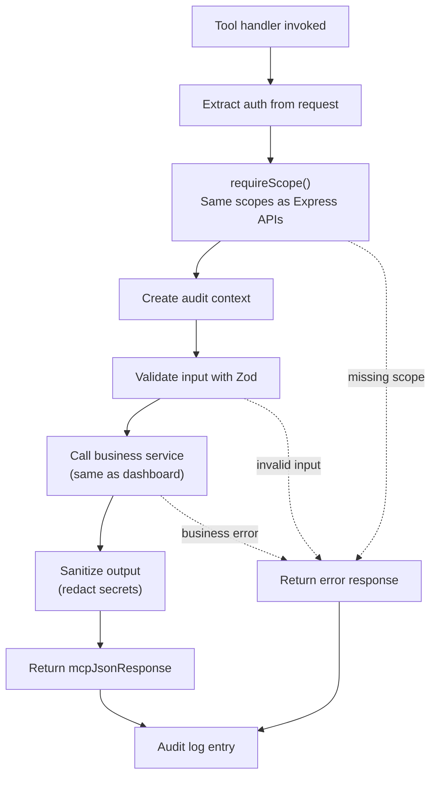

Cross-cutting concerns — authentication, scope enforcement, audit logging, error handling — are explicit function calls in every handler, not implicit middleware. This makes the flow visible and debuggable.

---

## Request Lifecycle

Every request from an AI client follows a controlled path through authentication, authorization, tool execution, and response sanitization.

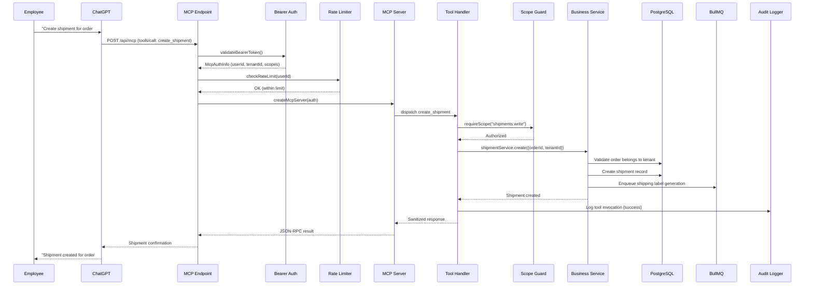

This lifecycle ensures:

1. Every request is authenticated before processing.
2. Rate limits protect the system from abuse.
3. Scope guards enforce that the user's API key has the required permissions.
4. Business services apply tenant isolation — the same isolation used by the admin dashboard.
5. Background jobs handle async operations without blocking the response.
6. Every tool invocation is audited with sanitized inputs.

---

## Security and RBAC

One of the most important design principles was:

> **AI should never bypass existing business permissions.**

The MCP layer reused the same role-based access control system that was built into the Express APIs. This was not a separate permission system — it was the same scopes, the same authorization logic, and the same tenant isolation.

### Authentication Flow

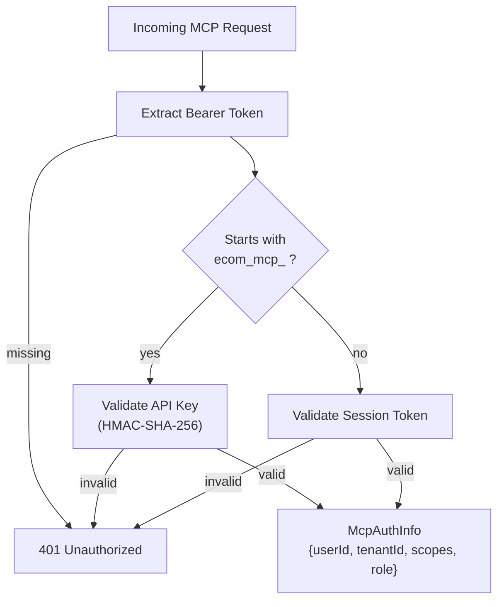

### Scope Model

The same scopes enforced by Express API middleware are enforced by MCP tool handlers:

| Scope | Grants |
|---|---|
| `products:read` | List, search, get products and variants |
| `products:write` | Create, update, delete products and variants |
| `orders:read` | List, get, search orders |
| `orders:write` | Update order status, cancel orders |
| `shipments:read` | List, get shipments and tracking |
| `shipments:write` | Create, cancel shipments, generate labels |
| `inventory:read` | Get stock levels, low stock alerts |
| `inventory:write` | Update stock, transfer inventory |
| `seo:read` | Get SEO metadata |
| `seo:write` | Update and generate SEO content |
| `pricing:read` | Get pricing information |
| `pricing:write` | Update prices, create price rules |
| `customers:read` | List, search, get customers |
| `reports:read` | Access all reporting tools |
| `system:read` | whoami, health check, server info |

### Role-to-Scope Mapping

Different employee roles received different tool access through the same permission system:

| Role | Available Tool Groups | Scopes |
|---|---|---|
| **Admin** | All tools | `*` |
| **Product Manager** | Products, SEO, Categories, Pricing | `products:*`, `seo:*`, `categories:*`, `pricing:*` |
| **Order Manager** | Orders, Shipments, Customers | `orders:*`, `shipments:*`, `customers:read` |
| **Inventory Manager** | Inventory, Products (read) | `inventory:*`, `products:read` |
| **Shop Manager** | Orders (read), Reports, Customers | `orders:read`, `reports:read`, `customers:read` |

If an employee could not perform an action through the dashboard, the AI could not perform it either.

### Defense-in-Depth

Security was not a single gate. It was layered:

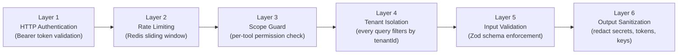

| Layer | Mechanism | What It Prevents |
|---|---|---|
| 1 — Authentication | Bearer token validation | Unauthenticated access |
| 2 — Rate Limiting | Redis-backed sliding window per user | Abuse and excessive consumption |
| 3 — Scope Guard | `requireScope()` on every tool | Unauthorized operations |
| 4 — Tenant Isolation | `WHERE tenantId = ?` on every query | Cross-tenant data access |
| 5 — Input Validation | Zod schemas on every tool input | Malformed or malicious parameters |
| 6 — Output Sanitization | Redact passwords, tokens, secrets | Secret leakage in AI responses |

---

## Guardrails

Not every operation should execute immediately when the AI requests it. Some actions carry higher business risk.

I classified tools into three risk tiers:

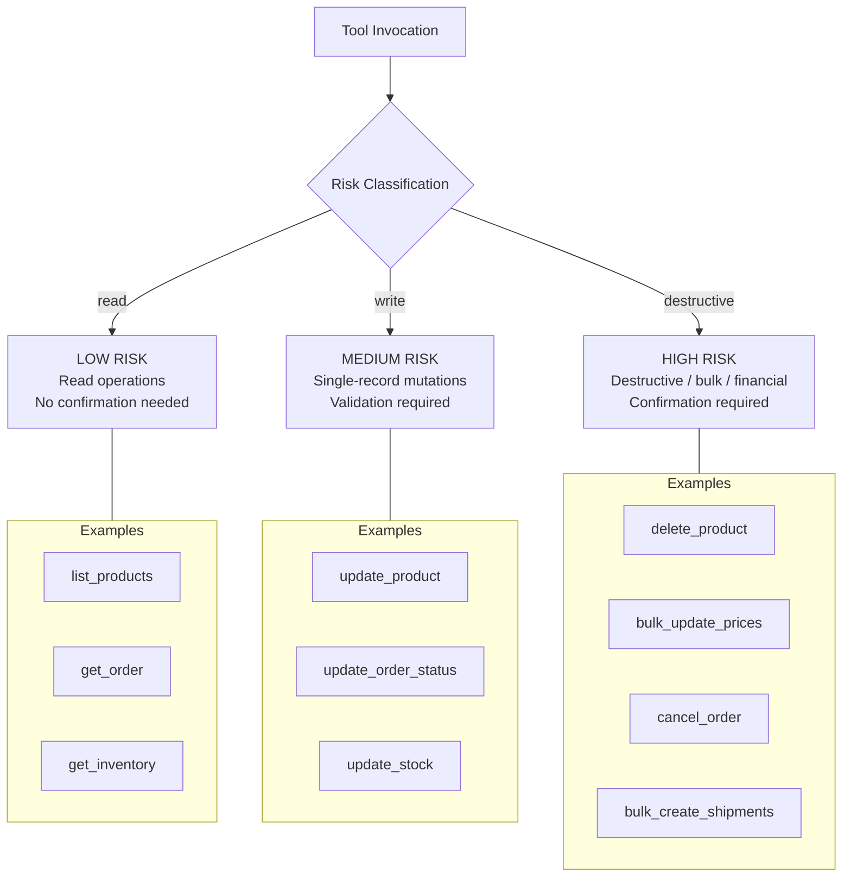

For high-risk operations, the tool handler required explicit confirmation:

```typescript
// High-risk tool: requires confirmation hash
server.tool("delete_product", "Permanently delete a product", schema, async (args, extra) => {
  requireScope(auth, "products:write");

  if (!args.confirmed || !args.confirmationHash) {
    return mcpJsonResponse({
      status: "confirmation_required",
      message: "This will permanently delete the product and all variants. Confirm?",
      confirmationHash: generateConfirmationHash(args.productId),
    });
  }

  // Validate hash before proceeding
  validateConfirmationHash(args.confirmationHash, args.productId);
  // ... execute deletion
});
```

This ensured the AI did not perform destructive operations without explicit user acknowledgment — even when the model had the technical permissions to do so.

---

## Background Processing with BullMQ

The platform used BullMQ with Redis for durable background job processing. This was the parallel of a8n's Inngest-based durable execution — different technology, same architectural principle: **separate the request from the execution**.

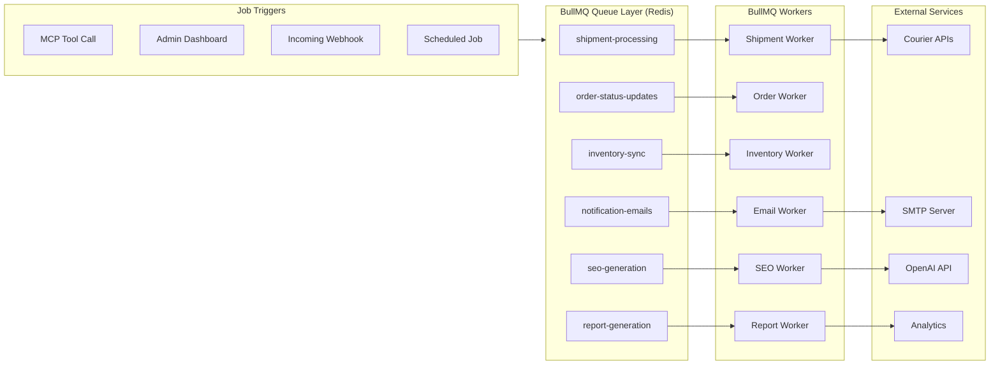

When a user asked ChatGPT to "create shipments for all pending orders," the MCP tool did not block the response waiting for every shipment to complete. Instead:

1. The tool validated permissions and order data.
2. It enqueued individual shipment creation jobs to BullMQ.
3. It returned an immediate response with job status.
4. BullMQ workers processed shipments in the background.
5. The user could check progress using `get_shipment` or `list_shipments`.

This pattern made bulk operations safe and responsive:

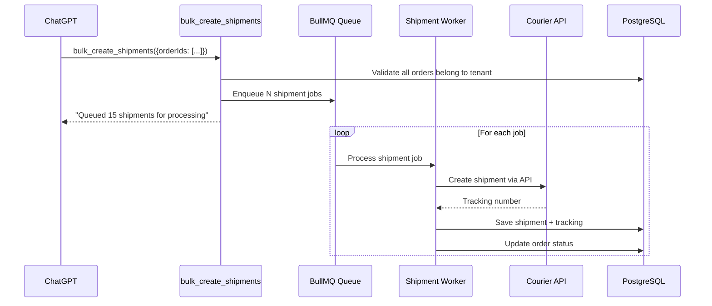

BullMQ provided the same durability guarantees that Inngest provided in a8n:

| Concern | BullMQ Solution |
|---|---|
| Job persistence | Redis persistence with configurable AOF/RDB |
| Automatic retries | Configurable retry strategy per queue |
| Failure isolation | Failed jobs do not block the queue |
| Concurrency control | Per-worker concurrency limits |
| Rate limiting | Built-in rate limiter per queue |
| Job scheduling | Delayed jobs and cron-based repeatable jobs |
| Observability | Job lifecycle events and progress tracking |

---

## Prompt Engineering and Versioning

I standardized common business workflows into reusable prompts so the AI behaved consistently across different users and tasks.

### Prompt Design Philosophy

Prompts were designed around **business workflows**, not AI capabilities:

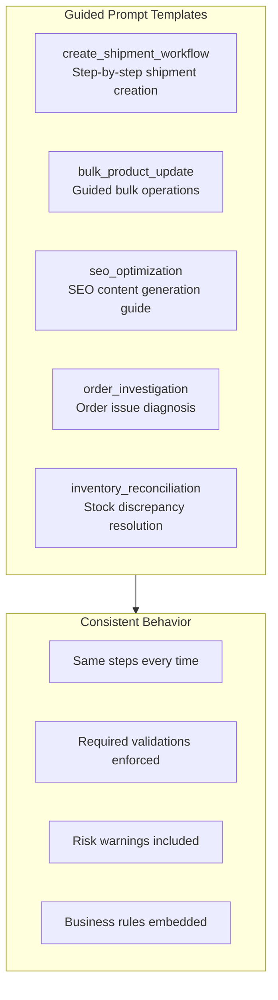

### Prompt Versioning

As prompts evolved, changes needed to be tracked, tested, and rollable:

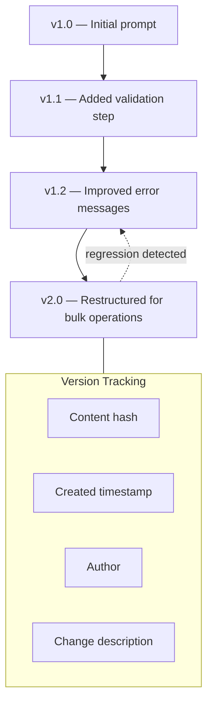

Each prompt version was stored with a content hash, allowing automatic detection of prompt drift and regression testing against previous versions.

---

## Evaluation Framework

As the number of tools grew to 60+, manual testing became insufficient. I needed a repeatable way to verify that important workflows continued working as prompts, tools, and models evolved.

### Eval Architecture

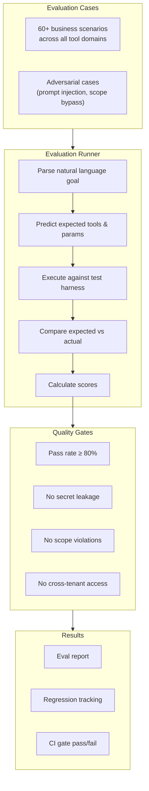

### Eval Case Shape

Each evaluation case contained:

```typescript
interface EvalCase {
  id: string;                      // Stable identifier for regression tracking
  domain: string;                  // products, orders, shipments, etc.
  persona: string;                 // product_manager, order_manager, admin
  goal: string;                    // Natural language business request
  expected: {
    tools: string[];               // Expected tool calls
    scopes: string[];              // Required scopes
    validations: string[];         // Business rules that must be enforced
    sideEffects: string[];         // External operations triggered
    mustNotCall: string[];         // Tools that should NOT be called
  };
}
```

Example cases:

| Domain | Goal | Expected Tools |
|---|---|---|
| Shipments | "Create shipment for order #12345" | `get_order`, `create_shipment` |
| SEO | "Generate SEO metadata for all products in the Sports category" | `list_products`, `generate_seo_content`, `bulk_update_seo` |
| Pricing | "Compare our top-selling product prices with competitors" | `search_products`, `get_pricing`, `get_competitor_pricing` |
| Inventory | "Show me all products with less than 10 items in stock" | `get_low_stock_alerts` |
| Reports | "Give me this week's sales summary" | `get_sales_report`, `get_revenue_summary` |

### CI Integration

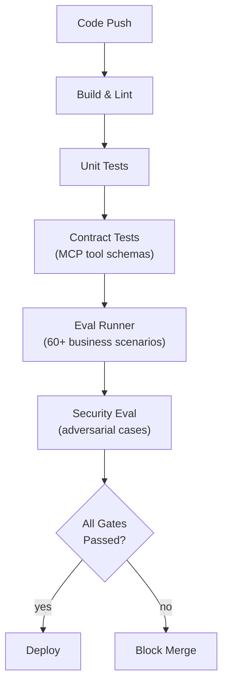

Changes to prompts, tools, or orchestration were checked automatically before deployment. This meant AI behavior was treated like software — tested, versioned, and gated before production.

---

## Observability and Logging

If something failed, I needed visibility into which tool executed, what parameters were passed, where validation failed, and whether the issue originated from the model or the application.

### Audit Logging Pipeline

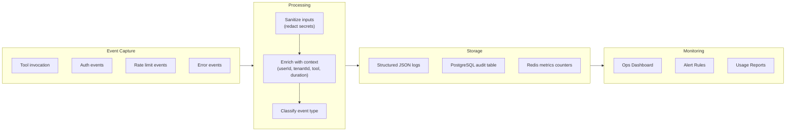

Every MCP tool invocation generated a structured audit entry:

```typescript
{
  timestamp: "2025-07-14T01:30:00Z",
  tool: "create_shipment",
  userId: "user_abc123",
  tenantId: "tenant_client_a",
  authMethod: "api_key",
  duration: 342,            // ms
  status: "success",
  input: {                  // sanitized — no secrets
    orderId: "order_12345",
    courierId: "courier_provider"
  },
  scopes: ["shipments:write", "orders:read"],
  rateLimit: {
    remaining: 28,
    limit: 30
  }
}
```

Sensitive values — passwords, API keys, tokens, private keys — were redacted at the logging layer before storage, using the same sanitization patterns used in a8n's MCP implementation.

---

## Shipping the MVP

Rather than spending weeks designing a perfect system, I focused on validating the concept quickly.

I asked myself one question:

> **"What is the smallest version of this idea that can prove whether we are solving the right problem?"**

Instead of exposing every capability of the admin dashboard, I focused only on the workflows that were repetitive, high-frequency, and already backed by stable business logic:

- Shipment creation (highest frequency — hundreds daily).
- Product management (frequent updates, descriptions, variants).
- SEO content generation (repetitive, time-consuming).
- Pricing updates (regular adjustments).
- Basic order inquiries (status checks, summaries).

Since the backend APIs already existed, I did not spend time rewriting business logic. I focused on exposing those capabilities safely through the MCP layer. From identifying the opportunity to delivering a working MVP, it took approximately one week.

That speed was not because I rushed development. It was possible because I already understood the platform architecture, the business workflows, and the existing backend services.

This project was not driven by a formal client requirement. There was no specification document or a ticket asking for an AI assistant. I identified the opportunity myself, scoped the MVP, implemented it, and demonstrated it internally.

Imagine an employee typed:

> "Create shipment for order #12345"

The system understood the request, found the order, validated permissions, called the shipment API, created the shipment, and returned confirmation. No dashboard navigation. No multiple screens. No manual search.

---

## Learning From Usage

Once the MVP was ready, my goal shifted from "Can we build this?" to "Can people actually rely on this in their daily work?"

Instead of immediately adding more AI features, I started observing how the system behaved and asked different questions:

- Where does the AI choose the wrong tool?
- Which tasks produce inconsistent results?
- Which operations require additional validation?
- Where could users accidentally trigger destructive actions?
- How do we make this safe enough for production use?

One of my biggest realizations was that building AI was actually the easier part. The difficult part was making it behave consistently inside a real business application where every action has consequences.

New questions emerged naturally:

- What if the user has permission to edit products but not pricing?
- What if the prompt changes and an existing workflow breaks?
- What if someone asks to delete 500 products?
- What if the model changes next month and tool selection degrades?

Those learnings fundamentally changed the direction of the project. Instead of asking "What else can AI do?", I started asking "What engineering capabilities are required for AI to be trusted in production?"

I deliberately slowed down feature expansion because reliability became more important than capability. Every new tool increased the responsibility of the system, so I wanted confidence that the existing workflows remained dependable before expanding further.

---

## Business Impact

The biggest outcome was not that we added AI to the platform. The biggest outcome was that we changed how employees interacted with it.

### Impact 1 — Reduced Operational Friction

Many repetitive workflows that previously required navigating multiple screens could now begin from a single conversational request. Employees spent less time operating the software and more time completing business tasks.

### Impact 2 — Simplified Onboarding

New employees did not have to memorize where every feature was located before becoming productive. They could interact with the system using the language of the business rather than the language of the software.

### Impact 3 — Enabled New AI-Powered Workflows

The conversational interface encouraged workflows that were not practical before:

- Generating SEO metadata for entire product categories in one request.
- Creating product descriptions using AI-generated content.
- Comparing product pricing with competitors using web-enabled tools.
- Getting natural-language sales reports without navigating the analytics module.

### Impact 4 — Technical Leverage

Because the solution reused the existing backend architecture, we did not duplicate business logic. That made the system easier to maintain and allowed new AI workflows to be added incrementally as the platform evolved.

### Impact 5 — Platform Thinking

What started as a solution for a single workflow gradually became an AI capability that could support many different business operations. Instead of building isolated AI features, we had created a foundation that could continue expanding as new customer needs emerged.

---

## Reflection and Lessons Learned

### Lesson 1 — AI Is Only One Component

One of the biggest learnings was that AI is only a small part of the overall system. Most of the engineering effort went into authorization, validation, testing, observability, error handling, and designing reliable workflows.

### Lesson 2 — Understand the Business First

Understanding the business domain was often more valuable than understanding another AI framework. Once I understood how the company actually operated, the technical solution became much clearer.

### Lesson 3 — Build Small, Learn Fast

This project reinforced the importance of shipping a focused MVP instead of trying to build the perfect system. The MVP gave real feedback much earlier than a larger implementation would have.

### Lesson 4 — AI Engineering Is Software Engineering

Initially I thought prompt engineering would be the most important part. Over time I realized production AI systems need the same engineering discipline as any other software — testing, versioning, monitoring, security, and maintainability.

### Lesson 5 — The Hardest Problem Is Trust

Balancing flexibility with safety was more challenging than integrating the LLM itself. Users should feel like they are having a natural conversation, but every action still needs deterministic validation, authorization, and error handling.

---

## What I Would Build Differently Today

The overall architecture would remain similar because separating business logic from the AI interaction layer proved to be the right decision. However, I would invest earlier in three areas:

1. **Observability from day one** — Capture usage analytics, tool selection patterns, and error rates from the first deployment.

2. **Evaluations as a first-class system** — Treat evals as infrastructure, not afterthoughts. Build the eval harness before building the second tool.

3. **Prompt lifecycle management** — Version, test, and gate prompts with the same rigor applied to application code.

---

## The Complete FDE Progression

```mermaid
flowchart TB
    S1["Business Context\nUnderstand the company,\nusers, and revenue model"]
    S2["Problem Discovery\nObserve workflow friction,\nidentify patterns"]
    S3["Problem Validation\nConfirm frequency, impact,\nand feasibility"]
    S4["Solution Design\nChoose MCP, design tools\naround business capabilities"]
    S5["MVP Delivery\nShip highest-value workflows\nin one week"]
    S6["Learning & Iteration\nObserve failures, identify\nreliability gaps"]
    S7["Production Hardening\nRBAC, guardrails, evals,\nCI, observability"]
    S8["Business Impact\nReduced friction, new\nworkflows, platform thinking"]
    S9["Reflection\nLessons learned,\nwhat to improve"]

    S1 --> S2
    S2 --> S3
    S3 --> S4
    S4 --> S5
    S5 --> S6
    S6 --> S7
    S7 --> S8
    S8 --> S9
```

This progression mirrors how experienced Forward Deployed Engineers think: start with the business, discover the real problem, build quickly, learn from usage, and continuously improve.

The project started as an observation about dashboard friction. It became an exercise in AI system design, production engineering, and building technology that businesses can trust.

---

## Technology Summary

| Component | Technology | Purpose |
|---|---|---|
| Backend API | Node.js + Express | Central business logic and API layer |
| Storefront | Next.js | Customer-facing e-commerce experience |
| Admin Dashboard | React | Internal operations management |
| Database | PostgreSQL + Prisma | Relational persistence with ORM |
| Cache & Pub/Sub | Redis | Session management, caching, real-time events |
| Job Processing | BullMQ | Durable background task execution |
| MCP Server | `@modelcontextprotocol/sdk` | AI-native tool execution interface |
| Schema Validation | Zod | Runtime input/output validation |
| Language | TypeScript | End-to-end type safety |
| Auth | JWT + API Keys | Session and programmatic authentication |
| Audit | Structured JSON + PostgreSQL | Compliance and debugging |

---

<div align="center">
  <sub>FDE Case Study 1 — AI-Native E-commerce Admin Platform</sub>
</div>
