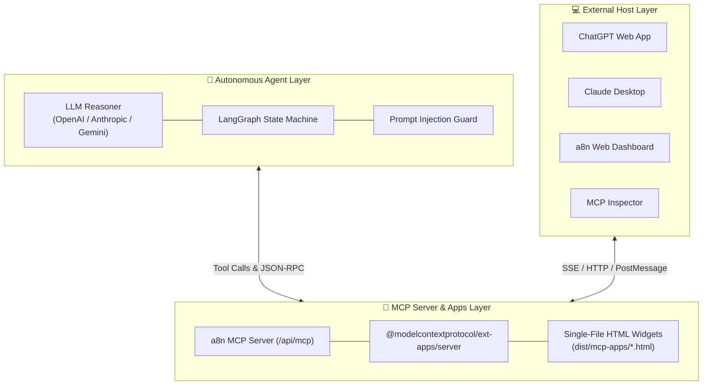
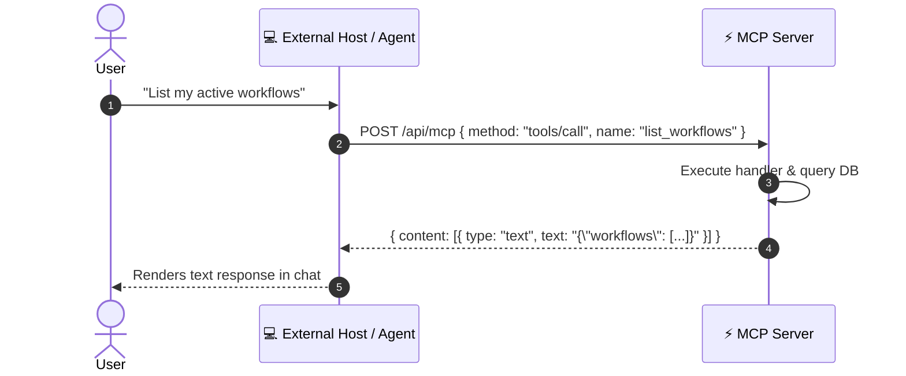
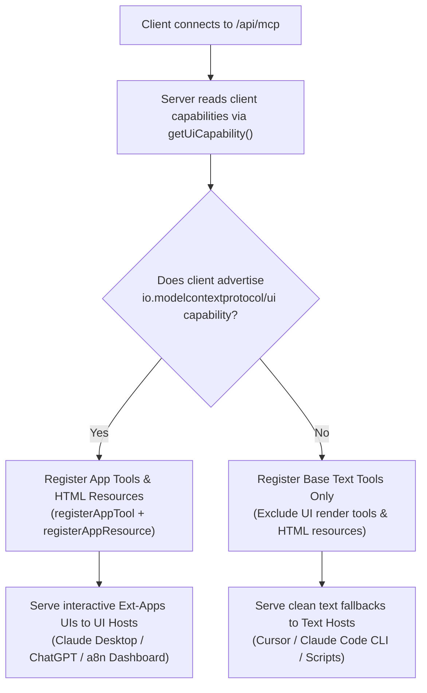

# Autonomous Agent, External Clients & Standardized MCP Apps Architecture

> **Document Version**: 1.0.0  
> **Target Audience**: Core Engineers, System Architects, MCP Tool Developers, Integration Engineers  
> **Scope**: End-to-End Architectural Deep-Dive on Agent Orchestration, External Host Clients, MCP Server Protocol, `@modelcontextprotocol/ext-apps` Integration, and Sandboxed UI Rendering in a8n.

---

## 📑 Table of Contents

1. [Executive Summary & Ecosystem Overview](#1-executive-summary--ecosystem-overview)
2. [Level 1: Simple Flow — Standard Text-Only MCP Tool Call](#2-level-1-simple-flow--standard-text-only-mcp-tool-call)
3. [Level 2: Intermediate Flow — Capability Negotiation & Graceful Degradation](#3-level-2-intermediate-flow--capability-negotiation--graceful-degradation)
4. [Level 3: Advanced Flow — `@modelcontextprotocol/ext-apps` Architecture](#4-level-3-advanced-flow--modelcontextprotocolext-apps-architecture)
5. [Level 4: Master Flow — Autonomous Agent + Host Client + MCP App End-to-End Lifecycle](#5-level-4-master-flow--autonomous-agent--host-client--mcp-app-end-to-end-lifecycle)
6. [How a8n Implements & Leverages This Flow](#6-how-a8n-implements--leverages-this-flow)
   - [a8n 4-Widget Interactive Suite](#a8n-4-widget-interactive-suite)
   - [Ext-Apps Server & Client SDK Setup](#ext-apps-server--client-sdk-setup)
   - [Single-File Vite Bundling Pipeline](#single-file-vite-bundling-pipeline)
   - [Multi-Profile Engine (Default, ChatGPT, Embedded Agent)](#multi-profile-engine-default-chatgpt-embedded-agent)
7. [Security, Safety & Isolation Boundary](#7-security-safety--isolation-boundary)

---

## 1. Executive Summary & Ecosystem Overview

Modern AI orchestration requires connecting three distinct operational layers:
1. **Autonomous AI Agents**: Reasoners (e.g., LangGraph state graphs, LLMs) that break user intent down into tool invocations.
2. **External Host Clients**: Interactive frontends (e.g., ChatGPT, Claude Desktop, a8n Web Dashboard, MCP Inspector) where users interact with AI.
3. **MCP Servers & MCP Apps**: Standardized tool endpoints providing domain functions and rich, interactive micro-frontend widgets via `@modelcontextprotocol/ext-apps`.

### The Problem with Text-Only Tools
Traditional MCP tools return plain text or JSON. For complex workflows (such as visual DAG graphs, credential setup checklists, execution timelines, or confirmation diffs), text blobs force users to parse raw JSON or switch away to external apps.

### The Solution: Standardized MCP Apps
By pairing the Model Context Protocol with the standardized `@modelcontextprotocol/ext-apps` SDK:
- **Servers** advertise interactive widget tools (`registerAppTool`) and HTML resources (`registerAppResource`).
- **Clients** discover capabilities, render sandboxed iframe widgets, and pass bidirectional RPC events.
- **Widgets** invoke server tools safely without leaving the chat interface using `app.callServerTool()`.



---

## 2. Level 1: Simple Flow — Standard Text-Only MCP Tool Call

In a basic MCP integration without UI capabilities, communication follows a standard request-response RPC protocol over HTTP/SSE or STDIO.

### Flow Diagram: Simple Text-Only Call



### Characteristics of Level 1
- **Format**: Structured text or JSON output.
- **Interactivity**: Static; user cannot take direct UI actions on the response.
- **Client Requirements**: Zero special UI requirements; any standard MCP client can consume it.

---

## 3. Level 2: Intermediate Flow — Capability Negotiation & Graceful Degradation

Not all host clients support interactive UI rendering. A robust MCP server must negotiate capabilities during initial connection setup and gracefully degrade to text for non-UI clients.

### Flow Diagram: Capability Negotiation



### Capability Detection in a8n
```typescript
import { getUiCapability } from "@modelcontextprotocol/ext-apps/server";

export function hasUiCapability(params: {
  capabilities?: Record<string, unknown>;
  appProfile?: string;
}): boolean {
  // 1. Explicit profile overrides
  if (params.appProfile === "chatgpt" || params.appProfile === "embedded_agent") {
    return true;
  }
  // 2. Ext-apps standard capability check
  const uiCap = getUiCapability(params.capabilities);
  return Boolean(uiCap && uiCap.mimeTypes?.includes("text/html;profile=mcp-app"));
}
```

---

## 4. Level 3: Advanced Flow — `@modelcontextprotocol/ext-apps` Architecture

When a client advertises UI capabilities, the server registers standardized MCP App tools and resources using `@modelcontextprotocol/ext-apps`. The host renders the single-file HTML bundle in an isolated iframe and mounts the bidirectional `PostMessageTransport` bridge.

### Component Architecture

```mermaid
graph TB
    subgraph HostContainer ["💻 External Client Host"]
        HostSDK["Host Client Application"]
        IFrameFrame["Sandboxed IFrame"]
        
        subgraph WidgetContainer ["🖼️ Ext-Apps Widget (dist/mcp-apps/*.html)"]
            DOM["DOM Tree & Tailwind CSS"]
            AppBridge["ext-apps App SDK"]
            PostMessage["PostMessageTransport"]
            DOM --- AppBridge
            AppBridge --- PostMessage
        end
        
        IFrameFrame --- WidgetContainer
        HostSDK <--->|window.postMessage()| PostMessage
    end

    subgraph ServerContainer ["⚡ a8n MCP Server"]
        ToolRegistry["registerAppTool()"]
        ResourceRegistry["registerAppResource()"]
        HTMLProvider["Vite Single-File HTML Provider"]
        
        ToolRegistry --- ResourceRegistry
        ResourceRegistry --- HTMLProvider
    end

    HostSDK <--->|HTTP / JSON-RPC| ServerContainer
```

### Standardized Registration APIs
- **Server Tool Registration**:
  ```typescript
  registerAppTool(server, "render_workflow_draft_preview", {
    description: "Renders interactive draft preview widget",
    resourceUri: "ui://a8n/workflow-draft-preview.html",
    parameters: z.object({ draftId: z.string() }),
    execute: async ({ draftId }, context) => {
      const data = await getDraftPreviewData(draftId);
      return { content: [{ type: "text", text: JSON.stringify(data) }] };
    }
  });
  ```
- **Server Resource Registration**:
  ```typescript
  registerAppResource(server, "ui://a8n/workflow-draft-preview.html", {
    name: "Workflow Draft Preview UI",
    mimeType: RESOURCE_MIME_TYPE, // "text/html;profile=mcp-app"
    async load() {
      const html = await readWidgetHtmlFile("workflow-draft-preview.html");
      return { contents: [{ uri: "ui://a8n/workflow-draft-preview.html", mimeType: RESOURCE_MIME_TYPE, text: html }] };
    }
  });
  ```
- **Widget Bridge Connection**:
  ```typescript
  import { App } from "@modelcontextprotocol/ext-apps/client";
  import { PostMessageTransport } from "@modelcontextprotocol/ext-apps/transport";

  const app = new App({ name: "a8n Draft Preview", version: "1.0.0" });

  app.ontoolinput = (params) => renderWidgetData(params.arguments);
  app.ontoolinputpartial = (params) => updateStreamingState(params.arguments);

  await app.connect(new PostMessageTransport());
  ```

---

## 5. Level 4: Master Flow — Autonomous Agent + Host Client + MCP App End-to-End Lifecycle

This complete sequence demonstrates the end-to-end interaction when a user interacts with the **a8n Autonomous Agent** or an **External Client (ChatGPT/Claude)** to build, inspect, and approve a workflow.

### Complete Lifecycle Sequence Diagram

```mermaid
sequenceDiagram
    autonumber
    actor User
    participant Host as 💻 External Host Client
    participant Widget as 🖼️ Sandboxed Widget iFrame
    participant Agent as 🧠 LangGraph Agent
    participant Safety as 🛡️ Safety & Injection Guard
    participant MCP as ⚡ a8n MCP Server
    participant Inngest as ⚙️ Inngest Execution Engine

    %% Phase 1: Intent & Safety Check
    User->>Host: "Build a workflow to sync Google Form responses to Slack"
    Host->>Agent: Send user prompt to Agent Graph
    Agent->>Safety: Validate prompt against prompt-injection heuristics
    Safety-->>Agent: Safety status: Passed (Score: 0.99)

    %% Phase 2: Graph Planning & Draft Creation
    Agent->>MCP: plan_workflow_from_goal({ goal: "Google Form to Slack" })
    MCP-->>Agent: Return planned nodes & connections
    Agent->>MCP: create_workflow_draft({ goal, nodes, edges })
    MCP-->>Agent: Return draftId: "draft-123"

    %% Phase 3: UI Tool Invocation & Widget Loading
    Agent->>Host: Call render_workflow_draft_preview({ draftId: "draft-123" })
    Host->>MCP: POST /api/mcp { method: "resources/read", uri: "ui://a8n/workflow-draft-preview.html" }
    MCP-->>Host: Return single-file HTML bundle (text/html;profile=mcp-app)
    Host->>Widget: Mount iframe & load HTML bundle
    Host->>Widget: Send ontoolinput event with draft JSON data
    Widget->>Widget: Render DOM, DAG graph steps, and validation badge

    %% Phase 4: Streaming Partial Arguments (Optional)
    Note over Host,Widget: As LLM streams arguments, host sends ontoolinputpartial events to update UI progressively.

    %% Phase 5: User Interactive Action in Widget
    User->>Widget: Clicks "Approve & Deploy Draft" button
    Widget->>Host: app.callServerTool("preview_workflow_diff", { draftId: "draft-123" })
    Host->>MCP: Execute preview_workflow_diff tool
    MCP-->>Host: Return diff metrics & confirmationHash
    Host-->>Widget: Return diff payload

    %% Phase 6: Risk-Gated Confirmation & Execution
    Widget->>Host: app.callServerTool("apply_workflow_draft", { draftId: "draft-123", approved: true, confirmationHash })
    Host->>MCP: Check approval policy & confirmation hash
    MCP->>Inngest: Dispatch workflow activation event
    Inngest-->>MCP: Activation acknowledged
    MCP-->>Host: Return success response
    Host->>Widget: Trigger ontoolresult event
    Widget->>Widget: Update UI status badge to "Deployed & Active"
```

---

## 6. How a8n Implements & Leverages This Flow

a8n uses this architectural pipeline across its dashboard, embedded agent, and external client integrations.

### a8n 4-Widget Interactive Suite

```
src/mcp/apps/ui/
├── shared/
│   ├── bridge.ts          # Bridge encapsulation (App + PostMessageTransport)
│   ├── styles.css          # Host-adaptive CSS tokens (Light/Dark themes)
│   └── utils.ts           # HTML escaping, DOM builders, secret redaction
├── workflow-draft-preview/ # Live streaming previews & DAG node visualization
├── workflow-setup-checklist/# Interactive credential verification & webhook tests
├── execution-timeline/     # Duration metrics, step timeline, error diagnosis
└── workflow-approval/      # Graph diff metrics & confirmation hash execution
```

#### 1. Workflow Draft Preview (`ui://a8n/workflow-draft-preview.html`)
- **Purpose**: Displays progressive LLM workflow generation.
- **Interactivity**: Listens to `ontoolinputpartial` for streaming previews and supports fullscreen toggle (`app.requestDisplayMode()`).

#### 2. Workflow Setup Checklist (`ui://a8n/workflow-setup-checklist.html`)
- **Purpose**: Guides users through credential configuration and webhook URLs.
- **Interactivity**: Interactive "Test Credential" and "Test Webhook" buttons invoke `app.callServerTool("test_credential")` directly from the widget.

#### 3. Execution Timeline (`ui://a8n/execution-timeline.html`)
- **Purpose**: Visualizes execution history, step order, and error stack traces.
- **Interactivity**: Clicking "Diagnose Failure" calls `app.callServerTool("diagnose_execution")` to fetch auto-repair suggestions.

#### 4. Workflow Approval (`ui://a8n/workflow-approval.html`)
- **Purpose**: Displays visual node/edge diffs before modifying production workflows.
- **Interactivity**: Clicking "Apply Draft" executes `app.callServerTool("apply_workflow_draft")` with a cryptographically verified confirmation hash.

---

### Single-File Vite Bundling Pipeline

To guarantee lightning-fast iframe load times with **zero external CDN calls**, a8n uses programmatic Vite bundling via `scripts/build-mcp-apps-ui.ts`:

```typescript
// scripts/build-mcp-apps-ui.ts
import { build } from "vite";
import viteSingleFile from "vite-plugin-singlefile";

await build({
  root: "src/mcp/apps/ui/workflow-draft-preview",
  plugins: [viteSingleFile()],
  build: {
    outDir: "dist/mcp-apps",
    emptyOutDir: false,
  },
});
```

Outputs 4 standalone HTML files in `dist/mcp-apps/`:
- `workflow-draft-preview.html`
- `workflow-setup-checklist.html`
- `execution-timeline.html`
- `workflow-approval.html`

---

### Multi-Profile Engine (Default, ChatGPT, Embedded Agent)

a8n tailors the available tool and widget surface based on the authenticated client context:

```typescript
// src/mcp/app-profile.ts
export type McpAppProfile = "default" | "chatgpt" | "embedded_agent";
```

| Profile | Target Client | Tool Count | UI Widgets | Safety Enforcement |
|---|---|---|---|---|
| `default` | Standard MCP Clients (Claude Desktop, MCP Inspector, Custom Apps) | 57 Tools | Full 4 Widgets | Full Approval Guard & Audit Logging |
| `chatgpt` | ChatGPT Action / App | 28 Curated Tools | 4 Widgets | Strict MVP policy (excludes raw secret / destructive mutations) |
| `embedded_agent` | a8n Dashboard Autonomous Chat Agent | 57 Tools | Full 4 Widgets | Contextual approval popups & full vault access |

---

## 7. Security, Safety & Isolation Boundary

The architectural model enforces four concentric security perimeters:

```
┌─────────────────────────────────────────────────────────────┐
│ 1. Sandboxed iFrame (CSP: default-src 'self', no external)  │
│    ┌───────────────────────────────────────────────────┐    │
│    │ 2. Ext-Apps Bridge (PostMessageTransport validation)│    │
│    │    ┌─────────────────────────────────────────┐    │    │
│    │    │ 3. Safety Guard (Prompt Injection Detector)│    │    │
│    │    │    ┌──────────────────────────────┐    │    │    │
│    │    │    │ 4. Approval Policy & Hash    │    │    │    │
│    │    │    │    (HMAC Confirmation)       │    │    │    │
│    │    │    └──────────────────────────────┘    │    │    │
│    │    └─────────────────────────────────────────┘    │    │
│    └───────────────────────────────────────────────────┘    │
└─────────────────────────────────────────────────────────────┘
```

1. **iFrame Sandboxing**: Widget HTML bundles run inside `sandbox="allow-scripts allow-same-origin"` with zero network egress (CSP rules prohibit external fetches).
2. **PostMessage Security**: Widget RPC commands (`callServerTool`) pass through host validation before dispatch.
3. **Prompt Injection Guard**: All text inputs (workflow names, prompt outputs, webhook payloads) are scanned by `src/agent/safety/` for prompt injection patterns before agent processing.
4. **Cryptographic Approval Hashes**: Destructive actions (`delete_workflow`, `apply_workflow_draft`, `revoke_api_key`) verify an HMAC confirmation hash computed from the state diff before execution.
