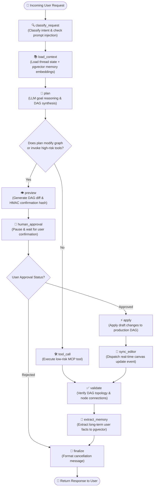
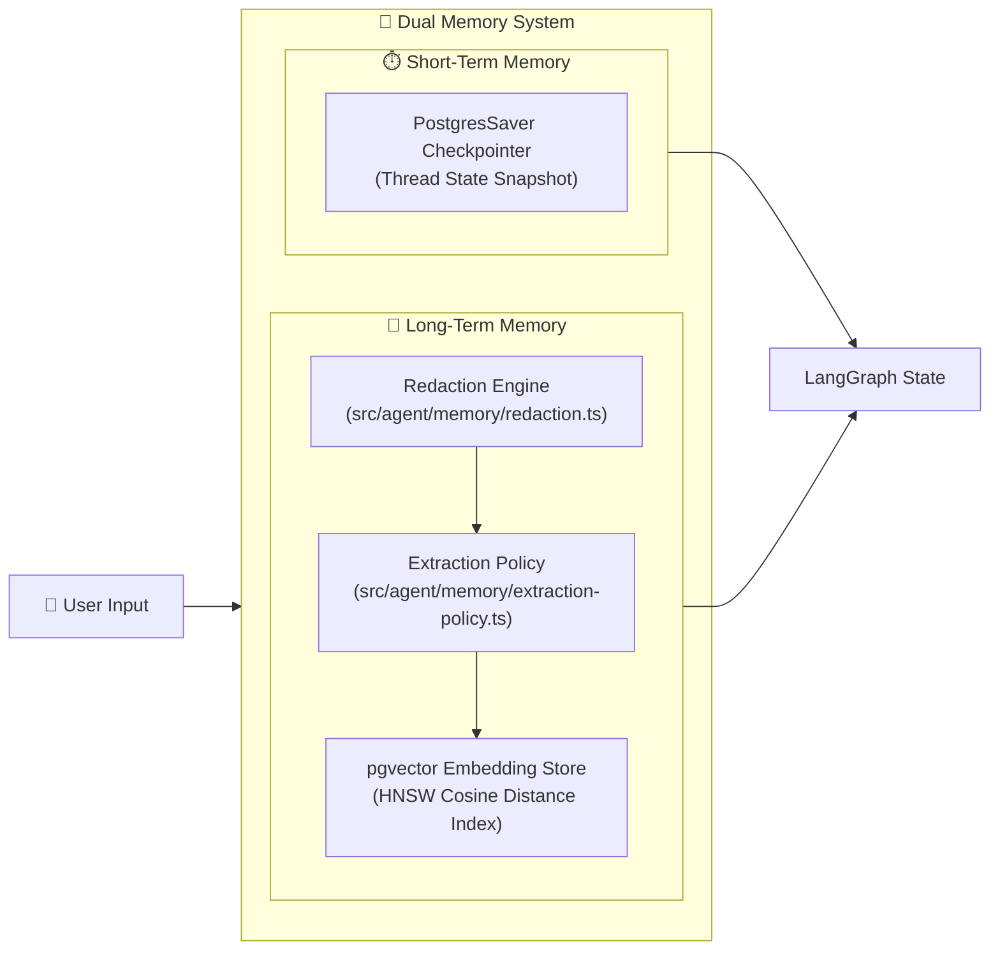
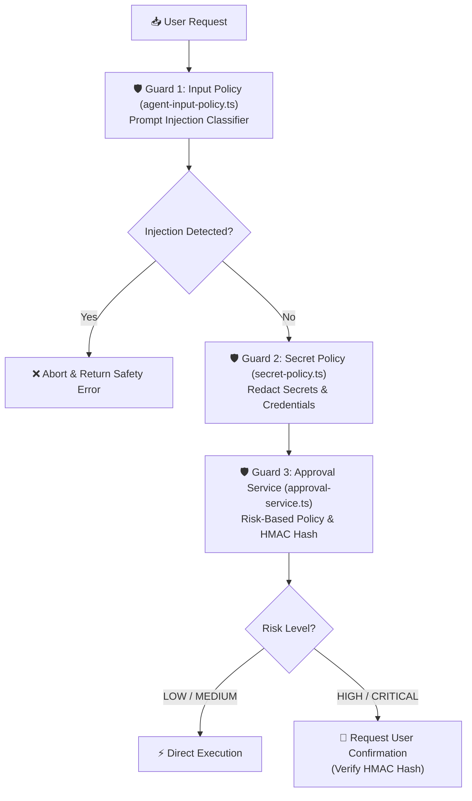

# Autonomous Agent Architecture & State Graph Specifications

> **Document Version**: 1.0.0  
> **Source Directory**: `src/agent/`  
> **Target Audience**: AI Systems Engineers, Core Developers, Security Auditors  
> **Scope**: Comprehensive technical breakdown of the LangGraph state machine, dual-memory system (`pgvector`), multi-layer safety guards, risk approval engine, and node handlers in a8n.

---

## 📑 Table of Contents

1. [Executive Summary](#1-executive-summary)
2. [State Graph Architecture & Flow Diagram](#2-state-graph-architecture--flow-diagram)
3. [Graph State Schema (`src/agent/graph/state.ts`)](#3-graph-state-schema-srcagentgraphstatets)
4. [Node-by-Node Handler Deep-Dive (`src/agent/graph/nodes/`)](#4-node-by-node-handler-deep-dive-srcagentgraphnodes)
5. [Dual Memory & Vector Persistence Engine (`src/agent/memory/`)](#5-dual-memory--vector-persistence-engine-srcagentmemory)
6. [Safety, Prompt Injection & Risk Approval System (`src/agent/safety/`)](#6-safety-prompt-injection--risk-approval-system-srcagentsafety)
7. [Agent Service & Execution Concurrency (`src/agent/service.ts`)](#7-agent-service--execution-concurrency-srcagentservicets)
8. [Health Monitoring & Benchmarks (`src/agent/health.ts` & `eval/`)](#8-health-monitoring--benchmarks-srcagenthealthts--eval)

---

## 1. Executive Summary

The **a8n Autonomous Agent** is an enterprise-grade AI assistant built on **LangGraph** (`@langchain/langgraph` `1.4.8`). It operates directly within the a8n workflow automation ecosystem to:
- Convert high-level natural language goals into validated visual workflow Directed Acyclic Graphs (DAGs).
- Inspect execution histories, diagnose node errors, and perform self-healing graph repairs.
- Manage encrypted API keys and credentials safely.
- Intersect with human operators via a risk-aware, cryptographically verified approval gate before applying graph modifications or invoking high-risk tools.

```
┌─────────────────────────────────────────────────────────────────────────────┐
│                             a8n AGENT SUBSYSTEM                             │
│                                                                             │
│  ┌──────────────────────┐    ┌──────────────────────┐    ┌───────────────┐  │
│  │   LangGraph Engine   │    │  Safety & Injection  │    │  Dual Memory  │  │
│  │ (11 Directed Nodes)  │ ── │   Classifier Guard   │ ── │ (State + Vector) │
│  └──────────────────────┘    └──────────────────────┘    └───────────────┘  │
│             │                           │                        │          │
│             ▼                           ▼                        ▼          │
│  ┌──────────────────────┐    ┌──────────────────────┐    ┌───────────────┐  │
│  │  Approval Gate Service│    │ MCP Tool Registry    │    │ PostgreSQL DB │  │
│  │ (HMAC Hash Verification)│ ──│ (57 Domain Tools)    │ ── │ (+ pgvector)  │  │
│  └──────────────────────┘    └──────────────────────┘    └───────────────┘  │
└─────────────────────────────────────────────────────────────────────────────┘
```

---

## 2. State Graph Architecture & Flow Diagram

The agent is structured as a state machine graph (`src/agent/graph/agent-graph.ts`). Incoming user prompts transition through deterministic classification, context enrichment, planning, safety verification, tool execution, and state finalization.



---

## 3. Graph State Schema (`src/agent/graph/state.ts`)

The central memory state passed across graph nodes is managed using LangGraph's `Annotation` builder:

```typescript
// src/agent/graph/state.ts
export const AgentStateAnnotation = Annotation.Root({
  // Conversation History
  messages: Annotation<BaseMessage[]>({
    reducer: (x, y) => x.concat(y),
    default: () => [],
  }),
  
  // High-Level User Intent
  goal: Annotation<string>(),
  intentCategory: Annotation<"CREATE_WORKFLOW" | "DEBUG_EXECUTION" | "MANAGE_CREDENTIAL" | "GENERAL_CHAT">(),

  // Workflow Active State
  workflowId: Annotation<string | undefined>(),
  activeDraftId: Annotation<string | undefined>(),
  
  // Safety & Approval Control
  safetyScore: Annotation<number>(),
  isPromptInjection: Annotation<boolean>(),
  riskLevel: Annotation<"LOW" | "MEDIUM" | "HIGH" | "CRITICAL">(),
  diffPreview: Annotation<WorkflowDiffPreview | undefined>(),
  confirmationHash: Annotation<string | undefined>(),
  approvalStatus: Annotation<"PENDING" | "APPROVED" | "REJECTED" | "NOT_REQUIRED">(),

  // Memory & Context
  relevantMemories: Annotation<MemoryItem[]>(),
  extractedMemories: Annotation<MemoryItem[]>(),

  // Diagnostics & Errors
  validationErrors: Annotation<string[]>(),
});
```

---

## 4. Node-by-Node Handler Deep-Dive (`src/agent/graph/nodes/`)

Each node in the state graph is an isolated TypeScript handler under `src/agent/graph/nodes/`:

### 1. `classify-request.ts`
- **Function**: Scans incoming input using `AgentInputPolicy` heuristics and semantic safety scoring.
- **Action**: Sets `intentCategory`, `isPromptInjection`, and `safetyScore`. If injection is detected, flags the graph to abort early.

### 2. `load-context.ts`
- **Function**: Fetches short-term thread history via `PostgresSaver` and retrieves long-term vector embeddings from `pgvector` store using `src/agent/memory/store.ts`.
- **Action**: Appends top-k relevant user memories to `state.relevantMemories`.

### 3. `plan.ts`
- **Function**: Invokes the configured LLM (OpenAI GPT-4o / Anthropic Claude / Google Gemini via Vercel AI SDK) to reason about the user goal and generate a sequence of actions.
- **Action**: Constructs initial workflow nodes, connections, or tool call parameters.

### 4. `preview.ts`
- **Function**: Generates a structured graph diff (added, updated, removed nodes and edges) using `src/agent/safety/approval-service.ts`.
- **Action**: Generates a secure HMAC-SHA256 `confirmationHash` linked to the target draft.

### 5. `human-approval.ts`
- **Function**: Pauses state graph execution if `riskLevel` is `HIGH` or `CRITICAL`.
- **Action**: Yields execution control back to the UI and awaits user input on `agent.approveAction`.

### 6. `apply.ts`
- **Function**: Executes graph modifications against the database when user approval is verified.
- **Action**: Reconciles draft changes into production workflow models.

### 7. `tool-call.ts`
- **Function**: Dispatches tool calls to the MCP server tool registry (57 domain tools across workflow, execution, credential, and widget domains).
- **Action**: Appends tool output messages to `state.messages`.

### 8. `validate.ts`
- **Function**: Checks DAG integrity (ensuring no cycles, verifying valid node handle connections, and validating required credential bindings).
- **Action**: Populates `state.validationErrors`.

### 9. `sync-editor.ts`
- **Function**: Dispatches WebSocket / Inngest Realtime events to update the visual React Flow canvas in real-time.

### 10. `extract-memory.ts`
- **Function**: Analyzes turn completion for long-term user preferences using `src/agent/memory/extraction-policy.ts`.
- **Action**: Sanitizes facts using `redaction.ts` and saves vector embeddings to `pgvector`.

### 11. `finalize.ts`
- **Function**: Assembles the final user-facing Markdown response, embedding status badges and interactive MCP App widget triggers.

---

## 5. Dual Memory & Vector Persistence Engine (`src/agent/memory/`)

a8n implements a dual-memory system:



### Short-Term Memory (`checkpointer.ts`)
- **Engine**: `PostgresSaver` backed by Prisma PostgreSQL connection pooling.
- **Scope**: Maintains thread conversation history, node execution states, and pending approval hashes across HTTP sessions.

### Long-Term Memory (`store.ts` & `pgvector`)
- **Engine**: PostgreSQL `pgvector` extension using HNSW index with cosine distance (`<=>`).
- **Namespace Isolation**: Users are partitioned into strict namespaces (`user_{userId}_memories`).
- **Secret & PII Redaction (`redaction.ts`)**: Automatically redacts API keys (`sk-`, `ghp_`, `whsec_`), tokens, passwords, and sensitive email addresses prior to embedding generation.

---

## 6. Safety, Prompt Injection & Risk Approval System (`src/agent/safety/`)

Safety is enforced through three concentric guards:



### Risk Level Classifications

| Risk Level | Trigger Actions | Gate Action |
|---|---|---|
| **`LOW`** | Read workflows, inspect executions, query logs | Direct execution without prompt |
| **`MEDIUM`** | Create workflow draft, test credential connection | Direct execution with UI notification badge |
| **`HIGH`** | Apply workflow draft, modify node configurations | Pauses graph; requires user confirmation in UI |
| **`CRITICAL`** | Delete workflow, revoke API key, batch purge credentials | Pauses graph; requires explicit user approval + HMAC hash verification |

### Cryptographic Confirmation Hashes
To prevent replay attacks or unintended approvals:
$$\text{ConfirmationHash} = \text{HMAC-SHA256}\Big(\text{Secret}, \; \text{draftId} + ":" + \text{userId} + ":" + \text{stateVersion}\Big)$$

---

## 7. Agent Service & Execution Concurrency (`src/agent/service.ts`)

The `AgentService` class acts as the singleton manager for agent executions:
- **Thread Concurrency (`concurrency.ts`)**: Limits concurrent graph executions per user to prevent race conditions during graph mutations.
- **Resource Cleanup (`cleanup.ts`)**: Automatically purges stale thread checkpoints older than 30 days while preserving long-term vector memories.
- **Feature Policy (`feature-policy.ts`)**: Evaluates feature flags (e.g. `FEATURE_FLAG_MCP_ENHANCED_TOOLING`) to dynamically toggle agent tools.

---

## 8. Health Monitoring & Benchmarks (`src/agent/health.ts` & `eval/`)

### Health Monitoring (`src/agent/health.ts`)
Exposes system diagnostics:
- **Database & Vector Status**: Verifies PostgreSQL connection health and `pgvector` extension availability.
- **Checkpointer Storage Metrics**: Tracks active state thread counts and average graph step latencies.

### Evaluation Suite (`src/agent/eval/`)
a8n includes an automated evaluation harness to test agent decision accuracy:
- **Golden Tasks**: Suite of benchmark prompt scenarios (e.g., "Create Stripe webhook workflow", "Fix invalid HTTP node header").
- **Metrics Tracked**:
  - *Goal Completion Rate*: Percentage of workflows passing DAG topological validation.
  - *Safety Accuracy*: False positive / false negative rate on prompt injection test sets.
  - *Tool Call Precision*: Ratio of correctly selected MCP tools.
