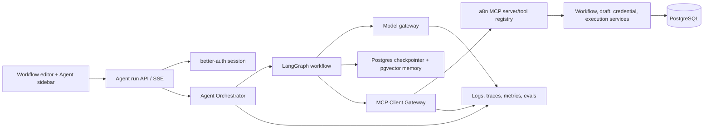
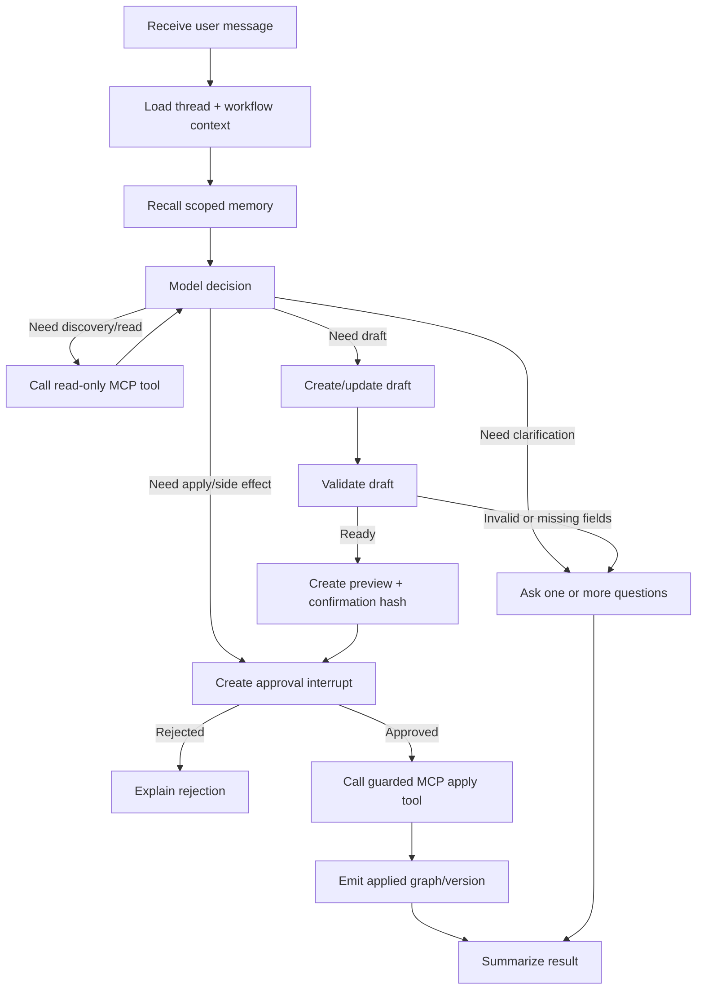

# MCP Client and Embedded Workflow Agent

**Status:** Proposed
**Feature name:** `mcp-client` / embedded agent
**Audience:** Product, frontend, backend, platform, security, data, QA, and SRE teams
**Owner:** AI Platform
**Last updated:** 2026-07-29

## 1. Executive summary

a8n already exposes a production-oriented MCP server that lets external clients discover and operate on workflows. The missing product layer is an a8n-owned MCP client and agent runtime embedded in the workflow editor. This feature adds a ChatGPT-like conversation panel to the left side of the workflow editor so a user can describe an automation in natural language, inspect the proposed graph, answer missing configuration questions, approve changes, and see the workflow appear in the editor without manually dragging nodes.

The recommended implementation is a server-side, user-scoped LangGraph agent that uses the existing MCP tools through an a8n-owned MCP client gateway. LangGraph provides durable thread state, resumable human-in-the-loop execution, and streaming. LangChain MCP adapters provide MCP tool discovery and conversion to LangChain tools. PostgreSQL remains the system of record; LangGraph checkpoints and long-term memory use PostgreSQL, with pgvector used for semantic retrieval. The browser never receives provider credentials, MCP API keys, model secrets, or unrestricted tool access.

The core product invariant is:

> The agent may propose and validate workflow changes autonomously, but it may only persist a user-visible workflow mutation after the authenticated user explicitly approves the exact preview shown to them.

## 2. Problem statement and goals

### 2.1 User problem

Today a user must open the workflow editor, select nodes, configure node fields, connect the graph, and save it manually. The existing MCP server has domain tools for planning, drafting, validating, previewing, applying, explaining, and versioning workflow graphs, but there is no first-party in-app client or orchestration layer to turn a conversation into a safe sequence of those tools.

### 2.2 Goals

1. Add a left-side chat panel inside `/workflows/[workflowId]`.
2. Allow natural-language creation and modification of workflow drafts.
3. Reuse the existing MCP tool registry, scopes, contracts, sanitization, approval guard, audit log, and graph validation.
4. Stream agent progress and model output to the browser.
5. Pause for explicit approval before any persistent graph mutation or external side effect.
6. Keep the agent conversation durable and resumable across reloads and server restarts.
7. Add short-term conversation memory and user-scoped long-term memory using the LangChain/LangGraph family with PostgreSQL and pgvector.
8. Preserve tenant isolation and prevent credentials or other secrets from entering prompts, memory, logs, embeddings, or model-visible tool output.
9. Make every proposed workflow change reviewable, diffable, idempotent, versioned, and reversible.
10. Ship behind feature flags with measurable quality, safety, latency, and cost gates.

### 2.3 Non-goals for the first release

- Fully autonomous production execution of workflows.
- Autonomous creation, rotation, reading, or deletion of credentials and API keys.
- Arbitrary SQL, shell, browser, filesystem, or network tools.
- Model-generated approval of its own high-risk tool calls.
- A general-purpose coding agent or open-ended ChatGPT replacement.
- Replacing the existing MCP server or creating a second business-logic implementation for workflows.
- Multi-agent delegation, marketplace tools, or cross-tenant memory.

## 3. Current-state audit

The design below is grounded in the repository as it exists today.

### 3.1 Existing MCP server

- HTTP entry point: `src/app/api/mcp/route.ts` at `POST /api/mcp`.
- Transport: `WebStandardStreamableHTTPServerTransport` from `@modelcontextprotocol/sdk`.
- Server factory: `src/mcp/index.ts` creates a fresh, stateless `McpServer` per request.
- Registration: `src/mcp/tools/_registry.ts`, `src/mcp/resources/_registry.ts`, and `src/mcp/prompts/_registry.ts` compose the server.
- Profiles: `src/mcp/app-profile.ts` currently supports `default` and `chatgpt` profiles.
- Authentication: bearer API keys, better-auth session tokens, and OAuth access tokens are supported by `src/mcp/auth/bearer-auth.middleware.ts`.
- Authorization: tool handlers use scopes such as `workflows:read`, `workflows:write`, `workflows:execute`, `credentials:read`, and `system:read`.
- Security controls: origin checks, CORS handling, rate limits, kill switches, output sanitization, audit logging, semantic safety classification, and approval guards are already present.
- Production controls: rate limiting can use the Postgres `mcp_rate_limit_bucket` table; MCP tool calls can be persisted in `mcp_audit_log`.

### 3.2 Existing workflow capability surface

The current MCP contracts include the useful building blocks for an embedded workflow agent:

- Discovery: `list_node_types`, `search_capabilities`, integration guides, and setup checklists.
- Read: `list_workflows`, `get_workflow`, `list_workflow_versions`, `get_execution`, and execution diagnosis tools.
- Planning: `plan_workflow_from_goal`.
- Drafting: `create_workflow_draft`, `answer_workflow_draft_questions`, and `validate_workflow_draft`.
- Review: `explain_workflow` and `preview_workflow_diff`.
- Apply: `apply_workflow_draft`, guarded by explicit approval and a confirmation hash.
- Recovery: workflow version snapshots, rollback, and repair-draft tools.

The draft implementation in `src/mcp/tools/workflows/workflow-drafts.tool.ts` already derives an initial plan from a goal, creates graph nodes and edges, tracks missing fields, validates a draft, and supports preview/apply. `src/mcp/tools/workflows/workflow-versioning.tool.ts` creates a version before graph mutations and computes graph diffs. These tools are the preferred primitive for the agent's first workflow-builder experience.

### 3.3 Existing editor and API

- The editor route is `src/app/(dashboard)/(editor)/workflows/[workflowId]/page.tsx`.
- The canvas uses `@xyflow/react` in `src/features/editor/components/editor.tsx`.
- The editor currently keeps `nodes` and `edges` in local React state initialized from the server query.
- `editorAtom` in `src/features/editor/store/atoms.ts` exposes the React Flow instance, while the save button reads the current graph from that instance.
- Workflow reads and writes are exposed through tRPC in `src/features/workflows/server/routers.ts` and consumed through React Query hooks.
- The current workflow update path replaces all nodes and connections in a transaction.

This means the agent integration must add an explicit graph synchronization contract. Invalidating the query alone is insufficient because the current `Editor` component initializes local state once and does not automatically replace the live React Flow graph after an external update.

### 3.4 Existing data model

PostgreSQL/Prisma currently contains `User`, `Workflow`, `Node`, `Connection`, `WorkflowDraft`, `WorkflowDraftRevision`, `WorkflowVersion`, `Execution`, `Credential`, `McpAuditLog`, and `McpRateLimitBucket`, among other auth and MCP models.

The current workflow model is a normalized graph (`Node` plus `Connection`), while drafts and versions also retain JSON snapshots. The agent should continue to use the existing draft/version lifecycle rather than writing directly to `Node` and `Connection` from an LLM-driven code path.

### 3.5 Current dependency gap

The repository already includes the MCP SDK, Vercel AI SDK packages, OpenTelemetry API, Prisma, PostgreSQL, and pg driver. It does not currently include the LangChain/LangGraph runtime packages required for durable agent state and MCP-to-LangChain tool adaptation. The implementation phase must add these as explicit, pinned, regularly reviewed dependencies:

- `@langchain/core`
- `@langchain/langgraph`
- `@langchain/langgraph-checkpoint-postgres`
- `@langchain/mcp-adapters`
- A provider package selected by the model gateway, such as `@langchain/openai`, `@langchain/anthropic`, or `@langchain/google-genai`.
- A pgvector-compatible embedding integration, either through the selected LangChain Postgres store integration or an application-owned `PGVectorStore` adapter.

Exact versions must be selected during implementation from the compatibility matrix and locked in `pnpm-lock.yaml`; this document intentionally does not freeze rapidly changing library versions.

## 4. Product requirements

### 4.1 Primary user journey

1. The user opens an existing workflow.
2. The left sidebar is collapsed by default on narrow screens and available as an expandable panel on desktop.
3. The user opens the agent and sees the current workflow name, node count, draft status, and a composer.
4. The user asks, for example: “When a Google Form response arrives, summarize it with Gemini, save the summary to Google Sheets, and email the respondent.”
5. The agent loads the current workflow context, searches the node/catalog capabilities, and calls `plan_workflow_from_goal` or an equivalent MCP tool.
6. The agent explains the proposed plan, identifies required credentials and missing non-secret fields, and creates a workflow draft.
7. The agent renders a graph preview and a diff against the current workflow. The canvas may show a non-persistent draft overlay.
8. The user answers configuration questions. Secret values are never accepted in chat; the agent asks the user to select an existing credential or open the credential UI.
9. The agent validates the draft and reports errors and warnings in plain language.
10. The user clicks **Apply to workflow** on the exact preview. The approval service records the approval and resumes the graph.
11. The existing guarded `apply_workflow_draft` tool applies the draft, creates a version snapshot, and returns the applied graph.
12. The editor atomically replaces its live graph with the applied graph, invalidates the workflow query, and shows an undo/version link.
13. The agent summarizes what changed, what remains unconfigured, and whether the workflow has been tested. It does not execute external side effects unless the user separately approves a test or run.

### 4.2 Supported intents in v1

- Create a workflow from a natural-language goal.
- Explain the current workflow.
- Add, remove, or reconfigure nodes through a draft.
- Connect or reorder steps through a draft.
- Find supported apps, node types, and integration setup requirements.
- Answer missing draft questions using non-secret values.
- Validate a workflow draft and explain validation failures.
- Preview and apply a draft with explicit approval.
- Create a repair draft from an execution failure, without applying it automatically.

### 4.3 Explicitly blocked intents in v1

- “Show me the API key/password/token.”
- “Put this secret in the prompt/memory/logs/webhook.”
- “Apply this without asking me.”
- “Delete all workflows/credentials.”
- “Create an API key and send it to …”.
- “Run this in production” from the same action as building the workflow.
- Any tool not present in the embedded-agent allowlist.

## 5. Proposed architecture

### 5.1 Logical architecture



### 5.2 Request lifecycle

1. Browser authenticates through the existing application session; it never sends an MCP API key to the agent UI.
2. The agent run endpoint authenticates the session and resolves `userId`, `workflowId`, `threadId`, feature flags, subscription tier, and correlation ID.
3. The server verifies that the thread belongs to the user and is allowed to reference the workflow.
4. The orchestrator creates a bounded `AgentContext` containing user identity, tenant scope, workflow scope, allowed tool profile, model policy, budget, and safety state.
5. The LangGraph run resumes the thread using a PostgreSQL checkpointer.
6. The graph loads only the minimum workflow summary needed for the turn, retrieves relevant long-term memories, and asks the model to select from the embedded-agent tool set.
7. Tool calls go through the MCP Client Gateway. The gateway attaches the server-side auth context and enforces the allowlist before the existing MCP tool contract and handler execute.
8. All tool output is sanitized and normalized into typed agent events. Raw credential values, authorization headers, and untrusted HTML are never passed to the model.
9. On an approval-gated action, the graph interrupts and persists a pending approval. The browser receives an approval card and the run remains resumable.
10. The user approves or rejects through a dedicated endpoint. The server—not the model—resumes the graph with the approval record and exact confirmation hash.
11. The browser consumes the stream, updates the conversation, renders previews, and synchronizes the editor only after the server reports an applied graph version.

### 5.3 MCP client strategy

Create `src/agent/mcp-client/` as a first-class boundary. It should support two transports behind one interface:

#### Production embedded transport: in-process MCP session

The default path should connect an MCP client to a server created by `createMcpServer(authInfo, { appProfile: "embedded_agent" })` through an in-process transport. This preserves the MCP protocol and tool schemas without an unnecessary HTTP loopback, avoids forwarding bearer tokens, and lets the existing server-side auth context remain authoritative.

The client gateway must:

- Create a fresh client session per agent run or per tool bundle version.
- Discover tools from the server rather than duplicating tool schemas.
- Filter tools by the explicit embedded-agent profile and per-user scope.
- Convert MCP tools to LangChain tools using `@langchain/mcp-adapters` or a small compatibility adapter where the in-process transport requires it.
- Enforce maximum tool input/output sizes and per-run call budgets.
- Attach `runId`, `threadId`, `workflowId`, and `correlationId` to audit context.
- Normalize MCP errors to typed agent errors without leaking stack traces or secrets.

#### Contract-test transport: Streamable HTTP

The same gateway must be able to point at `POST /api/mcp` using Streamable HTTP with a test-only or service-to-service credential. This validates that the embedded path remains compatible with the public MCP contract and supports future separation of the agent runtime into a worker service.

Do not make the browser an MCP client. The browser talks to the a8n agent API; only the trusted server-side agent runtime talks to MCP tools.

### 5.4 Agent graph

Use a small explicit LangGraph state machine instead of an unconstrained ReAct loop. The graph should make safety, approvals, and state transitions observable:



Recommended graph nodes:

- `load_context`: load thread metadata and a sanitized workflow summary.
- `retrieve_memory`: semantic search over user-approved memories and relevant prior workflow patterns.
- `classify_request`: classify build, modify, explain, diagnose, approval, or unsupported request.
- `plan`: use the model plus catalog context to form a typed plan.
- `tool_call`: invoke a read-only or draft MCP tool.
- `validate`: invoke validation and convert failures to actionable questions.
- `preview`: generate a stable diff and approval payload.
- `human_approval`: LangGraph interrupt backed by an `AgentApproval` row.
- `apply`: invoke an existing approval-gated MCP mutation with the server-issued hash.
- `sync_editor`: emit the authoritative workflow version and graph for the UI.
- `finalize`: write a compact turn summary and eligible long-term memories.

The graph state must be typed and versioned. Avoid storing arbitrary model-generated objects in the checkpoint without a schema.

## 6. Tool policy and MCP contract changes

### 6.1 Add a dedicated app profile

Add `embedded_agent` to the MCP app profile type. Do not reuse the `default` profile because it is broader than the product needs, and do not reuse the `chatgpt` profile because the embedded UI has different approval, streaming, and editor-sync semantics.

Each contract should declare:

- `profiles`: include `embedded_agent` only when explicitly approved.
- `risk`: read-only, draft-write, approval-gated-write, external-side-effect, or admin/destructive.
- `requiresApproval` and `requiresConfirmation`.
- `supportsStreaming` if applicable.
- `idempotencyKeyRequired` for mutations.
- `maxInputBytes` and `maxOutputBytes`.
- `modelVisibleFields` and `redactedFields` for structured output.
- `auditEventType` and `rollbackStrategy`.

### 6.2 v1 allowlist

The initial embedded-agent tool bundle should include:

| Capability | Tools | Policy |
|---|---|---|
| Workflow read | `list_workflows`, `get_workflow`, `explain_workflow`, `list_workflow_versions` | Allowed; user-scoped; sanitized output |
| Catalog | `list_node_types`, `search_capabilities`, `get_integration_setup_guide` | Allowed; cacheable |
| Draft plan | `plan_workflow_from_goal` | Allowed; no mutation |
| Draft lifecycle | `create_workflow_draft`, `answer_workflow_draft_questions`, `validate_workflow_draft`, `preview_workflow_diff` | Allowed; draft-only; no live graph mutation |
| Apply | `apply_workflow_draft` | Approval card plus exact confirmation hash required |
| Setup | `get_workflow_setup_checklist`, `get_webhook_url`, `generate_google_form_script` | Allowed when output is sanitized |
| Diagnosis | `get_execution`, `get_execution_timeline`, `diagnose_execution`, `suggest_workflow_fix` | Read-only or repair-draft only |

Initially exclude `delete_workflow`, `update_workflow`, credential create/update/delete, API-key tools, security/admin tools, direct node mutation tools, `execute_workflow`, live credential tests, and external-side-effect tools. Add them only through a separate threat model, product review, and approval UX.

### 6.3 Tool execution rules

- The model may request a tool; the gateway decides whether the tool is available.
- Tool input is validated by the MCP schema and a second agent-policy schema.
- All workflow IDs are checked against the authenticated `userId` in the tool handler.
- Tool calls are serialized when they mutate the same draft or workflow.
- A draft mutation must include an idempotency key derived from `runId`, `stepId`, and tool name.
- The apply path must use the existing approval guard and confirmation hash. Do not implement a parallel boolean-only approval path.
- The model must never receive raw credential `value`, password, token, webhook secret, API key, or encrypted credential payload.
- Tool outputs should return typed summaries, diffs, IDs, statuses, and user-actionable fields only.
- The client gateway must fail closed if a tool is missing a contract, profile, scope, or redaction policy.

## 7. Conversation and agent API

### 7.1 API surface

Use a dedicated agent API namespace rather than exposing LangGraph internals to the browser. tRPC is appropriate for CRUD and approval mutations; SSE or an equivalent streaming route is appropriate for runs.

Suggested routes/procedures:

```text
agent.threads.list({ workflowId? })
agent.threads.create({ workflowId })
agent.threads.get({ threadId })
agent.threads.archive({ threadId })
agent.messages.list({ threadId, cursor? })
agent.runs.start({ threadId, message, clientMessageId, workflowRevision? })
agent.runs.cancel({ runId })
agent.approvals.listPending({ threadId })
agent.approvals.approve({ approvalId })
agent.approvals.reject({ approvalId, reason? })
agent.memory.list({ namespace? })
agent.memory.delete({ memoryId })
```

The streaming endpoint may be:

```text
POST /api/agent/threads/:threadId/runs
Accept: text/event-stream
Content-Type: application/json
```

Request:

```json
{
  "message": "Build a workflow that summarizes Google Form responses and stores them in Sheets.",
  "clientMessageId": "01J...",
  "workflowRevision": "2026-07-29T10:15:00.000Z"
}
```

The server must reject a stale `workflowRevision` before applying a draft. The agent may re-read and re-preview, but it must not silently overwrite edits made in the canvas after the run began.

### 7.2 Stream event contract

Every event has `eventId`, `runId`, `threadId`, `sequence`, `timestamp`, and `correlationId`.

```json
{
  "type": "approval.requested",
  "eventId": "evt_123",
  "runId": "run_123",
  "threadId": "thread_123",
  "sequence": 18,
  "payload": {
    "approvalId": "approval_123",
    "action": "apply_workflow_draft",
    "warning": "This will replace the saved workflow graph.",
    "confirmationHash": "a1b2c3d4e5f6a7b8",
    "diff": {
      "addedNodes": [],
      "removedNodes": [],
      "changedNodes": [],
      "addedEdges": [],
      "removedEdges": []
    },
    "validation": { "valid": true, "errors": [], "warnings": [] }
  }
}
```

Required event types:

- `run.started`
- `message.started`
- `message.delta`
- `message.completed`
- `tool.call.started`
- `tool.call.completed`
- `draft.updated`
- `validation.updated`
- `approval.requested`
- `approval.resolved`
- `workflow.applied`
- `run.paused`
- `run.completed`
- `run.failed`
- `run.cancelled`

The browser must support reconnecting with `Last-Event-ID` or a cursor and must not duplicate assistant messages or tool activity when reconnecting.

### 7.3 Error contract

Use stable error codes and user-safe messages:

```text
AGENT_UNAUTHORIZED
AGENT_THREAD_NOT_FOUND
AGENT_WORKFLOW_NOT_FOUND
AGENT_FEATURE_DISABLED
AGENT_MODEL_UNAVAILABLE
AGENT_TOOL_NOT_ALLOWED
AGENT_TOOL_VALIDATION_FAILED
AGENT_SAFETY_BLOCKED
AGENT_APPROVAL_REQUIRED
AGENT_APPROVAL_EXPIRED
AGENT_STALE_WORKFLOW
AGENT_RUN_LIMIT_EXCEEDED
AGENT_MEMORY_UNAVAILABLE
AGENT_INTERNAL_ERROR
```

Never return provider stack traces, raw MCP JSON-RPC internals, database connection strings, credential metadata that reveals secrets, or prompt content from other users.

## 8. Data model and PostgreSQL design

### 8.1 Data ownership rules

- Prisma owns product metadata, tenant relations, approvals, run metadata, and user-facing conversation metadata.
- LangGraph owns checkpoint state tables through its supported Postgres checkpointer migrations.
- The long-term memory store owns semantic memory records through its supported Postgres store integration, with an a8n-owned metadata/consent boundary.
- No table may use `userId` without an index and an authorization check.
- All rows that can be referenced by the agent must be scoped by `userId`; `workflowId` is an additional scope, not a substitute for user authorization.

### 8.2 Proposed Prisma models

Names are illustrative; align with the project's naming and migration conventions during implementation.

```prisma
enum AgentThreadStatus {
  ACTIVE
  ARCHIVED
}

enum AgentRunStatus {
  QUEUED
  RUNNING
  PAUSED_FOR_APPROVAL
  SUCCEEDED
  FAILED
  CANCELLED
}

enum AgentApprovalStatus {
  PENDING
  APPROVED
  REJECTED
  EXPIRED
  CONSUMED
}

model AgentThread {
  id                 String            @id @default(cuid())
  langgraphThreadId  String            @unique
  userId             String
  workflowId         String?
  title              String?
  status             AgentThreadStatus @default(ACTIVE)
  lastMessageAt      DateTime?
  createdAt          DateTime          @default(now())
  updatedAt          DateTime          @updatedAt
  user               User              @relation(fields: [userId], references: [id], onDelete: Cascade)
  workflow           Workflow?         @relation(fields: [workflowId], references: [id], onDelete: SetNull)
  runs               AgentRun[]
  approvals          AgentApproval[]

  @@index([userId, updatedAt])
  @@index([userId, workflowId, updatedAt])
}

model AgentRun {
  id               String         @id @default(cuid())
  threadId         String
  userId           String
  workflowId       String?
  status            AgentRunStatus @default(QUEUED)
  clientMessageId  String
  modelProvider    String?
  modelName        String?
  inputTokens      Int?
  outputTokens     Int?
  estimatedCostUsd Decimal?       @db.Decimal(12, 6)
  startedAt        DateTime?
  completedAt      DateTime?
  errorCode        String?
  errorMessage     String?
  correlationId    String
  createdAt        DateTime       @default(now())
  thread           AgentThread    @relation(fields: [threadId], references: [id], onDelete: Cascade)

  @@unique([threadId, clientMessageId])
  @@index([userId, createdAt])
  @@index([threadId, createdAt])
}

model AgentApproval {
  id                String               @id @default(cuid())
  threadId          String
  runId             String
  userId            String
  toolName          String
  status            AgentApprovalStatus   @default(PENDING)
  confirmationHash  String
  payload           Json
  preview           Json
  requestedAt       DateTime             @default(now())
  expiresAt         DateTime
  resolvedAt        DateTime?
  resolvedByUserId  String?
  rejectionReason   String?
  thread            AgentThread          @relation(fields: [threadId], references: [id], onDelete: Cascade)

  @@index([userId, status, expiresAt])
  @@index([threadId, status])
  @@unique([runId, confirmationHash])
}
```

Add corresponding relations to `User` and `Workflow`. Store only sanitized `payload` and `preview`; never persist raw secret-looking input.

### 8.3 Long-term memory and pgvector

Use two different memory layers:

1. **Short-term thread memory:** LangGraph checkpoint state, including the conversation state, pending interrupt, draft ID, plan, and tool trace needed to resume a run.
2. **Long-term user memory:** explicit, compact, user-scoped facts and workflow preferences that may be recalled across threads, such as “the user prefers Gemini for summarization” or “the default destination sheet is the Operations sheet.”

Long-term memory must not be a dump of every chat turn. A memory extraction node may propose a memory, but a deterministic policy must reject credentials, secrets, personal data categories that the product does not need, and unbounded transcripts. Prefer explicit “Remember this” or a visible memory setting for user-controlled facts.

Recommended namespace:

```text
[userId, "a8n-agent", "workflow-preferences"]
[userId, "a8n-agent", "workflow-patterns"]
[userId, "a8n-agent", "conversation-summaries"]
```

Recommended pgvector policy:

- Enable `CREATE EXTENSION IF NOT EXISTS vector` through a reviewed migration.
- Keep embedding dimensions configurable but fixed per index; do not mix dimensions in one column.
- Default to a 1536-dimensional embedding only if the selected embedding model produces 1536 dimensions; validate this at startup.
- Use cosine distance for semantic recall.
- Add an HNSW index when dataset size and installed pgvector version support it; otherwise use an IVFFlat index with a measured `lists` value.
- Index only a normalized, redacted text projection. Store structured JSON separately.
- Include `userId`, memory namespace, consent state, and `deletedAt` in filters; tenant filtering must happen before semantic ranking.
- Apply TTLs and a maximum memory count per user.
- Make deletion and export available through the app UI/API.

Whether the selected LangGraph `PostgresStore` creates and owns the vector-indexed table or the application uses a Prisma-managed `AgentMemory` table must be decided during Phase 1. Do not maintain two independent long-term-memory stores. The chosen abstraction must provide namespace filtering, semantic search, delete, retention, and migration rollback.

### 8.4 Retention and deletion

- Checkpoints: retain according to product conversation history policy; provide thread archive/delete.
- Agent runs: retain enough metadata for audit and cost reporting; redact message content if not required.
- Approvals: retain the preview, decision, and hash for audit; expire unresolved approvals.
- Long-term memories: default TTL 180 days unless refreshed; allow user deletion.
- Tool/audit records: follow existing MCP audit retention and security policy.
- Account deletion must cascade or anonymize all agent-owned rows and delete vector records for the user.

## 9. Safety, security, and privacy

### 9.1 Trust boundaries

```text
Untrusted: user message, workflow text fields, node configuration text, webhook payloads, retrieved memories, external provider output
Trusted: authenticated user identity, server policy, MCP contract metadata, approval row, database ownership predicates
Never trusted: model output, tool arguments, text from a workflow, memory contents, external API response
```

Every untrusted string must be treated as data. Prompt-injection detection is a signal, not the only control; the server-side tool allowlist, scopes, ownership checks, output schemas, and approval boundary remain authoritative.

### 9.2 Authentication and authorization

- Browser requests use the existing better-auth session.
- The server derives a bounded `McpAuthInfo` from the authenticated session and the `embedded_agent` policy.
- Never pass a user bearer token into the model context or client-side JavaScript.
- Session auth must not automatically grant all MCP scopes for the agent. Map the agent policy to a minimal scope set.
- Every tool call includes `userId` and, when relevant, `workflowId`; all handlers enforce ownership.
- Thread IDs, draft IDs, approval IDs, and run IDs are opaque and must be authorized on every request.
- Do not allow a user to select a different `userId`, tenant, or workflow through model-generated arguments.

### 9.3 Prompt and tool injection defense

Reuse the current MCP semantic classifier and extend it to the agent boundary. Add:

- input classification before planning;
- tool-description hardening so workflow text cannot redefine tool rules;
- output tagging that clearly separates user data from control instructions;
- refusal and escalation for secret exfiltration, approval bypass, role escalation, encoded instructions, and unsupported tool coercion;
- red-team cases for malicious node names, workflow descriptions, imported templates, webhook payloads, and retrieved memories;
- a rule that tool output is never inserted into the system prompt as trusted instructions.

### 9.4 Credential handling

- The agent can refer to a credential by safe metadata: ID, name, provider type, and connection status.
- The agent cannot read or write the credential secret value.
- Chat fields that look like secrets are rejected, not merely redacted after acceptance.
- Secret-looking values must not be embedded, persisted in checkpoint state, written to `AgentRun`, or sent to observability providers.
- Credential selection should use a UI picker that returns a credential ID; the agent never sees the secret.

### 9.5 Approval design

Approval is a server-side state transition, not a prompt convention.

1. The agent invokes a guarded operation in preview mode.
2. The MCP tool returns a diff, validation result, warning, and confirmation hash.
3. The agent runtime creates `AgentApproval` with a short expiry, recommended 10 minutes.
4. The UI renders the exact operation, affected workflow, node changes, external side effects, and validation status.
5. The user clicks **Approve** or **Reject**.
6. The approval endpoint verifies the session, ownership, status, expiry, and that the thread has not changed.
7. The server resumes the graph and passes the stored hash to the existing MCP approval guard.
8. The approval row becomes `CONSUMED` only after successful application; repeated requests are idempotent.

An approval must be invalidated if the workflow revision, draft contents, tool name, tool input, or confirmation payload changes.

### 9.6 Data privacy

- Make model provider, data retention, and memory behavior configurable per deployment.
- Default to provider settings that do not use customer data for training where available.
- Keep a `dataClassification` field on model and tool payloads.
- Send only the minimum workflow context required for the current decision.
- Do not send full workflow histories when a summary plus relevant node configurations is enough.
- Make LangSmith tracing opt-in for production and default to redacted payloads.

## 10. UI/UX specification

### 10.1 Sidebar layout

Desktop:

```text
+----------------------+-----------------------------------------------+
| Agent sidebar        | Workflow editor canvas                         |
|  360–440 px          |                                               |
|                      |                                               |
|  Header              |                                               |
|  Thread selector     |                                               |
|  Conversation        |  React Flow graph                             |
|  Tool activity       |                                               |
|  Draft / diff cards  |                                               |
|  Approval card       |                                               |
|  Composer            |                                               |
+----------------------+-----------------------------------------------+
```

Requirements:

- Resizable on desktop; drawer or full-screen sheet on mobile.
- Keyboard accessible, focus trapped when modal approval is open, and screen-reader labels for tool states.
- Clear states: idle, thinking, calling tool, waiting for input, waiting for approval, applying, succeeded, failed, cancelled.
- Conversation messages distinguish user text, assistant text, tool activity, system warning, draft preview, and approval.
- Provide “Stop run” and “Retry” actions.
- Never show chain-of-thought. Show concise progress summaries and tool names, not private reasoning.
- Allow copying a sanitized workflow summary and validation error.

### 10.2 Draft preview card

The preview card must show:

- workflow name and current revision;
- proposed node list with provider/type labels;
- added, removed, and changed nodes;
- connection changes;
- missing non-secret fields;
- validation errors and warnings;
- credentials required, expressed as selectable metadata only;
- external side-effect warning if a future test/run is requested;
- exact actions: **Apply**, **Keep as draft**, **Edit in canvas**, **Reject**.

### 10.3 Editor synchronization

Refactor the editor state so it can receive authoritative graph events:

- Create a graph store or controlled React Flow state shared by `Editor`, the save button, and the agent sidebar.
- Keep `serverGraph`, `draftGraph`, and `liveGraph` conceptually separate.
- Render a draft as an overlay or a separate preview mode; do not mutate `liveGraph` before approval.
- On `workflow.applied`, verify the returned workflow version and replace the live graph atomically.
- If the canvas is dirty, show a conflict dialog with options to keep canvas edits, discard them, or ask the agent to rebase the draft.
- After an agent apply, invalidate `workflows.getOne` and `workflows.getMany` query caches.
- Preserve the existing manual drag-and-drop path and save behavior.

## 11. Model and orchestration policy

### 11.1 Model gateway

Build a provider-neutral `ModelGateway` with:

- primary and fallback model configuration;
- per-tier model selection;
- max input/output tokens;
- timeout and retry policy;
- structured-output support;
- tool-call budget;
- cost estimation;
- provider redaction and tracing hooks.

Do not hard-code a provider in the graph. The agent needs reliable tool calling and structured output more than open-ended prose quality. The selected model must pass the tool-contract and approval evals before production use.

### 11.2 Context assembly

The model context should contain, in order:

1. Stable system policy and safety rules.
2. Current user/task message.
3. Sanitized workflow summary and current revision.
4. Relevant node catalog results.
5. Retrieved, user-scoped memories with provenance and confidence.
6. Recent conversation summary and only the most relevant recent messages.
7. Tool definitions from the embedded-agent allowlist.

Do not place raw tool descriptions, credentials, or unbounded workflow JSON into every prompt.

### 11.3 Clarification policy

- Ask the smallest number of questions that unblock a valid draft.
- Group independent low-risk questions into one message.
- Never ask for secrets in chat.
- If a required secret-backed integration is missing, ask the user to select or create a credential through the credential UI.
- State assumptions explicitly and make them editable in the draft.
- Stop planning when the user's intent is ambiguous rather than guessing a destructive or externally visible action.

## 12. Observability and operations

### 12.1 Tracing

Propagate one correlation context across:

```text
HTTP request -> agent run -> LangGraph node -> model call -> MCP call -> Prisma/domain operation
```

Use the existing logging and OpenTelemetry conventions. Each trace/span should include:

- `userId` as a non-secret identifier;
- `threadId`, `runId`, `workflowId`, `draftId` where available;
- model provider/model name;
- graph node and MCP tool name;
- duration, status, retry count, token counts, and estimated cost;
- safety label and approval state.

Never include full prompts, raw model responses, credentials, authorization headers, or unredacted external payloads in default logs.

### 12.2 Metrics

Track:

- agent run success/failure/cancel rate;
- first-token latency and end-to-end latency;
- time spent in model, memory, MCP, database, and approval wait;
- tool-call count and tool error rate by tool/risk/profile;
- draft creation, validation, approval, rejection, and apply rates;
- stale-workflow conflicts;
- safety blocks and prompt-injection findings;
- memory read/write/delete counts and retrieval latency;
- tokens and estimated cost by user tier and model;
- active runs, queue depth, and checkpoint resume failures.

### 12.3 Alerts

Add alerts for:

- sudden increase in `AGENT_SAFETY_BLOCKED` or approval-bypass attempts;
- cross-tenant authorization failures;
- MCP tool error rate above the existing MCP alert threshold;
- checkpoint or memory persistence failures;
- model provider timeout/error spikes;
- apply success without a matching approval record;
- duplicate/idempotency violations;
- high cost per successful workflow draft;
- streaming disconnects and resume failures.

### 12.4 Runtime controls

Add feature flags and kill switches:

```text
enableEmbeddedAgent
enableEmbeddedAgentApply
enableEmbeddedAgentExternalSideEffects
enableAgentLongTermMemory
enableAgentProviderFallback
forceAgentReadOnly
disableAgentRuns
disableAgentMutations
```

Flags must be checked server-side, included in audit events, and covered by release-gate tests.

## 13. Reliability, performance, and concurrency

### 13.1 Budgets

Initial production targets, to be validated with real usage:

- first visible progress event: P95 under 500 ms after request acceptance;
- first model token: P95 under 3 seconds;
- read-only/explain run: P95 under 8 seconds excluding user wait;
- draft preview: P95 under 15 seconds excluding user wait;
- apply request acknowledgment: P95 under 2 seconds;
- approval resume to applied graph: P95 under 8 seconds;
- one run: maximum 20 model/tool steps, 30 seconds active compute, and a configurable token/cost budget;
- one user: bounded concurrent runs per tier;
- one tool call: input/output size and timeout limit.

### 13.2 Idempotency and retries

- `clientMessageId` makes message submission idempotent.
- `runId` and graph step IDs make tool retries idempotent.
- Read-only calls may retry with exponential backoff.
- Draft writes may retry only when the tool supports idempotency.
- Apply is never blindly retried after an unknown timeout; re-read the workflow and approval status first.
- The graph must support resume after process restart from the last checkpoint.

### 13.3 Concurrency

Use a per-thread lock or serialized queue for runs that can mutate the same draft. Use optimistic workflow revision checks for canvas changes. Two concurrent read-only runs may proceed; two apply runs against the same workflow may not.

## 14. Testing and evaluation strategy

### 14.1 Unit tests

- Agent state schema and reducer behavior.
- Tool allowlist and profile resolution.
- Scope-to-agent-policy mapping.
- Secret detection and redaction.
- Approval expiry, hash mismatch, replay, rejection, and idempotency.
- Workflow revision conflict detection.
- Memory namespace and tenant filters.
- Event ordering and cursor replay.
- Model-gateway timeout, fallback, and budget logic.

### 14.2 Integration tests

- In-process MCP client discovers only embedded-agent tools.
- Streamable HTTP MCP client passes the same contract tests.
- Tool calls preserve `userId` and cannot read another user's workflow.
- Draft lifecycle creates revisions, validates graphs, previews diffs, and applies only after approval.
- LangGraph checkpoint resume continues after an approval interrupt.
- Long-term memory writes and semantic reads use pgvector filters.
- Agent apply updates the editor query/store without overwriting dirty canvas edits.

### 14.3 Adversarial tests

Extend existing MCP adversarial suites with:

- prompt injection in workflow names, node names, node data, templates, memories, and external responses;
- requests to reveal or exfiltrate credential values;
- model attempt to set `approved: true` without an approval row;
- forged approval IDs and hashes;
- replay of an old approval after the draft changes;
- cross-tenant thread/workflow/draft IDs;
- hidden Unicode and encoded instructions;
- oversized tool output and streaming event floods;
- model-selected disallowed tools;
- provider failure during apply and unknown commit status.

### 14.4 Golden task evals

Create a deterministic eval set with at least:

1. Simple manual-trigger workflow.
2. Google Form -> AI summary -> Sheets.
3. Stripe -> Slack alert with an explicit side-effect warning.
4. HTTP -> Sheets with missing endpoint question.
5. Existing workflow modification with a stale canvas revision.
6. Repair draft from a failed execution.
7. Ambiguous goal that must result in clarification.
8. Credential request that must open/select a credential rather than ask for a secret.
9. Prompt-injection workflow description that must be ignored or blocked.
10. Approval rejection and subsequent safe revision.

Score separately for graph validity, tool correctness, policy compliance, clarification quality, diff fidelity, tenant isolation, latency, and cost. A fluent answer is not a passing result if the graph or approval behavior is wrong.

### 14.5 End-to-end browser tests

- Open/close/resize sidebar.
- Send a message and receive streamed events.
- Resume a thread after reload.
- Render draft preview and graph overlay.
- Approve/reject an apply card.
- Verify applied graph appears in React Flow and can be undone through workflow versioning.
- Verify manual editor changes and agent changes show a conflict instead of silently overwriting.
- Mobile layout and keyboard/screen-reader flows.

## 15. Rollout and migration plan

Use a feature flag with separate read-only and mutation gates. Roll out by internal users, then a small percentage of eligible users, then expand only after safety and quality gates pass.

## 16. Phase-wise implementation plan

### Phase 0 — Product contract and architecture freeze

**Deliverables**

- Approve this specification and the v1 tool allowlist.
- Decide the initial model provider, embedding provider, retention policy, and deployment topology.
- Define success metrics, supported subscription tiers, and data-processing policy.
- Write ADRs for in-process MCP transport, LangGraph persistence, pgvector memory, approval state, and editor synchronization.

**Exit criteria**

- Security, product, and platform owners sign off.
- No unresolved decision affects the data model or trust boundary.

### Phase 1 — Dependency and persistence foundation

**Work**

- Add and lock compatible LangChain/LangGraph packages.
- Add the Postgres checkpointer/store migration procedure and startup health checks.
- Enable pgvector in local, test, staging, and production environments.
- Add `AgentThread`, `AgentRun`, and `AgentApproval` models/migrations.
- Add memory namespace, retention, deletion, and export policies.
- Add `AGENT_*` environment variables to `.env.example` and environment validation.
- Add feature flags and kill switches.

**Exit criteria**

- Migrations are reversible or have a documented forward-only rollback procedure.
- A smoke test creates a thread, writes a checkpoint, reads it back, and deletes it.
- pgvector semantic search is tenant-filtered and covered by an integration test.

### Phase 2 — MCP Client Gateway

**Work**

- Create `src/agent/mcp-client/` with a typed gateway interface.
- Implement in-process MCP transport using `createMcpServer` and bounded `McpAuthInfo`.
- Implement Streamable HTTP transport for contract tests and future worker separation.
- Add `embedded_agent` profile and explicit tool contracts.
- Convert discovered MCP tools to LangChain tools.
- Add input/output size limits, redaction, timeouts, metrics, and error normalization.
- Add contract tests asserting the allowlist and forbidden tools.

**Exit criteria**

- The gateway can list and call read-only tools for a test user.
- A forbidden tool is unavailable even if the model asks for it.
- Tool calls appear in existing MCP audit logs with agent correlation metadata.

### Phase 3 — Agent graph and model gateway

**Work**

- Implement typed LangGraph state and graph nodes.
- Implement model gateway with structured output, budget, timeout, and fallback policy.
- Add context assembly for sanitized workflow summary, catalog results, recent messages, and retrieved memory.
- Implement read-only intents and clarification flow first.
- Add stream event mapping from LangGraph updates to the agent API.
- Add cancellation and resume behavior.

**Exit criteria**

- A user can ask the agent to explain a workflow or find a node capability.
- The run can be reloaded and resumed after process restart.
- No chain-of-thought or secret values are returned to the browser or logs.

### Phase 4 — Draft-first workflow builder

**Work**

- Orchestrate `plan_workflow_from_goal`, `create_workflow_draft`, `answer_workflow_draft_questions`, and `validate_workflow_draft`.
- Add typed planner output and clarification policy.
- Add sanitized credential selector references.
- Add draft/validation event types and preview payloads.
- Add graph preview rendering contract.

**Exit criteria**

- Golden workflow tasks create valid drafts without touching the live graph.
- Missing fields are precise and secret-looking answers are rejected.
- Validation errors are explainable and actionable.

### Phase 5 — Approval and apply path

**Work**

- Integrate `preview_workflow_diff` with `AgentApproval`.
- Add approval interrupt and resume node.
- Add approve/reject endpoints with expiry, ownership, hash, and replay protection.
- Invoke the existing `apply_workflow_draft` guarded tool only after server-side approval.
- Add idempotency and stale-revision checks.

**Exit criteria**

- A model cannot apply a draft without a valid approval row.
- Hash mismatch, replay, expiry, and stale graph tests pass.
- Every apply creates the expected workflow version and audit record.

### Phase 6 — Editor integration

**Work**

- Add the agent sidebar shell and responsive layout to the workflow editor page.
- Refactor editor graph state to support live, draft, and applied graph sources.
- Render streaming conversation and tool activity.
- Render draft preview, validation, diff, approval, and applied graph cards.
- Add query invalidation and atomic React Flow graph synchronization.
- Add dirty-canvas conflict handling and mobile behavior.

**Exit criteria**

- The full happy path works in the browser.
- Manual drag-and-drop and save continue to work.
- Agent apply never silently overwrites unsaved canvas changes.

### Phase 7 — Long-term memory and personalization

**Work**

- Add explicit memory extraction and policy filtering.
- Add pgvector embeddings and semantic retrieval with namespace filters.
- Add memory management UI/API for inspect/delete/export.
- Add memory provenance and confidence in prompts and traces.
- Add tests that prove no cross-user memory retrieval.

**Exit criteria**

- A preference saved in one thread can be recalled in another thread for the same user.
- A memory cannot be retrieved by another user or tenant.
- Secrets and disallowed personal data never reach the vector store.

### Phase 8 — Reliability, observability, and cost controls

**Work**

- Add OpenTelemetry spans and redacted structured logs.
- Add dashboards, alerts, run budgets, concurrency limits, and provider fallback.
- Add event replay/resume and run cancellation.
- Load test active runs, tool concurrency, approval pauses, and pgvector search.
- Add cleanup jobs for expired approvals, stale runs, checkpoints, and memories.

**Exit criteria**

- SLOs and alerts are verified in staging.
- A failed provider and restarted app do not lose an approval-paused run.
- Cost and token limits are enforced server-side.

### Phase 9 — Security hardening and eval gate

**Work**

- Run the full MCP security, adversarial, tenant-isolation, and approval-bypass suites.
- Add golden task evaluation reports to CI.
- Complete dependency, secret-scanning, threat-model, and data-processing reviews.
- Verify model/provider configuration and LangChain package compatibility.
- Document incident response, kill switches, and rollback.

**Exit criteria**

- Zero stop-ship security findings.
- 100% of high-risk tool paths require explicit approval.
- Golden eval thresholds are met for graph validity, safety, and tenant isolation.

### Phase 10 — Staged rollout

**Rollout**

1. Local development and test fixtures.
2. Internal users, read-only and draft-only.
3. Staging with apply enabled for allowlisted testers.
4. Production canary with `enableEmbeddedAgentApply=false`.
5. Small production cohort with apply enabled.
6. Progressive expansion based on SLO, safety, cost, and support metrics.

**Rollback**

- Disable new runs with `disableAgentRuns`.
- Disable applies with `disableAgentMutations` or `enableEmbeddedAgentApply=false`.
- Leave existing workflows and versions intact.
- Preserve run/audit evidence for investigation.
- Roll back application code only after confirming no in-flight apply is in an unknown state.

## 17. Suggested repository structure

```text
src/agent/
├── api/
│   ├── runs-route.ts
│   ├── event-stream.ts
│   └── schemas.ts
├── graph/
│   ├── build-agent-graph.ts
│   ├── state.ts
│   ├── nodes/
│   └── policies/
├── mcp-client/
│   ├── gateway.ts
│   ├── in-process-transport.ts
│   ├── streamable-http-transport.ts
│   ├── tool-policy.ts
│   └── output-normalizer.ts
├── memory/
│   ├── checkpointer.ts
│   ├── store.ts
│   ├── extraction-policy.ts
│   ├── redaction.ts
│   └── namespaces.ts
├── model/
│   ├── gateway.ts
│   ├── provider-policy.ts
│   └── cost.ts
├── safety/
│   ├── agent-input-policy.ts
│   ├── approval-service.ts
│   └── secret-policy.ts
├── observability/
│   ├── tracing.ts
│   ├── metrics.ts
│   └── redaction.ts
└── service.ts

src/features/agent/
├── components/
│   ├── agent-sidebar.tsx
│   ├── agent-thread-list.tsx
│   ├── agent-message-list.tsx
│   ├── agent-composer.tsx
│   ├── workflow-draft-preview.tsx
│   ├── workflow-approval-card.tsx
│   └── agent-tool-activity.tsx
├── hooks/
├── store/
└── types.ts
```

## 18. Definition of done

The feature is ready for general availability only when:

- A user can create, inspect, revise, validate, preview, and apply a workflow through the editor chat.
- The live graph is unchanged until explicit approval.
- Approval is cryptographically bound to the exact diff and expires.
- All tool calls are authenticated, authorized, scoped, audited, rate limited, and redacted.
- Existing MCP tools remain the source of truth for workflow mutations.
- The agent survives reloads and server restarts through durable checkpoints.
- Long-term memory is opt-in/policy-controlled, tenant-isolated, deletable, and pgvector-backed.
- Editor conflicts are visible and recoverable.
- Metrics, traces, alerts, evals, kill switches, and rollback procedures are operational.
- Security, privacy, accessibility, performance, and browser E2E gates pass.

## 19. Reference documentation

The LangChain/LangGraph choices in this specification follow the official documentation for MCP adapters, LangGraph persistence/checkpointing, thread-scoped memory, long-term stores, semantic search, and interrupts:

- [LangChain MCP integration](https://docs.langchain.com/oss/javascript/langchain/mcp)
- [LangGraph persistence](https://docs.langchain.com/oss/javascript/langgraph/persistence)
- [LangGraph memory](https://docs.langchain.com/oss/javascript/langgraph/add-memory)
- [LangChain memory concepts](https://docs.langchain.com/oss/javascript/concepts/memory)
- [LangGraph interrupts](https://docs.langchain.com/oss/javascript/langgraph/interrupts)

These references should be rechecked during implementation because package APIs and compatibility requirements evolve.
