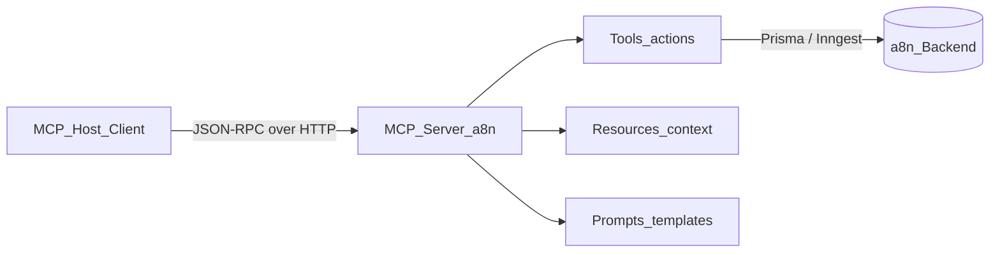

# Introduction to Model Context Protocol (MCP)

> **Audience:** Developers new to MCP  
> **Prerequisites:** Basic understanding of APIs and LLM applications  
> **Last Updated:** May 2026

---

## What you'll learn

- What MCP is and why it was created
- The three core primitives: tools, resources, and prompts
- How MCP differs from REST/OpenAPI for AI agents
- The MCP ecosystem and key terminology

---

## What is MCP?

The **Model Context Protocol (MCP)** is an open standard for connecting AI applications (hosts/clients) to external data sources and tools (servers). Anthropic introduced it to solve a recurring problem: every LLM product reinvented its own plugin format, making integrations fragile and non-portable.

MCP provides a **standardized context layer** between:

- **MCP Host** — the AI application the user interacts with (Cursor, Claude Desktop, custom apps)
- **MCP Server** — a service that exposes capabilities (tools, resources, prompts) to the host
- **MCP Client** — the bridge inside the host that speaks MCP to servers

In a8n, the MCP server lets AI assistants manage workflows, credentials, and executions without custom integration code per client.

---

## The problem MCP solves

Before MCP, connecting an LLM to your product typically meant:

1. Writing custom function-calling schemas per provider (OpenAI, Anthropic, Google)
2. Building one-off plugins for each IDE or chat client
3. Manually stuffing API docs into prompts to reduce hallucinations
4. No standard way to expose read-only context vs executable actions

MCP standardizes all of this into a single protocol with clear primitives and transport options.

---

## Core primitives

MCP servers expose three types of capabilities:

### Tools — executable actions

**Tools** are functions the LLM can invoke. Each tool has:

- A **name** (e.g. `list_workflows`)
- A **description** (helps the model decide when to call it)
- An **input schema** (typically JSON Schema via Zod)
- A **handler** that performs the action and returns a result

**When to use:** The model needs to *do something* — create a workflow, list credentials, trigger an execution.

**a8n example:** 22 tools across workflows, credentials, executions, nodes, system, and API keys.

### Resources — read-only context

**Resources** are addressable content the model can read for context. Each resource has:

- A **URI** (e.g. `a8n://schema/workflow`)
- **Contents** (often markdown or JSON describing schemas)

**When to use:** The model needs to *understand structure* before acting — workflow JSON shape, node type fields, API reference.

**a8n example:** 4 resources including workflow schema, node types, credential types, and full API docs.

### Prompts — guided templates

**Prompts** are reusable message templates the host can fetch and inject into the conversation. They accept arguments and return structured messages.

**When to use:** You want consistent, step-by-step guidance for complex tasks — creating a workflow, debugging an execution.

**a8n example:** `create_workflow`, `debug_execution`, `setup_integration`.

---

## MCP vs REST/OpenAPI for AI agents

| Aspect | REST/OpenAPI | MCP |
|---|---|---|
| **Discovery** | Manual docs or OpenAPI spec | Built-in `tools/list`, `resources/list` |
| **Context** | Model must infer from docs | Resources provide structured context |
| **Actions** | Custom function schemas per provider | Standard `tools/call` |
| **Guidance** | Prompt engineering only | Native prompts primitive |
| **Client support** | Per-integration | One protocol, many hosts |

MCP does not replace your REST/tRPC API. a8n keeps tRPC for the dashboard and adds MCP as an **AI-native interface** with scoped API keys and LLM-oriented resources.

---

## Roles in the ecosystem

| Role | Description | a8n example |
|---|---|---|
| **Host** | Application embedding the LLM | Cursor IDE, Claude Desktop |
| **Client** | MCP protocol implementation inside the host | Cursor's built-in MCP client |
| **Server** | Exposes tools/resources/prompts | `src/mcp/` + `/api/mcp` route |
| **Transport** | How messages are carried | Streamable HTTP |
| **Backend** | Business logic behind the server | Prisma, Inngest, encryption |

---

## How a typical interaction works

1. User asks Cursor: "List my workflows and run the latest one."
2. Cursor's MCP client connects to `http://localhost:3000/api/mcp` with a Bearer API key.
3. Client sends `initialize` to negotiate capabilities.
4. Client calls `tools/list` to discover available tools.
5. Model chooses `list_workflows`, then `execute_workflow`.
6. Server authenticates, checks scopes, runs handlers, returns JSON results.
7. Model summarizes results for the user.

See [02 — Protocol Deep Dive](./02-protocol-deep-dive.md) for message-level detail.

---

## Ecosystem

| Component | Purpose |
|---|---|
| [modelcontextprotocol.io](https://modelcontextprotocol.io/) | Official specification and docs |
| `@modelcontextprotocol/sdk` | TypeScript SDK (used by a8n) |
| **Cursor** | IDE with native Streamable HTTP MCP support |
| **Claude Desktop** | Uses `mcp-remote` bridge for HTTP servers |
| **MCP Inspector** | Debug tool for testing servers |
| **mcp-remote** | npm package bridging stdio clients to HTTP endpoints |

---

## Glossary

| Term | Definition |
|---|---|
| **Host** | AI application that embeds an MCP client |
| **Server** | Service implementing MCP and exposing capabilities |
| **Transport** | Wire protocol (stdio, SSE, Streamable HTTP) |
| **Capability negotiation** | `initialize` handshake declaring supported features |
| **tools/call** | JSON-RPC method to invoke a tool by name |
| **resources/read** | JSON-RPC method to fetch resource contents by URI |
| **prompts/get** | JSON-RPC method to retrieve a prompt template |
| **Scope** | Permission string restricting API key access (e.g. `workflows:read`) |
| **Streamable HTTP** | Stateless HTTP transport for remote MCP servers |

---

## a8n MCP at a glance

| Property | Value |
|---|---|
| Server name | `a8n-mcp-server` |
| Version | `1.0.0` |
| Endpoint | `POST /api/mcp` |
| Transport | Streamable HTTP (stateless) |
| Auth | Bearer token (API key or session) |
| Tools | 22 |
| Resources | 4 |
| Prompts | 3 |

---

## Next steps

- [02 — Protocol Deep Dive](./02-protocol-deep-dive.md) — JSON-RPC messages and lifecycle
- [03 — Transports](./03-transports.md) — why a8n uses Streamable HTTP
- [04 — Architecture](./04-architecture.md) — how this server is structured

---

  Part of the a8n MCP documentation series

