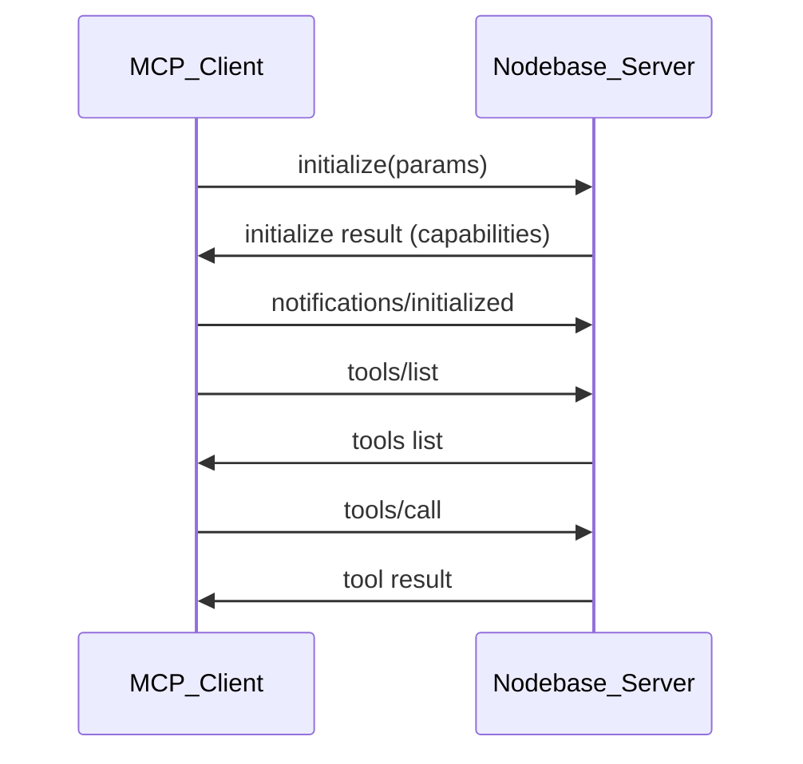
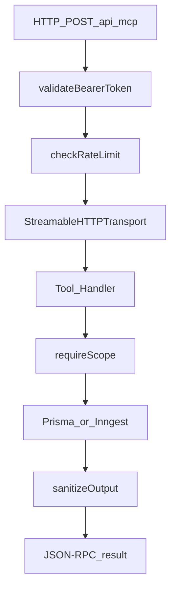

# MCP Protocol Deep Dive

> **Audience:** Developers implementing or debugging MCP integrations  
> **Prerequisites:** [01 — Introduction to MCP](./01-introduction-to-mcp.md)  
> **Last Updated:** May 2026

---

## What you'll learn

- JSON-RPC 2.0 message structure used by MCP
- The initialize handshake and capability negotiation
- Core methods: tools, resources, prompts
- Error handling and stateless vs sessionful servers

---

## Protocol foundation: JSON-RPC 2.0

MCP messages are **JSON-RPC 2.0** payloads sent over a transport (stdio, SSE, or HTTP). Every message is either a **request**, **response**, or **notification**.

### Request shape

```json
{
  "jsonrpc": "2.0",
  "method": "tools/call",
  "params": {
    "name": "list_workflows",
    "arguments": { "page": 1, "pageSize": 10 }
  },
  "id": 1
}
```

### Response shape (success)

```json
{
  "jsonrpc": "2.0",
  "result": {
    "content": [
      {
        "type": "text",
        "text": "{\"workflows\":[...],\"page\":1,\"totalCount\":5}"
      }
    ]
  },
  "id": 1
}
```

### Response shape (error)

```json
{
  "jsonrpc": "2.0",
  "error": {
    "code": -32603,
    "message": "Internal server error"
  },
  "id": 1
}
```

Nodebase tool handlers return results as **text content** containing JSON strings via `mcpJsonResponse()` in `src/mcp/shared/sanitize.ts`.

---

## Capability negotiation

Before tools or resources are used, the client and server perform an **initialize** handshake.



### initialize

The client declares its protocol version and capabilities. The server responds with its own capabilities (tools, resources, prompts support).

### notifications/initialized

After a successful `initialize`, the client sends this notification to indicate it is ready for normal operation.

---

## Core MCP methods

### Tools

| Method | Purpose |
|---|---|
| `tools/list` | Discover all registered tools and their input schemas |
| `tools/call` | Invoke a tool by name with arguments |

**Example — list workflows via curl:**

```bash
curl -X POST http://localhost:3000/api/mcp \
  -H "Content-Type: application/json" \
  -H "Authorization: Bearer n8n_mcp_<your-api-key>" \
  -d '{
    "jsonrpc": "2.0",
    "method": "tools/call",
    "params": {
      "name": "list_workflows",
      "arguments": { "page": 1, "pageSize": 10, "search": "" }
    },
    "id": 1
  }'
```

### Resources

| Method | Purpose |
|---|---|
| `resources/list` | List available resource URIs |
| `resources/read` | Fetch content for a URI (e.g. `n8n://schema/workflow`) |

Resources are ideal for schema reference material the model should read before calling `update_workflow`.

### Prompts

| Method | Purpose |
|---|---|
| `prompts/list` | List available prompt templates |
| `prompts/get` | Retrieve a prompt with arguments filled in |

Prompts return `messages` arrays suitable for injection into the host's conversation — they do not execute tools themselves.

---

## Tool handler lifecycle (Nodebase)

When `tools/call` reaches the Nodebase server:

1. **HTTP route** authenticates Bearer token and checks rate limits
2. **Transport** parses JSON-RPC and routes to the MCP SDK
3. **Tool handler** runs with `extra` context (intended: `authInfo`)
4. **Scope guard** validates the caller has the required permission
5. **Audit logger** records the invocation
6. **Error boundary** catches exceptions and returns user-safe messages
7. **Sanitizer** strips secrets from output before returning



---

## Error model

MCP uses standard JSON-RPC error codes plus application-level errors.

| Code | Meaning | Nodebase usage |
|---|---|---|
| `-32700` | Parse error | Malformed JSON body |
| `-32600` | Invalid request | Missing required fields |
| `-32601` | Method not found | Unknown MCP method |
| `-32602` | Invalid params | Zod validation failure |
| `-32603` | Internal error | Unhandled exception in route or tool |

### HTTP-level errors (before JSON-RPC)

| Status | Cause |
|---|---|
| `401` | Missing or invalid Bearer token |
| `429` | Rate limit exceeded |
| `500` | Unhandled server error |

### Tool-level errors

Tool handlers use `withErrorBoundary()` to catch errors and return structured text responses instead of crashing the transport. Scope violations throw errors like:

```
Missing required scope: workflows:write. Granted scopes: workflows:read, system:read
```

---

## Stateless vs sessionful servers

| Mode | Behavior | Nodebase choice |
|---|---|---|
| **Sessionful** | Server assigns session ID; state persists across requests | Not used |
| **Stateless** | Each request creates fresh server + transport | **Used** |

Nodebase sets `sessionIdGenerator: undefined` on `WebStandardStreamableHTTPServerTransport`, meaning:

- No session store required
- Horizontally scalable in theory
- Auth must be validated on every request
- Slight per-request overhead (new `McpServer` instance each time)

See [03 — Transports](./03-transports.md) for transport-level detail.

---

## Content types in tool results

Nodebase returns tool results as MCP **content** blocks:

```json
{
  "content": [
    {
      "type": "text",
      "text": "{ \"workflows\": [...] }"
    }
  ]
}
```

This text-JSON pattern is universal across MCP clients but means large payloads are not structured at the protocol level. See [09 — Design Decisions](./09-design-decisions.md) for trade-offs.

---

## Pagination pattern

List tools (`list_workflows`, `list_credentials`, `list_executions`) use a shared pagination helper:

**Input:** `page` (1-indexed), `pageSize` (1–100)  
**Output:** `page`, `pageSize`, `totalCount`, `totalPages`, `hasNextPage`, `hasPreviousPage`

---

## Known implementation note

The HTTP route validates authentication before handing off to the MCP SDK, but **auth context injection into tool handlers** (`extra.authInfo`) is a known gap — tools expect `authInfo` from the SDK request context. See [05 — Security & Auth](./05-security-and-auth.md) for current behavior and planned fix.

---

## Next steps

- [03 — Transports](./03-transports.md) — Streamable HTTP in detail
- [06 — Tools Reference](./06-tools-reference.md) — all 22 tools
- [04 — Architecture](./04-architecture.md) — module structure

---

<div align="center">
  <sub>Part of the Nodebase MCP documentation series</sub>
</div>
