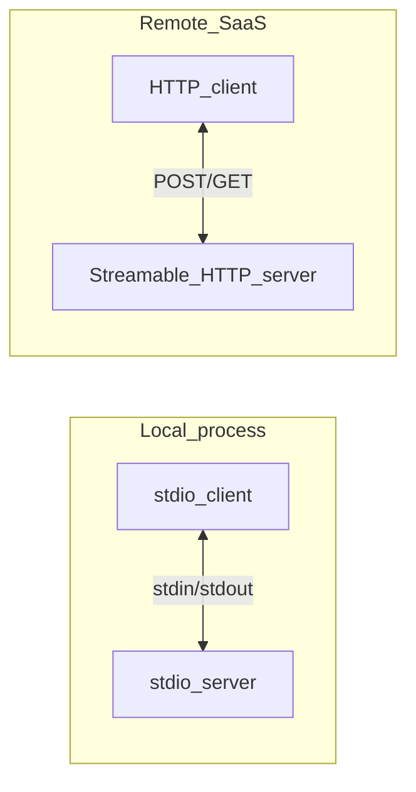
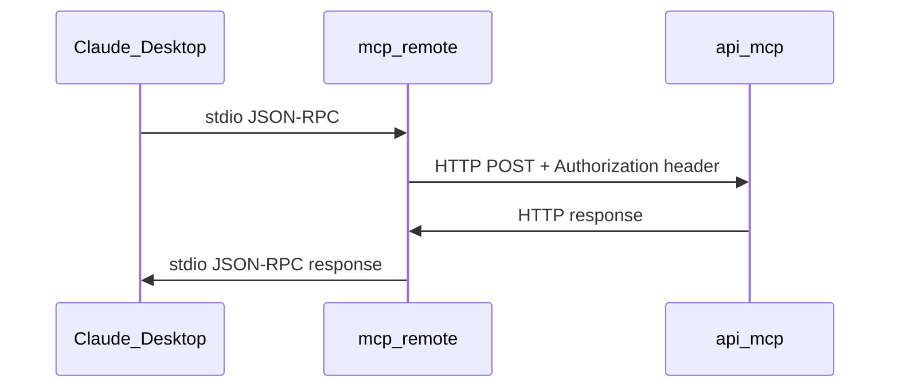

# MCP Transports

> **Audience:** Developers choosing or debugging client connections  
> **Prerequisites:** [01 — Introduction to MCP](./01-introduction-to-mcp.md)  
> **Last Updated:** May 2026

---

## What you'll learn

- The three main MCP transport options and when to use each
- Why a8n uses Streamable HTTP
- How `mcp-remote` bridges stdio-only clients to HTTP
- POST / GET / DELETE semantics on `/api/mcp`

---

## Transport overview

A **transport** is the wire layer that carries JSON-RPC messages between MCP client and server. The protocol logic is identical; only the delivery mechanism differs.



---

## Transport comparison

| Transport | Use case | Pros | Cons |
|---|---|---|---|
| **stdio** | Local CLI tools, subprocess servers | Simple, no network exposure | Cannot serve remote users; one client per process |
| **SSE** (legacy HTTP+SSE) | Older MCP clients | Wide early adoption | Long-lived connections; session complexity |
| **Streamable HTTP** | Remote SaaS, modern IDEs | Stateless, Web Standard Request/Response | Per-request server initialization overhead |

---

## stdio transport

In stdio mode, the MCP server runs as a **child process**. The client writes JSON-RPC to the server's stdin and reads responses from stdout.

**Best for:** Local development tools, Claude Desktop with a local binary, CLI utilities.

**Not suitable for:** Multi-tenant SaaS where users connect over the internet — a8n is a web app, not a subprocess.

---

## SSE transport (legacy)

Early MCP HTTP implementations used **Server-Sent Events** for server-to-client streaming, with separate POST channels for client-to-server messages.

**Characteristics:**

- Long-lived HTTP connections
- Session management required
- More complex deployment behind load balancers

a8n does **not** implement legacy SSE as the primary transport. The route's GET handler supports SSE fallbacks via the SDK transport when clients request it.

---

## Streamable HTTP (a8n choice)

**Streamable HTTP** is the modern MCP transport for remote servers. It uses standard HTTP methods with the MCP JSON-RPC body in POST requests.

### Why a8n uses it

| Requirement | Streamable HTTP fit |
|---|---|
| Deployed Next.js app on Vercel/similar | ✅ Standard API route |
| Cursor native support | ✅ `transport: "streamable-http"` |
| Stateless scaling | ✅ No session store |
| Bearer auth on every request | ✅ Standard `Authorization` header |

### Implementation

```typescript
// src/app/api/mcp/route.ts
const transport = new WebStandardStreamableHTTPServerTransport({
  sessionIdGenerator: undefined, // Stateless mode
});

const server = createMcpServer();
await server.connect(transport);
const response = await transport.handleRequest(request);
```

The SDK class `WebStandardStreamableHTTPServerTransport` works with the Web Standard `Request`/`Response` API used by Next.js App Router.

---

## HTTP route semantics

a8n exposes a single endpoint: **`/api/mcp`**

| Method | Purpose |
|---|---|
| **POST** | Primary MCP protocol traffic (initialize, tools/call, etc.) |
| **GET** | SSE streams and capability discovery; JSON fallback on error |
| **DELETE** | Session cleanup (no-op in stateless mode → `204`) |

All methods require authentication via `Authorization: Bearer <token>`.

### GET fallback response

If the transport cannot handle a GET request, the route returns server metadata:

```json
{
  "name": "a8n-mcp-server",
  "version": "1.0.0",
  "description": "a8n Workflow Automation Platform — MCP Server...",
  "endpoint": "/api/mcp",
  "transport": "streamable-http",
  "auth": "Bearer token (API key or session)"
}
```

---

## mcp-remote bridge pattern

Some clients (Claude Desktop, Antigravity) only support **stdio** MCP servers. The `mcp-remote` npm package bridges them to HTTP:

```json
{
  "mcpServers": {
    "a8n": {
      "command": "npx",
      "args": ["-y", "mcp-remote", "http://localhost:3000/api/mcp"],
      "env": {
        "MCP_HEADERS": "Authorization: Bearer a8n_mcp_<your-api-key>"
      }
    }
  }
}
```

**Flow:**



---

## Cursor configuration (native HTTP)

Cursor supports Streamable HTTP directly — no bridge required:

```json
{
  "mcpServers": {
    "a8n": {
      "url": "http://localhost:3000/api/mcp",
      "transport": "streamable-http",
      "headers": {
        "Authorization": "Bearer a8n_mcp_<your-api-key>"
      }
    }
  }
}
```

Config file location: `.cursor/mcp.json` in the project root.

---

## Production URL

Replace `localhost:3000` with your deployed origin:

```
https://your-app.vercel.app/api/mcp
```

Requirements:

- HTTPS (TLS)
- Valid API key in `Authorization` header
- CORS if browser-based clients connect directly (see [10 — Operations](./10-operations.md))

---

## Rate limit headers

Successful POST responses include rate limit metadata:

| Header | Description |
|---|---|
| `X-RateLimit-Limit` | Max requests per window |
| `X-RateLimit-Remaining` | Requests left in current window |
| `X-RateLimit-Reset` | Milliseconds until window resets |

On `429 Too Many Requests`, `Retry-After` is set in seconds.

---

## Choosing a transport for your client

| Client | Recommended transport | Config |
|---|---|---|
| Cursor | Streamable HTTP | `.cursor/mcp.json` with `url` + `transport` |
| Claude Desktop | stdio via mcp-remote | `claude_desktop_config.json` with `command` + `args` |
| MCP Inspector | Streamable HTTP | UI: URL + Authorization header |
| Antigravity | stdio via mcp-remote | `.gemini/settings.json` |

Full client examples: [10 — Operations](./10-operations.md).

---

## Next steps

- [04 — Architecture](./04-architecture.md) — request lifecycle through modules
- [10 — Operations](./10-operations.md) — deployment and troubleshooting
- [05 — Security & Auth](./05-security-and-auth.md) — Bearer token authentication

---

<div align="center">
  <sub>Part of the a8n MCP documentation series</sub>
</div>
