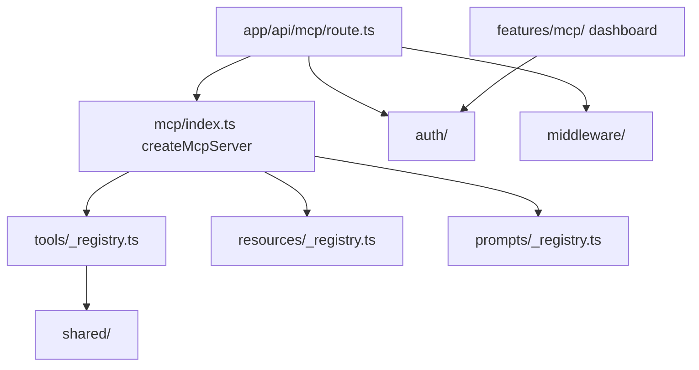
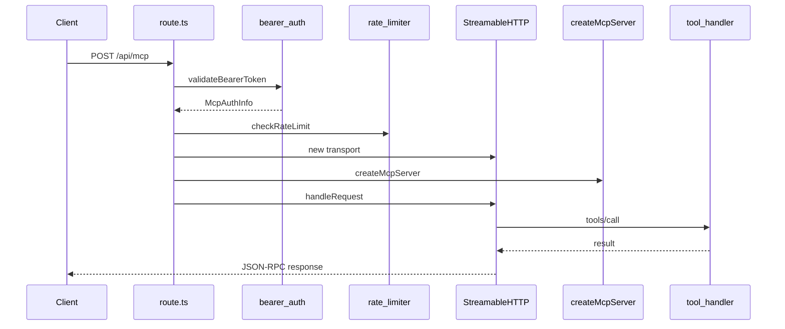

# MCP Server Architecture

> **Audience:** Contributors working on or debugging the MCP module  
> **Prerequisites:** [02 — Protocol Deep Dive](./02-protocol-deep-dive.md), [03 — Transports](./03-transports.md)  
> **Last Updated:** May 2026

---

## What you'll learn

- The `src/mcp/` module layout and responsibilities
- Per-request lifecycle from HTTP to tool handler
- The registry pattern for tools, resources, and prompts
- How the MCP dashboard feature relates to the server

---

## High-level module map



---

## Directory structure

```
src/mcp/
├── index.ts                 # createMcpServer() factory
├── config.ts                # SERVER_NAME, rate limits, env flags
├── auth/
│   ├── api-key.service.ts   # Generate, hash, validate, revoke keys
│   ├── bearer-auth.middleware.ts
│   ├── scopes.ts            # Permission definitions
│   └── types.ts             # McpAuthInfo, AuthResult
├── middleware/
│   ├── scope-guard.ts       # requireScope()
│   ├── rate-limiter.ts      # In-memory sliding window
│   ├── audit-logger.ts      # Structured audit + metrics
│   └── error-boundary.ts    # withErrorBoundary()
├── shared/
│   ├── sanitize.ts          # Output redaction, mcpJsonResponse
│   └── pagination.ts        # normalizePagination, buildPaginationOutput
├── tools/
│   ├── _registry.ts         # registerAllTools()
│   ├── workflows/           # 7 tools
│   ├── credentials/         # 6 tools
│   ├── executions/          # 2 tools
│   ├── nodes/               # 1 tool
│   ├── system/              # 3 tools
│   └── api-keys/            # 3 tools
├── resources/
│   ├── _registry.ts         # 4 static markdown resources
│   └── *.resource.ts
└── prompts/
    ├── _registry.ts         # 3 guided prompts
    └── *.prompt.ts
```

---

## Server factory

`createMcpServer()` in `src/mcp/index.ts` is the central assembly point:

1. Instantiate `McpServer` with name and version from `MCP_CONFIG`
2. Call `registerAllTools(server)`
3. Call `registerAllResources(server)`
4. Call `registerAllPrompts(server)`
5. Return the configured server (not yet connected to transport)

A **new instance is created per HTTP request** — the server is stateless.

---

## HTTP route lifecycle

Every `POST /api/mcp` request follows this sequence (see `src/app/api/mcp/route.ts`):

| Step | Action | Module |
|---|---|---|
| 1 | Extract and validate Bearer token | `bearer-auth.middleware.ts` |
| 2 | Check rate limit (30/min default) | `rate-limiter.ts` |
| 3 | Create audit context for `mcp_request` | `audit-logger.ts` |
| 4 | Create `WebStandardStreamableHTTPServerTransport` (stateless) | SDK |
| 5 | `createMcpServer()` + `server.connect(transport)` | `index.ts` |
| 6 | `transport.handleRequest(request)` — JSON-RPC dispatch | SDK |
| 7 | Inject `X-RateLimit-*` headers on response | `rate-limiter.ts` |
| 8 | Audit success or failure | `audit-logger.ts` |



---

## Registry pattern

### Tools

`tools/_registry.ts` imports domain registrars:

```typescript
export function registerAllTools(server: McpServer): void {
  registerWorkflowTools(server);    // 7
  registerCredentialTools(server);  // 6
  registerExecutionTools(server);   // 2
  registerNodeTools(server);        // 1
  registerSystemTools(server);       // 3
  registerApiKeyTools(server);      // 3
}
```

Each domain folder has an `index.ts` that calls individual `registerX(server)` functions from tool files.

**To add a tool:** create a file in the appropriate domain folder, export `registerMyTool(server)`, import it in the domain `index.ts`.

### Resources

Four static markdown resources registered in `resources/_registry.ts`. Content is embedded at build time — no database queries.

### Prompts

Three prompt templates in `prompts/_registry.ts`. Each returns a `messages` array for the host LLM.

---

## Tool handler pattern

Every tool follows the same structure:

```typescript
server.tool("tool_name", "Description", inputSchema, async (args, extra) => {
  const auth = (extra as any).authInfo as McpAuthInfo;
  requireScope(auth, "required:scope");

  const audit = createAuditContext({ ... });

  return withErrorBoundary("tool_name", async () => {
    // Prisma / Inngest logic
    audit.success();
    return mcpJsonResponse(result);
  });
});
```

Cross-cutting concerns are **explicit function calls**, not SDK middleware plugins.

---

## Shared utilities

### sanitize.ts

- `mcpJsonResponse(data)` — stringify JSON as MCP text content
- `sanitizeOutput(obj)` — redact `value`, `password`, `token`, `rawKey`, etc.
- `sanitizeInput(obj)` — redact sensitive keys before audit logging

### pagination.ts

- `normalizePagination({ page, pageSize })` → `{ page, pageSize, skip, take }`
- `buildPaginationOutput(page, pageSize, totalCount)` → pagination metadata

---

## Dashboard feature (`src/features/mcp/`)

The MCP **dashboard UI** at `/mcp` is separate from the MCP protocol server but shares the API key service:

| Component | Purpose |
|---|---|
| `server/routers.ts` | tRPC: `createKey`, `listKeys`, `revokeKey` |
| `components/` | Key list, create modal, client config snippets |
| `hooks/use-mcp-keys.ts` | React Query hooks |

Users manage keys in the browser; AI clients use keys via Bearer auth on `/api/mcp`.

---

## Configuration

`src/mcp/config.ts` exports `MCP_CONFIG`:

| Key | Value |
|---|---|
| `SERVER_NAME` | `a8n-mcp-server` |
| `SERVER_VERSION` | `1.0.0` |
| `ENDPOINT_PATH` | `/api/mcp` |
| `API_KEY_PREFIX` | `a8n_mcp_` |
| `RATE_LIMIT.FREE_TIER` | 30 req/min |
| `RATE_LIMIT.PRO_TIER` | 120 req/min |
| `AUDIT_LOG_ENABLED` | env `MCP_AUDIT_LOG_ENABLED` |
| `CORS_ORIGINS` | env `MCP_CORS_ORIGINS` (defined, not wired to route) |

---

## Dependencies

| Package | Role |
|---|---|
| `@modelcontextprotocol/sdk` | McpServer, Streamable HTTP transport |
| `zod` | Tool input schemas |
| `@/lib/db` | Prisma client |
| `@/lib/encryption` | Credential value encryption |
| `@/inngest/utils` | `sendWorkflowExecution()` |

---

## Next steps

- [08 — Platform Integration](./08-platform-integration.md) — Prisma, Inngest, tRPC parity
- [11 — Extending the Server](./11-extending-the-server.md) — add new tools
- [05 — Security & Auth](./05-security-and-auth.md) — auth and scopes

---

<div align="center">
  <sub>Part of the a8n MCP documentation series</sub>
</div>
