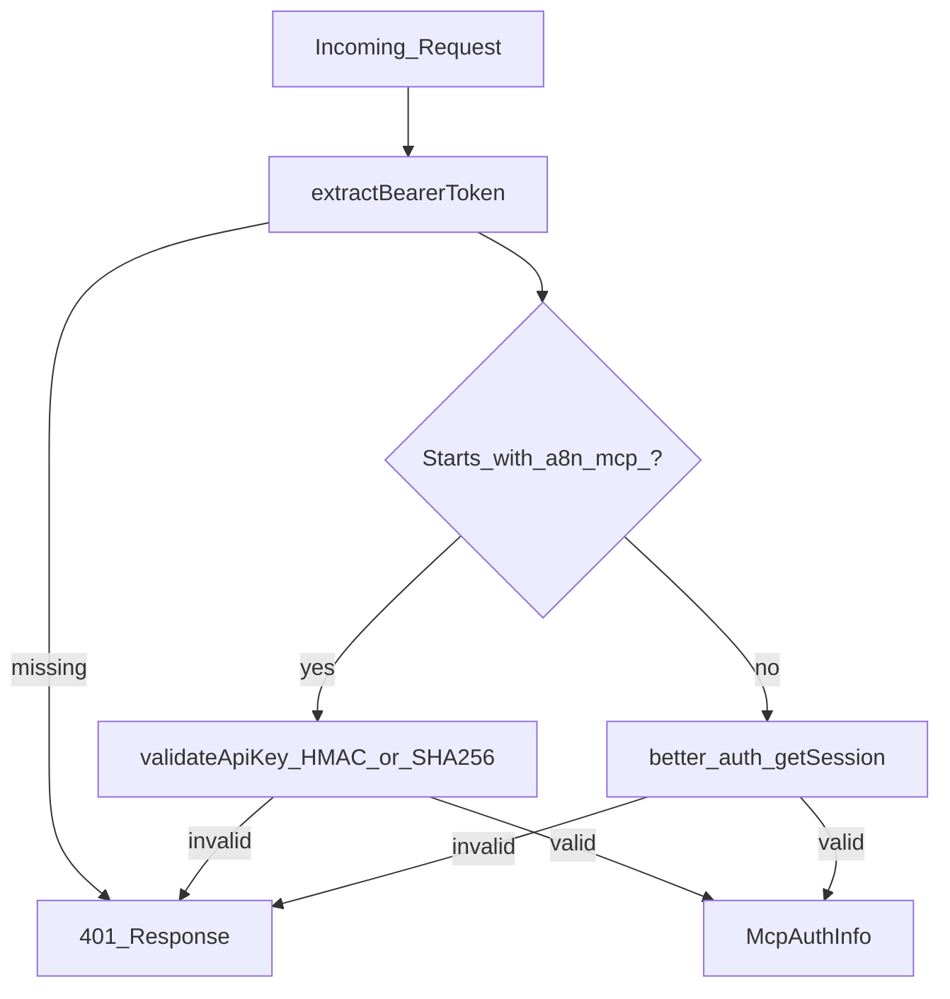
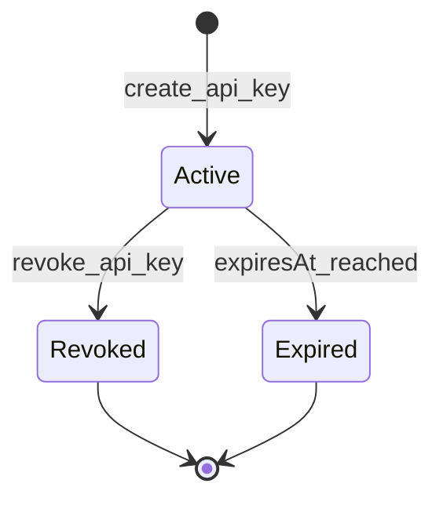

# MCP Security and Authentication

> **Audience:** Operators and security reviewers  
> **Prerequisites:** [04 — Architecture](./04-architecture.md)  
> **Last Updated:** June 24, 2026

---

## What you'll learn

- Authentication methods (API keys vs sessions)
- Scope-based permission model
- Defense-in-depth for secrets
- Rate limiting and audit logging
- Known limitations and planned fixes

---

## Authentication overview

Every request to `/api/mcp` requires a Bearer token:

```
Authorization: Bearer <token>
```



---

## Authentication methods

### API keys (recommended for AI clients)

| Property | Value |
|---|---|
| Prefix | `a8n_mcp_` |
| Length | 48 random characters (base64url) |
| Storage | HMAC-SHA-256 when `MCP_API_KEY_HMAC_SECRET` is set; legacy SHA-256 lookup remains supported. Raw key shown once at creation |
| Scopes | Configurable per key |
| Tracking | `lastUsedAt` updated on each use |

**Create via:** MCP `create_api_key` tool, dashboard `/mcp`, or `scripts/mcp-seed-key.ts` (dev).

### Session tokens (dashboard / testing)

Any Bearer token **not** starting with `a8n_mcp_` is validated via Better Auth `getSession()`.

| Property | Value |
|---|---|
| Scopes | **All scopes** (`ALL_SCOPES`) — full access |
| Use case | Development, dashboard testing |
| Production | Avoid using session tokens for automated clients |

---

## Scope model

Defined in `src/mcp/auth/scopes.ts`:

| Scope | Grants |
|---|---|
| `workflows:read` | List and get workflows |
| `workflows:write` | Create, update, rename, delete workflows |
| `workflows:execute` | Trigger Inngest executions |
| `credentials:read` | List/get credential metadata (no secrets) |
| `credentials:write` | Create, update, delete credentials |
| `executions:read` | List/get execution history |
| `system:read` | whoami, server_info, health_check, list_node_types |
| `api_keys:manage` | Create, list, revoke API keys |
| `*` | Wildcard — all operations |

### Default scopes for new keys

```typescript
["workflows:read", "credentials:read", "executions:read", "system:read"]
```

### Scope guard

Each tool calls `requireScope(auth, "required:scope")` before executing. Missing scope throws:

```
Permission denied: this operation requires the "workflows:write" scope.
Your API key has scopes: [workflows:read, system:read].
```

---

## API key lifecycle



| Stage | Behavior |
|---|---|
| **Create** | Returns `rawKey` once; stores hash + prefix + scopes |
| **Use** | Hash lookup; updates `lastUsedAt` (fire-and-forget) |
| **Revoke** | Sets `revokedAt`; immediate invalidation |
| **Expire** | Optional `expiresAt`; rejected after date |

---

## Defense layers

### Layer 1 — HTTP authentication

`validateBearerToken()` in `bearer-auth.middleware.ts` rejects unauthenticated requests before MCP processing.

### Layer 2 — Rate limiting

In-memory sliding window per `apiKeyId` or `userId`:

| Tier | Limit | Status |
|---|---|---|
| Free | 30 requests / minute | Active (default) |
| Pro | 120 requests / minute | Config exists; route always uses free tier |

Returns `429` with `Retry-After` and `X-RateLimit-*` headers.

### Layer 3 — Per-tool scope check

`requireScope()` enforces least privilege per operation.

### Layer 4 — Data access control

All Prisma queries filter by `userId: auth.userId` — no cross-tenant access.

### Layer 5 — Secret redaction

| Mechanism | Location |
|---|---|
| `SAFE_CREDENTIAL_SELECT` | Excludes `value` column from queries |
| `sanitizeOutput()` | Redacts `value`, `password`, `token`, `rawKey`, etc. |
| `sanitizeInput()` | Redacts secrets before audit log output |

### Layer 6 — Audit logging

Structured JSON logs per tool invocation (when `MCP_AUDIT_LOG_ENABLED` is true) and optional database persistence through `McpAuditLog` (when `MCP_AUDIT_DB_ENABLED` is not `false`):

- User ID, API key ID, auth method
- Tool name, duration, success/failure
- Sanitized input (secrets redacted)
- Query recent persisted entries with `list_mcp_audit_events`

---

## Credential security

- Values encrypted with AES-256 (Cryptr) via `ENCRYPTION_KEY`
- MCP tools never return decrypted values
- `create_credential` accepts plaintext once; stored encrypted immediately
- Nodes reference credentials by `credentialId` only

---

## API key hashing

```typescript
hashApiKey(rawKey) = HMAC-SHA-256(rawKey, MCP_API_KEY_HMAC_SECRET)
// Falls back to SHA-256(rawKey) when no HMAC secret is configured.
// Validation checks both preferred and legacy hashes for compatibility.
```

**Recommendation:** Set `MCP_API_KEY_HMAC_SECRET` in production so newly created keys use a server-side pepper. Existing SHA-256 keys continue to validate during migration.

---

## Auth context injection

The HTTP route validates Bearer auth, passes the resulting `McpAuthInfo` into `createMcpServer(auth)`, and all tools/resources read it through shared auth-context helpers before enforcing scopes.


---

## Production recommendations

| Practice | Rationale |
|---|---|
| Use scoped API keys | Never `*` in production automation |
| Set `expiresInDays` | Limit blast radius of leaked keys |
| Rotate keys regularly | Revoke old keys via dashboard or `revoke_api_key` |
| HTTPS only | Protect Bearer tokens in transit |
| Monitor audit logs | Detect unusual tool usage patterns |
| Separate keys per client | Cursor vs CI vs Inspector |

---

## CORS

`MCP_CORS_ORIGINS` is applied in the route handler for `GET`, `POST`, `DELETE`, and `OPTIONS`. Use explicit origins in production; `*` is convenient for local development but too broad for hosted deployments.

---

## Next steps

- [10 — Operations](./10-operations.md) — client setup and troubleshooting
- [09 — Design Decisions](./09-design-decisions.md) — security trade-offs

---

<div align="center">
  <sub>Part of the a8n MCP documentation series</sub>
</div>
