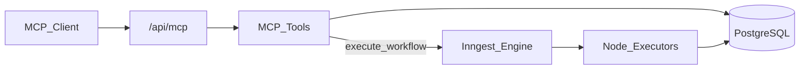
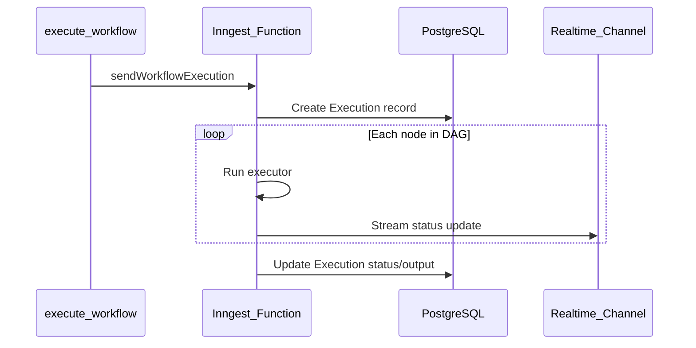

# MCP Platform Integration

> **Audience:** Developers understanding how MCP connects to a8n internals  
> **Prerequisites:** [04 — Architecture](./04-architecture.md), [WORKFLOW_ENGINE.md](../WORKFLOW_ENGINE.md)  
> **Last Updated:** May 2026

---

## What you'll learn

- End-to-end data flow from MCP client to Inngest execution
- How MCP tools map to tRPC procedures and Prisma models
- Credential encryption and workflow graph representation
- What MCP deliberately does not do

---

## End-to-end data flow



1. AI client calls `execute_workflow` via MCP
2. Tool validates auth and scope, loads workflow from Prisma
3. Tool calls `sendWorkflowExecution({ workflowId })` from `@/inngest/utils`
4. Inngest function runs node executors in `src/features/executions/`
5. Execution record updated in Prisma; client reads via `get_execution`

MCP **never runs node executors directly** — it only triggers Inngest.

---

## Parallel stack to tRPC

MCP tools call **Prisma directly**, not tRPC routers. This avoids coupling to tRPC session context but creates a **parallel code path** that must stay in sync.

| Operation | MCP Tool | tRPC Procedure | Backend |
|---|---|---|---|
| List workflows | `list_workflows` | `workflows.getMany` | Prisma |
| Get workflow | `get_workflow` | `workflows.getOne` | Prisma + graph transform |
| Create workflow | `create_workflow` | `workflows.create` | Prisma |
| Update workflow | `update_workflow` | `workflows.update` | Prisma transaction |
| Rename workflow | `rename_workflow` | `workflows.updateName` | Prisma |
| Delete workflow | `delete_workflow` | `workflows.remove` | Prisma |
| Execute workflow | `execute_workflow` | `workflows.execute` | Inngest |
| List credentials | `list_credentials` | `credentials.getMany` | Prisma |
| Create credential | `create_credential` | `credentials.create` | Prisma + encrypt |
| List executions | `list_executions` | `executions.getMany` | Prisma |
| Get execution | `get_execution` | `executions.getOne` | Prisma |

### Known parity differences

| Behavior | tRPC | MCP |
|---|---|---|
| Create workflow | `premiumProcedure` (Pro subscription) | No premium check |
| Create credential | `premiumProcedure` | No premium check |
| Auth context | Session from tRPC context | Bearer + scopes (see auth gap in [05](./05-security-and-auth.md)) |

---

## Workflow graph model

The database stores **nodes** and **connections** as separate Prisma models. MCP and the editor expose a **React Flow–like** graph:

**`get_workflow` output shape:**

```json
{
  "id": "...",
  "name": "my-workflow",
  "nodes": [
    {
      "id": "node-1",
      "type": "MANUAL_TRIGGER",
      "position": { "x": 0, "y": 0 },
      "data": { "label": "Manual Trigger" }
    }
  ],
  "edges": [
    {
      "id": "edge-1",
      "source": "node-1",
      "target": "node-2",
      "sourceHandle": "main",
      "targetHandle": "main"
    }
  ]
}
```

**`update_workflow`** performs a **full replacement**: deletes all existing nodes and connections, then recreates from the provided arrays. This matches the tRPC `workflows.update` transaction semantics.

---

## Credential encryption

| Step | Implementation |
|---|---|
| Create | `create_credential` accepts plaintext `value`, calls `encrypt()` from `@/lib/encryption` |
| Storage | AES-256 via Cryptr; stored in `Credential.value` column |
| Read | `SAFE_CREDENTIAL_SELECT` excludes `value`; `sanitizeOutput` redacts if leaked |
| Node link | Nodes reference `credentialId` in `data`; executors decrypt at runtime |

MCP **never returns** decrypted credential values in tool responses.

---

## Node types

`list_node_types` returns the Prisma `NodeType` enum plus hardcoded metadata in `NODE_TYPE_METADATA`:

| Category | Types |
|---|---|
| Triggers | `INITIAL`, `MANUAL_TRIGGER`, `GOOGLE_FORM_TRIGGER`, `STRIPE_TRIGGER` |
| Executors | `HTTP_REQUEST`, `OPENAI`, `ANTHROPIC`, `GEMINI`, `DISCORD`, `SLACK` |

Supported credential types for `create_credential`: `OPENAI`, `ANTHROPIC`, `GEMINI`.

---

## Execution flow



Clients poll execution status via `list_executions` or `get_execution` — there is no MCP streaming of execution progress today.

---

## User isolation

All data access is scoped by `auth.userId`:

- Workflows: `where: { userId: auth.userId }`
- Credentials: `where: { userId: auth.userId }`
- Executions: via workflow ownership check

Cross-user access is prevented at the Prisma query level.

---

## What MCP does not do

| Capability | Reason |
|---|---|
| Run node executors synchronously | Execution is async via Inngest |
| Return raw credential secrets | Security policy |
| Manage subscriptions/billing | Not in MCP scope |
| Edit workflow UI state | MCP is API-only |
| Webhook registration | Handled by dedicated API routes |

---

## Inngest integration point

```typescript
// execute_workflow tool calls:
import { sendWorkflowExecution } from "@/inngest/utils";

await sendWorkflowExecution({ workflowId: args.id });
```

Same entry point as the dashboard "Run" button via `workflows.execute` tRPC mutation.

---

## Next steps

- [06 — Tools Reference](./06-tools-reference.md) — per-tool inputs and examples
- [WORKFLOW_ENGINE.md](../WORKFLOW_ENGINE.md) — executor internals
- [DATABASE.md](../DATABASE.md) — Prisma schema

---

<div align="center">
  <sub>Part of the a8n MCP documentation series</sub>
</div>
