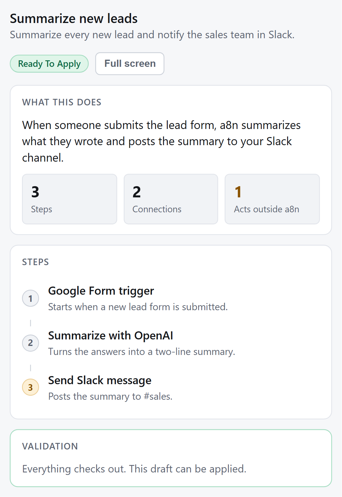
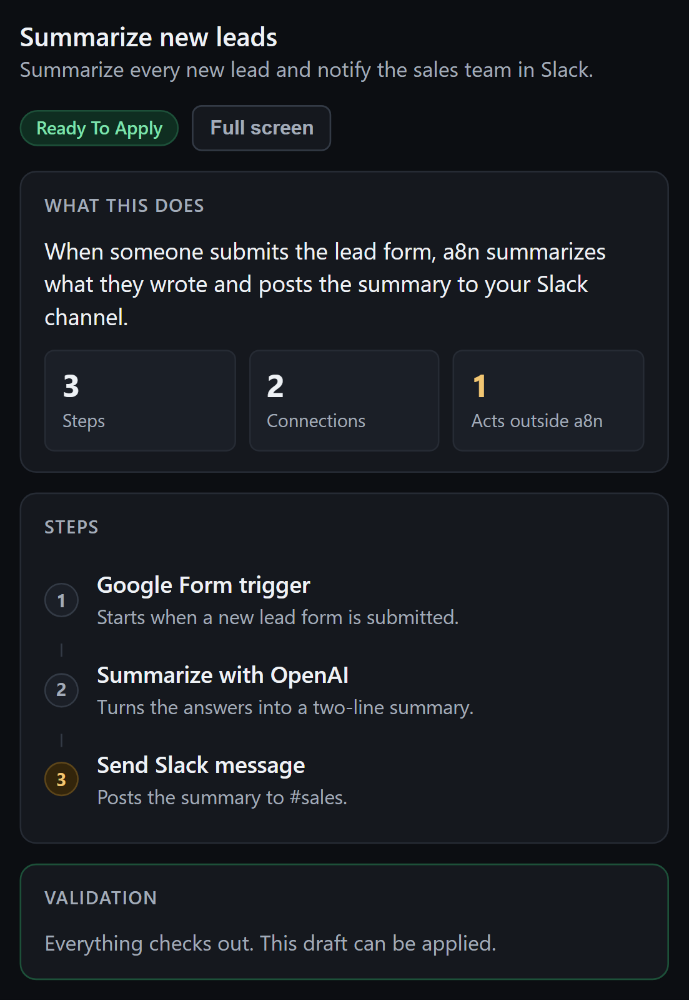
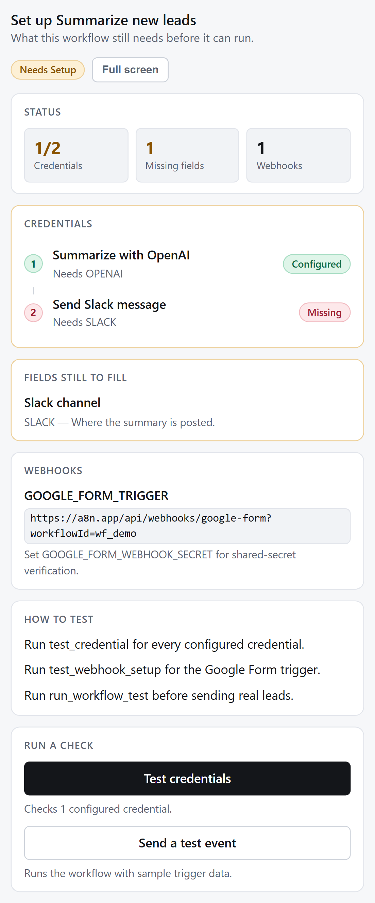
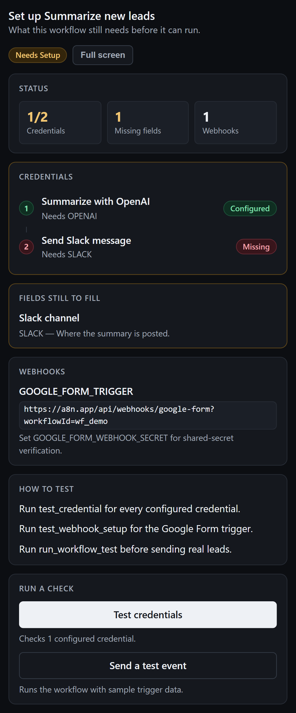
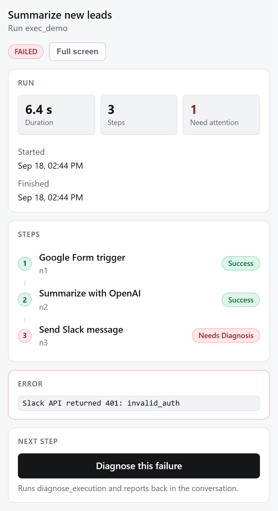
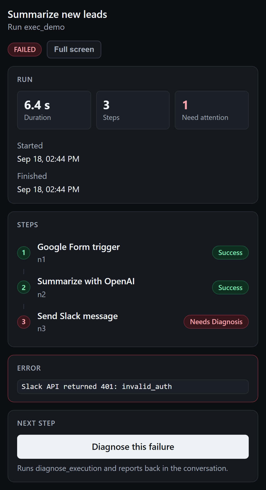
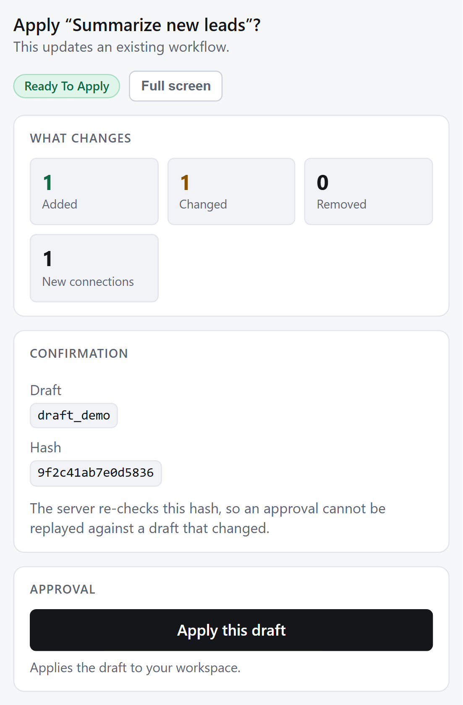
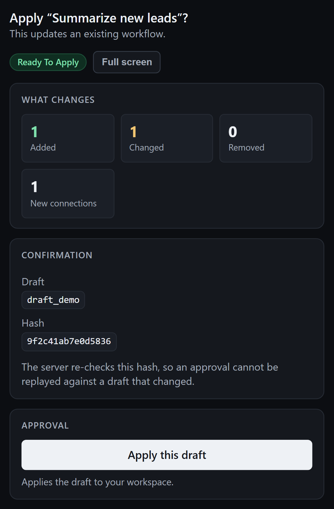

# MCP App widget screenshots

Each widget rendered through the real MCP Apps postMessage handshake, at the
420px width a host inline frame typically gives, in both host themes.

Regenerate:

```bash
pnpm build:mcp-apps-ui
PLAYWRIGHT_SKIP_WEB_SERVER=true npx playwright test \
  --config playwright.config.mjs widget-screenshots --project=chromium
```

The viewport is pinned in the spec so two runs differ only by the change under
review.

| Widget | Light | Dark |
|---|---|---|
| Workflow draft preview |  |  |
| Workflow setup checklist |  |  |
| Execution timeline |  |  |
| Workflow approval |  |  |

The dark column is driven by the host setting `data-theme="dark"`, not by the
OS preference — which is the case that used to render a light widget inside a
dark host.

## What the screenshots do not cover

They show the populated state. The waiting, streaming, disconnected and
empty states, the interaction paths (apply, diagnose, test credentials, test
webhook), secret redaction, the CSP, and narrow-width layout are covered by
`tests/e2e/mcp/widgets.spec.ts` instead, because a screenshot cannot show that
a button actually fired the right tool call.
