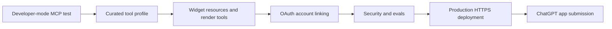

# Phase-wise Implementation Plan

This plan converts the existing a8n MCP server into a ChatGPT App.

## Final definition of done

a8n is done as a ChatGPT App when:

- A user can find or add a8n from ChatGPT Apps or a direct app listing link.
- The user can connect their a8n account through OAuth.
- ChatGPT can list a8n tools during connector creation.
- ChatGPT can invoke a curated set of a8n tools.
- ChatGPT can render a8n widgets for workflow drafts, setup checklists, execution timelines, and approval screens.
- Write actions are permission-aware and require confirmation where needed.
- The app passes MCP Inspector tests, ChatGPT developer-mode tests, and OpenAI submission checks.

## Phase 0: Baseline audit and requirements lock

Status: implemented.

### Objectives

- Confirm current MCP capabilities.
- Confirm ChatGPT Apps requirements.
- Define MVP and production scope.

### Tasks

- Read official ChatGPT Apps and Apps SDK docs.
- Audit current a8n MCP route, auth, tools, resources, prompts, and security middleware.
- Identify gaps for OAuth, app widgets, CSP, metadata, testing, and submission.
- Create docs under `docs/mcp/mcp-apps/`.

### Deliverables

- `README.md`
- `00-current-state-audit.md`
- `01-phase-wise-implementation-plan.md`
- `02-app-surface-and-ux.md`
- `03-auth-security-submission-checklist.md`
- `04-phase-0-1-runbook.md`

### Acceptance criteria

- Clear implementation phases exist.
- Current gaps are documented.
- The final ChatGPT user journey is explicit.
- Phase 0 implementation artifacts are linked from the MCP docs hub.

## Phase 1: Private developer-mode MCP connection

Purpose: prove ChatGPT can reach the existing a8n MCP endpoint.

Status: implemented as local/tunnel readiness tooling and runbook. Manual ChatGPT developer-mode connector creation still happens in ChatGPT.

### Objectives

- Connect ChatGPT developer mode to a8n MCP.
- Validate tool discovery.
- Validate basic tool calls.

### Tasks

1. Deploy or tunnel the app over HTTPS.

   Development options:

   - Secure MCP Tunnel.
   - ngrok.
   - Cloudflare Tunnel.

2. Confirm the public MCP endpoint:

   ```txt
   https://<public-host>/api/mcp
   ```

3. Create a ChatGPT developer-mode connector.

   Metadata draft:

   ```txt
   Name: a8n
   Description: Build, inspect, execute, and debug a8n workflow automations from ChatGPT.
   Connector URL: https://<public-host>/api/mcp
   ```

4. Use a development API key or session token for initial testing if the connector setup allows manual bearer auth.

5. Test basic read-only tools:

   - `server_info`
   - `whoami`
   - `list_node_types`
   - `list_workflows`

6. Capture failure modes:

   - Authentication challenge behavior.
   - CORS issues.
   - Tool schema parsing issues.
   - Rate-limit behavior.

### Code changes

Minimal for this phase:

- Configure `MCP_CORS_ORIGINS` appropriately.
- Ensure production URL env vars are correct:

  ```txt
  NEXT_PUBLIC_APP_URL
  NEXT_PUBLIC_WEBHOOK_BASE_URL
  APP_URL
  ```
- Add `pnpm mcp:seed-key` for creating a development MCP key.
- Add `pnpm mcp:chatgpt:check` for verifying endpoint reachability, MCP initialization, tool discovery, and basic read-only tool calls.
- Add `scripts/mcp-chatgpt-phase1-check.ts` as the repeatable readiness checker.
- Add `04-phase-0-1-runbook.md` with localhost, HTTPS tunnel, and ChatGPT developer-mode steps.

### Acceptance criteria

- ChatGPT can create a developer-mode connector pointing at a8n.
- ChatGPT can list tools.
- At least four read-only tools can be called successfully.
- Failures return clean MCP errors, not stack traces.
- The readiness checker passes against localhost and the HTTPS tunnel before testing in ChatGPT.

## Phase 2: Curate the ChatGPT app tool profile

Purpose: reduce the broad 53-tool MCP surface into a ChatGPT-friendly app surface.

Status: implemented as a profile-selectable curated tool surface.

### Objectives

- Define which tools should be visible to ChatGPT.
- Add metadata that improves tool discovery and approval behavior.
- Keep advanced tools available for other MCP clients.

### Tasks

1. Create an app profile concept.

   Suggested environment flag:

   ```txt
   MCP_APP_PROFILE=chatgpt
   ```

2. Split tools into categories:

   - App-facing read tools.
   - App-facing write tools.
   - App-facing render tools.
   - Advanced MCP-only tools.
   - Admin/API-key tools.

3. Add annotations where supported:

   - read-only tools: read-only annotations.
   - mutation tools: write annotations.
   - destructive tools: destructive/important action descriptions.
   - external side-effect tools: clear descriptions and approval language.

4. Add `outputSchema` to app-facing tools.

5. Make tool descriptions user-intent based.

   Poor:

   ```txt
   Update workflow.
   ```

   Better:

   ```txt
   Safely update a saved a8n workflow graph after validation and user approval.
   ```

6. Hide or de-prioritize sensitive/admin tools for ChatGPT:

   - API key management.
   - Raw credential creation/update.
   - Security audit tools not intended for regular users.
   - Full graph replacement unless guarded by validation and approval.

### Code changes

Implemented:

- Added `src/mcp/app-profile.ts`.
- Added ChatGPT profile propagation through `src/mcp/index.ts`.
- Added request-level profile selection in `src/app/api/mcp/route.ts`.
- Added curated registration in `src/mcp/tools/chatgpt-profile.ts`.
- Updated `src/mcp/tools/_registry.ts` to register either the default 53-tool surface or the 28-tool ChatGPT surface.
- Updated `server_info` to report the active app profile and profile-specific capability counts.

Use either:

```txt
MCP_APP_PROFILE=chatgpt
```

or:

```txt
/api/mcp?profile=chatgpt
```

for ChatGPT developer-mode testing.

### Recommended MVP tool profile

| Capability | Tools |
|---|---|
| Discover | `list_workflows`, `get_workflow`, `explain_workflow`, `list_node_types`, `search_capabilities` |
| Build safely | `plan_workflow_from_goal`, `create_workflow_draft`, `answer_workflow_draft_questions`, `validate_workflow_draft`, `preview_workflow_diff`, `apply_workflow_draft` |
| Setup | `get_workflow_setup_checklist`, `get_integration_setup_guide`, `test_credential`, `test_webhook_setup` |
| Run | `execute_workflow_and_wait`, `run_workflow_test` |
| Debug | `get_execution_timeline`, `diagnose_execution`, `suggest_workflow_fix`, `apply_workflow_fix` |

### Acceptance criteria

- ChatGPT tool list is understandable and not overwhelming.
- Every app-facing tool has a clear description.
- Every app-facing tool has validation-friendly inputs.
- Every app-facing tool returns predictable structured output.
- Destructive or externally visible actions are clearly marked in descriptions and guarded in code.

## Phase 3: Add Apps SDK resources and widgets

Purpose: turn current app-style resources into ChatGPT-renderable widgets.

Status: implemented with MCP Apps metadata on resources and render tools.

### Objectives

- Add MCP Apps-compatible widget resources.
- Link render tools to widgets.
- Keep data separation between model-visible and widget-only payloads.

### Tasks

1. Add Apps SDK package support.

   Official examples use:

   ```txt
   @modelcontextprotocol/ext-apps
   ```

   Current project has:

   ```txt
   @modelcontextprotocol/sdk
   ```

   Add the extension package if implementation requires it.

2. Create a new module:

   ```txt
   src/mcp/apps/
   ```

   Suggested files:

   ```txt
   src/mcp/apps/register-chatgpt-app.ts
   src/mcp/apps/resources/workflow-draft-preview.widget.ts
   src/mcp/apps/resources/setup-checklist.widget.ts
   src/mcp/apps/resources/execution-timeline.widget.ts
   src/mcp/apps/resources/approval.widget.ts
   src/mcp/apps/tools/render-workflow-draft.tool.ts
   src/mcp/apps/tools/render-setup-checklist.tool.ts
   src/mcp/apps/tools/render-execution-timeline.tool.ts
   src/mcp/apps/tools/render-approval.tool.ts
   ```

3. Convert HTML resources to app widget resources.

   Target MIME type:

   ```txt
   text/html;profile=mcp-app
   ```

4. Add widget metadata.

   Each widget resource should include:

   ```json
   {
     "_meta": {
       "ui": {
         "csp": {
           "connectDomains": ["https://a8n.example.com"],
           "resourceDomains": ["https://a8n.example.com"]
         },
         "domain": "https://a8n.example.com",
         "prefersBorder": true
       },
       "openai/widgetDescription": "Shows a workflow draft preview and validation state."
     }
   }
   ```

5. Link render tools to widgets.

   Tool metadata should include:

   ```json
   {
     "_meta": {
       "ui": { "resourceUri": "ui://a8n/workflow-draft-preview.html" },
       "openai/outputTemplate": "ui://a8n/workflow-draft-preview.html",
       "openai/toolInvocation/invoking": "Preparing workflow preview...",
       "openai/toolInvocation/invoked": "Workflow preview ready."
     }
   }
   ```

6. Use `_meta` correctly in tool results.

   - `structuredContent`: concise, model-visible JSON.
   - `content`: short narration.
   - `_meta`: UI-only detail.

7. Add interactive widget actions.

   For example:

   - Approval widget can call `apply_workflow_draft`.
   - Timeline widget can call `diagnose_execution`.
   - Setup widget can call `test_credential`.

   Use `window.openai.callTool` only for actions that the widget should initiate.

### Code changes

Implemented:

- Added `src/mcp/apps/widget-resources.ts`.
- Added `src/mcp/apps/render-tools.ts`.
- Added `src/mcp/apps/index.ts`.
- Exported shared data builders from `src/mcp/resources/app-resources.resource.ts`.
- Updated `src/mcp/resources/_registry.ts` to register ChatGPT widget resources only for the ChatGPT profile.
- Extended `scripts/mcp-chatgpt-phase1-check.ts` so the same checker validates Phase 2/3 when the endpoint uses `profile=chatgpt`.
- Added `docs/mcp/mcp-apps/05-phase-2-3-runbook.md`.

The current implementation uses the installed `@modelcontextprotocol/sdk` directly because it supports tool `_meta`, resource content `_meta`, annotations, and output schemas needed for the Apps metadata. No extra Apps SDK package was required for this phase.

### Acceptance criteria

- MCP Inspector can render all widgets.
- ChatGPT can render all widgets.
- Widgets do not display raw secrets.
- Widgets work in light and dark mode.
- Widgets remain useful even if JavaScript bridge calls fail.
- CSP is exact and submission-ready.

## Phase 4: Implement ChatGPT OAuth account linking

Purpose: support production-grade "Connect a8n" behavior.

Status: implemented with DB-backed opaque OAuth tokens, PKCE authorization code flow, metadata endpoints, dynamic client registration, and MCP bearer validation.

### Objectives

- Let ChatGPT connect a user to their a8n account through OAuth.
- Issue scoped access tokens for MCP calls.
- Reject unauthenticated calls with MCP-compatible OAuth challenges.

### Tasks

1. Add protected resource metadata endpoint:

   ```txt
   GET /.well-known/oauth-protected-resource
   ```

   Response should include:

   ```json
   {
     "resource": "https://a8n.example.com",
     "authorization_servers": ["https://a8n.example.com"],
     "scopes_supported": [
       "workflows:read",
       "workflows:write",
       "workflows:execute",
       "credentials:read",
       "executions:read",
       "system:read"
     ],
     "resource_documentation": "https://a8n.example.com/docs/mcp"
   }
   ```

2. Add OAuth/OIDC discovery metadata:

   ```txt
   GET /.well-known/oauth-authorization-server
   ```

   Or:

   ```txt
   GET /.well-known/openid-configuration
   ```

3. Add OAuth endpoints:

   ```txt
   GET  /api/oauth/authorize
   POST /api/oauth/token
   POST /api/oauth/register      optional, if using dynamic client registration
   GET  /api/oauth/jwks.json     if using JWT access tokens
   ```

4. Support authorization code with PKCE.

5. Echo and enforce the OAuth `resource` parameter.

   ChatGPT sends `resource=https://your-mcp-host`. Tokens should include that audience/resource so the MCP server can verify the token was minted for a8n.

6. Add OAuth token validation in `validateBearerToken`.

   New auth modes:

   ```ts
   method: "api_key" | "session" | "oauth"
   ```

7. Map OAuth scopes to existing MCP scopes.

8. Return OAuth challenges on unauthenticated MCP calls:

   ```txt
   WWW-Authenticate: Bearer resource_metadata="https://a8n.example.com/.well-known/oauth-protected-resource", scope="workflows:read"
   ```

9. Add token revocation and expiration behavior.

### Code changes

Implemented:

- Added OAuth models to `prisma/schema.prisma`.
- Added migration `prisma/migrations/20260625090000_mcp_oauth_account_linking/`.
- Added OAuth service helpers in `src/mcp/auth/oauth.service.ts`.
- Added protected resource metadata at `/.well-known/oauth-protected-resource`.
- Added authorization server metadata at `/.well-known/oauth-authorization-server` and `/.well-known/openid-configuration`.
- Added OAuth routes under `src/app/api/oauth/`.
- Added OAuth bearer validation to `src/mcp/auth/bearer-auth.middleware.ts`.
- Added MCP `WWW-Authenticate` OAuth challenges in `src/app/api/mcp/route.ts`.
- Added login/signup callback handling so OAuth authorization resumes after sign-in.
- Added `pnpm mcp:chatgpt:oauth-check`.
- Added `docs/mcp/mcp-apps/06-phase-4-runbook.md`.

The implementation uses opaque DB-backed tokens, not JWTs. This keeps revocation and audit behavior straightforward while preserving a future path to JWT/JWKS if needed.

### Implementation options

| Option | Description | Recommendation |
|---|---|---|
| Use external IdP | Auth0, Okta, Cognito, Clerk, etc. handles OAuth server | Best for production speed and correctness |
| Extend Better Auth | Keep a8n login and add custom OAuth provider endpoints | Good if you want full ownership |
| API key only | User manually pastes `a8n_mcp_...` key | Good for internal developer-mode testing only |

### Acceptance criteria

- ChatGPT can discover protected resource metadata.
- ChatGPT can start OAuth connection flow.
- User can sign in to a8n and approve scopes.
- ChatGPT receives an access token.
- `/api/mcp` accepts OAuth bearer tokens.
- `/api/mcp` rejects invalid, expired, wrong-audience, or insufficient-scope tokens.
- Audit logs record auth method as `oauth`.

## Phase 5: Safety, permissions, and prompt-injection hardening

Purpose: make workflow actions safe enough for real ChatGPT usage.

Status: implemented as an initial server-side hardening layer with tool risk policy, forbidden-tool checks, prompt-injection detection metadata, and a safety readiness checker.

### Objectives

- Prevent accidental destructive changes.
- Prevent prompt injection through workflow content or external data.
- Preserve least privilege.

### Tasks

1. Classify tools by risk:

   | Risk | Examples | Required behavior |
   |---|---|---|
   | Read-only | `list_workflows`, `get_execution_timeline` | Can run automatically if user permissions allow |
   | Write draft | `create_workflow_draft`, `answer_workflow_draft_questions` | Usually safe, no external side effect |
   | Apply change | `apply_workflow_draft`, `apply_workflow_fix` | Require explicit approval and confirmation hash |
   | External side effect | `execute_workflow_and_wait`, `run_workflow_test` | Require clear user intent, approval where appropriate |
   | Destructive | `delete_workflow`, credential deletion | Hide from ChatGPT MVP or require strong confirmation |

2. Keep credential values out of ChatGPT.

   - ChatGPT can list credential metadata.
   - ChatGPT should not receive secret values.
   - Credential creation through ChatGPT should be deferred unless a secure widget flow is built.

3. Add prompt-injection tests.

   Test malicious workflow names, node descriptions, HTTP responses, Google Form input, and execution output.

4. Use confirmation hashes for graph mutations.

5. Add "dry run" or "test mode" where possible.

6. Tighten CORS and CSP.

7. Add data retention and deletion policy docs.

### Code changes

Implemented:

- Added ChatGPT tool risk policy in `src/mcp/safety/app-tool-policy.ts`.
- Added prompt-injection detection helpers in `src/mcp/shared/safety.ts`.
- Added `_meta.safety` metadata to MCP JSON/text responses when suspicious untrusted content is detected.
- Updated scope-denied messaging so it applies to OAuth, sessions, and API keys.
- Updated ChatGPT readiness checker to share the central forbidden-tool list.
- Added `pnpm mcp:safety:check`.
- Added `docs/mcp/mcp-apps/07-phase-5-runbook.md`.

Remaining production hardening:

- Add full prompt-injection evals that call the live MCP endpoint.
- Capture ChatGPT developer-mode screenshots for malicious workflow names and execution payloads.
- Finalize data retention and deletion policy language for submission.

### Acceptance criteria

- No app-facing tool returns raw secret values.
- Write actions have explicit approval paths.
- Destructive tools are excluded from MVP ChatGPT app profile.
- Prompt injection tests exist for app-facing read and write tools.
- Audit logs capture app calls with correlation IDs.

## Phase 6: Testing and evaluation

Purpose: prove reliability before users connect the app.

Implementation status: Phase 6 now has an app-facing eval suite, a safety/app full-check runner, and a documented developer-mode test flow. Live MCP/OAuth checks still require a running server, a reachable endpoint, and a valid bearer token.

### Test layers

1. Unit tests.

   - Tool handlers.
   - Auth token validation.
   - Scope checks.
   - Output schemas.
   - Widget HTML generation.

2. MCP Inspector tests.

   - List tools.
   - Call read-only tools.
   - Call approval-gated tools.
   - Render widgets.
   - Verify OAuth error challenges.

3. ChatGPT developer-mode tests.

   - Create connector.
   - Connect account.
   - Ask `@a8n list my workflows`.
   - Ask `@a8n create a workflow that...`.
   - Ask `@a8n run this workflow with sample data`.
   - Ask `@a8n debug my latest failed execution`.

4. Regression evals.

   Extend:

   ```txt
   scripts/mcp-eval.ts
   src/mcp/evals/non-technical-goals.ts
   ```

   Add app-specific goals:

   - Beginner creates a workflow.
   - Beginner configures missing credential.
   - User previews a draft before approval.
   - User executes workflow and reads timeline.
   - User diagnoses failed workflow.

### Acceptance criteria

- MCP Inspector passes core tool and widget tests.
- ChatGPT developer-mode connector works end-to-end.
- OAuth happy path and failure path pass.
- App-facing eval suite passes.
- Screenshots are captured for submission.

## Phase 7: Production deployment

Purpose: host a stable review-ready MCP endpoint.

Implementation status: Phase 7 now has a production readiness checker plus public `/privacy` and `/support` routes. Final acceptance still requires deploying the app to the real production domain and running the checker without `--allow-dev-hosts`.

### Tasks

1. Deploy app to a stable HTTPS domain:

   ```txt
   https://a8n.example.com/api/mcp
   ```

2. Configure environment:

   ```txt
   APP_URL=https://a8n.example.com
   NEXT_PUBLIC_APP_URL=https://a8n.example.com
   NEXT_PUBLIC_WEBHOOK_BASE_URL=https://a8n.example.com
   MCP_CORS_ORIGINS=https://chatgpt.com,https://chat.openai.com
   MCP_AUDIT_LOG_ENABLED=true
   MCP_AUDIT_DB_ENABLED=true
   MCP_API_KEY_HMAC_SECRET=...
   ```

3. Configure OAuth production redirect URI from ChatGPT app management.

   Expected shape:

   ```txt
   https://chatgpt.com/connector/oauth/{callback_id}
   ```

4. Configure widget domain and CSP.

5. Publish privacy policy and support/contact page.

6. Add monitoring:

   - HTTP status rates.
   - MCP tool latency.
   - OAuth failure rates.
   - app widget load errors.
   - execution failure rates.

### Acceptance criteria

- Public endpoint is stable.
- HTTPS is valid.
- OAuth redirect URI works.
- CSP is exact.
- No local/test endpoint is used in production app settings.

## Phase 8: ChatGPT app submission

Purpose: submit a8n for review and eventual discovery.

Implementation status: Phase 8 now has a submission package source, app icon, golden prompts, screenshot evidence checklist, and submission preflight checker. Final submission remains a manual OpenAI Platform Dashboard action.

### Tasks

1. Complete OpenAI organization verification.

2. Confirm account permissions:

   - `api.apps.write`
   - `api.apps.read`

3. Prepare submission assets:

   - App name: `a8n`
   - App description.
   - Logo.
   - Privacy policy URL.
   - Terms/support URL.
   - MCP server URL.
   - OAuth details.
   - Tool descriptions.
   - Screenshots.
   - Test prompts and expected responses.
   - Localization notes.

4. Submit for review from the OpenAI Platform Dashboard.

5. Track review feedback and update app draft as needed.

### Acceptance criteria

- App draft is complete.
- Review MCP URL is real and reachable.
- Submission form has no placeholders.
- Required screenshots and test prompts are included.
- App is submitted for review.

## Phase 9: Rollout and maintenance

Purpose: keep the ChatGPT App reliable after launch.

Implementation status: Phase 9 now has a rollout incident template, weekly review checklist, incident-to-eval enforcement, and a combined release gate for Phases 6 through 9. Live monitoring still depends on the production deployment and hosting observability stack.

### Tasks

1. Monitor app tool usage.
2. Review failed tool calls weekly.
3. Improve tool descriptions based on discovery misses.
4. Add eval cases for every production issue.
5. Track OAuth consent and scope changes.
6. Rotate secrets and review audit logs.
7. Maintain app submission metadata.

### Acceptance criteria

- Production incidents become regression tests.
- Tool descriptions stay aligned with behavior.
- OAuth scopes remain least-privilege.
- App widgets remain compatible with current Apps SDK guidance.

## Critical path



## Recommended MVP scope

Build the MVP around these user stories:

1. As a user, I can connect a8n to ChatGPT.
2. As a user, I can ask ChatGPT to list my workflows.
3. As a user, I can ask ChatGPT to explain a workflow.
4. As a user, I can ask ChatGPT to create a workflow draft from a goal.
5. As a user, I can preview the draft in a widget.
6. As a user, I can approve and apply the draft.
7. As a user, I can run a workflow with sample data.
8. As a user, I can view an execution timeline.
9. As a user, I can diagnose a failed workflow.

Defer these to post-MVP:

- Public credential secret entry through ChatGPT.
- Direct destructive workflow deletion.
- Advanced API key management.
- Full workflow graph editing through an interactive canvas widget.
- Marketplace submission enhancements beyond basic approval.
