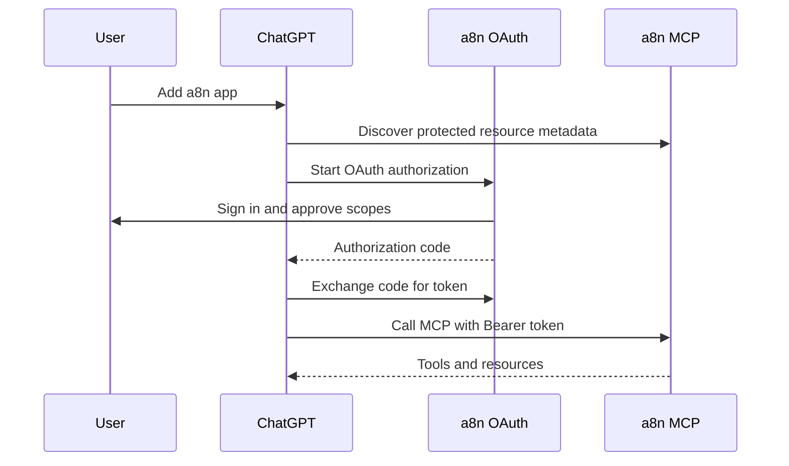
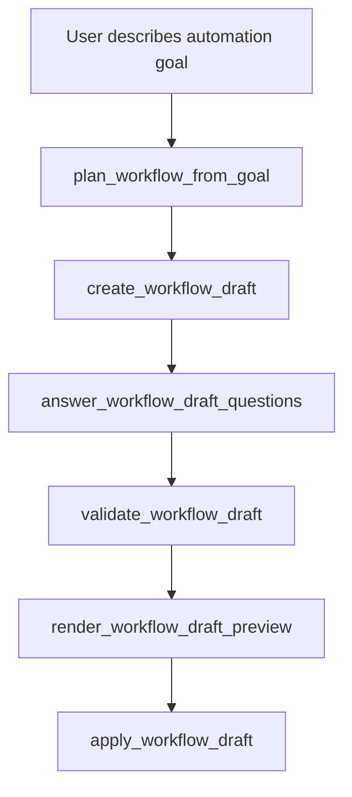
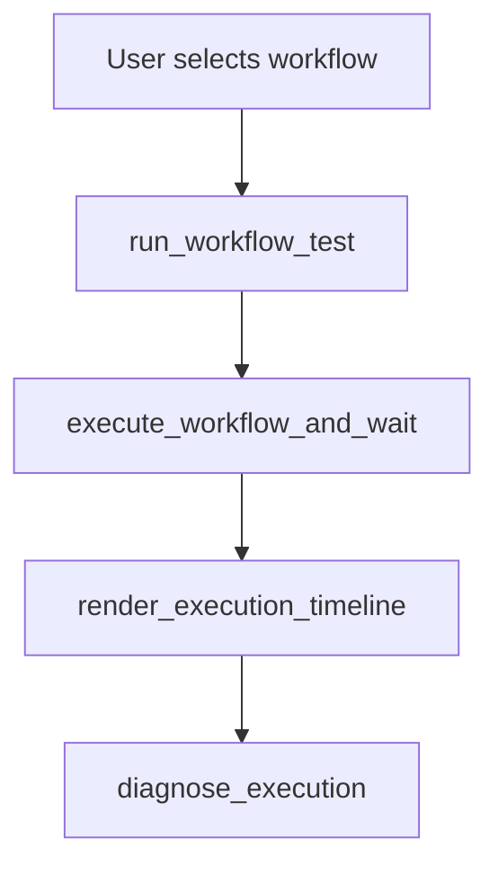

# ChatGPT App Surface and UX Plan

This document defines how a8n should behave inside ChatGPT.

## Product positioning

### App name

```txt
a8n
```

### Short description

```txt
Build, run, and debug workflow automations from ChatGPT.
```

### Long description

```txt
a8n lets you create, inspect, validate, execute, and debug workflow automations from ChatGPT. Use it to design multi-step automations with HTTP, AI, messaging, email, Google Sheets, and webhook triggers, then preview and test workflows before applying changes.
```

### When ChatGPT should use a8n

ChatGPT should use a8n when the user asks to:

- Create a workflow automation.
- Explain an existing workflow.
- Find available workflow nodes.
- Configure a workflow draft.
- Validate a workflow.
- Run a workflow or test run.
- Debug a failed execution.
- Generate setup steps for a webhook or integration.

### When ChatGPT should not use a8n

ChatGPT should not use a8n when the user asks to:

- Manage unrelated files, calendars, docs, or emails directly.
- Store raw API secrets in the conversation.
- Perform destructive workflow deletion without explicit confirmation.
- Execute workflows when the user has not approved potential side effects.

## ChatGPT user flows

### Flow 1: Connect app



### Flow 2: Build a workflow from a natural-language goal



Expected prompt:

```txt
@a8n Create a workflow that takes a Google Form response, summarizes it with OpenAI, sends the summary to Slack, and logs it in Google Sheets.
```

Expected behavior:

1. ChatGPT plans the workflow.
2. ChatGPT creates a draft, not a live workflow mutation.
3. ChatGPT asks for missing fields.
4. ChatGPT shows a preview widget.
5. User approves.
6. ChatGPT applies the draft.

### Flow 3: Execute and inspect workflow result



Expected prompt:

```txt
@a8n Run my support triage workflow with sample Google Form data and show me the result.
```

Expected behavior:

1. ChatGPT warns that workflow execution may have side effects.
2. User confirms test run.
3. a8n runs the workflow with sample data.
4. ChatGPT shows execution status and output summary.
5. Timeline widget appears.

### Flow 4: Debug failed execution

Expected prompt:

```txt
@a8n Why did my latest workflow execution fail?
```

Expected behavior:

1. ChatGPT finds recent executions.
2. ChatGPT loads timeline.
3. ChatGPT diagnoses the failure.
4. ChatGPT suggests a repair draft.
5. User previews and approves the fix.

## App-facing tool profile

The ChatGPT App should expose a curated subset first.

### Read tools

| Tool | Use |
|---|---|
| `list_workflows` | Show available workflows |
| `get_workflow` | Fetch workflow graph and config |
| `explain_workflow` | Explain workflow in beginner-friendly language |
| `list_node_types` | Show supported trigger/action nodes |
| `search_capabilities` | Find nodes by user intent |
| `get_execution_timeline` | Inspect workflow run status |
| `diagnose_execution` | Explain failure cause and repair options |

### Draft and build tools

| Tool | Use |
|---|---|
| `plan_workflow_from_goal` | Convert user goal to a workflow plan |
| `create_workflow_draft` | Create draft graph |
| `answer_workflow_draft_questions` | Fill missing setup fields |
| `validate_workflow_draft` | Check graph validity |
| `preview_workflow_diff` | Summarize changes before apply |
| `apply_workflow_draft` | Apply after approval |

### Execution tools

| Tool | Use |
|---|---|
| `run_workflow_test` | Test with sample/manual trigger data |
| `execute_workflow_and_wait` | Run and poll for result |

### Repair tools

| Tool | Use |
|---|---|
| `suggest_workflow_fix` | Create repair draft from failed execution |
| `apply_workflow_fix` | Apply approved repair draft |

### Setup tools

| Tool | Use |
|---|---|
| `get_integration_setup_guide` | Explain how to configure an integration |
| `get_workflow_setup_checklist` | Show missing fields, credentials, webhook URLs |
| `test_credential` | Validate saved credential metadata and connectivity |
| `test_webhook_setup` | Validate trigger endpoint setup |

## Tools to hide or defer from ChatGPT MVP

| Tool category | Reason |
|---|---|
| API key management | Not needed inside ChatGPT and can create security confusion |
| Raw credential write tools | Risky unless built with a dedicated secure widget |
| Destructive workflow deletion | High-risk action; defer until stronger confirmation UX exists |
| Full graph replacement update | Prefer draft and safe partial-edit flows |
| Low-level audit/security admin tools | Better for dashboard/admin MCP clients |

## Widget plan

### Widget 1: workflow draft preview

Resource URI:

```txt
ui://a8n/workflow-draft-preview.html
```

Render tool:

```txt
render_workflow_draft_preview
```

Purpose:

- Show draft workflow name, goal, node list, edge list, missing fields, validation status.
- Provide a clear "ready to apply" or "needs setup" state.

Model-visible `structuredContent`:

```json
{
  "draftId": "...",
  "workflowId": "...",
  "status": "READY",
  "valid": true,
  "summary": "..."
}
```

Widget-only `_meta`:

```json
{
  "nodesById": {},
  "edges": [],
  "validationDetails": {},
  "confirmationHash": "..."
}
```

### Widget 2: workflow setup checklist

Resource URI:

```txt
ui://a8n/workflow-setup-checklist.html
```

Render tool:

```txt
render_workflow_setup_checklist
```

Purpose:

- Show required credentials.
- Show webhook URLs.
- Show missing node fields.
- Show test steps.

Actions:

- Call `test_credential`.
- Call `test_webhook_setup`.
- Call `run_workflow_test`.

### Widget 3: execution timeline

Resource URI:

```txt
ui://a8n/execution-timeline.html
```

Render tool:

```txt
render_execution_timeline
```

Purpose:

- Show node-by-node execution state.
- Show duration.
- Show output summary.
- Show failure diagnosis link.

Actions:

- Call `diagnose_execution`.
- Call `suggest_workflow_fix`.

### Widget 4: approval screen

Resource URI:

```txt
ui://a8n/workflow-approval.html
```

Render tool:

```txt
render_workflow_approval
```

Purpose:

- Show diff summary.
- Show validation status.
- Show confirmation hash.
- Make it clear what will change before applying.

Actions:

- Call `apply_workflow_draft`.
- Call `apply_workflow_fix`.

## Widget design constraints

Widgets should:

- Render inside a sandboxed iframe.
- Use a strict CSP.
- Avoid external assets unless allowlisted.
- Work with light and dark mode.
- Avoid putting secrets in HTML, props, `structuredContent`, or `_meta`.
- Stay readable in narrow chat columns.
- Use concise copy because ChatGPT will provide surrounding explanation.

## Tool result contract

For app-facing tools:

```ts
return {
  structuredContent: {
    // concise, schema-backed fields the model can reason over
  },
  content: [
    {
      type: "text",
      text: "Short human-readable status."
    }
  ],
  _meta: {
    // UI-only details, hidden from model
  }
}
```

Rules:

- Do not put secrets in any field.
- Do not put large raw workflow outputs in `content`.
- Prefer identifiers and summaries in `structuredContent`.
- Put large maps, full timelines, and render-only details in `_meta`.

## Example prompts for testing

### Discovery

```txt
@a8n What workflows do I have?
```

```txt
@a8n What nodes can I use to send a message after an AI summary?
```

### Build

```txt
@a8n Create a workflow that receives a Google Form response, summarizes it with OpenAI, sends the summary to Slack, and logs the row in Google Sheets.
```

### Setup

```txt
@a8n Show me what setup is missing before I can run this workflow.
```

### Execute

```txt
@a8n Test this workflow with sample Google Form data.
```

### Debug

```txt
@a8n Diagnose the latest failed execution and suggest a safe fix.
```

## MVP UX principles

1. Draft first, mutate second.
2. Explain before applying.
3. Prefer sample/test runs before real executions.
4. Keep secrets in a8n, not in ChatGPT.
5. Show visual state when it reduces confusion.
6. Make every write action reversible or versioned where possible.
