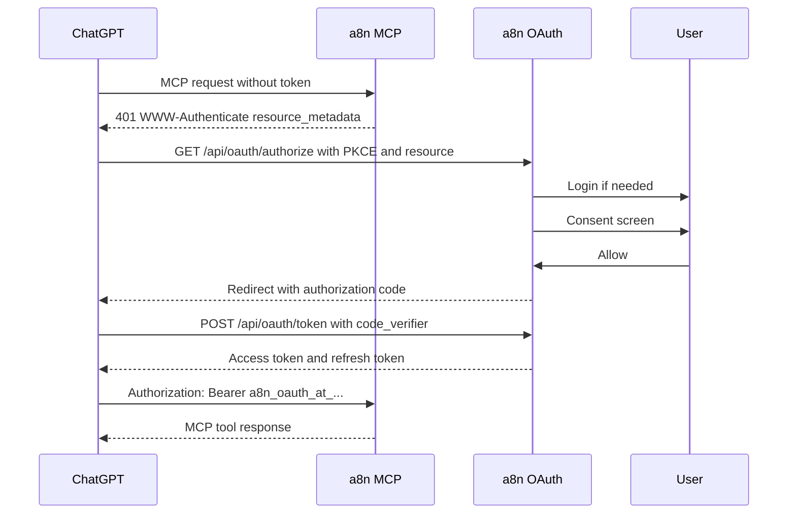

# Phase 4 Runbook

This runbook covers the implemented OAuth account-linking path for using a8n as a ChatGPT App.

## What Is Implemented

Implemented:

- `GET /.well-known/oauth-protected-resource`
- `GET /.well-known/oauth-authorization-server`
- `GET /.well-known/openid-configuration`
- `GET /api/oauth/authorize`
- `POST /api/oauth/authorize`
- `POST /api/oauth/token`
- `POST /api/oauth/register`
- `POST /api/oauth/revoke`
- `GET /api/oauth/jwks.json`
- Authorization code flow with PKCE S256.
- Dynamic client registration for public OAuth clients.
- Opaque DB-backed access and refresh tokens.
- OAuth bearer validation in `/api/mcp`.
- MCP `WWW-Authenticate` challenges with protected resource metadata.
- Login/signup callback handling so account linking resumes after sign-in.
- Phase 4 readiness checker: `pnpm mcp:chatgpt:oauth-check`.

## Storage Model

OAuth account linking uses:

```txt
mcp_oauth_client
mcp_oauth_authorization_code
mcp_oauth_access_token
mcp_oauth_refresh_token
```

Tokens are opaque and stored only as hashes. Raw tokens are returned only to the OAuth client.

## Environment

Optional:

```txt
MCP_OAUTH_ISSUER=https://a8n.example.com
MCP_OAUTH_RESOURCE=https://a8n.example.com
MCP_OAUTH_CLIENT_ID=<preconfigured-client-id>
MCP_OAUTH_REDIRECT_URIS=https://chatgpt.com/connector/oauth/<callback_id>
MCP_OAUTH_TOKEN_HMAC_SECRET=<strong-random-secret>
MCP_OAUTH_ACCESS_TOKEN_TTL_SECONDS=3600
MCP_OAUTH_REFRESH_TOKEN_TTL_SECONDS=2592000
MCP_OAUTH_AUTH_CODE_TTL_SECONDS=600
MCP_OAUTH_ALLOW_DYNAMIC_CLIENT_REGISTRATION=true
```

If `MCP_OAUTH_ISSUER` is not set, a8n derives the issuer from the request origin.

## Verification

Start the app:

```powershell
pnpm dev
```

Run:

```powershell
pnpm mcp:chatgpt:oauth-check
```

Expected:

```txt
Result: PASS
```

The checker validates metadata discovery, the JWKS compatibility endpoint, and the unauthenticated MCP OAuth challenge.

## ChatGPT Connector URL

Use:

```txt
https://<public-host>/api/mcp?profile=chatgpt
```

ChatGPT should discover OAuth from:

```txt
https://<public-host>/.well-known/oauth-protected-resource
https://<public-host>/.well-known/oauth-authorization-server
```

## Flow



## Scope Set

The ChatGPT app OAuth scope set is:

```txt
workflows:read
workflows:write
workflows:execute
credentials:read
executions:read
system:read
```

The OAuth path does not grant:

```txt
credentials:write
api_keys:manage
*
```

## Notes

- This implementation uses opaque tokens, not JWTs.
- `GET /api/oauth/jwks.json` returns an empty key set for compatibility and future expansion.
- Dynamic client registration accepts public clients with `token_endpoint_auth_method=none`.
- Redirect URIs are restricted to ChatGPT/OpenAI hosts, localhost, configured exact URIs, or configured redirect hosts.
- For production review, an external identity provider is still a valid hardening option if you do not want to maintain OAuth server security yourself.
