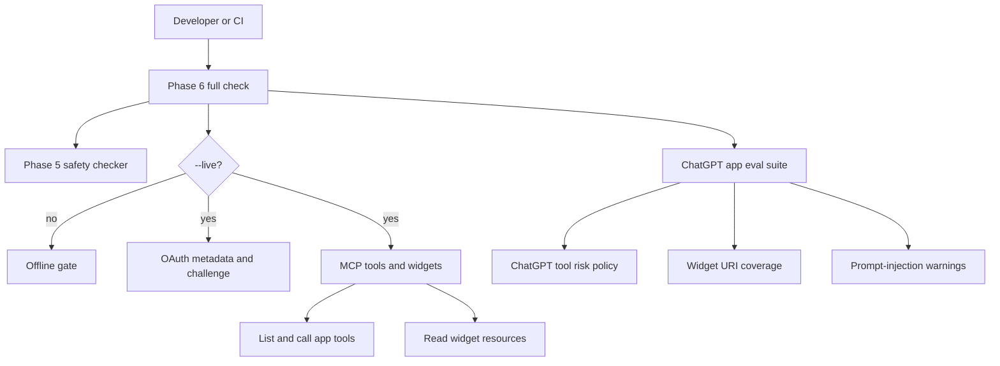
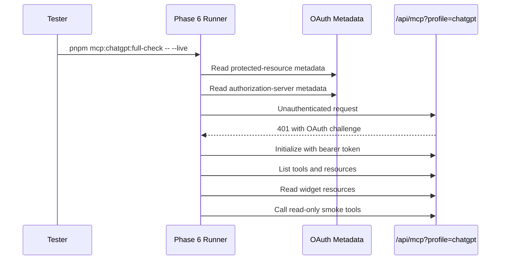

# Phase 6 Runbook

This runbook covers the implemented testing and evaluation layer for the a8n ChatGPT app integration.

## What Is Implemented

Implemented:

- App-facing eval manifest:

  ```txt
  src/mcp/evals/chatgpt-app-goals.ts
  ```

- Offline ChatGPT app eval checker:

  ```txt
  pnpm mcp:chatgpt:app-eval
  ```

- Full Phase 6 runner:

  ```txt
  pnpm mcp:chatgpt:full-check
  pnpm mcp:chatgpt:full-check -- --live
  ```

The full runner always executes the offline safety and app eval checks. With `--live`, it also runs the OAuth metadata/challenge check and the authenticated MCP tool/resource check.

## Test Architecture



## Eval Coverage

The ChatGPT app eval suite covers:

- Listing workflows.
- Explaining an existing workflow.
- Planning and creating a draft from a beginner goal.
- Rendering a workflow draft preview widget.
- Rendering a workflow setup checklist widget.
- Previewing a diff and rendering an approval widget.
- Running an approved sample workflow and rendering an execution timeline widget.
- Diagnosing a failed execution and proposing an approved repair flow.
- Treating malicious execution output as untrusted data.

The suite validates:

- Every expected tool is present in the ChatGPT tool policy.
- Forbidden or destructive tools are not selected for app flows.
- Approval-gated tools are explicitly listed as approval tools.
- All four widget resources are represented.
- Required risk levels are represented.
- Prompt-injection warning patterns are detected for adversarial tool output.

## Commands

Run the offline app eval:

```powershell
pnpm mcp:chatgpt:app-eval
```

Run all offline Phase 6 gates:

```powershell
pnpm mcp:chatgpt:full-check
```

Run the live developer-mode gates:

```powershell
$env:MCP_CHATGPT_DEV_URL="https://your-domain.example/api/mcp?profile=chatgpt"
$env:MCP_CHATGPT_DEV_TOKEN="a8n_mcp_..."
pnpm mcp:chatgpt:full-check -- --live
```

For local testing, `MCP_CHATGPT_DEV_URL` can point to `http://localhost:3000/api/mcp?profile=chatgpt`. For ChatGPT developer mode, use a public HTTPS URL.

## Live Test Sequence



## ChatGPT Developer-Mode Prompts

Use these prompts after adding the connector in ChatGPT developer mode:

```txt
@a8n list my workflows.
@a8n explain my latest workflow.
@a8n create a workflow that summarizes Google Form responses with AI and posts to Slack. Preview it before saving.
@a8n show me the setup checklist for this workflow.
@a8n run this workflow with sample data after I approve and show the timeline.
@a8n debug my latest failed execution and suggest a fix.
```

Capture screenshots for:

- Connector configuration.
- OAuth consent and successful connection.
- Tool discovery or first successful `@a8n` call.
- Draft preview widget.
- Setup checklist widget.
- Approval widget.
- Execution timeline widget.

Recommended evidence folder:

```txt
docs/mcp/mcp-apps/evidence/phase-6/
```

## Acceptance Mapping

| Requirement | Implemented by |
|---|---|
| App-facing eval suite passes | `pnpm mcp:chatgpt:app-eval` |
| Safety evals pass | `pnpm mcp:safety:check` through full runner |
| OAuth happy/failure paths pass | `pnpm mcp:chatgpt:oauth-check` through `--live` |
| MCP tool and widget checks pass | `pnpm mcp:chatgpt:check` through `--live` |
| Screenshots captured | Manual ChatGPT developer-mode evidence folder |

## Official References

- [Test your integration](https://developers.openai.com/apps-sdk/deploy/testing)
- [Connect from ChatGPT](https://developers.openai.com/apps-sdk/deploy/connect-chatgpt)
- [Apps SDK reference](https://developers.openai.com/apps-sdk/reference)
