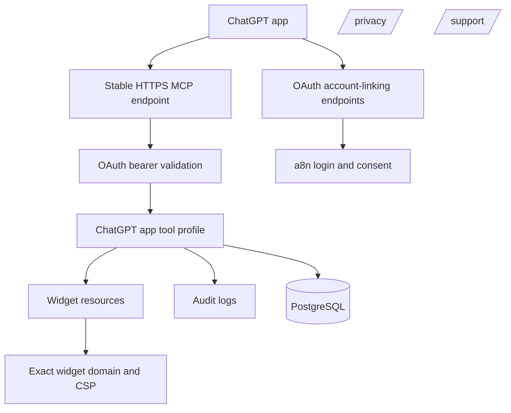
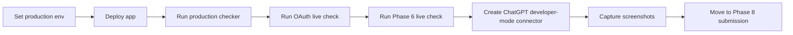

# Phase 7 Runbook

This runbook covers the implemented production-readiness gate for hosting the a8n MCP endpoint as a review-ready ChatGPT app.

## What Is Implemented

Implemented:

- Production readiness checker:

  ```txt
  pnpm mcp:production:check
  ```

- Development-host mode for local or tunnel rehearsal:

  ```txt
  pnpm mcp:production:check -- --allow-dev-hosts
  ```

- Public support route:

  ```txt
  /support
  ```

- Public privacy route:

  ```txt
  /privacy
  ```

## Production Architecture



## Required Environment

Use production values before submission:

```txt
APP_URL=https://a8n.example.com
NEXT_PUBLIC_APP_URL=https://a8n.example.com
NEXT_PUBLIC_WEBHOOK_BASE_URL=https://a8n.example.com

MCP_CORS_ORIGINS=https://chatgpt.com,https://chat.openai.com
MCP_AUDIT_LOG_ENABLED=true
MCP_AUDIT_DB_ENABLED=true
MCP_API_KEY_HMAC_SECRET=<strong-random-secret-at-least-32-chars>

MCP_OAUTH_ISSUER=https://a8n.example.com
MCP_OAUTH_RESOURCE=https://a8n.example.com
MCP_OAUTH_REDIRECT_URIS=https://chatgpt.com/connector/oauth/<callback_id>
MCP_OAUTH_TOKEN_HMAC_SECRET=<strong-random-secret-at-least-32-chars>
MCP_OAUTH_ALLOW_DYNAMIC_CLIENT_REGISTRATION=true
```

The production checker does not print secret values. It only validates that required secret variables are present and long enough for production use.

## Readiness Checks

The checker validates:

- `APP_URL`, `NEXT_PUBLIC_APP_URL`, and `NEXT_PUBLIC_WEBHOOK_BASE_URL` are stable public URLs.
- `APP_URL` and `NEXT_PUBLIC_APP_URL` share the same origin.
- CORS is explicit and includes `https://chatgpt.com` and `https://chat.openai.com`.
- OAuth issuer and resource match the app origin.
- OAuth redirect URIs include the ChatGPT connector callback shape.
- Dynamic client registration is enabled, unless a fixed ChatGPT client is configured.
- API key and OAuth token hashing secrets are configured.
- MCP audit logging and database audit persistence are enabled.
- `/privacy` and `/support` routes exist.

## Commands

Run the strict production gate:

```powershell
pnpm mcp:production:check
```

Run the same gate against a local or tunnel environment:

```powershell
$env:APP_URL="http://localhost:3000"
$env:NEXT_PUBLIC_APP_URL="http://localhost:3000"
$env:NEXT_PUBLIC_WEBHOOK_BASE_URL="http://localhost:3000"
$env:MCP_CORS_ORIGINS="https://chatgpt.com,https://chat.openai.com"
$env:MCP_AUDIT_LOG_ENABLED="true"
$env:MCP_AUDIT_DB_ENABLED="true"
$env:MCP_API_KEY_HMAC_SECRET="local-dev-secret-with-at-least-32-chars"
$env:MCP_OAUTH_ISSUER="http://localhost:3000"
$env:MCP_OAUTH_RESOURCE="http://localhost:3000"
$env:MCP_OAUTH_REDIRECT_URIS="https://chatgpt.com/connector/oauth/dev-callback"
$env:MCP_OAUTH_TOKEN_HMAC_SECRET="local-oauth-secret-with-at-least-32-chars"
pnpm mcp:production:check -- --allow-dev-hosts
```

## Deployment Checklist



Before Phase 8:

- Deploy to the final stable HTTPS domain.
- Configure ChatGPT app settings with the production MCP URL.
- Configure the exact OAuth redirect URI from ChatGPT app management.
- Confirm widget CSP uses only required domains.
- Visit `/privacy` and `/support` on the deployed domain.
- Run `pnpm mcp:production:check` with production environment variables.
- Run `pnpm mcp:chatgpt:full-check -- --live` against the production endpoint.

## Acceptance Mapping

| Requirement | Implemented by |
|---|---|
| Public endpoint uses stable HTTPS origin | `pnpm mcp:production:check` |
| OAuth redirect URI is production ChatGPT callback | `pnpm mcp:production:check` |
| CORS excludes wildcard and includes ChatGPT origins | `pnpm mcp:production:check` |
| Widget domain derives from production app origin | `NEXT_PUBLIC_APP_URL` gate |
| Privacy and support pages exist | `/privacy`, `/support`, checker route validation |
| No local/test endpoint in production settings | strict checker without `--allow-dev-hosts` |

## Official References

- [Deploy and connect from ChatGPT](https://developers.openai.com/apps-sdk/deploy/connect-chatgpt)
- [Authenticate users](https://developers.openai.com/apps-sdk/build/auth)
- [Security and privacy](https://developers.openai.com/apps-sdk/guides/security-privacy)
- [Submit your app](https://developers.openai.com/apps-sdk/deploy/submission)
