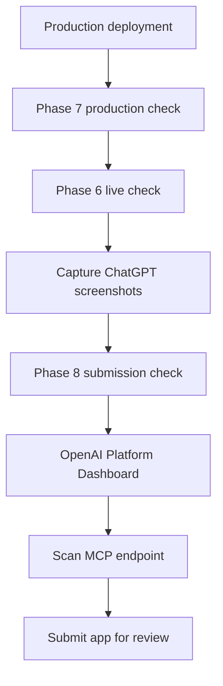

# Phase 8 Runbook

This runbook covers the implemented coding-side support for ChatGPT app submission.

## What Is Implemented

Implemented:

- Submission metadata source:

  ```txt
  src/mcp/apps/submission-assets.ts
  ```

- Public app icon:

  ```txt
  public/a8n-app-logo.svg
  ```

- Submission readiness checker:

  ```txt
  pnpm mcp:submission:check
  ```

- Submission copy and golden prompts:

  ```txt
  docs/mcp/mcp-apps/submission/app-copy.md
  docs/mcp/mcp-apps/submission/golden-prompts.md
  ```

- Evidence folder:

  ```txt
  docs/mcp/mcp-apps/evidence/phase-8/
  ```

## Submission Package

The submission package contains:

- App name, category, short description, and long description.
- Production icon URL.
- Production MCP server URL.
- Privacy/support URLs.
- OAuth metadata URLs.
- OAuth redirect URI shape.
- Required scopes.
- Tool risk notes.
- Widget URIs.
- Golden prompts and expected behavior.
- Screenshot checklist.
- Release notes and reviewer notes.

Print the package as JSON:

```powershell
pnpm mcp:submission:check -- --json --print-package --allow-missing-evidence
```

For strict production submission, run without development shortcuts:

```powershell
pnpm mcp:submission:check
```

Strict mode expects:

- Production `APP_URL`.
- Production HTTPS URLs.
- No placeholder URLs.
- Screenshot files in `docs/mcp/mcp-apps/evidence/phase-8/`.
- Public `/privacy`, `/support`, and `/a8n-app-logo.svg`.

## Manual Dashboard Steps

Some Phase 8 tasks cannot be completed by code because they happen in the OpenAI Platform Dashboard:

- Complete organization verification.
- Confirm required app permissions:
  - `api.apps.write`
  - `api.apps.read`
- Create the app draft.
- Scan the production MCP endpoint.
- Upload screenshots.
- Submit for review.
- Track review feedback.

To mark those manual checks as acknowledged in local preflight:

```powershell
$env:OPENAI_ORG_VERIFIED="true"
$env:OPENAI_APPS_PERMISSIONS_CONFIRMED="true"
pnpm mcp:submission:check
```

## Review Evidence

Required screenshots:

```txt
01-connector-settings.png
02-oauth-consent.png
03-workflow-draft-preview.png
04-setup-checklist.png
05-approval-widget.png
06-execution-timeline.png
```

Save them in:

```txt
docs/mcp/mcp-apps/evidence/phase-8/
```

## Submission Flow



## Current Official Guidance Reflected

- ChatGPT developer-mode testing should use golden direct, indirect, negative, and security prompts.
- OAuth needs well-known metadata, authorization-code + PKCE, and the ChatGPT connector callback redirect URI.
- App metadata scanned from the MCP endpoint is treated as a reviewed version snapshot.
- Breaking metadata changes after publish require a new app version and review.

Sources:

- [Connect from ChatGPT](https://developers.openai.com/apps-sdk/deploy/connect-chatgpt)
- [Test your integration](https://developers.openai.com/apps-sdk/deploy/testing)
- [Authenticate users](https://developers.openai.com/apps-sdk/build/auth)
- [Submit and maintain your app](https://developers.openai.com/apps-sdk/deploy/submission)
- [App submission guidelines](https://developers.openai.com/apps-sdk/app-submission-guidelines)
