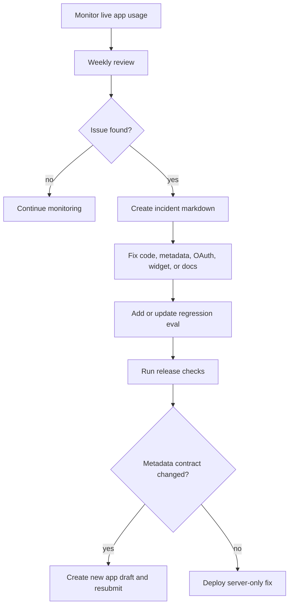

# Phase 9 Runbook

This runbook covers the implemented rollout and maintenance loop after the a8n ChatGPT app is submitted or published.

## What Is Implemented

Implemented:

- Rollout checker:

  ```txt
  pnpm mcp:rollout:check
  ```

- Incident template:

  ```txt
  docs/mcp/mcp-apps/rollout/incident-template.md
  ```

- Incident folder:

  ```txt
  docs/mcp/mcp-apps/rollout/incidents/
  ```

- Weekly review checklist:

  ```txt
  docs/mcp/mcp-apps/rollout/weekly-review.md
  ```

- Combined release gate:

  ```txt
  pnpm mcp:chatgpt:release-check
  ```

## Maintenance Loop



## Incident Rule

Every closed production incident must reference a regression eval ID from:

```txt
src/mcp/evals/chatgpt-app-goals.ts
```

The checker enforces this:

```powershell
pnpm mcp:rollout:check
```

If a severity 1 or 2 incident is still open, the checker fails by default. During active mitigation you can acknowledge it:

```powershell
pnpm mcp:rollout:check -- --allow-open-critical
```

## Weekly Review

Use:

```txt
docs/mcp/mcp-apps/rollout/weekly-review.md
```

Review:

- Tool usage.
- OAuth failures.
- MCP 4xx/5xx responses.
- Tool latency and timeouts.
- Widget load errors.
- Approval-gated write attempts.
- Prompt-injection safety events.
- Tool description false positives and false negatives.

## App Versioning Policy

Treat the reviewed MCP metadata as a versioned contract.

Create a new app draft and resubmit when you change:

- Tool names.
- Tool titles or descriptions.
- Input or output schemas.
- Tool annotations.
- Tool `_meta` fields.
- Widget resource URIs.
- Widget CSP metadata.
- MCP server initialization instructions.

Server-only fixes can deploy without review when they preserve the published contract.

## Release Gate

Before any production deploy or app resubmission:

```powershell
pnpm mcp:chatgpt:release-check
```

For local rehearsal:

```powershell
pnpm mcp:chatgpt:release-check -- --allow-dev-hosts --allow-missing-evidence
```

For production live verification:

```powershell
$env:MCP_CHATGPT_DEV_URL="https://<production-domain>/api/mcp?profile=chatgpt"
$env:MCP_CHATGPT_DEV_TOKEN="a8n_mcp_..."
pnpm mcp:chatgpt:release-check -- --live
```

## Official Guidance Reflected

OpenAI notes that submitted app metadata is snapshotted for review, while live tool calls continue to hit your server. Backward-incompatible changes to published metadata can break existing app versions, so changes should be backward-compatible or submitted as a new app version.

Source:

- [Submit and maintain your app](https://developers.openai.com/apps-sdk/deploy/submission)
