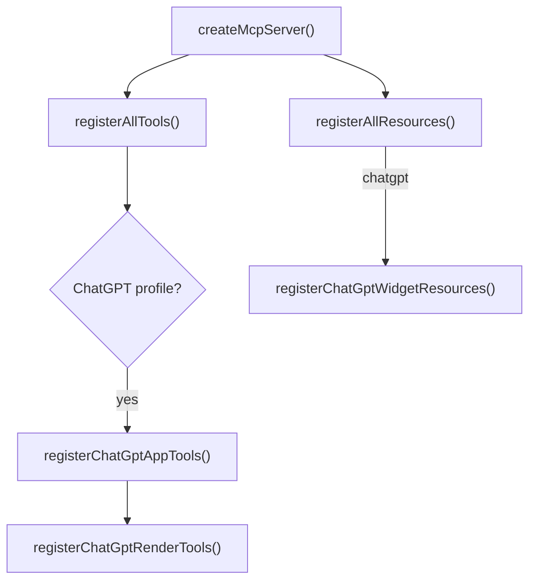
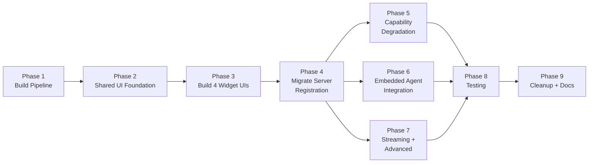

# Standardized `@modelcontextprotocol/ext-apps` Integration Plan

> **Goal**: Migrate a8n's custom MCP Apps implementation to the standardized `@modelcontextprotocol/ext-apps` SDK, enabling interoperable widget UIs across all MCP-compatible clients (Claude Desktop, ChatGPT, embedded agent, MCP Inspector, and any future host).  
> **Status**: ✅ **Fully Implemented & Verified (Phases 1–9 Complete)**

---

## Executive Summary

a8n already has a functional MCP Apps implementation with 4 widget resources, 4 render tools, and a ChatGPT-specific metadata layer. However, this implementation uses **hand-rolled metadata** (`_meta.ui`, `openai/*` prefixed keys, custom CSP objects, inline HTML generation) rather than the **standardized `@modelcontextprotocol/ext-apps` SDK** APIs.

The `@modelcontextprotocol/ext-apps` package is already installed in `node_modules` but not referenced anywhere in the source code. This plan migrates the existing implementation to use the SDK's:

- **`registerAppTool()`** — replaces manual `server.registerTool()` calls with normalized UI metadata
- **`registerAppResource()`** — replaces manual `server.registerResource()` calls with `RESOURCE_MIME_TYPE` defaults
- **`getUiCapability()`** — enables capability-based graceful degradation
- **`RESOURCE_MIME_TYPE`** (`text/html;profile=mcp-app`) — standardized constant
- **Client-side `App` class** — replaces `window.openai` bridge with standardized `ontoolinput`/`ontoolresult`/`onhostcontextchanged` lifecycle
- **Host styling** — replaces hardcoded CSS with `applyDocumentTheme`, `applyHostStyleVariables`, `applyHostFonts`

### What Changes

| Area | Current State | Target State |
|---|---|---|
| Tool registration | `server.registerTool()` + manual `_meta` | `registerAppTool()` from ext-apps/server |
| Resource registration | `server.registerResource()` + custom MIME | `registerAppResource()` with `RESOURCE_MIME_TYPE` |
| Widget HTML | Inline template strings in `widget-resources.ts` | Vite-built single-file HTML from `src/mcp/apps/ui/` |
| Client-side bridge | `window.openai` + `openai:set_globals` events | `App` class + `PostMessageTransport` |
| Host styling | Hardcoded CSS with `prefers-color-scheme` | `applyDocumentTheme()` + CSS variable fallbacks |
| Client detection | ChatGPT-only (`isChatGptAppProfile`) | Capability-based (`getUiCapability`) |
| Embedded agent | No widget support | Full widget support via ext-apps lifecycle |

### What Stays the Same

- All 53 MCP tools and their business logic
- Auth middleware (bearer tokens, API keys, OAuth, scopes)
- Rate limiting, audit logging, sanitization
- Data layer functions (`draftPreview`, `setupChecklist`, `executionTimeline`, `approvalPreview`)
- Tool risk policy and prompt-injection safety
- Profile system (`default`, `chatgpt`, `embedded_agent`)
- Existing MCP endpoint at `/api/mcp`

---

## Current Architecture Snapshot

### Server-Side Registration Flow



### Key Files to Modify

| File | Role | Lines |
|---|---|---|
| [widget-resources.ts](./../../src/mcp/apps/widget-resources.ts) | Widget HTML generation + resource registration | 424 |
| [render-tools.ts](./../../src/mcp/apps/render-tools.ts) | Render tool registration | 275 |
| [index.ts](./../../src/mcp/apps/index.ts) | Apps module barrel export | 3 |
| [resources/_registry.ts](./../../src/mcp/resources/_registry.ts) | Resource registration dispatcher | 59 |
| [tools/_registry.ts](./../../src/mcp/tools/_registry.ts) | Tool registration dispatcher | 93 |
| [src/mcp/index.ts](./../../src/mcp/index.ts) | Server factory | 52 |
| [chatgpt-profile.ts](./../../src/mcp/tools/chatgpt-profile.ts) | ChatGPT tool profile | 97 |
| [embedded-agent-profile.ts](./../../src/mcp/tools/embedded-agent-profile.ts) | Embedded agent tool profile | 85 |

---

## Available ext-apps Skills Analysis

The `@modelcontextprotocol/ext-apps` repository provides 4 agent skills. Here's which ones apply to this migration:

| Skill | Relevance | How We Use It |
|---|---|---|
| **`add-app-to-server`** | ✅ **Primary** — This is exactly our pattern. We have an existing MCP server with tools and need to add interactive UIs. | Follow its Step 3–6 for converting tools and building UIs. |
| **`convert-web-app`** | ⚠️ **Partial** — Our widgets are not standalone web apps, but the hybrid initialization pattern is useful for widgets that should work both inside MCP hosts and in standalone preview mode. | Borrow the `isMcpApp` detection and `PostMessageTransport` pattern. |
| **`create-mcp-app`** | ❌ Not applicable — We already have a full MCP server. | Skip. |
| **`migrate-oai-app`** | ⚠️ **Partial** — We currently use `openai/*` metadata keys. The migration skill helps map those to standardized ext-apps metadata. | Reference for replacing `openai/outputTemplate`, `openai/toolInvocation/*`, `openai/widgetDescription` with standard `_meta.ui` fields. |

---

## Phase-wise Implementation Plan

### Phase 1: Foundation — Add ext-apps to `package.json` and Create Build Pipeline

**Goal**: Get `@modelcontextprotocol/ext-apps` properly declared as a dependency and set up the Vite build pipeline for widget UIs.

**Priority**: P0 — Must be done first.

#### Tasks

1. **Add ext-apps to `package.json` dependencies**

   The package is installed in `node_modules` but not declared in `package.json`. Fix this:

   ```bash
   npm install @modelcontextprotocol/ext-apps
   npm install -D vite vite-plugin-singlefile
   ```

2. **Create the widget UI source directory**

   ```
   src/mcp/apps/ui/
   ├── shared/
   │   ├── styles.css              # Shared CSS with host variable fallbacks
   │   ├── bridge.ts               # Shared App initialization + host styling
   │   └── utils.ts                # escapeHtml, safeText, sanitization
   ├── workflow-draft-preview/
   │   ├── mcp-app.html            # Vite entry point
   │   └── mcp-app.ts              # App lifecycle + render logic
   ├── workflow-setup-checklist/
   │   ├── mcp-app.html
   │   └── mcp-app.ts
   ├── execution-timeline/
   │   ├── mcp-app.html
   │   └── mcp-app.ts
   └── workflow-approval/
       ├── mcp-app.html
       └── mcp-app.ts
   ```

3. **Create `vite.config.mcp-apps.ts`**

   ```typescript
   import { defineConfig } from "vite";
   import { viteSingleFile } from "vite-plugin-singlefile";
   import path from "node:path";

   export default defineConfig({
     plugins: [viteSingleFile()],
     build: {
       outDir: "dist/mcp-apps",
       rollupOptions: {
         input: {
           "workflow-draft-preview": path.resolve(
             __dirname,
             "src/mcp/apps/ui/workflow-draft-preview/mcp-app.html",
           ),
           "workflow-setup-checklist": path.resolve(
             __dirname,
             "src/mcp/apps/ui/workflow-setup-checklist/mcp-app.html",
           ),
           "execution-timeline": path.resolve(
             __dirname,
             "src/mcp/apps/ui/execution-timeline/mcp-app.html",
           ),
           "workflow-approval": path.resolve(
             __dirname,
             "src/mcp/apps/ui/workflow-approval/mcp-app.html",
           ),
         },
       },
     },
   });
   ```

4. **Add build scripts to `package.json`**

   ```json
   {
     "scripts": {
       "build:mcp-apps-ui": "vite build --config vite.config.mcp-apps.ts",
       "build": "npm run build:mcp-apps-ui && next build"
     }
   }
   ```

#### Acceptance Criteria

- `npm run build:mcp-apps-ui` produces 4 single-file HTML files in `dist/mcp-apps/`
- No changes to existing tool behavior
- Build can be run independently of the Next.js build

---

### Phase 2: Shared Widget UI Foundation

**Goal**: Create the shared bridge and styling module that all 4 widgets use.

**Priority**: P0 — Required before building individual widgets.

#### Tasks

1. **Create `src/mcp/apps/ui/shared/bridge.ts`**

   Standardized App initialization using the ext-apps SDK:

   ```typescript
   import {
     App,
     PostMessageTransport,
     applyDocumentTheme,
     applyHostStyleVariables,
     applyHostFonts,
   } from "@modelcontextprotocol/ext-apps";

   export interface WidgetRenderData {
     input?: Record<string, unknown>;
     result?: Record<string, unknown>;
   }

   /**
    * Initialize an MCP App widget with standardized lifecycle handlers.
    *
    * ALL handlers are registered BEFORE connect() per ext-apps requirements.
    * The onRender callback is called on both ontoolinput and ontoolresult events.
    */
   export async function initWidget(
     name: string,
     version: string,
     onRender: (data: WidgetRenderData) => void,
   ): Promise<App> {
     const app = new App({ name, version });

     // Register ALL handlers BEFORE connect()
     app.ontoolinput = (params) => {
       onRender({
         input: params.arguments ?? {},
         result: params.structuredContent ?? {},
       });
     };

     app.ontoolresult = (result) => {
       onRender({
         result: result.structuredContent ?? {},
       });
     };

     app.onhostcontextchanged = (ctx) => {
       if (ctx.theme) applyDocumentTheme(ctx.theme);
       if (ctx.styles?.variables) applyHostStyleVariables(ctx.styles.variables);
       if (ctx.styles?.css?.fonts) applyHostFonts(ctx.styles.css.fonts);
       if (ctx.safeAreaInsets) {
         const { top, right, bottom, left } = ctx.safeAreaInsets;
         document.body.style.padding =
           `${top}px ${right}px ${bottom}px ${left}px`;
       }
     };

     app.onteardown = async () => ({});

     await app.connect(new PostMessageTransport());
     return app;
   }
   ```

2. **Create `src/mcp/apps/ui/shared/styles.css`**

   CSS with host variable fallbacks so widgets look correct in any host:

   ```css
   :root {
     color-scheme: light dark;
     font-family: var(--font-sans, Inter, ui-sans-serif, system-ui, -apple-system,
       BlinkMacSystemFont, "Segoe UI", sans-serif);
     background: var(--color-background-primary, #f7f8fb);
     color: var(--color-text-primary, #16171d);
   }

   * { box-sizing: border-box; }
   body { margin: 0; background: transparent; }
   main { padding: 16px; }

   /* Panels, metrics, pills, grids — ported from widget-resources.ts
      with var(--host-variable, fallback) pattern */
   .panel {
     background: var(--color-background-secondary, #ffffff);
     border: 1px solid var(--color-border-primary, #e4e7ee);
     border-radius: var(--border-radius-md, 8px);
     padding: 12px;
   }

   .subtle { color: var(--color-text-secondary, #626b7a); font-size: 13px; }

   /* etc. — full styles ported from existing widget CSS */
   ```

3. **Create `src/mcp/apps/ui/shared/utils.ts`**

   Port `escapeHtml`, `safeText`, `html` helper functions from existing `widget-resources.ts`:

   ```typescript
   export function escapeHtml(value: unknown): string {
     return String(value ?? "")
       .replace(/&/g, "&amp;")
       .replace(/</g, "&lt;")
       .replace(/>/g, "&gt;")
       .replace(/"/g, "&quot;")
       .replace(/'/g, "&#39;");
   }

   export function safeText(value: unknown): string {
     return String(value ?? "")
       .replace(/a8n_mcp_[A-Za-z0-9._-]+/g, "[REDACTED_MCP_KEY]")
       .replace(/\bsk-(?:live|test|proj)-[A-Za-z0-9_-]+/g, "[REDACTED_SECRET]")
       .replace(/\b(?:xox[baprs]-|ghp_|AIza)[A-Za-z0-9_-]+/g, "[REDACTED_SECRET]")
       .replace(/\bBearer\s+[A-Za-z0-9._~+/=-]+/gi, "Bearer [REDACTED]")
       .replace(
         /(api[_ -]?key|token|secret|authorization)(["':=\s]+)[^\s<>"']{8,}/gi,
         "$1$2[REDACTED]",
       );
   }

   export function html(value: unknown): string {
     return escapeHtml(safeText(value));
   }

   export function list(
     items: unknown[] | undefined,
     mapper: (item: unknown, index: number) => string,
   ): string {
     if (!Array.isArray(items) || items.length === 0)
       return '<p class="subtle">None</p>';
     return "<ol>" + items.map(mapper).join("") + "</ol>";
   }

   export function panel(title: string, body: string): string {
     return '<div class="panel"><h2>' + html(title) + "</h2>" + body + "</div>";
   }

   export function metric(label: string, value: unknown): string {
     return (
       '<div class="metric"><strong>' +
       html(value) +
       '</strong><span class="subtle">' +
       html(label) +
       "</span></div>"
     );
   }
   ```

#### Acceptance Criteria

- Shared module imports `@modelcontextprotocol/ext-apps` correctly
- CSS uses `var(--color-*, fallback)` pattern for all theme-sensitive values
- Bridge handles `ontoolinput`, `ontoolresult`, `onhostcontextchanged`, `onteardown`
- All handlers registered before `app.connect()`

---

### Phase 3: Build Individual Widget UIs

**Goal**: Create the 4 widget UI entry points using the ext-apps `App` lifecycle instead of `window.openai`.

**Priority**: P0 — Must complete before server-side migration.

#### Key Migration Pattern

**Before** (window.openai bridge in inline `<script>`):
```javascript
window.addEventListener("openai:set_globals", render);
const bridge = window.openai || {};
const metadata = bridge.toolResponseMetadata || {};
const mcpResult = metadata.mcp_tool_result || metadata.call_tool_result || {};
const output = bridge.toolOutput || mcpResult.structuredContent || {};
const details = (mcpResult._meta && mcpResult._meta.details) || metadata.details || {};
```

**After** (ext-apps App lifecycle in TypeScript module):
```typescript
import { initWidget } from "../shared/bridge";

const app = await initWidget("a8n-draft-preview", "1.0.0", (data) => {
  // data.result contains the structuredContent from the tool result
  // data.input contains the tool arguments
  renderDraft(data.result);
});
```

#### Widget 1: Workflow Draft Preview

**File**: `src/mcp/apps/ui/workflow-draft-preview/mcp-app.ts`

- Receives draft data via `ontoolresult` → `structuredContent` and `_meta.details`
- Renders: draft name, goal, node list, validation status, explanation
- Ports: `renderDraft()` function from current inline script
- No interactive tool calls needed

#### Widget 2: Workflow Setup Checklist

**File**: `src/mcp/apps/ui/workflow-setup-checklist/mcp-app.ts`

- Receives checklist data via `ontoolresult`
- Renders: credential checks, webhook URLs, missing fields, test steps
- **Interactive**: calls `test_credential` and `test_webhook_setup` via `app.callServerTool()`
- Ports: `renderSetup()` function

#### Widget 3: Execution Timeline

**File**: `src/mcp/apps/ui/execution-timeline/mcp-app.ts`

- Receives execution data via `ontoolresult`
- Renders: status, duration, node-by-node timeline, error details
- **Interactive**: calls `diagnose_execution` via `app.callServerTool()`
- Ports: `renderTimeline()` function

#### Widget 4: Workflow Approval

**File**: `src/mcp/apps/ui/workflow-approval/mcp-app.ts`

- Receives diff and confirmation hash via `ontoolresult`
- Renders: added/changed/removed nodes, confirmation hash, apply button
- **Interactive**: calls `apply_workflow_draft` via `app.callServerTool()`
- **Critical**: `apply_workflow_draft` button uses `app.callServerTool()` instead of `window.openai.callTool()`
- Ports: `renderApproval()` function

#### HTML Entry Points

Each widget gets a standard HTML entry:

```html
<!doctype html>
<html lang="en">
  <head>
    <meta charset="UTF-8" />
    <meta name="viewport" content="width=device-width, initial-scale=1.0" />
    <title>MCP App</title>
  </head>
  <body>
    <div id="root"></div>
    <script type="module" src="./mcp-app.ts"></script>
  </body>
</html>
```

#### Acceptance Criteria

- `npm run build:mcp-apps-ui` produces 4 valid single-file HTML files
- Each HTML file is fully self-contained (CSS, JS inlined)
- Each widget handles `ontoolinput`, `ontoolresult`, and `onhostcontextchanged`
- Approval widget calls `apply_workflow_draft` via `app.callServerTool()`
- Setup checklist widget calls `test_credential` via `app.callServerTool()`
- All 4 widgets render correctly with the existing data structures from `app-resources.resource.ts`

---

### Phase 4: Migrate Server-Side Registration to ext-apps API

**Goal**: Replace manual `server.registerTool()` and `server.registerResource()` calls with `registerAppTool()` and `registerAppResource()` from `@modelcontextprotocol/ext-apps/server`.

**Priority**: P0 — Core migration.

> [!IMPORTANT]
> This is the most impactful phase. It changes how tools and resources are registered but does NOT change business logic.

#### Task 1: Refactor `widget-resources.ts`

**Before**:
```typescript
import type { McpServer } from "@modelcontextprotocol/sdk/server/mcp.js";

export const MCP_APP_WIDGET_MIME_TYPE = "text/html;profile=mcp-app";

server.registerResource(spec.name, spec.uri, {
  title: spec.title,
  mimeType: MCP_APP_WIDGET_MIME_TYPE,
  _meta: meta,
}, async () => ({
  contents: [{
    uri: spec.uri,
    mimeType: MCP_APP_WIDGET_MIME_TYPE,
    text: widgetHtml(spec),
  }],
}));
```

**After**:
```typescript
import {
  registerAppResource,
  RESOURCE_MIME_TYPE,
} from "@modelcontextprotocol/ext-apps/server";
import fs from "node:fs/promises";
import path from "node:path";

registerAppResource(server, spec.name, spec.uri, {
  title: spec.title,
  description: spec.description,
  _meta: {
    ui: {
      csp: {
        connectDomains: [appOrigin()],
        resourceDomains: [appOrigin()],
      },
    },
  },
}, async () => {
  const html = await fs.readFile(
    path.resolve(import.meta.dirname, "../../../dist/mcp-apps", spec.htmlFile),
    "utf-8",
  );
  return {
    contents: [{
      uri: spec.uri,
      mimeType: RESOURCE_MIME_TYPE,
      text: html,
    }],
  };
});
```

#### Task 2: Refactor `render-tools.ts`

**Before**:
```typescript
server.registerTool("render_workflow_draft_preview", {
  inputSchema: { draftId: z.string() },
  _meta: widgetToolMeta(CHATGPT_WIDGET_URIS.workflowDraftPreview, "...", "..."),
}, handler);
```

**After**:
```typescript
import { registerAppTool } from "@modelcontextprotocol/ext-apps/server";

registerAppTool(server, "render_workflow_draft_preview", {
  title: "Render workflow draft preview",
  description: "Render a widget preview for a workflow draft...",
  inputSchema: { draftId: z.string().describe("Workflow draft ID.") },
  outputSchema: renderOutputSchema,
  annotations: {
    readOnlyHint: true,
    destructiveHint: false,
    idempotentHint: true,
    openWorldHint: false,
  },
  _meta: {
    ui: {
      resourceUri: WIDGET_URIS.workflowDraftPreview,
      visibility: ["model", "app"],
    },
  },
}, handler);
```

#### Task 3: Add app-only helper tools

Register tools that widgets call but the model doesn't need to see:

```typescript
registerAppTool(server, "poll_draft_data", {
  description: "Fetches fresh draft data for the widget",
  inputSchema: { draftId: z.string() },
  _meta: {
    ui: {
      resourceUri: WIDGET_URIS.workflowDraftPreview,
      visibility: ["app"], // hidden from model, only callable by widget
    },
  },
}, async (args) => {
  const data = await draftPreview(args.draftId, userId);
  return {
    content: [{ type: "text", text: JSON.stringify(data) }],
    structuredContent: data,
  };
});
```

#### Task 4: Handle OpenAI-specific metadata keys

These custom keys in the current implementation need to be addressed:

| Current Key | Action | Reason |
|---|---|---|
| `openai/outputTemplate` | Remove | Replaced by `_meta.ui.resourceUri` |
| `openai/widgetAccessible` | Remove | Implied by `registerAppTool` |
| `openai/toolInvocation/invoking` | **Keep temporarily** | ChatGPT-specific UX hint; no ext-apps equivalent yet |
| `openai/toolInvocation/invoked` | **Keep temporarily** | ChatGPT-specific UX hint |
| `openai/widgetDescription` | Remove | Replaced by resource `description` field |
| `openai/widgetPrefersBorder` | Remove | Not in ext-apps spec |
| `openai/widgetDomain` | Remove | Handled by CSP `csp.connectDomains` |
| `openai/widgetCSP` | Remove | Replaced by `_meta.ui.csp` |

> [!WARNING]
> Keep `openai/toolInvocation/*` keys alongside standard `_meta.ui` metadata during transition. These provide ChatGPT-specific UX like "Preparing preview..." status text. Remove them only after confirming standard metadata provides equivalent UX.

#### Task 5: Replace `MCP_APP_WIDGET_MIME_TYPE`

Replace all references to the custom constant:

```diff
- import { MCP_APP_WIDGET_MIME_TYPE } from "./widget-resources";
+ import { RESOURCE_MIME_TYPE } from "@modelcontextprotocol/ext-apps/server";
```

#### Task 6: Simplify helper functions

The `widgetToolMeta()` and `widgetResourceMeta()` helpers become unnecessary since `registerAppTool()` and `registerAppResource()` handle metadata normalization internally.

```diff
- export function widgetToolMeta(resourceUri, invoking, invoked) { ... }
- export function widgetResourceMeta(description) { ... }
+ // Inline _meta.ui directly in registerAppTool/registerAppResource calls
```

#### Acceptance Criteria

- `server_info` tool still reports correct tool/resource counts
- All 4 render tools appear in `tools/list` with `_meta.ui.resourceUri`
- All 4 widget resources appear in `resources/list` with `RESOURCE_MIME_TYPE`
- Tool results still include `structuredContent`, `content`, and `_meta`
- No regression in ChatGPT app profile behavior
- Text-only fallback still works (`content` array with text)

---

### Phase 5: Add Capability-Based Graceful Degradation

**Goal**: Use `getUiCapability()` to conditionally register App tools only when the client supports UI rendering.

**Priority**: P1 — Enhances compatibility but not blocking.

#### Tasks

1. **Update `createMcpServer()` to support deferred registration**

   Currently, all tools are registered synchronously in `createMcpServer()`. For capability-based degradation, we need to register app tools after initialization when client capabilities are known.

   ```typescript
   import {
     getUiCapability,
     RESOURCE_MIME_TYPE,
   } from "@modelcontextprotocol/ext-apps/server";

   export function createMcpServer(authInfo?, options?) {
     const server = new McpServer({ name, version });

     // Register non-UI tools immediately
     registerAllTools(server, {
       authInfo, appProfile,
       excludeRenderTools: true,
     });
     registerAllResources(server, {
       authInfo, appProfile,
       excludeWidgetResources: true,
     });
     registerAllPrompts(server);

     // Register UI tools after init when we know client capabilities
     server.server.oninitialized = () => {
       const caps = server.server.getClientCapabilities();
       const uiCap = getUiCapability(caps);

       if (uiCap?.mimeTypes?.includes(RESOURCE_MIME_TYPE)) {
         registerAppRenderTools(server, { authInfo, appProfile });
         registerAppWidgetResources(server);
         logger.info({ component: "mcp", uiCapability: true },
           "Client supports MCP Apps UI — render tools registered.");
       } else {
         logger.info({ component: "mcp", uiCapability: false },
           "Client does not support MCP Apps UI — text-only mode.");
       }
     };

     return server;
   }
   ```

2. **Ensure text fallback always works**

   Every render tool already returns `content: [{ type: "text", text: "..." }]`. Verify this path works when widgets are not registered. Non-UI clients can still call the underlying data tools (e.g., `get_execution_timeline`) directly.

3. **Update profile system**

   | Profile | Behavior |
   |---|---|
   | `default` | Register app tools if client supports UI |
   | `chatgpt` | Always register app tools (ChatGPT always supports UI) |
   | `embedded_agent` | Register app tools if client supports UI |

#### Acceptance Criteria

- Text-only MCP clients (e.g., Cursor) don't see render tools or widget resources
- UI-capable clients (Claude Desktop, ChatGPT) get full widget support
- ChatGPT profile always registers all app tools (override behavior)
- No breaking change for existing clients
- Server logs indicate whether UI capability was detected

---

### Phase 6: Integrate Widgets into Embedded Agent

**Goal**: Enable the embedded agent profile to use the same ext-apps widgets, providing interactive UI in the a8n dashboard's built-in chat.

**Priority**: P1 — Extends widget reach to the a8n dashboard.

#### Tasks

1. **Add render tools to `embedded-agent-profile.ts`**

   Currently, the embedded agent profile has 28 tools but no render tools. Add the 4 render tools:

   ```typescript
   import { registerChatGptRenderTools } from "@/mcp/apps/render-tools";

   // In registerEmbeddedAgentTools():
   registerChatGptRenderTools(server, context);
   ```

   > Note: Rename `registerChatGptRenderTools` to `registerAppRenderTools` since they are no longer ChatGPT-specific.

2. **Update resource registry for embedded agent**

   ```typescript
   // In registerAllResources():
   if (
     isChatGptAppProfile(context.appProfile) ||
     isEmbeddedAgentProfile(context.appProfile)
   ) {
     registerAppWidgetResources(server);
   }
   ```

3. **Frontend iframe host implementation**

   The embedded agent client (in the a8n dashboard frontend) needs to:
   - Detect `_meta.ui.resourceUri` in tool results
   - Fetch the widget HTML resource via MCP `resources/read`
   - Render it in a sandboxed iframe with `sandbox="allow-scripts"`
   - Implement the `PostMessageTransport` host-side protocol
   - Pass `hostContext` with the dashboard's theme, font, and safe area insets

4. **Add app-only tools for agent-widget interaction**

   Register app-only tools that the embedded agent's widgets can call for live data refresh:

   ```typescript
   registerAppTool(server, "agent_refresh_draft", {
     description: "Refresh draft preview data for the widget",
     _meta: {
       ui: {
         resourceUri: WIDGET_URIS.workflowDraftPreview,
         visibility: ["app"],
       },
     },
   }, handler);
   ```

#### Acceptance Criteria

- Embedded agent can display workflow draft preview widget
- Embedded agent can display execution timeline widget
- Approval widget works end-to-end in embedded agent
- Widgets receive host theme and adapt accordingly
- App-only tools are not visible to the model in the embedded agent

---

### Phase 7: Streaming and Advanced Features

**Goal**: Add `ontoolinputpartial` support and fullscreen mode for enhanced UX.

**Priority**: P2 — Nice-to-have enhancements.

#### Tasks

1. **Add `ontoolinputpartial` handler to widgets**

   For workflow draft preview, show a live preview as the LLM generates the tool input:

   ```typescript
   app.ontoolinputpartial = (params) => {
     const partialArgs = params.arguments; // Healed partial JSON
     renderPartialPreview(partialArgs);
   };

   app.ontoolinput = (params) => {
     renderFullPreview(params.arguments);
   };
   ```

   Applicable widgets:
   - **Draft preview**: Show partial node list during generation
   - **Timeline**: Show partial timeline during generation

2. **Add fullscreen mode support**

   For execution timeline and draft preview widgets:

   ```typescript
   let currentMode = "inline";

   app.onhostcontextchanged = (ctx) => {
     if (ctx.availableDisplayModes?.includes("fullscreen")) {
       document.getElementById("fullscreenBtn").style.display = "block";
     }
     if (ctx.displayMode) {
       currentMode = ctx.displayMode;
       container.classList.toggle(
         "fullscreen",
         ctx.displayMode === "fullscreen",
       );
     }
   };

   document.getElementById("fullscreenBtn")
     ?.addEventListener("click", async () => {
       const newMode = currentMode === "fullscreen" ? "inline" : "fullscreen";
       const result = await app.requestDisplayMode({ mode: newMode });
       currentMode = result.mode;
     });
   ```

3. **Add `app.callServerTool()` for all interactive widgets**

   Enable widgets to call server tools directly:
   - Setup checklist → `test_credential`, `test_webhook_setup`
   - Timeline → `diagnose_execution`, `suggest_workflow_fix`
   - Approval → `apply_workflow_draft`

#### Acceptance Criteria

- Partial input shows live preview during LLM generation
- Fullscreen button appears on capable hosts
- Fullscreen toggle works bidirectionally
- Widget-initiated tool calls work end-to-end

---

### Phase 8: Testing and Verification

**Goal**: Validate the migration across all client types.

**Priority**: P0 — Required before cleanup.

#### Test Matrix

| Client | Test Method | What to Verify |
|---|---|---|
| **MCP Inspector** | `npx @modelcontextprotocol/inspector` | Tools list, resource list, MIME types, metadata |
| **basic-host** | ext-apps example host | Widget rendering, theme sync, callServerTool |
| **ChatGPT** | Developer-mode connector | Widget rendering, approval flow, OAuth |
| **Embedded Agent** | Local dashboard | Widget rendering in iframe, theme sync |
| **Text-only client** | Cursor / Claude Code | Tools work without widgets, text fallbacks |

#### Tasks

1. **Update existing eval suite**

   Extend `src/mcp/evals/chatgpt-app-goals.ts` to verify ext-apps metadata:

   ```typescript
   // Verify _meta.ui.resourceUri is present on render tools
   // Verify RESOURCE_MIME_TYPE on widget resources
   // Verify structuredContent + content fallback in results
   // Verify no openai/* keys remain (or are documented as temporary)
   ```

2. **Add ext-apps integration tests**

   ```typescript
   // Test: registerAppTool produces correct _meta with both ui and ui/resourceUri keys
   // Test: registerAppResource uses RESOURCE_MIME_TYPE
   // Test: getUiCapability detects support correctly
   // Test: getUiCapability returns undefined for non-UI clients
   // Test: Widget HTML loads and connects App lifecycle
   ```

3. **Test with basic-host**

   Clone ext-apps repo, run basic-host against a8n:

   ```bash
   # Terminal 1: Run a8n MCP server
   npm run build:mcp-apps-ui && npm run dev

   # Terminal 2: Clone and run basic-host
   git clone --branch "v$(npm view @modelcontextprotocol/ext-apps version)" \
     --depth 1 https://github.com/modelcontextprotocol/ext-apps.git /tmp/mcp-ext-apps
   cd /tmp/mcp-ext-apps/examples/basic-host
   npm install
   SERVERS='["http://localhost:3000/api/mcp"]' npm run start
   # Open http://localhost:8080
   ```

4. **Update submission package**

   Update `submission-assets.ts` to reference standardized metadata and remove OpenAI-specific keys.

#### Acceptance Criteria

- All 4 widgets render correctly in basic-host
- All 4 widgets render correctly in ChatGPT developer mode
- Text-only clients receive clean text fallbacks
- No regression in existing tool behavior
- Eval suite passes with updated metadata checks
- Widget theme adapts to host light/dark mode

---

### Phase 9: Cleanup and Documentation

**Goal**: Remove legacy code and update documentation.

**Priority**: P1 — Post-validation cleanup.

#### Tasks

1. **Remove legacy widget HTML generation**

   Delete the inline `widgetHtml()` function from `widget-resources.ts` (~260 lines of inline HTML template string including the `<script>` tag with `renderDraft`, `renderSetup`, `renderTimeline`, `renderApproval` functions).

2. **Remove legacy bridge code**

   Delete `window.openai` / `openai:set_globals` event listener patterns and `hostEnvelope()` function.

3. **Remove `openai/*` metadata keys** (if confirmed safe)

   If ChatGPT is confirmed working with standard ext-apps metadata, remove all `openai/*` keys:

   ```diff
   - "openai/outputTemplate": resourceUri,
   - "openai/widgetAccessible": true,
   - "openai/toolInvocation/invoking": "Preparing preview...",
   - "openai/toolInvocation/invoked": "Preview ready",
   - "openai/widgetDescription": "Shows a workflow draft preview...",
   - "openai/widgetPrefersBorder": true,
   - "openai/widgetDomain": origin,
   - "openai/widgetCSP": { connect_domains: [...], resource_domains: [...] },
   ```

4. **Rename ChatGPT-specific functions**

   | Before | After |
   |---|---|
   | `registerChatGptRenderTools` | `registerAppRenderTools` |
   | `registerChatGptWidgetResources` | `registerAppWidgetResources` |
   | `CHATGPT_WIDGET_URIS` | `APP_WIDGET_URIS` |
   | `CHATGPT_WIDGET_CSP` | Remove (handled by ext-apps) |

5. **Remove dead constants**

   - `MCP_APP_WIDGET_MIME_TYPE` → use `RESOURCE_MIME_TYPE`
   - `CHATGPT_WIDGET_CSP` → use `_meta.ui.csp`

6. **Update documentation**

   - Update `README.md` references table to include this document
   - Update `00-current-state-audit.md` compatibility gap matrix scores
   - Update `01-phase-wise-implementation-plan.md` Phase 3 notes
   - Add ext-apps as a dependency in all relevant runbooks

7. **Update `.gitignore`**

   ```
   dist/mcp-apps/
   ```

#### Acceptance Criteria

- No dead code remains
- All imports reference `@modelcontextprotocol/ext-apps/server` or `@modelcontextprotocol/ext-apps`
- No `window.openai` references remain
- Documentation reflects current state
- Build pipeline produces correct artifacts

---

## File Change Summary

### New Files

| File | Purpose |
|---|---|
| `vite.config.mcp-apps.ts` | Vite build config for widget UIs |
| `src/mcp/apps/ui/shared/bridge.ts` | Shared App lifecycle initialization |
| `src/mcp/apps/ui/shared/styles.css` | Shared CSS with host variable fallbacks |
| `src/mcp/apps/ui/shared/utils.ts` | Shared utility functions (escapeHtml, safeText, etc.) |
| `src/mcp/apps/ui/workflow-draft-preview/mcp-app.html` | Vite entry point |
| `src/mcp/apps/ui/workflow-draft-preview/mcp-app.ts` | Widget TypeScript module |
| `src/mcp/apps/ui/workflow-setup-checklist/mcp-app.html` | Vite entry point |
| `src/mcp/apps/ui/workflow-setup-checklist/mcp-app.ts` | Widget TypeScript module |
| `src/mcp/apps/ui/execution-timeline/mcp-app.html` | Vite entry point |
| `src/mcp/apps/ui/execution-timeline/mcp-app.ts` | Widget TypeScript module |
| `src/mcp/apps/ui/workflow-approval/mcp-app.html` | Vite entry point |
| `src/mcp/apps/ui/workflow-approval/mcp-app.ts` | Widget TypeScript module |
| `docs/mcp/mcp-apps/13-ext-apps-integration-plan.md` | This document |

### Modified Files

| File | Change |
|---|---|
| `package.json` | Add `@modelcontextprotocol/ext-apps` to deps, `vite` + `vite-plugin-singlefile` to devDeps, add `build:mcp-apps-ui` script |
| `src/mcp/apps/widget-resources.ts` | Use `registerAppResource()`, `RESOURCE_MIME_TYPE`, read built HTML from `dist/mcp-apps/` |
| `src/mcp/apps/render-tools.ts` | Use `registerAppTool()`, standard `_meta.ui` metadata |
| `src/mcp/apps/index.ts` | Update exports (rename functions) |
| `src/mcp/index.ts` | Add `getUiCapability` capability detection in `oninitialized` |
| `src/mcp/tools/_registry.ts` | Support conditional app tool registration with `excludeRenderTools` flag |
| `src/mcp/resources/_registry.ts` | Support conditional app resource registration with `excludeWidgetResources` flag |
| `src/mcp/tools/chatgpt-profile.ts` | Use renamed render tools function |
| `src/mcp/tools/embedded-agent-profile.ts` | Add render tools registration |
| `src/mcp/apps/submission-assets.ts` | Remove `openai/*` metadata references |

### Deleted (Phase 9)

| What | Why |
|---|---|
| Inline `widgetHtml()` function (~260 lines) | Replaced by Vite-built HTML files |
| `window.openai` bridge code in inline scripts | Replaced by ext-apps `App` class |
| `MCP_APP_WIDGET_MIME_TYPE` constant | Replaced by `RESOURCE_MIME_TYPE` from ext-apps |
| `widgetResourceMeta()` helper | Simplified into direct `_meta.ui` objects |
| `widgetToolMeta()` helper | Simplified into direct `_meta.ui` objects |
| `CHATGPT_WIDGET_CSP` constant | Handled by `_meta.ui.csp` |

---

## Risk Assessment

| Risk | Impact | Likelihood | Mitigation |
|---|---|---|---|
| ChatGPT may not yet support standard ext-apps `_meta.ui` | High — widgets stop rendering in ChatGPT | Medium | Keep `openai/*` keys alongside standard keys temporarily (Phase 4 Task 4) |
| Vite build adds complexity to CI/CD | Low — one extra build step | Low | `build:mcp-apps-ui` runs before `next build`; fails fast |
| `getUiCapability()` breaks existing sessions | Low — only affects new connections | Low | Default to registering all tools when capability detection is unavailable |
| Widget HTML file size increases | Low — `vite-plugin-singlefile` inlines everything | Low | Monitor output size; current inline HTML is already ~16KB |
| Embedded agent iframe security | Medium — new iframe rendering surface | Medium | Use same CSP, sandboxing, and origin controls as ChatGPT widgets |
| `import.meta.dirname` not available in all Node.js versions | Medium — server crash at startup | Low | Verify Node.js >= 20.11 requirement; fallback to `__dirname` if needed |

---

## Critical Path



**Estimated effort**:
- Phases 1–4 (core migration): 2–3 sessions
- Phases 5–7 (advanced features): 2 sessions
- Phases 8–9 (testing + cleanup): 1–2 sessions

---

## Open Questions

> [!IMPORTANT]
> These questions should be resolved before starting Phase 4:

1. **ChatGPT backward compatibility**: Should we keep `openai/*` metadata keys alongside standard ext-apps metadata during the transition, or can we drop them immediately? This depends on whether ChatGPT's MCP host already supports standard ext-apps `_meta.ui` metadata.

2. **Embedded agent priority**: Should Phase 6 (embedded agent widget support) be implemented before or after Phase 5 (capability degradation)? If the embedded agent is actively being used, Phase 6 may have higher value.

3. **Widget framework**: The current widgets use vanilla JS. Should we keep vanilla JS for the Vite-built widgets, or switch to a lightweight framework (Preact, Solid)? The ext-apps SDK provides React hooks (`useApp`, `useHostStyles`) if React is preferred.

4. **Build pipeline integration**: Should `build:mcp-apps-ui` be a separate CI step, or should it be integrated into the existing `next build` pipeline? A separate step is cleaner but requires CI changes.

5. **Widget preview mode**: Should widgets support a standalone preview mode (using `convert-web-app` skill's hybrid pattern) for development/testing outside an MCP host? This would add minor complexity but improve developer experience.
