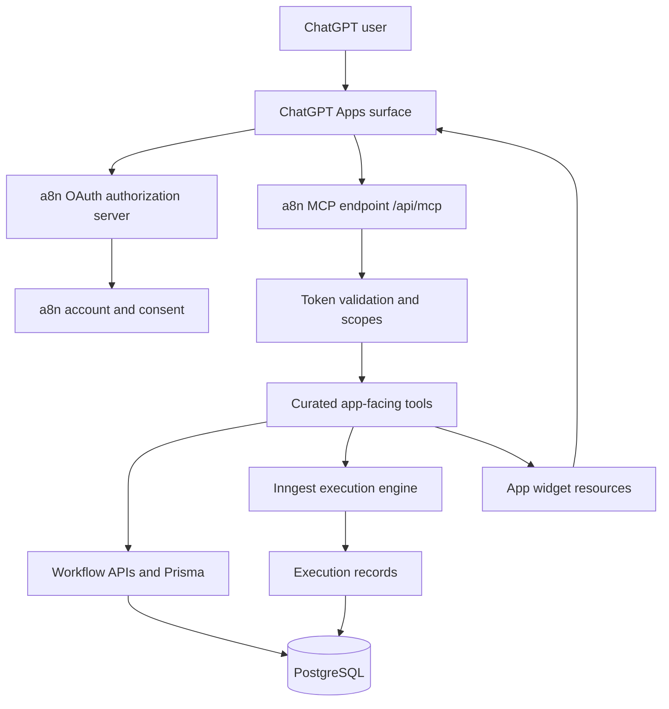

# a8n MCP Apps for ChatGPT

> Goal: make a8n installable and usable as a ChatGPT App so a user can add the a8n app from ChatGPT, connect their a8n account, and manage workflows directly inside a ChatGPT conversation.

## Target outcome

The final user experience should be:

1. User opens ChatGPT.
2. User goes to Apps or Connectors.
3. User adds the a8n app.
4. ChatGPT starts an OAuth connection flow.
5. User signs in to a8n and grants scoped access.
6. User can summon a8n from ChatGPT using the Tools menu or `@a8n`.
7. ChatGPT can create, inspect, validate, execute, and debug a8n workflows.
8. For visual operations, ChatGPT renders a8n workflow widgets inside the chat.

## Official references used

These docs should be checked again before implementation because ChatGPT Apps and Apps SDK requirements may evolve:

| Source | Why it matters |
|---|---|
| [Apps in ChatGPT](https://chatgpt.com/features/apps/) | User-facing app directory, app installation, `@` invocation, admin controls |
| [Apps in ChatGPT Help Center](https://help.openai.com/en/articles/11487775-apps-in-chatgpt) | App capabilities, permissions, write-action approval model |
| [Apps SDK overview](https://developers.openai.com/apps-sdk/) | ChatGPT app development entry point |
| [MCP Apps compatibility in ChatGPT](https://developers.openai.com/apps-sdk/mcp-apps-in-chatgpt) | MCP Apps iframe and bridge compatibility |
| [Apps SDK MCP concepts](https://developers.openai.com/apps-sdk/concepts/mcp-server) | Required MCP primitives: list tools, call tools, return components |
| [Define tools](https://developers.openai.com/apps-sdk/plan/tools) | Tool-first design guidance |
| [Build your MCP server](https://developers.openai.com/apps-sdk/build/mcp-server) | Apps SDK server metadata, structured content, widget metadata |
| [Build your ChatGPT UI](https://developers.openai.com/apps-sdk/build/chatgpt-ui) | Widget resources, output templates, `window.openai` bridge |
| [Authenticate users](https://developers.openai.com/apps-sdk/build/auth) | OAuth 2.1 and MCP authorization requirements |
| [Connect from ChatGPT](https://developers.openai.com/apps-sdk/deploy/connect-chatgpt) | Developer mode and connector creation flow |
| [Test your integration](https://developers.openai.com/apps-sdk/deploy/testing) | MCP Inspector and ChatGPT test strategy |
| [Submit your app](https://developers.openai.com/apps-sdk/deploy/submission) | Public submission prerequisites |
| [Security and privacy](https://developers.openai.com/apps-sdk/guides/security-privacy) | Least privilege, consent, prompt injection, data handling |
| [Apps SDK reference](https://developers.openai.com/apps-sdk/reference) | `_meta`, output templates, CSP, tool result fields |

## Current a8n position

a8n already has a strong MCP foundation:

- Streamable HTTP MCP endpoint at `/api/mcp`.
- Stateless Next.js route handler using `WebStandardStreamableHTTPServerTransport`.
- Bearer authentication through a8n MCP API keys or Better Auth sessions.
- Scope checks for workflows, credentials, executions, system, and API keys.
- 53 MCP tools.
- 17 resources and 5 resource templates.
- 3 prompts.
- Sanitized tool output.
- Audit logs.
- Rate limiting.
- Existing app-style resources for workflow previews, setup checklists, execution timelines, and approvals.
- ChatGPT app profile at `/api/mcp?profile=chatgpt`.
- 28-tool curated ChatGPT surface that excludes admin, destructive, and raw credential mutation tools.
- MCP Apps widget resources for workflow previews, setup checklists, execution timelines, and approvals.
- Render tools linked to `ui://a8n/...` widget templates.
- OAuth account linking with PKCE, protected resource metadata, OAuth metadata, opaque token validation, and MCP OAuth challenges.
- ChatGPT tool risk policy and prompt-injection safety metadata for suspicious tool output.
- ChatGPT app eval suite and full-check runner for Phase 6 validation.
- Production readiness checker for stable HTTPS, OAuth, CORS, audit logging, and public support/privacy routes.
- Submission package, golden prompts, app icon, and Phase 8 preflight checker.
- Rollout incident/eval loop, weekly review checklist, and combined release gate.

The remaining non-code work is live ChatGPT developer-mode evidence, final public deployment, OpenAI Dashboard submission, review feedback handling, and ongoing production monitoring.

## Target architecture

## Documentation map

| Document | Purpose |
|---|---|
| [00-current-state-audit.md](./00-current-state-audit.md) | Complete audit of current MCP implementation and ChatGPT Apps gaps |
| [01-phase-wise-implementation-plan.md](./01-phase-wise-implementation-plan.md) | Phase-by-phase implementation plan with acceptance criteria |
| [02-app-surface-and-ux.md](./02-app-surface-and-ux.md) | Product surface, app widgets, curated tools, and expected user flows |
| [03-auth-security-submission-checklist.md](./03-auth-security-submission-checklist.md) | OAuth, scopes, safety, privacy, testing, deployment, and submission checklist |
| [04-phase-0-1-runbook.md](./04-phase-0-1-runbook.md) | Implemented Phase 0/1 artifacts and developer-mode connection runbook |
| [05-phase-2-3-runbook.md](./05-phase-2-3-runbook.md) | Implemented ChatGPT app profile, widget resources, render tools, and verification steps |
| [06-phase-4-runbook.md](./06-phase-4-runbook.md) | Implemented OAuth account-linking endpoints, token validation, MCP challenges, and verification steps |
| [07-phase-5-runbook.md](./07-phase-5-runbook.md) | Implemented tool risk policy, prompt-injection safety metadata, and safety checks |
| [08-phase-6-runbook.md](./08-phase-6-runbook.md) | Implemented ChatGPT app eval suite, full-check runner, and developer-mode test flow |
| [09-phase-7-runbook.md](./09-phase-7-runbook.md) | Implemented production readiness gate, required env, and support/privacy routes |
| [10-phase-8-runbook.md](./10-phase-8-runbook.md) | Implemented submission package, app icon, screenshot checklist, and submission preflight |
| [11-phase-9-runbook.md](./11-phase-9-runbook.md) | Implemented rollout maintenance loop, incident template, and release gate |
| [12-end-to-end-test-guide.md](./12-end-to-end-test-guide.md) | Full local, HTTPS, ChatGPT developer-mode, production, submission, and rollout test guide |

## Recommended delivery strategy

Build this in two tracks:

1. Private developer-mode app.

   Use the current `/api/mcp` route, a public HTTPS tunnel, app metadata, and a curated tool subset to validate ChatGPT can list and call tools.

2. Production ChatGPT App.

   Add OAuth 2.1, app widget metadata, CSP, public deployment, app submission assets, privacy/security controls, and review-ready test prompts.

This avoids blocking early testing on the full public submission path.
