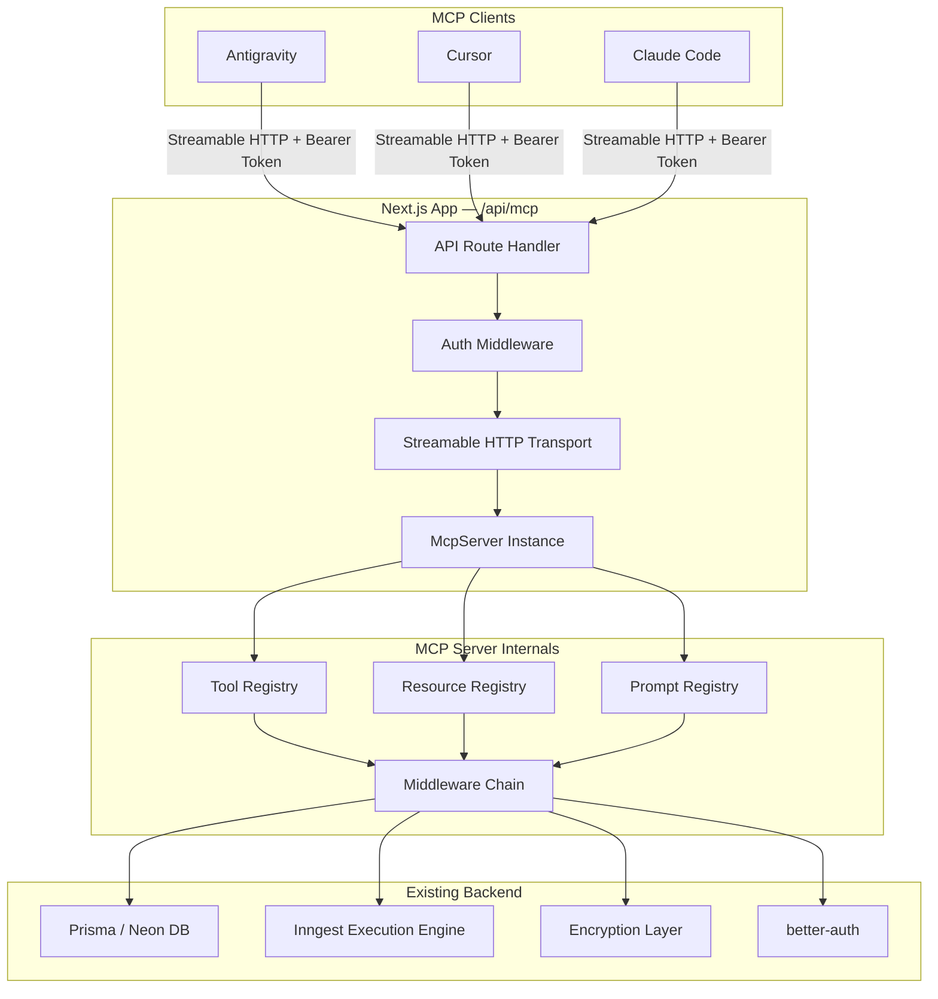

# n8n MCP Server — Production Implementation Plan

> **Historical document** — This was the original build checklist used during implementation (May 2026).  
> **For knowledge base documentation**, see **[mcp/README.md](./mcp/README.md)**.

> **Project**: n8n Workflow Automation Platform  
> **Goal**: Expose all n8n operations via a secure, production-grade MCP server compatible with Antigravity, Cursor, and Claude Code  
> **SDK**: `@modelcontextprotocol/sdk` (TypeScript) — Streamable HTTP Transport  
> **Date**: May 2026

---

## Table of Contents

1. [Project Analysis & Audit](#1-project-analysis--audit)
2. [Architecture Design](#2-architecture-design)
3. [Folder Structure](#3-folder-structure)
4. [Phase 1 — Foundation & Transport](#phase-1--foundation--transport)
5. [Phase 2 — Authentication & Security](#phase-2--authentication--security)
6. [Phase 3 — Tool Implementation](#phase-3--tool-implementation)
7. [Phase 4 — Resources & Prompts](#phase-4--resources--prompts)
8. [Phase 5 — Middleware & Observability](#phase-5--middleware--observability)
9. [Phase 6 — Testing & Hardening](#phase-6--testing--hardening)
10. [Phase 7 — Client Configuration](#phase-7--client-configuration)
11. [Environment Variables](#environment-variables)
12. [Dependency Matrix](#dependency-matrix)
13. [Risk Register](#risk-register)

---

## 1. Project Analysis & Audit

### Current Tech Stack

| Layer | Technology |
|---|---|
| Framework | Next.js 16 (App Router) |
| API | tRPC v11 (3 routers: workflows, credentials, executions) |
| Database | PostgreSQL via Prisma + Neon serverless adapter |
| Auth | better-auth (email/password + GitHub + Google OAuth) |
| Payments | Polar.sh (subscription gating) |
| Execution | Inngest (durable workflow execution with realtime channels) |
| Encryption | Cryptr (AES-256 for credential values) |

### Existing Domain Models (Prisma)

| Model | Key Fields | Relations |
|---|---|---|
| `User` | id, name, email | → Workflows, Credentials, Sessions |
| `Workflow` | id, name, userId | → Nodes, Connections, Executions |
| `Node` | id, type (enum), position, data | → Workflow, Credential |
| `Connection` | fromNodeId, toNodeId | → Workflow |
| `Execution` | id, status, output, error | → Workflow |
| `Credential` | id, name, type, value (encrypted) | → User, Nodes |

### Node Types (10 registered)

```
INITIAL | MANUAL_TRIGGER | HTTP_REQUEST | GOOGLE_FORM_TRIGGER | STRIPE_TRIGGER
ANTHROPIC | GEMINI | OPENAI | DISCORD | SLACK
```

### Existing tRPC Procedures (Operations to Expose)

| Router | Procedure | Type | Auth Level |
|---|---|---|---|
| `workflows` | `create` | mutation | premium |
| `workflows` | `remove` | mutation | protected |
| `workflows` | `update` | mutation | protected |
| `workflows` | `updateName` | mutation | protected |
| `workflows` | `getOne` | query | protected |
| `workflows` | `getMany` | query | protected |
| `workflows` | `execute` | mutation | protected |
| `credentials` | `create` | mutation | premium |
| `credentials` | `remove` | mutation | protected |
| `credentials` | `update` | mutation | protected |
| `credentials` | `getOne` | query | protected |
| `credentials` | `getMany` | query | protected |
| `credentials` | `getByType` | query | protected |
| `executions` | `getOne` | query | protected |
| `executions` | `getMany` | query | protected |

---

## 2. Architecture Design

### Design Principles (Industry Best Practices)

Inspired by **Cloudflare**, **Claude Code**, and **Anthropic** production MCP servers:

| Principle | Implementation |
|---|---|
| **Modularity** | Each tool/resource is a self-contained module with its own schema, handler, and tests |
| **Scalability** | Stateless Streamable HTTP transport — each request gets its own transport instance |
| **Extensibility** | Registry pattern — new tools auto-register by adding files to `/tools/` directory |
| **Security** | Bearer token auth + API key support + rate limiting + audit logging |
| **Least Privilege** | Scoped API keys with per-tool permissions |
| **Observability** | Structured JSON logging with correlation IDs on every MCP call |
| **Codemode Pattern** | Tools are narrowly scoped (Cloudflare's recommendation to avoid context window exhaustion) |

### High-Level Architecture



---

## 3. Folder Structure

```
src/
├── mcp/                              # ← NEW: MCP Server feature module
│   ├── index.ts                      # Server factory — creates & configures McpServer
│   ├── config.ts                     # MCP server config constants & env validation
│   │
│   ├── auth/                         # Authentication & authorization
│   │   ├── api-key.service.ts        # API key generation, validation, hashing
│   │   ├── bearer-auth.middleware.ts # Bearer token validation middleware
│   │   ├── scopes.ts                 # Permission scope definitions
│   │   └── types.ts                  # Auth context types (McpAuthInfo)
│   │
│   ├── tools/                        # MCP Tools (one file per tool)
│   │   ├── _registry.ts              # Auto-discovery tool registry
│   │   ├── workflows/
│   │   │   ├── list-workflows.tool.ts
│   │   │   ├── get-workflow.tool.ts
│   │   │   ├── create-workflow.tool.ts
│   │   │   ├── update-workflow.tool.ts
│   │   │   ├── delete-workflow.tool.ts
│   │   │   ├── rename-workflow.tool.ts
│   │   │   ├── execute-workflow.tool.ts
│   │   │   └── index.ts
│   │   ├── credentials/
│   │   │   ├── list-credentials.tool.ts
│   │   │   ├── get-credential.tool.ts
│   │   │   ├── create-credential.tool.ts
│   │   │   ├── update-credential.tool.ts
│   │   │   ├── delete-credential.tool.ts
│   │   │   ├── list-credentials-by-type.tool.ts
│   │   │   └── index.ts
│   │   ├── executions/
│   │   │   ├── list-executions.tool.ts
│   │   │   ├── get-execution.tool.ts
│   │   │   └── index.ts
│   │   ├── nodes/
│   │   │   ├── list-node-types.tool.ts
│   │   │   └── index.ts
│   │   └── system/
│   │       ├── whoami.tool.ts
│   │       ├── server-info.tool.ts
│   │       └── index.ts
│   │
│   ├── resources/                    # MCP Resources (read-only data)
│   │   ├── _registry.ts
│   │   ├── workflow-schema.resource.ts
│   │   ├── node-types.resource.ts
│   │   ├── credential-types.resource.ts
│   │   └── api-docs.resource.ts
│   │
│   ├── prompts/                      # MCP Prompts (reusable templates)
│   │   ├── _registry.ts
│   │   ├── create-workflow.prompt.ts
│   │   ├── debug-execution.prompt.ts
│   │   └── setup-integration.prompt.ts
│   │
│   ├── middleware/                    # Cross-cutting concerns
│   │   ├── audit-logger.ts           # Structured audit logging
│   │   ├── rate-limiter.ts           # Token-bucket rate limiting
│   │   ├── error-boundary.ts         # Standardized MCP error responses
│   │   └── scope-guard.ts           # Permission check per-tool
│   │
│   ├── shared/                       # Shared utilities
│   │   ├── pagination.ts             # Pagination helpers for list tools
│   │   ├── zod-to-json-schema.ts     # Convert Zod schemas → JSON Schema
│   │   └── sanitize.ts              # Output sanitization (strip secrets)
│   │
│   └── __tests__/                    # Test suite
│       ├── tools/
│       ├── auth/
│       ├── middleware/
│       └── integration/
│
├── app/
│   └── api/
│       └── mcp/
│           └── route.ts              # ← Next.js API route — MCP HTTP endpoint
│
└── prisma/
    └── schema.prisma                 # ← Add ApiKey model
```

> [!IMPORTANT]
> Each tool file exports a **single function** that receives the `McpServer` instance and calls `server.tool()`. The registry auto-imports all tools from subdirectories — zero-config extensibility.

---

## Phase 1 — Foundation & Transport

### Objective
Install dependencies, create the MCP server factory, and wire up the Streamable HTTP transport via a Next.js API route.

### Tasks

#### 1.1 Install Dependencies

```bash
pnpm add @modelcontextprotocol/sdk @modelcontextprotocol/server
```

> [!NOTE]
> The `@modelcontextprotocol/sdk` v2 has split packages. For a Next.js app using Web Standard APIs, we use `@modelcontextprotocol/server` which includes `McpServer` and `WebStandardStreamableHTTPServerTransport`.

#### 1.2 Create Server Factory — `src/mcp/index.ts`

```typescript
import { McpServer } from "@modelcontextprotocol/server";
import { registerAllTools } from "./tools/_registry";
import { registerAllResources } from "./resources/_registry";
import { registerAllPrompts } from "./prompts/_registry";
import { MCP_CONFIG } from "./config";

export function createMcpServer(): McpServer {
  const server = new McpServer({
    name: MCP_CONFIG.SERVER_NAME,
    version: MCP_CONFIG.SERVER_VERSION,
  });

  // Register all tools, resources, and prompts
  registerAllTools(server);
  registerAllResources(server);
  registerAllPrompts(server);

  return server;
}
```

#### 1.3 Create API Route — `src/app/api/mcp/route.ts`

```typescript
import { WebStandardStreamableHTTPServerTransport } from "@modelcontextprotocol/server";
import { createMcpServer } from "@/mcp";
import { validateBearerToken } from "@/mcp/auth/bearer-auth.middleware";

export async function POST(request: Request): Promise<Response> {
  // 1. Authenticate
  const authResult = await validateBearerToken(request);
  if (!authResult.ok) {
    return new Response(JSON.stringify({ error: authResult.error }), {
      status: 401,
      headers: { "Content-Type": "application/json" },
    });
  }

  // 2. Create transport (stateless — one per request)
  const transport = new WebStandardStreamableHTTPServerTransport({
    sessionIdGenerator: undefined, // Stateless mode
  });

  // 3. Connect server to transport
  const server = createMcpServer();
  await server.connect(transport);

  // 4. Handle the request
  return transport.handleRequest(request);
}

// Required: handle GET for SSE streams and DELETE for session cleanup
export async function GET(request: Request): Promise<Response> {
  return new Response("MCP Streamable HTTP endpoint. Use POST.", { status: 405 });
}

export async function DELETE(request: Request): Promise<Response> {
  return new Response(null, { status: 204 });
}
```

#### 1.4 Create Config — `src/mcp/config.ts`

```typescript
export const MCP_CONFIG = {
  SERVER_NAME: "n8n-mcp-server",
  SERVER_VERSION: "1.0.0",
  ENDPOINT_PATH: "/api/mcp",
  MAX_REQUESTS_PER_MINUTE: 60,
  API_KEY_PREFIX: "n8n_mcp_",
  API_KEY_LENGTH: 48,
} as const;
```

### Deliverables
- [x] MCP SDK installed
- [x] Server factory with registry pattern
- [x] Next.js API route at `/api/mcp`
- [x] Stateless Streamable HTTP transport

---

## Phase 2 — Authentication & Security

### Objective
Implement dual-mode authentication (API Keys + Bearer Tokens) with scoped permissions and database-backed key management.

### Tasks

#### 2.1 Add ApiKey Model to Prisma Schema

```prisma
model ApiKey {
  id          String    @id @default(cuid())
  name        String                          // Human-readable label
  keyHash     String    @unique               // SHA-256 hash of the key
  keyPrefix   String                          // First 8 chars for identification
  scopes      String[]  @default([])          // Permission scopes
  userId      String
  user        User      @relation(fields: [userId], references: [id], onDelete: Cascade)
  lastUsedAt  DateTime?
  expiresAt   DateTime?
  createdAt   DateTime  @default(now())
  revokedAt   DateTime?

  @@index([keyHash])
  @@index([userId])
  @@map("api_key")
}
```

> [!WARNING]
> Never store raw API keys. Only the SHA-256 hash is persisted. The raw key is shown **once** at creation time.

#### 2.2 Define Permission Scopes — `src/mcp/auth/scopes.ts`

```typescript
export const MCP_SCOPES = {
  // Workflow scopes
  "workflows:read":    "Read workflow data",
  "workflows:write":   "Create, update, delete workflows",
  "workflows:execute": "Trigger workflow executions",

  // Credential scopes
  "credentials:read":  "Read credential metadata (not values)",
  "credentials:write": "Create, update, delete credentials",

  // Execution scopes
  "executions:read":   "Read execution history and results",

  // System scopes
  "system:read":       "Read server info and node types",

  // Wildcard
  "*":                 "Full access to all operations",
} as const;

export type McpScope = keyof typeof MCP_SCOPES;
```

#### 2.3 Bearer Auth Middleware — `src/mcp/auth/bearer-auth.middleware.ts`

```typescript
// Validates the Authorization: Bearer <token> header
// Supports two token types:
//   1. API Key:     "n8n_mcp_..." → hashed & looked up in DB
//   2. Session JWT: better-auth session token → validated via auth.api
//
// Returns { ok: true, userId, scopes } or { ok: false, error }
```

#### 2.4 Scope Guard Middleware — `src/mcp/middleware/scope-guard.ts`

Each tool declares its required scope. Before execution, the scope guard checks:
```typescript
function requireScope(requiredScope: McpScope, userScopes: McpScope[]): void {
  if (userScopes.includes("*")) return;
  if (!userScopes.includes(requiredScope)) {
    throw new McpError(ErrorCode.InvalidRequest, `Missing scope: ${requiredScope}`);
  }
}
```

#### 2.5 API Key Management Tools (Self-Serve)

| Tool | Purpose |
|---|---|
| `create-api-key` | Generate a new scoped API key |
| `list-api-keys` | List active API keys (masked) |
| `revoke-api-key` | Soft-delete an API key |

### Security Checklist

- [x] API keys hashed with SHA-256 before storage
- [x] Keys shown only once at creation time
- [x] Scope-based authorization on every tool call
- [x] Rate limiting per API key (token bucket)
- [x] Key expiration support
- [x] Audit log of all authenticated operations
- [x] Credential values **never** returned in MCP responses (only metadata)

---

## Phase 3 — Tool Implementation

### Objective
Map all 15+ tRPC procedures to MCP tools with Zod-validated JSON Schema inputs.

### Tool Design Convention

Each `.tool.ts` file follows this pattern:

```typescript
// src/mcp/tools/workflows/list-workflows.tool.ts
import { McpServer } from "@modelcontextprotocol/server";
import { z } from "zod";
import prisma from "@/lib/db";
import { PAGINATION } from "@/config/constants";

const inputSchema = z.object({
  page: z.number().min(1).default(PAGINATION.DEFAULT_PAGE)
    .describe("Page number (1-indexed)"),
  pageSize: z.number().min(1).max(100).default(PAGINATION.DEFAULT_PAGE_SIZE)
    .describe("Results per page (max 100)"),
  search: z.string().default("")
    .describe("Filter workflows by name (case-insensitive)"),
});

export function registerListWorkflows(server: McpServer) {
  server.tool(
    "list_workflows",
    "List all workflows for the authenticated user with pagination and search",
    inputSchema.shape,  // JSON Schema auto-derived from Zod
    async ({ page, pageSize, search }, extra) => {
      const userId = extra.authInfo?.userId;
      // ... Prisma query (reuses existing logic from workflowsRouter.getMany)
      return {
        content: [{ type: "text", text: JSON.stringify(result) }],
      };
    }
  );
}
```

### Complete Tool Catalog

#### Workflow Tools (7)

| Tool Name | Scope | Description |
|---|---|---|
| `list_workflows` | `workflows:read` | Paginated list with search |
| `get_workflow` | `workflows:read` | Full workflow with nodes & edges |
| `create_workflow` | `workflows:write` | Create with auto-generated slug name |
| `update_workflow` | `workflows:write` | Update nodes & connections |
| `rename_workflow` | `workflows:write` | Rename a workflow |
| `delete_workflow` | `workflows:write` | Delete by ID |
| `execute_workflow` | `workflows:execute` | Trigger via Inngest |

#### Credential Tools (6)

| Tool Name | Scope | Description |
|---|---|---|
| `list_credentials` | `credentials:read` | Paginated list (values masked) |
| `get_credential` | `credentials:read` | Single credential (value masked) |
| `create_credential` | `credentials:write` | Create with encrypted value |
| `update_credential` | `credentials:write` | Update name/type/value |
| `delete_credential` | `credentials:write` | Delete by ID |
| `list_credentials_by_type` | `credentials:read` | Filter by CredentialType enum |

#### Execution Tools (2)

| Tool Name | Scope | Description |
|---|---|---|
| `list_executions` | `executions:read` | Paginated execution history |
| `get_execution` | `executions:read` | Single execution with output |

#### Node Tools (1)

| Tool Name | Scope | Description |
|---|---|---|
| `list_node_types` | `system:read` | Available node types with metadata |

#### System Tools (2)

| Tool Name | Scope | Description |
|---|---|---|
| `whoami` | `system:read` | Current user info & active scopes |
| `server_info` | `system:read` | Server version, capabilities |

#### API Key Management Tools (3)

| Tool Name | Scope | Description |
|---|---|---|
| `create_api_key` | `*` | Generate new scoped API key |
| `list_api_keys` | `*` | List active keys (masked) |
| `revoke_api_key` | `*` | Revoke an API key |

> **Total: 21 tools** — narrowly scoped per Cloudflare's Codemode best practice.

---

## Phase 4 — Resources & Prompts

### MCP Resources (Read-Only Context)

Resources provide static or semi-static information that LLMs can reference without making tool calls:

| Resource URI | Description |
|---|---|
| `n8n://schema/workflow` | Workflow JSON structure reference |
| `n8n://schema/node-types` | All available node types with fields |
| `n8n://schema/credential-types` | Credential type enum & descriptions |
| `n8n://docs/api` | Summary of all available MCP tools |

### MCP Prompts (Guided Templates)

| Prompt Name | Arguments | Description |
|---|---|---|
| `create_workflow` | `description: string` | Step-by-step workflow creation guide |
| `debug_execution` | `executionId: string` | Execution failure diagnosis template |
| `setup_integration` | `service: string` | Integration setup guide (e.g., Slack, Discord) |

---

## Phase 5 — Middleware & Observability

### Audit Logger — `src/mcp/middleware/audit-logger.ts`

Every MCP tool call is logged with:

```typescript
interface AuditLogEntry {
  timestamp: string;         // ISO 8601
  correlationId: string;     // UUID per request
  userId: string;
  apiKeyId?: string;
  tool: string;
  input: Record<string, unknown>; // Sanitized (no secrets)
  duration: number;          // ms
  status: "success" | "error";
  error?: string;
  ip?: string;
  userAgent?: string;
}
```

### Rate Limiter — `src/mcp/middleware/rate-limiter.ts`

Token-bucket algorithm per API key:

| Tier | Requests/min | Burst |
|---|---|---|
| Free | 30 | 10 |
| Pro | 120 | 30 |
| Unlimited (internal) | ∞ | ∞ |

### Error Boundary — `src/mcp/middleware/error-boundary.ts`

Standardized MCP error responses mapped from application errors:

| Application Error | MCP Error Code | Message |
|---|---|---|
| Prisma `NotFoundError` | `InvalidParams` | Resource not found |
| tRPC `UNAUTHORIZED` | `InvalidRequest` | Authentication required |
| tRPC `FORBIDDEN` | `InvalidRequest` | Insufficient permissions |
| Zod validation error | `InvalidParams` | Detailed validation message |
| Inngest failure | `InternalError` | Execution engine error |
| Rate limit exceeded | `InvalidRequest` | Rate limit exceeded |

---

## Phase 6 — Testing & Hardening

### Testing Strategy

| Layer | Framework | Coverage Target |
|---|---|---|
| Unit (tools) | Vitest + mocks | Each tool handler individually |
| Integration | Vitest + real DB | End-to-end MCP request flow |
| Auth | Vitest | Token validation, scope checks |
| E2E | MCP Inspector CLI | Full client-server roundtrip |

### MCP Inspector Verification

```bash
# Official MCP debugging tool
npx @modelcontextprotocol/inspector
# Connect to: http://localhost:3000/api/mcp
# Verify: all 21 tools, 4 resources, 3 prompts discoverable
```

### Hardening Checklist

- [ ] Input validation on every tool (Zod schemas)
- [ ] SQL injection protection (Prisma parameterized queries — already in place)
- [ ] Credential values never exposed in MCP responses
- [ ] Rate limiting functional under load
- [ ] Error messages don't leak internal stack traces in production
- [ ] CORS configured for MCP client origins
- [ ] Request size limits enforced
- [ ] Timeout on long-running operations (workflow execution)

---

## Phase 7 — Client Configuration

### Antigravity (`.gemini/settings.json`)

```json
{
  "mcpServers": {
    "n8n": {
      "command": "npx",
      "args": ["-y", "mcp-remote", "http://localhost:3000/api/mcp"],
      "env": {
        "MCP_API_KEY": "n8n_mcp_<your-api-key>"
      }
    }
  }
}
```

### Cursor (`.cursor/mcp.json`)

```json
{
  "mcpServers": {
    "n8n": {
      "url": "http://localhost:3000/api/mcp",
      "transport": "streamable-http",
      "headers": {
        "Authorization": "Bearer n8n_mcp_<your-api-key>"
      }
    }
  }
}
```

### Claude Code (`claude_desktop_config.json`)

```json
{
  "mcpServers": {
    "n8n": {
      "command": "npx",
      "args": ["-y", "mcp-remote", "http://localhost:3000/api/mcp"],
      "env": {
        "MCP_HEADERS": "Authorization: Bearer n8n_mcp_<your-api-key>"
      }
    }
  }
}
```

> [!TIP]
> For production deployment, replace `localhost:3000` with your deployed URL (e.g., `https://n8n.yourdomain.com/api/mcp`).

---

## Environment Variables

Add to `.env`:

```env
# MCP Server Configuration
MCP_SERVER_ENABLED=true
MCP_API_KEY_SECRET=<random-64-char-hex>    # For API key hashing salt
MCP_RATE_LIMIT_ENABLED=true
MCP_AUDIT_LOG_ENABLED=true
MCP_CORS_ORIGINS=*                         # Restrict in production
```

---

## Dependency Matrix

| Package | Version | Purpose |
|---|---|---|
| `@modelcontextprotocol/sdk` | `^2.x` | Core MCP protocol types |
| `@modelcontextprotocol/server` | `^2.x` | McpServer + Web transport |
| `zod-to-json-schema` | `^3.x` | Convert Zod → JSON Schema for tool inputs |
| `nanoid` | `^5.x` | Secure API key generation |

> [!NOTE]
> No additional HTTP framework needed — Next.js API routes handle the HTTP layer natively via Web Standard `Request`/`Response` APIs.

---

## Risk Register

| Risk | Impact | Mitigation |
|---|---|---|
| API key leak | Critical | Hash-only storage, show once, rotation support |
| LLM prompt injection via tool inputs | High | Zod validation, input sanitization, parameterized queries |
| Rate limit bypass | Medium | Per-key tracking, sliding window backup |
| Credential value exposure | Critical | Never return decrypted values, mask in all responses |
| Transport compatibility | Medium | Test with MCP Inspector + all 3 target clients |
| Inngest execution timeout | Medium | 30s timeout on execute_workflow, async status polling |

---

## Implementation Timeline

| Phase | Duration | Prerequisites |
|---|---|---|
| Phase 1 — Foundation | 1 day | None |
| Phase 2 — Auth & Security | 2 days | Phase 1 |
| Phase 3 — Tools | 2-3 days | Phase 2 |
| Phase 4 — Resources & Prompts | 1 day | Phase 1 |
| Phase 5 — Middleware | 1 day | Phase 2 |
| Phase 6 — Testing | 1-2 days | Phase 3-5 |
| Phase 7 — Client Config | 0.5 day | Phase 6 |

**Total estimated: 8-10 days**

---

> [!IMPORTANT]
> **Next Step**: Approve this plan, then we begin Phase 1 — installing the MCP SDK and creating the server factory + API route. Each phase will be implemented incrementally with verification at each checkpoint.
